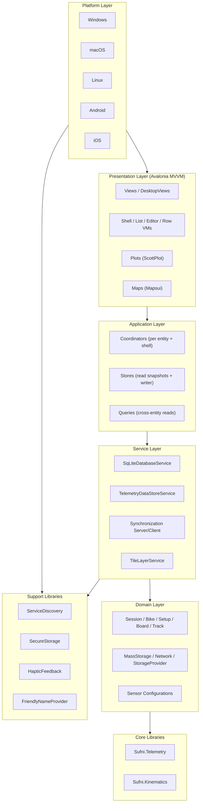
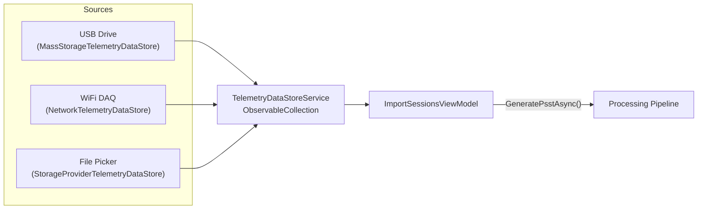
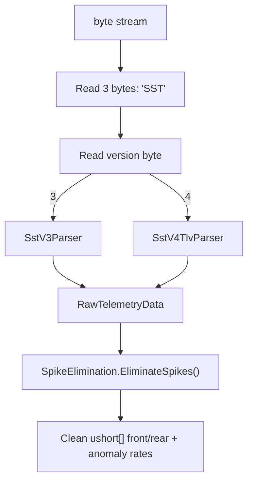
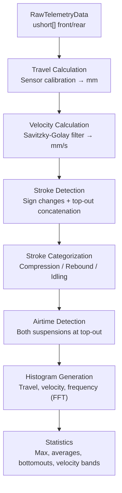
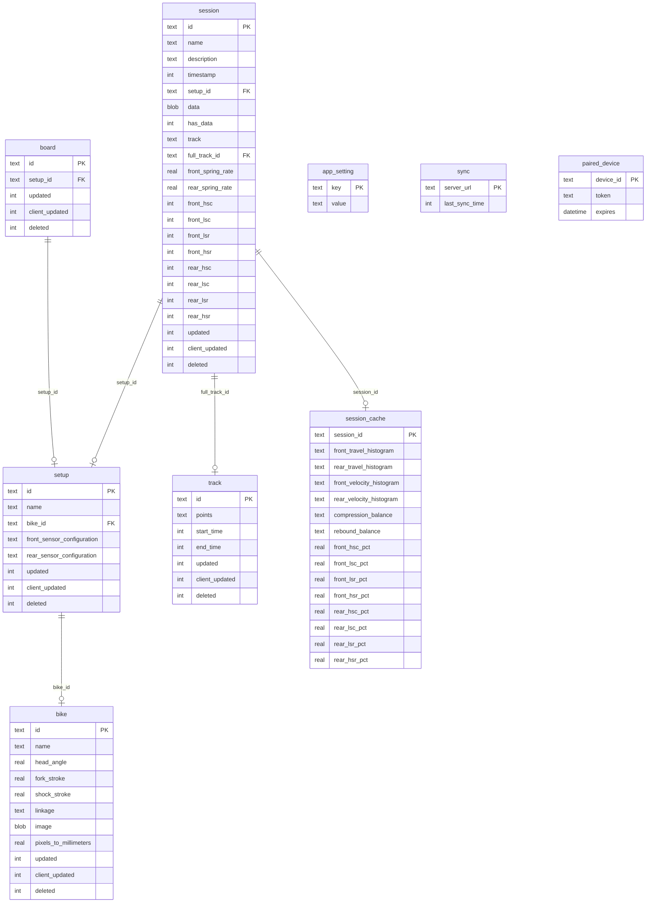
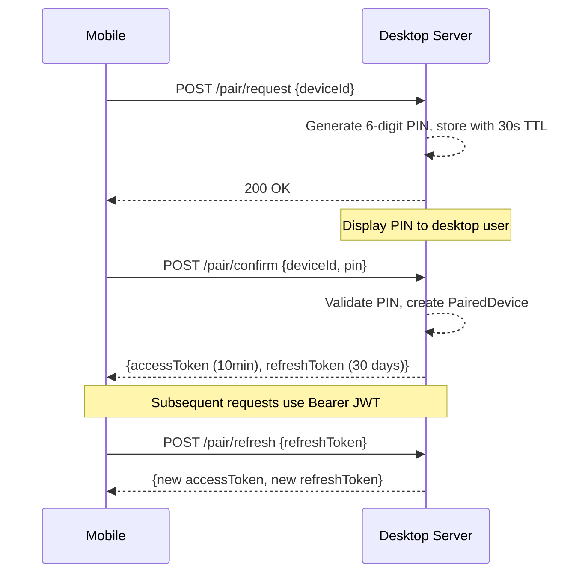
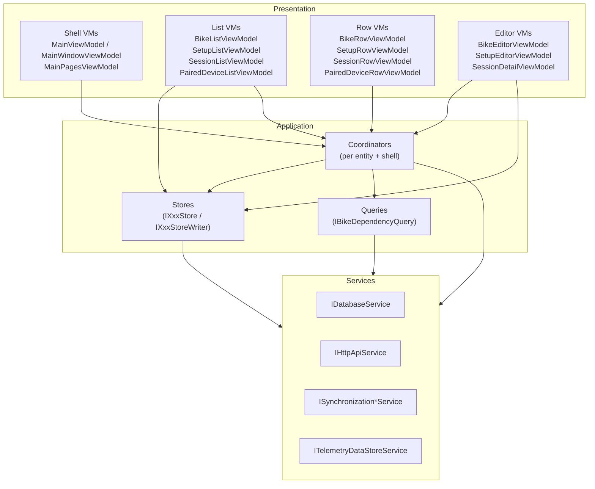
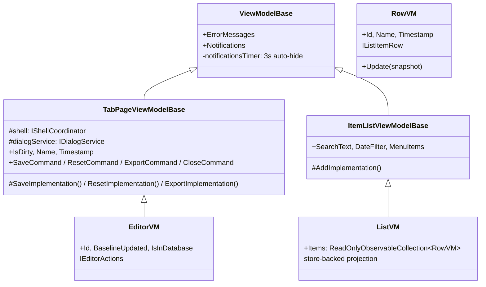

# Architecture

## Table of Contents

- [Project Structure](#project-structure)
- [Data Acquisition](#data-acquisition)
- [File Format & Parsing](#file-format--parsing)
- [Signal Processing Pipeline](#signal-processing-pipeline)
- [Suspension Kinematics](#suspension-kinematics)
- [Sensor Calibration](#sensor-calibration)
- [Data Visualization](#data-visualization)
- [Persistence & Serialization](#persistence--serialization)
- [Cross-Device Synchronization](#cross-device-synchronization)
- [Platform Abstractions](#platform-abstractions)
- [UI Architecture](#ui-architecture)
  - [Layered Architecture](#layered-architecture)
  - [Stores](#stores)
  - [Coordinators](#coordinators)
  - [Queries](#queries)
  - [View Models](#view-models)
  - [Dependency Injection](#dependency-injection)
  - [Navigation](#navigation)

Sufni.App is a cross-platform application for analyzing mountain bike suspension telemetry. It acquires raw sensor data from a Pico-based DAQ device (via USB or WiFi), processes it through a signal analysis pipeline, and presents interactive plots for tuning suspension spring rates and damper settings. It also models bike linkage kinematics to compute leverage ratios and related characteristics. The app runs on Windows, macOS, Linux, Android, and iOS using Avalonia UI, and supports desktop-to-mobile synchronization.



The presentation layer holds only UI state and binds against the
application layer. Coordinators are the only writers to stores, queries
are stateless cross-entity reads, and services know nothing about view
models. View models do not depend on other feature view models for
business answers — see [UI Architecture](#ui-architecture) for the rules.

---

## Project Structure

| Project | Path | Role |
|---------|------|------|
| **Sufni.Telemetry** | `Sufni.Telemetry/` | Pure C# library: SST parsing, signal processing, stroke detection, histograms |
| **Sufni.Telemetry.Tests** | `Sufni.Telemetry.Tests/` | Unit tests for telemetry processing |
| **Sufni.Kinematics** | `Sufni.Kinematics/` | Suspension linkage simulation, leverage ratio calculation |
| **Sufni.App** | `Sufni.App/Sufni.App/` | Main application: views, view models, coordinators, stores, queries, services, models, plots |
| **Sufni.App.Windows** | `Sufni.App/Sufni.App.Windows/` | Windows entry point (`Program.cs`) |
| **Sufni.App.macOS** | `Sufni.App/Sufni.App.macOS/` | macOS entry point (`Program.cs`) |
| **Sufni.App.Linux** | `Sufni.App/Sufni.App.Linux/` | Linux entry point (`Program.cs`) |
| **Sufni.App.Android** | `Sufni.App/Sufni.App.Android/` | Android entry point (`MainActivity.cs`) |
| **Sufni.App.iOS** | `Sufni.App/Sufni.App.iOS/` | iOS entry point (`AppDelegate.cs`) |
| **ServiceDiscovery** | `ServiceDiscovery/` | mDNS service discovery (socket-based and native Bonjour) |
| **SecureStorage** | `SecureStorage/` | Platform-specific encrypted credential storage |
| **HapticFeedback** | `HapticFeedback/` | Platform-specific haptic feedback for mobile |
| **FriendlyNameProvider** | `FriendlyNameProvider/` | Device naming for sync identification |

---

## Data Acquisition

Three data store implementations feed telemetry files into the app through a common interface.



### Interfaces

**`ITelemetryDataStore`** (`Sufni.App/Sufni.App/Models/ITelemetryDataStore.cs`) exposes a `Name`, an optional `BoardId` (DAQ device GUID), and `GetFiles()` returning a list of `ITelemetryFile`.

**`ITelemetryFile`** (`Sufni.App/Sufni.App/Models/ITelemetryFile.cs`) represents a single SST file. Key members:

- `ShouldBeImported` — tri-state nullable bool: `null` if file duration < 5 seconds (too short to be useful), `true`/`false` for user decision
- `GeneratePsstAsync(BikeData)` — the full pipeline in one call: reads raw bytes, parses SST, runs signal processing, returns MessagePack-serialized `TelemetryData`
- `OnImported()` / `OnTrashed()` — post-action hooks (move file, send TCP delete command, etc.)
- `StartTime`, `Duration` — eagerly parsed in the constructor from the SST header for display before import

### Mass Storage

`MassStorageTelemetryDataStore` (`Sufni.App/Sufni.App/Models/MassStorageTelemetryDataStore.cs`) identifies DAQ drives by the presence of a `BOARDID` marker file at the drive root. The file contains the device serial as a hex string, converted to a UUID via `UuidUtil.CreateDeviceUuid()`.

`TelemetryDataStoreService` (`Sufni.App/Sufni.App/Services/TelemetryDataStoreService.cs`) polls `DriveInfo.GetDrives()` every 1 second on a `DispatcherTimer`. It uses set-difference operations (`Except()` with a `DriveInfoComparer`) to detect added/removed drives without rescanning the full list. Files are enumerated with `GetFiles("*.SST")` using a `TrySelect` extension that silently skips files that throw during header parsing.

On import, files move to an `uploaded/` subdirectory. On trash, files move to `trash/`.

### Network (WiFi DAQ)

`NetworkTelemetryDataStore` (`Sufni.App/Sufni.App/Models/NetworkTelemetryDataStore.cs`) connects to a DAQ device discovered via mDNS (service type `_gosst._tcp`). File listing uses a custom TCP binary protocol implemented in `SstTcpClient` (`Sufni.App/Sufni.App/Models/SstTcpClient.cs`):

```
Request:  [0x03, 0x00, 0x00, 0x00, fileId_LE(4)]
Response: [size_LE(4), padding(4)]  → ack [0x04] → data[size] → confirm [0x05]
```

- `fileId = 0` is a magic value that returns the directory listing instead of a file. The directory contains the board ID (8 bytes), sample rate (uint16), then 25-byte entries (9-char name + uint64 size + uint64 timestamp).
- `fileId < 0` (negative) triggers a remote delete; the server responds with status code 10.

### Storage Provider

`StorageProviderTelemetryDataStore` (`Sufni.App/Sufni.App/Models/StorageProviderTelemetryDataStore.cs`) wraps Avalonia's `IStorageFolder` for platform-agnostic file access via the system file picker. The constructor is synchronous; all I/O is deferred to an async `Init()` task.

---

## File Format & Parsing

SST files are the raw binary format written by the Pico DAQ. Two versions exist.



`RawTelemetryData.FromStream()` (`Sufni.Telemetry/RawTelemetryData.cs`) reads the magic bytes and version, then dispatches to the appropriate `ISstParser` implementation.

### SST V3 Format

| Offset | Size | Field |
|--------|------|-------|
| 0 | 3 | Magic: `"SST"` |
| 3 | 1 | Version: `3` |
| 4 | 2 | Sample rate (uint16, Hz) |
| 6 | 2 | Padding |
| 8 | 8 | Timestamp (int64, Unix seconds) |
| 16 | N×4 | Records: uint16 front + uint16 rear per sample |

Values use 12-bit two's complement: if `value >= 2048`, subtract 4096. A sentinel of `0xFFFF` for the first sample indicates no data on that channel.

### SST V4 TLV Format

| Offset | Size | Field |
|--------|------|-------|
| 0 | 3 | Magic: `"SST"` |
| 3 | 1 | Version: `4` |
| 4 | 4 | Padding |
| 8 | 8 | Timestamp (int64, Unix seconds) |
| 16 | ... | TLV chunks |

Each chunk: 1-byte type + uint16 payload length + variable payload. Unknown chunk types are skipped by seeking past their payload.

| Type | Value | Payload | Description |
|------|-------|---------|-------------|
| Rates | `0x00` | N × (1-byte type + uint16 rate) | Sample rates per stream type |
| Telemetry | `0x01` | N × (uint16 front + uint16 rear) | Suspension encoder data |
| Marker | `0x02` | (empty) | Event marker; timestamp derived from current telemetry sample count |
| Imu | `0x03` | N × 6 × int16 | Accelerometer (Ax,Ay,Az) + gyroscope (Gx,Gy,Gz) |
| ImuMeta | `0x04` | count(1) + N × (locId(1) + accelLsbPerG(f32) + gyroLsbPerDps(f32)) | IMU calibration per sensor location |
| Gps | `0x05` | N × 46 bytes | date(u32 YYYYMMDD) + timeMs(u32) + lat(f64) + lon(f64) + alt(f32) + speed(f32) + heading(f32) + fixMode(u8) + satellites(u8) + epe2d(f32) + epe3d(f32) |

The parser (`Sufni.Telemetry/SstV4TlvParser.cs`) tracks `telemetrySampleCount` as it processes chunks. Marker timestamps are calculated as `telemetrySampleCount / telemetrySampleRate` at the point the marker chunk appears. IMU data is only retained if calibration metadata (`ImuMeta`) is present.

`SstV4TlvParser.ParseDuration()` is a lightweight method that scans only the Rates and Telemetry chunks to compute duration without fully parsing all data — used for UI display before import.

### Spike Elimination

`SpikeElimination.EliminateSpikes()` (`Sufni.Telemetry/SpikeElimination.cs`) cleans sensor data in four stages:

1. **Detect sudden changes** — multi-pass sliding window search (window sizes 5 down to 1). A change is flagged when the total magnitude exceeds `summaThreshold=100` ADC counts AND every individual step within the window exceeds `stepThreshold=30`. Already-flagged regions are excluded from subsequent passes.

2. **Flatten gradual spikes** — each detected change region is collapsed to a single step (all intermediate samples set to the end value).

3. **Handle early baseline shift** — if the first detected change occurs within the first 100 samples (~100ms at 1kHz), the entire signal after the change is shifted by the change magnitude. This corrects for sensor initialization drift.

4. **Handle temporary dips** — pairs of negative-then-positive changes are treated as sensor glitches. The dip region between them is shifted back to undo the anomaly.

Output is clamped to valid 12-bit ADC range `[0, 4095]`. The anomaly count is converted to an anomaly rate (per second) for quality reporting.

### V4 Data Structures

All are MessagePack-serializable records defined in `Sufni.Telemetry/`:

- **`GpsRecord`** — Timestamp (UTC DateTime), Latitude, Longitude, Altitude, Speed (m/s), Heading, FixMode, Satellites, Epe2d/Epe3d (error estimates in meters)
- **`ImuRecord`** — Ax, Ay, Az (raw int16 acceleration), Gx, Gy, Gz (raw int16 gyroscope)
- **`ImuMetaEntry`** — LocationId (sensor position: 0=frame, 1=fork, 2=shock), AccelLsbPerG, GyroLsbPerDps (calibration)
- **`RawImuData`** — Container: Meta list, SampleRate, Records list, ActiveLocations list
- **`MarkerData`** — TimestampOffset (seconds from session start)

---

## Signal Processing Pipeline



`TelemetryData.FromRecording(RawTelemetryData, Metadata, BikeData)` (`Sufni.Telemetry/TelemetryData.cs`) orchestrates the entire pipeline. `BikeData` is a record carrying `HeadAngle`, `FrontMaxTravel`, `RearMaxTravel`, and two calibration functions (`Func<ushort, double>`) from the sensor configurations.

### Travel Calculation

Each raw encoder count is passed through the sensor's `MeasurementToTravel` function (see [Sensor Calibration](#sensor-calibration)) to produce travel in millimeters. Values are clamped to `[0, MaxTravel]`.

### Velocity Calculation

A Savitzky-Golay filter (`Sufni.Telemetry/Filters.cs`) computes the smoothed first derivative of the travel signal. Parameters: 51-point window, polynomial order 3, 1st derivative. The implementation uses Gram polynomial basis functions with recursive computation, and handles signal boundaries with asymmetric windows that shrink toward edges. Positive velocity = compression (fork/shock compressing), negative = rebound (extending).

### Stroke Detection

`Strokes.FilterStrokes()` (`Sufni.Telemetry/Strokes.cs`) identifies strokes by finding sign changes in velocity. Adjacent strokes where both have max position < 5mm (near full extension) are concatenated — this prevents small oscillations at top-out from fragmenting the data into many tiny strokes.

Each stroke records its start/end sample indices, length (travel delta in mm), duration, and aggregated statistics (`StrokeStat`: sum/max travel, sum/max velocity, bottomout count, sample count).

### Stroke Categorization

- **Compression**: length >= 5mm
- **Rebound**: length <= -5mm
- **Idling**: |length| < 5mm AND duration >= 0.1s

Only compressions and rebounds are MessagePack-serialized. Idlings are reconstructed from gaps on deserialization.

### Airtime Detection

An idling stroke is marked as an air candidate when: max travel <= 5mm, duration >= 0.2s, and the next stroke's max velocity >= 500 mm/s (landing impact). Airtimes are confirmed when front and rear air candidates overlap by >= 50%, or when a single suspension's mean travel is <= 4% of its max.

### Processing Parameters

All constants in `Sufni.Telemetry/Parameters.cs`:

| Constant | Value | Description |
|----------|-------|-------------|
| `StrokeLengthThreshold` | 5 mm | Min travel to classify as compression/rebound |
| `IdlingDurationThreshold` | 0.10 s | Min duration for an idling stroke |
| `AirtimeDurationThreshold` | 0.20 s | Min duration for airtime candidate |
| `AirtimeVelocityThreshold` | 500 mm/s | Min landing impact velocity |
| `AirtimeOverlapThreshold` | 0.50 | Front/rear overlap ratio for airtime |
| `AirtimeTravelMeanThresholdRatio` | 0.04 | Max mean travel as ratio of max for single-suspension airtime |
| `BottomoutThreshold` | 3 mm | Distance from max travel to count as bottomout |
| `TravelHistBins` | 20 | Number of travel histogram bins |
| `VelocityHistStep` | 100 mm/s | Coarse velocity histogram bin width |
| `VelocityHistStepFine` | 15 mm/s | Fine velocity histogram bin width |

### Serialized Structure

`TelemetryData` uses MessagePack with `[MessagePackObject]` attributes:

```
TelemetryData
├── Metadata (SourceName, Version, SampleRate, Timestamp, Duration)
├── Front: Suspension
│   ├── Present, MaxTravel, AnomalyRate
│   ├── Travel[], Velocity[]
│   ├── TravelBins[], VelocityBins[], FineVelocityBins[]
│   └── Strokes (Compressions[], Rebounds[])
├── Rear: Suspension (same structure)
├── Airtimes[] (Start, End in seconds)
├── ImuData: RawImuData? (V4 only)
├── GpsData: GpsRecord[]? (V4 only)
└── Markers: MarkerData[] (V4 only)
```

The serialized form is accessed via `TelemetryData.BinaryForm` and stored as a BLOB in the session table.

---

## Suspension Kinematics

The `Sufni.Kinematics` library models bike suspension linkages to compute how wheel travel relates to shock compression.

### Linkage Model

A `Linkage` (`Sufni.Kinematics/Linkage.cs`) consists of named `Joint`s and `Link`s. Joints have a type that determines their behavior during solving:

| JointType | Behavior |
|-----------|----------|
| `Fixed` | Immovable frame attachment |
| `BottomBracket` | Immovable (treated as fixed) |
| `HeadTube` | Fork crown pivot |
| `Floating` | Free to move during solving |
| `RearWheel` | Rear axle position |
| `FrontWheel` | Front axle position |

A `Link` (`Sufni.Kinematics/Link.cs`) connects two joints and stores their Euclidean distance as a constraint. The `Shock` link is special — its length is varied during solving to simulate compression.

Linkages are stored as JSON in the `bike` table and deserialized with `Linkage.FromJson()`, which resolves joint name references to object references for fast lookup.

### Kinematic Solver

`KinematicSolver` (`Sufni.Kinematics/KinematicSolver.cs`) uses iterative constraint satisfaction (Gauss-Seidel relaxation) to find valid joint positions through the full range of shock compression.

Constructor: `KinematicSolver(Linkage, steps=200, iterations=1000)` — deep-copies the linkage via JSON round-trip.

For each of the 200 steps (0% to 100% shock compression):
1. Set the shock's target length: `maxLength - (shockStroke * step / (steps-1))`
2. Run 1000 iterations of `EnforceLength()` on every link

`EnforceLength()` moves joint endpoints symmetrically to satisfy the distance constraint. If a joint is fixed, the other endpoint absorbs the full correction. The correction factor is `(currentLength - targetLength) / currentLength`, applied as a displacement along the link axis.

Output: `Dictionary<string, CoordinateList>` mapping each joint name to its X,Y positions across all 200 steps.

### Bike Characteristics

`BikeCharacteristics` (`Sufni.Kinematics/BikeCharacteristics.cs`) derives properties from the solved motion:

- **MaxFrontTravel** = `sin(headAngle) * forkStroke` — projects fork stroke onto the vertical travel axis
- **MaxRearTravel** = Euclidean distance between rear wheel's initial and final positions
- **Leverage ratio** = `delta(wheelTravel) / delta(shockCompression)` at each step — computed lazily and cached

`AngleToTravelDataset()` calculates the angle at a specified joint (formed by two adjacent joints) across the full travel range, used for visualizing pivot behavior.

### Utilities

- **`CoordinateRotation`** — 2D rotation matrix operations for bike image display
- **`GroundCalculator`** — computes rotation angle to level ground contact points given wheel positions and radii
- **`EtrtoRimSize`** — ETRTO standard rim sizes (507/559/584/622mm) with tire diameter calculation
- **`GeometryUtils`** — distance and angle calculations using dot product, with float clamping to avoid NaN from precision errors

---

## Sensor Calibration

Four sensor types convert raw ADC counts to millimeters of travel through the `ISensorConfiguration` strategy pattern.

`ISensorConfiguration` (`Sufni.App/Sufni.App/Models/SensorConfigurations/SensorConfiguration.cs`) defines:

- `Type` — `SensorType` enum discriminator (`LinearFork`, `RotationalFork`, `LinearShock`, `RotationalShock`)
- `MeasurementToTravel` — `Func<ushort, double>` calibration closure
- `MaxTravel` — physical suspension limit in mm

Polymorphic JSON deserialization: `SensorConfiguration.FromJson(json, bike)` reads the `Type` field first, then dispatches to the concrete class's `FromJson()` which deserializes the type-specific parameters and computes calibration factors using bike geometry.

For example, `LinearForkSensorConfiguration` stores `Length` (sensor physical range) and `Resolution` (ADC bit depth). Its calibration:

```csharp
// Computed once during FromJson():
measurementToStroke = Length / Math.Pow(2, Resolution);     // ADC count → mm of fork stroke
strokeToTravel = Math.Sin(headAngle * Math.PI / 180.0);    // fork stroke → vertical wheel travel

// Applied per sample:
MeasurementToTravel = measurement => measurement * measurementToStroke * strokeToTravel;
MaxTravel = bike.ForkStroke * strokeToTravel;
```

The bike context (head angle, fork stroke, shock stroke) is injected at deserialization time, making the closure self-contained for the processing pipeline.

| Implementation | Parameters | Calibration |
|---------------|------------|-------------|
| `LinearForkSensorConfiguration` | Length, Resolution | Linear potentiometer on fork, projected by head angle |
| `RotationalForkSensorConfiguration` | ArmLength, MaxAngle, StartAngle | Rotary encoder on fork, arc-to-travel conversion |
| `LinearShockSensorConfiguration` | Length, Resolution | Linear potentiometer on shock |
| `RotationalShockSensorConfiguration` | ArmLength, MaxAngle, StartAngle | Rotary encoder on shock |

---

## Data Visualization

### Plot Hierarchy

`SufniPlot` (`Sufni.App/Sufni.App/Plots/SufniPlot.cs`) is the base class providing dark theme styling (background `#15191C`, data area `#20262B`, grid `#505558`, labels `#D0D0D0`). It also patches a ScottPlot horizontal line rendering issue.

`TelemetryPlot` (`Sufni.App/Sufni.App/Plots/TelemetryPlot.cs`) extends `SufniPlot` for time-series data with front (blue `#3288bd`) and rear (teal `#66c2a5`) color conventions. It defines `LockedVerticalSoftLockedHorizontalRule` — an axis rule that locks the Y range but allows X panning/zooming within the session duration.

| Plot | File | Description |
|------|------|-------------|
| **TravelPlot** | `Plots/TravelPlot.cs` | Suspension travel over time (mm). Airtime spans shown as semi-transparent red |
| **VelocityPlot** | `Plots/VelocityPlot.cs` | Suspension velocity over time (mm/s). Positive = compression, negative = rebound |
| **TravelHistogramPlot** | `Plots/TravelHistogramPlot.cs` | Time distribution across 20 travel bins, separate compression/rebound |
| **VelocityHistogramPlot** | `Plots/VelocityHistogramPlot.cs` | Stacked histogram by 10 travel zones, reveals damping at different stroke positions |
| **TravelFrequencyHistogramPlot** | `Plots/TravelFrequencyHistogramPlot.cs` | FFT of travel signal (0-10 Hz), identifies suspension oscillation frequencies |
| **BalancePlot** | `Plots/BalancePlot.cs` | Front vs rear scatter with polynomial trend lines, Mean Signed Deviation |
| **LeverageRatioPlot** | `Plots/LeverageRatioPlot.cs` | Leverage ratio curve from linkage kinematics |
| **ImuPlot** | `Plots/ImuPlot.cs` | Accelerometer magnitude per sensor location after removing gravity |

### IMU Plot

`ImuPlot` de-interleaves IMU records by sensor location (records cycle through active locations), converts raw counts to Gs using `AccelLsbPerG` calibration, subtracts 1G from the Z axis to remove gravity, then plots `sqrt(ax^2 + ay^2 + az^2)` per location. Colors: frame=orange, fork=blue, shock=teal.

### Desktop vs Mobile

Desktop builds use extended views in `Sufni.App/Sufni.App/DesktopViews/` that provide richer layouts (side-by-side panels, additional controls). Mobile uses the standard `Views/` with a simpler stacked layout. Plot views wrap ScottPlot's Avalonia control; map views use Mapsui's Avalonia control.

---

## Persistence & Serialization



### Database Service

`SqLiteDatabaseService` (`Sufni.App/Sufni.App/Services/SQLiteDatabaseService.cs`) implements `IDatabaseService` using sqlite-net-pcl with WAL mode. The database path uses `Environment.SpecialFolder.LocalApplicationData` + `Sufni.App/sst.db`.

Generic operations on any `Synchronizable` subclass:

- `GetAllAsync<T>()` — returns all records where `Deleted == null`
- `GetChangedAsync<T>(long since)` — returns records where `Updated > since` OR (`Deleted != null` AND `Deleted > since`)
- `PutAsync<T>(item)` — upsert with `Updated = DateTimeOffset.Now`
- `DeleteAsync<T>(id)` — sets `Deleted` timestamp (soft delete)

Session-specific operations split metadata from blob handling:

- `PutSessionAsync()` — updates metadata columns only, never touches the `data` blob
- `PatchSessionPsstAsync(id, bytes)` — updates only the `data` column
- `GetSessionPsstAsync(id)` — deserializes MessagePack blob to `TelemetryData`

### Soft Delete

All `Synchronizable` entities (`Sufni.App/Sufni.App/Models/Synchronizable.cs`) carry `Updated` (server timestamp), `ClientUpdated` (local timestamp), and nullable `Deleted` (soft delete timestamp). On database initialization, records with `Deleted` older than 1 day and expired paired devices are permanently removed.

### Conflict Resolution

`MergeAsync<T>()` handles incoming sync data:

1. **New entity** (not in local DB): insert, set `ClientUpdated = entity.Updated`
2. **Remote delete** (`entity.Deleted` set): accept, update local `Deleted` timestamp
3. **Local wins** (`existing.ClientUpdated > entity.Updated`): keep local content, update timestamps
4. **Remote wins** (otherwise): replace local with remote, set `ClientUpdated = entity.Updated`

This gives local client changes precedence in conflicts while accepting remote deletes.

---

## Cross-Device Synchronization

Desktop acts as a hub server; mobile devices sync with it.

### Pairing Flow



### Server

`SynchronizationServerService` (`Sufni.App/Sufni.App/Services/SynchronizationServerService.cs`) embeds ASP.NET Core Kestrel on port 5575 with:

- **TLS**: Self-signed ECDSA P-256 certificate (password stored in `SecureStorage`)
- **JWT**: HS256 with a 64-byte random secret (stored in `SecureStorage`)
- **Discovery**: mDNS advertisement as `_sstsync._tcp`

| Endpoint | Method | Auth | Purpose |
|----------|--------|------|---------|
| `/pair/request` | POST | No | Start pairing, generates 6-digit PIN with 30s TTL |
| `/pair/confirm` | POST | No | Confirm PIN, returns access + refresh tokens |
| `/pair/refresh` | POST | No | Refresh expired access token |
| `/pair/unpair` | POST | No | Revoke pairing |
| `/sync/push` | PUT | JWT | Receive `SynchronizationData` from mobile |
| `/sync/pull` | GET | JWT | Return changes since `?since=` timestamp |
| `/session/incomplete` | GET | JWT | List session IDs missing telemetry blobs |
| `/session/data/{id}` | GET | JWT | Download MessagePack telemetry blob |
| `/session/data/{id}` | PATCH | JWT | Upload MessagePack telemetry blob |

### Client

`SynchronizationClientService` (`Sufni.App/Sufni.App/Services/SynchronizationClientService.cs`) runs `SyncAll()` in four phases:

1. **Push local changes** — collect all entities changed since last sync, POST to `/sync/push`
2. **Pull remote changes** — GET `/sync/pull?since=`, apply deletes or upserts locally
3. **Push incomplete sessions** — for each server-side session missing data, upload the local blob
4. **Pull incomplete sessions** — for each local session missing data, download from server

`SyncCoordinator` (`Sufni.App/Sufni.App/Coordinators/SyncCoordinator.cs`) is the application-layer entry point: it owns `IsRunning` / `IsPaired` / `CanSync`, drives `SyncAllAsync()`, and refreshes every store after a successful round-trip. On mobile it subscribes to `IPairingClientCoordinator.PairingConfirmed` so a fresh pair triggers an immediate sync. Inbound sync arrival is split by entity family — see [Coordinators](#coordinators) — so that each store has exactly one writer.

`HttpApiService` (`Sufni.App/Sufni.App/Services/HttpApiService.cs`) handles JWT auto-refresh: when the access token is within 10 minutes of expiry, it calls `/pair/refresh`. On 401, it clears stored credentials. TLS validation checks CN and expiry but not the certificate chain (suitable for LAN self-signed certs).

`SynchronizationData` (`Sufni.App/Sufni.App/Models/Synchronizable.cs`) is the sync payload:

```
SynchronizationData
├── Boards[]
├── Bikes[]
├── Setups[]
├── Sessions[] (metadata only, no blob)
└── Tracks[]
```

---

## Platform Abstractions

| Interface | File | Purpose | Implementations |
|-----------|------|---------|-----------------|
| `IServiceDiscovery` | `ServiceDiscovery/ServiceDiscovery.common.cs` | mDNS browse for `_gosst._tcp` and `_sstsync._tcp` | Socket-based (Win/Linux/Android), native Bonjour (macOS/iOS) |
| `ISecureStorage` | `SecureStorage/SecureStorage.common.cs` | Encrypted key-value store for JWT secrets, certificates, refresh tokens | DPAPI (Win), Keychain (iOS), KeyStore (Android), keyring/file (Linux) |
| `IHapticFeedback` | `HapticFeedback/HapticFeedback.common.cs` | Tactile feedback: `Click()`, `LongPress()` | Vibrator API (Android), UIFeedbackGenerator (iOS) |
| `IFriendlyNameProvider` | `FriendlyNameProvider/FriendlyNameProvider.common.cs` | Human-readable device name for sync identification | Android device name, hostname fallback |

Each platform entry point registers its implementations before the shared `App.axaml.cs` initialization runs.

---

## UI Architecture

The presentation code is organized in five layers with a strict
one-way dependency chain:

```
Views → ViewModels → Coordinators / Stores / Queries → Services → Platform
```

CommunityToolkit.Mvvm source generators (`[ObservableProperty]`,
`[RelayCommand]`) drive bindings; views are XAML with compiled
bindings; reactive collections use DynamicData (`SourceCache<T, TKey>`
→ `ReadOnlyObservableCollection<T>`).

### Layered Architecture



Rules enforced by convention:

- A view model may depend on coordinators, **read-only** stores,
  queries, services, and other shell composition view models. It may
  not depend on another feature view model or on a store writer.
- A coordinator may depend on services, **read/write** stores, other
  coordinators, queries, the shell coordinator, and dialogs. It may
  not depend on any view model.
- A store may depend only on services. A query may depend on services
  or read-only stores.
- Controls in `Views/Controls/` and `DesktopViews/Controls/` resolve
  nothing from the DI container — parent views supply everything via
  bindings or attached behaviours.

### Stores

Stores own shared read state. One per entity family, registered as a
singleton, exposed behind two interfaces: a read-only `IXxxStore`
injected into list/row/editor view models and queries, and a
`IXxxStoreWriter` (which extends the read interface) reserved for
coordinators and the composition root. The implementation lives in
`Sufni.App/Sufni.App/Stores/`.

| Store | Read interface | Writer interface | Snapshot type | Key |
|-------|----------------|------------------|---------------|-----|
| `BikeStore` | `IBikeStore` | `IBikeStoreWriter` | `BikeSnapshot` | `Guid` |
| `SetupStore` | `ISetupStore` | `ISetupStoreWriter` | `SetupSnapshot` | `Guid` |
| `SessionStore` | `ISessionStore` | `ISessionStoreWriter` | `SessionSnapshot` | `Guid` |
| `PairedDeviceStore` | `IPairedDeviceStore` | `IPairedDeviceStoreWriter` | `PairedDeviceSnapshot` | `string` |

Each store wraps a `SourceCache<TSnapshot, TKey>` and exposes:

- `Connect()` — DynamicData change stream consumed by list view models.
- `Get(key)` — synchronous lookup that returns the current snapshot or
  `null`.
- `RefreshAsync()` — load (or reload) all rows from the database via
  `IDatabaseService` and replace the cache contents. Called once at
  startup by `MainPagesViewModel.LoadDatabaseContent()` and again after
  every successful `SyncCoordinator.SyncAllAsync()`.
- `Upsert(snapshot)` / `Remove(key)` (writer interface only) — invoked
  by coordinators after a save / delete / sync arrival.

Snapshots are immutable records, not view models. They carry an
`Updated` timestamp that the editors keep as their `BaselineUpdated`
for optimistic conflict detection.

`SessionStore` additionally exposes `Watch(Guid)`, a per-id observable
filtered to `Add`/`Update` change reasons. `SessionDetailViewModel`
subscribes to this in `Loaded` to react to telemetry-arrival and
recalculation events for the session it is editing, then disposes the
subscription in `Unloaded`.

`SetupStore` exposes `FindByBoardId(Guid)` so the import flow can
look up the existing setup for the currently selected DAQ board
without scanning anything from the UI side.

### Coordinators

Coordinators own feature workflows. They are the only layer that
writes to stores, the only layer that decides post-save navigation
(e.g. pop the page on mobile), and the only layer that subscribes to
synchronization events. They live in `Sufni.App/Sufni.App/Coordinators/`
and are registered as singletons.

| Coordinator | Lifetime | Owns |
|-------------|----------|------|
| `IShellCoordinator` (`DesktopShellCoordinator`, `MobileShellCoordinator`) | per shell | `Open` / `OpenOrFocus<T>` / `Close` / `GoBack` — the only navigation surface |
| `IBikeCoordinator` | shared | Open create/edit, save with conflict detection, delete (gated by `IBikeDependencyQuery`) |
| `ISetupCoordinator` | shared | Same as above + the `Board` row association (clears the previous board on save / delete) |
| `ISessionCoordinator` | shared | Save/delete + `EnsureTelemetryDataAvailableAsync` for the mobile telemetry-fetch path; subscribes to the desktop server's `SynchronizationDataArrived` and `SessionDataArrived` |
| `IPairedDeviceCoordinator` | shared | Local-only unpair; subscribes to the desktop server's `PairingConfirmed` and `Unpaired` |
| `IImportSessionsCoordinator` | shared | Opens the import view, runs the per-file import / trash lifecycle, upserts new sessions into `SessionStore` |
| `ISyncCoordinator` | shared | `IsRunning` / `IsPaired` / `CanSync` state, drives `SynchronizationClientService.SyncAll()`, refreshes every store on success |
| `IPairingClientCoordinator` (`PairingClientCoordinator`) | mobile only | `DeviceId` / `DisplayName` / `ServerUrl` / `IsPaired` source of truth, mDNS browse lifecycle, request/confirm/unpair HTTP plumbing |
| `IPairingServerCoordinator` (`PairingServerCoordinator`) | desktop only | Re-exposes `ISynchronizationServerService` pairing events as plain .NET events for `PairingServerViewModel`, plus `StartServerAsync()` passthrough |
| `IInboundSyncCoordinator` (`InboundSyncCoordinator`) | desktop only | Marker interface; constructor subscribes to `SynchronizationDataArrived` and writes incoming bikes/setups into their stores. Sessions and paired devices have their own coordinators, so each entity family has exactly one inbound writer |

`SaveAsync` on the entity coordinators returns a sealed-record result
hierarchy: `Saved(NewBaselineUpdated)`, `Conflict(CurrentSnapshot)`,
or `Failed(ErrorMessage)`. Editors pattern-match on the result and,
on conflict, prompt the user via `IDialogService` before reloading
the snapshot. The coordinator detects conflicts by comparing the
baseline `Updated` value the editor opened on against the store's
current snapshot — so a sync arrival or another tab's save during an
edit cannot silently overwrite the user's changes.

`InboundSyncCoordinator`, `SessionCoordinator`, `PairedDeviceCoordinator`,
`PairingClientCoordinator` (mobile), `PairingServerCoordinator`
(desktop) and `SyncCoordinator` are eagerly resolved in
`App.axaml.cs` after `BuildServiceProvider()` so their constructor
event subscriptions wire up before any sync, pairing, or telemetry
arrival can happen.

### Queries

Queries answer business questions across entity families without
going through view models. They are stateless singletons in
`Sufni.App/Sufni.App/Queries/`.

`IBikeDependencyQuery.IsBikeInUseAsync(Guid)` (backed by
`BikeDependencyQuery` over `IDatabaseService`) reports whether any
setup currently references a bike. `BikeCoordinator.DeleteAsync` uses
it to short-circuit deletes with `BikeDeleteOutcome.InUse`. The
answer is sourced from the database, not from any list view model, so
it does not depend on which screens the user has visited.

### View Models



There are four kinds of view model in the presentation layer:

- **Shell view models** — `MainViewModel` (mobile), `MainWindowViewModel`
  (desktop), and `MainPagesViewModel` compose the page view models for
  binding and forward shell-level concerns. `MainPagesViewModel` is
  the only place that holds references to multiple page view models
  at once; this is the explicit "view composition" carve-out from the
  no-VM-on-VM rule. It keeps observable mirrors of `SyncCoordinator`'s
  `IsRunning` / `IsPaired` and forwards `SyncCompleted` / `SyncFailed`
  notifications to the active page, but it owns no workflows of its
  own. The triggering of the initial store refresh
  (`LoadDatabaseContent`) also lives here so the database load happens
  exactly once after the shell is constructed.

- **List view models** (`ViewModels/ItemLists/`) — `BikeListViewModel`,
  `SetupListViewModel`, `SessionListViewModel`,
  `PairedDeviceListViewModel`. Each takes a read-only store plus the
  matching coordinator, and projects the store's `Connect()` change
  stream through DynamicData into a typed `ReadOnlyObservableCollection`
  of row view models:

  ```
  store.Connect()
      .Filter(filterSubject)              // search text + date range
      .TransformWithInlineUpdate(
          snapshot => new XxxRowViewModel(snapshot, coordinator),
          (row, snapshot) => row.Update(snapshot))
      .Bind(out items)                    // .SortAndBind for sessions
      .Subscribe();
  ```

  The list owns its own `Items` collection (it `new`-shadows the
  empty default on `ItemListViewModelBase`) and pushes a fresh
  predicate to a `BehaviorSubject` whenever filter state changes.
  The base class only contributes the cross-cutting search /
  date-filter / menu-item state and the `AddCommand` plumbing —
  individual lists override `AddImplementation()` to delegate to
  their coordinator.

- **Row view models** (`ViewModels/Rows/`) — `BikeRowViewModel`,
  `SetupRowViewModel`, `SessionRowViewModel`,
  `PairedDeviceRowViewModel`. Cheap, non-editable wrappers around a
  single snapshot. They expose a `Update(snapshot)` method that
  DynamicData calls when the underlying snapshot changes, plus an
  `IRelayCommand`-based open/delete surface defined in
  `IListItemRow` (a single shared `x:DataType` for the
  `DeletableListItemButton` / `SwipeToDeleteButton` /
  `PairedDeviceListItemButton` controls). Open and delete commands
  route through the entity coordinator.

- **Editor view models** (`ViewModels/Editors/`) — `BikeEditorViewModel`,
  `SetupEditorViewModel`, `SessionDetailViewModel`. Constructed by
  the entity coordinator from a snapshot and the `isNew` flag, never
  by another view model and never stored in a list. They keep the
  snapshot's `Updated` value as `BaselineUpdated` for optimistic
  conflict detection at save time, derive editable state from the
  snapshot in `ResetImplementation`, and call back into the
  coordinator's `SaveAsync` / `DeleteAsync`. On
  `SaveResult.Conflict` they prompt the user via
  `IDialogService.ShowConfirmationAsync` and rebuild from the
  conflict's current snapshot. They implement `IEditorActions` so
  the shared `CommonButtonLine` editor button strip resolves a
  single `x:DataType`.

`TabPageViewModelBase` (`ViewModels/TabPageViewModelBase.cs`) is the
shared base for everything that opens as a top-level tab or stacked
view (editors, the import view, the welcome screen). It takes
`IShellCoordinator` and `IDialogService` via its constructor and
provides the shared `IsDirty` machinery, the
`SaveCommand`/`ResetCommand`/`ExportCommand`/`CloseCommand`
implementation, and the `OpenPreviousPageCommand` that delegates to
`shell.GoBack()`. The `CloseCommand` flow uses
`IDialogService.ShowCloseConfirmationAsync` to prompt for save / discard
/ cancel before letting the shell close the tab.

`ViewModelBase` (`ViewModels/ViewModelBase.cs`) extends
`ObservableObject` and contributes the notification / error-message
collections plus the 3-second auto-hide timer that pauses on pointer
hover. It no longer carries any navigation surface — that moved to
`IShellCoordinator`.

### Dependency Injection

The DI container is a `ServiceCollection` exposed as a static field
on `App` (`App.axaml.cs`). Each platform entry point
(`Sufni.App.{Windows,macOS,Linux,Android,iOS}/Program.cs` or
`AppDelegate.cs` / `MainActivity.cs`) adds its platform-specific
registrations to `App.ServiceCollection` before
`OnFrameworkInitializationCompleted` runs the shared registrations
and calls `BuildServiceProvider()`. There is no separate
`RegisteredServices` indirection — the `ServiceCollection` itself is
the composition root.

Shared registrations in `App.OnFrameworkInitializationCompleted`:

- **Shell**: `IShellCoordinator` chosen by application lifetime —
  `DesktopShellCoordinator` for `IClassicDesktopStyleApplicationLifetime`,
  `MobileShellCoordinator` for `ISingleViewApplicationLifetime`. Both
  receive a `Func<MainViewModel/MainWindowViewModel>` rather than the
  shell view model directly so the shell can be resolved lazily.
- **Services**: `IHttpApiService`, `ITelemetryDataStoreService`,
  `IDatabaseService`, `IFilesService`, `IDialogService`.
- **Stores**: each concrete store registered as a singleton, then
  re-registered behind both its read and writer interfaces via
  factory delegates that resolve the same instance.
- **Coordinators**: every entity coordinator plus `ISyncCoordinator`,
  `IImportSessionsCoordinator` (the latter takes a
  `Func<ImportSessionsViewModel>` so it can hand the singleton to
  `IShellCoordinator.OpenOrFocus`).
- **Queries**: `IBikeDependencyQuery`.
- **View models**: list view models, the import view model and the
  welcome screen as singletons; `MainViewModel` and
  `MainWindowViewModel` as singletons; `MainPagesViewModel` via an
  explicit factory because two of its dependencies
  (`PairingClientViewModel`, `PairingServerViewModel`) are optional
  and platform-specific.

Platform entry points add (a strict subset depending on the
platform): `ISecureStorage`, `IServiceDiscovery` (registered as
keyed singletons under `"gosst"` and optionally `"sync"`),
`IHapticFeedback`, `IFriendlyNameProvider`,
`ISynchronizationServerService` + `IPairingServerCoordinator` +
`IInboundSyncCoordinator` + `PairingServerViewModel` (desktop only),
or `ISynchronizationClientService` + `IPairingClientCoordinator` +
`PairingClientViewModel` (mobile only). Platform detection
(`App.IsDesktop`) is true when the collection contains
`ISynchronizationServerService`.

After `BuildServiceProvider()`, `App` eagerly resolves
`ISessionCoordinator`, `IPairedDeviceCoordinator`,
`ISyncCoordinator`, plus the desktop-only
`IPairingServerCoordinator` and `IInboundSyncCoordinator` (or the
mobile-only `IPairingClientCoordinator`). This is necessary because
their constructors subscribe to synchronization-server / pairing /
service-discovery events and nothing else depends on them at
startup.

### Navigation

Navigation is owned exclusively by `IShellCoordinator`. View models
never poke at the shell view model directly — they call
`shell.Open(view)`, `shell.OpenOrFocus<T>(match, factory)`,
`shell.Close(view)`, or `shell.GoBack()`.

- **Mobile** — `MobileShellCoordinator` wraps `MainViewModel`, which
  maintains a `Stack<ViewModelBase>`. `Open` pushes; `Close` pops if
  the supplied view is current; `GoBack` always pops; `OpenOrFocus`
  always pushes (mobile has no concept of focusing an existing tab).
  The Android back button is wired in `App.OnFrameworkInitializationCompleted`
  to call `MainViewModel.OpenPreviousView()`.
- **Desktop** — `DesktopShellCoordinator` wraps `MainWindowViewModel`,
  which holds an `ObservableCollection<TabPageViewModelBase> Tabs`
  and a `CurrentView`. `OpenOrFocus<T>(match, create)` walks
  `Tabs.OfType<T>().FirstOrDefault(match)` and reuses the existing
  tab if found, otherwise instantiates and adds a new one. `Close`
  removes the tab through `MainWindowViewModel.CloseTabPage`, which
  preserves a `tabHistory` stack so `RestoreCommand` can re-open the
  most recently closed tab. `GoBack` is a no-op on desktop.

`DesktopViews/` continues to provide extended layouts (side panels,
richer controls) that the desktop tab renders instead of the mobile
view.

### Controls Library

`Sufni.App/Sufni.App/Views/Controls/` contains reusable UI components: `SearchBar`, `SearchBarWithDateFilter`, `EditableTitle`, `SwipeToDeleteButton`, `PullableMenuScrollViewer`, `PinInput`, `SidePanel`, `NotificationsBar`, `ErrorMessagesBar`, dialog windows (`OkCancelDialogWindow`, `YesNoCancelDialogWindow`), and `CommonButtonLine`. The desktop-specific row controls (`DesktopViews/Controls/DeletableListItemButton`, `PairedDeviceListItemButton`) bind against the shared `IListItemRow` surface so list views can use a single `x:DataType` regardless of the entity family.