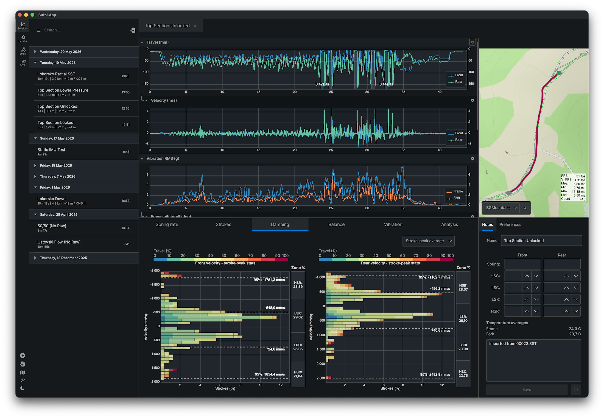

# Sufni Suspension Telemetry



Sufni\* Suspension Telemetry is a mountain bike suspension telemetry system that
was born out of sheer curiosity. The [data acquisition unit](https://github.com/sghctoma/sst/wiki/02-Data-Acquisition-Unit) is built around the
Raspberry Pi Pico W and uses affordable off-the-shelf components, so anybody
with a bit of soldering skills can build it.

Contrary to most (all?) suspension telemetry systems, Sufni uses rotary encoders
to measure movement. They are cheap, reasonably accurate, and can reach pretty
high sample rates. An additional benefit is that on some frames they are easier
to attach to rear shocks than linear sensors, because they can fit into much
tigther spaces.

The application retrieves recorded sessions from the DAQ either over Wi-Fi or via its mass-storage device mode. Both the mobile and desktop apps can import data from the DAQ and synchronize sessions between them. A typical workflow is to transfer sessions to the mobile app on the trail for a quick review, then sync them to the desktop application later for more in-depth analysis.

The user interface provides plots that help with setting spring rate, damping, and overall bike balance. In the desktop app, GPX tracks can be uploaded and synchronized with the travel plot, making it easy to see how the suspension behaved at specific sections of the trail.

## Notable Features

- Cross-platform: macOS, Linux, Windows, Android, iOS
- Suspension analysis: travel and velocity plots, histograms, balance, leverage ratio, frequency spectrum
- Automatic compression/rebound stroke detection and airtime detection
- Import sessions from the DAQ over Wi-Fi (mDNS discovery + TCP) or USB mass storage
- Sync sessions between desktop and mobile devices

## Prerequisites

- [.NET 10 SDK](https://dotnet.microsoft.com/download)
- Platform workloads if building for mobile targets (`dotnet workload install android ios macos`) — not needed for desktop-only builds

## Building

Four solution files are available, each tailored to a development scenario:

| Solution            | Use case                    |
| ------------------- | --------------------------- |
| `Sufni.App.sln`     | Full matrix — all platforms |
| `Sufni.Desktop.sln` | Desktop development         |
| `Sufni.Android.sln` | Android development         |
| `Sufni.iOS.sln`     | iOS development             |

You can build and run straight from the terminal:

```sh
dotnet build Sufni.App/Sufni.App.macOS/Sufni.App.macOS.csproj -c Debug
open Sufni.App/Sufni.App.macOS/bin/Debug/net10.0-macos/osx-arm64/Sufni.App.macOS.app
```

Or use your preferred IDE:

- [Visual Studio Code](https://code.visualstudio.com/) is supported with launch and tasks configurations. The [C# Dev Kit](https://marketplace.visualstudio.com/items?itemName=ms-dotnettools.csdevkit) will be needed for full IDE integration.

- [JetBrains Rider](https://www.jetbrains.com/rider/) has been tested.

See [BUILD.md](BUILD.md) for platform-specific build and run instructions.

For an overview of the project structure, processing pipeline, and design decisions, see [ARCHITECTURE.md](ARCHITECTURE.md).

\* _The word "sufni" (pronounced SHOOF-nee) means tool shed in Hungarian, but
also used as an adjective denoting something as DIY, garage hack, etc._
