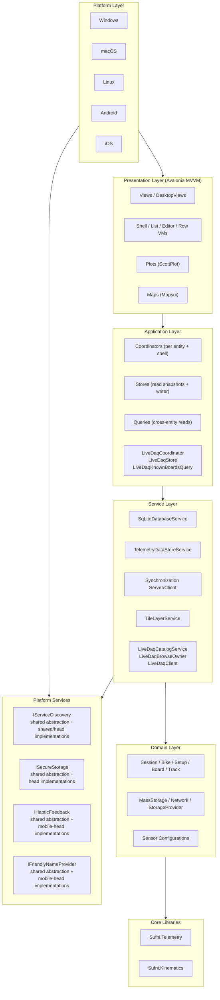

# Architecture

Sufni.App is a cross-platform application for analyzing mountain bike suspension telemetry. It acquires raw sensor data from a Pico-based DAQ device (via USB or WiFi), processes it through a signal analysis pipeline, and presents interactive plots for tuning suspension spring rates and damper settings. It also models bike linkage kinematics to compute leverage ratios and related characteristics. The app runs on Windows, macOS, Linux, Android, and iOS using Avalonia UI, and supports desktop-to-mobile synchronization.

This document is the catalog. Each subsystem is summarized here and the deep details live in `architecture/`.



The presentation layer holds only UI state and binds against the application layer. Coordinators are the only writers to stores; queries are stateless cross-entity reads; services and factories own infrastructure creation and background execution; view models do not depend on other feature view models for business answers, do not construct concrete datastore implementations, and do not manage picker or thread lifetime — see [UI Architecture](#ui-architecture) for the rules.

---

## Document Index

- [Data Acquisition & File Format](docs/architecture/acquisition.md) — how SST files reach the app, the wire/file formats, spike elimination.
- [Signal Processing & Suspension Kinematics](docs/architecture/processing.md) — the pipeline from raw samples to histograms, the linkage solver, sensor calibration.
- [UI Architecture](docs/architecture/ui.md) — invariants, layering, threading, stores, coordinators, queries, view models, DI, navigation, controls, plots.
- [Live DAQ Streaming](docs/architecture/live-streaming.md) — real-time telemetry preview: wire protocol, transport, discovery catalog, runtime store, detail tab lifecycle.
- [Persistence & Serialization](docs/architecture/persistence.md) — SQLite schema, the database service, soft delete, conflict resolution.
- [Cross-Device Synchronization](docs/architecture/sync.md) — pairing flow, server, client, and sync payloads.

---

## Project Structure

| Project                   | Path                           | Role                                                                                                         |
| ------------------------- | ------------------------------ | ------------------------------------------------------------------------------------------------------------ |
| **Sufni.Telemetry**       | `Sufni.Telemetry/`             | Pure C# library: SST parsing, signal processing, stroke detection, histograms                                |
| **Sufni.Telemetry.Tests** | `Sufni.Telemetry.Tests/`       | Unit tests for telemetry processing                                                                          |
| **Sufni.Kinematics**      | `Sufni.Kinematics/`            | Suspension linkage simulation, leverage ratio calculation                                                    |
| **Sufni.App**             | `Sufni.App/Sufni.App/`         | Neutral shared application layer: views, view models, coordinators, stores, queries, services, models, plots |
| **Sufni.App.Desktop**     | `Sufni.App/Sufni.App.Desktop/` | Desktop-only layer: sync server, ASP.NET Core hosting, inbound desktop sync infrastructure                   |
| **Sufni.App.Windows**     | `Sufni.App/Sufni.App.Windows/` | Windows entry point (`Program.cs`)                                                                           |
| **Sufni.App.macOS**       | `Sufni.App/Sufni.App.macOS/`   | macOS entry point (`Program.cs`)                                                                             |
| **Sufni.App.Linux**       | `Sufni.App/Sufni.App.Linux/`   | Linux entry point (`Program.cs`)                                                                             |
| **Sufni.App.Android**     | `Sufni.App/Sufni.App.Android/` | Android entry point (`MainActivity.cs`)                                                                      |
| **Sufni.App.iOS**         | `Sufni.App/Sufni.App.iOS/`     | iOS entry point (`AppDelegate.cs`)                                                                           |

Scenario-specific solutions live at the repository root:

- `Sufni.App.sln` — full matrix / repo-wide solution
- `Sufni.Desktop.sln` — desktop workflow solution
- `Sufni.Android.sln` — Android workflow solution
- `Sufni.iOS.sln` — iOS workflow solution

---

## Platform Abstractions

| Interface               | File                                                    | Purpose                                                                 | Implementations                                                                                                |
| ----------------------- | ------------------------------------------------------- | ----------------------------------------------------------------------- | -------------------------------------------------------------------------------------------------------------- |
| `IServiceDiscovery`     | `Sufni.App/Sufni.App/Services/IServiceDiscovery.cs`     | mDNS browse for `_gosst._tcp` and `_sstsync._tcp`                       | `SocketServiceDiscovery` (shared / Win / Linux / Android), `BonjourServiceDiscovery` (macOS / iOS)             |
| `ISecureStorage`        | `Sufni.App/Sufni.App/Services/ISecureStorage.cs`        | Encrypted key-value store for JWT secrets, certificates, refresh tokens | `WindowsSecureStorage`, `LinuxSecureStorage`, `MacOsSecureStorage`, `AndroidSecureStorage`, `IosSecureStorage` |
| `IHapticFeedback`       | `Sufni.App/Sufni.App/Services/IHapticFeedback.cs`       | Tactile feedback: `Click()`, `LongPress()`                              | `AndroidHapticFeedback`, `IosHapticFeedback`                                                                   |
| `IFriendlyNameProvider` | `Sufni.App/Sufni.App/Services/IFriendlyNameProvider.cs` | Human-readable device name for sync identification                      | `AndroidFriendlyNameProvider`, `IosFriendlyNameProvider`                                                       |

Each platform entry point registers its implementations before the shared `App.axaml.cs` initialization runs.

---

## Data Acquisition & File Format

Telemetry reaches the app through three `ITelemetryDataStore` implementations behind a single interface, and SST files come in two binary versions (V3 fixed-record, V4 TLV with IMU/GPS/markers). Parsing applies multi-stage spike elimination before handing samples to the processing pipeline.

Topics in [architecture/acquisition.md](architecture/acquisition.md):

- [Data Acquisition](architecture/acquisition.md#data-acquisition) — overview and source-flow diagram
  - [Interfaces](architecture/acquisition.md#interfaces) — `ITelemetryDataStore`, `ITelemetryFile`, `ITelemetryDataStoreService`
  - [Import Screen Boundaries](architecture/acquisition.md#import-screen-boundaries) — canonical worked example of the boundary rules
  - [Mass Storage](architecture/acquisition.md#mass-storage) — `BOARDID` marker, drive probing, background lifecycle
  - [Network (WiFi DAQ)](architecture/acquisition.md#network-wifi-daq) — mDNS discovery and the SST TCP wire protocol
  - [Storage Provider](architecture/acquisition.md#storage-provider) — Avalonia picker integration and duplicate detection
- [File Format & Parsing](architecture/acquisition.md#file-format--parsing) — version dispatch
  - [SST V3 Format](architecture/acquisition.md#sst-v3-format) — legacy fixed-record layout
  - [SST V4 TLV Format](architecture/acquisition.md#sst-v4-tlv-format) — TLV chunks (Rates, Telemetry, Marker, IMU, IMU Meta, GPS)
  - [Spike Elimination](architecture/acquisition.md#spike-elimination) — four-stage anomaly correction
  - [V4 Data Structures](architecture/acquisition.md#v4-data-structures) — `GpsRecord`, `ImuRecord`, `ImuMetaEntry`, `RawImuData`, `MarkerData`

---

## Signal Processing & Suspension Kinematics

`TelemetryData.FromRecording()` orchestrates the full pipeline: travel calibration → Savitzky-Golay velocity → stroke detection → categorization → airtime detection → histogram + statistics. The `Sufni.Kinematics` library independently solves bike linkage geometry to derive leverage ratios. Sensor calibration is a strategy-pattern bridge between raw ADC counts and millimeters of travel.

Topics in [architecture/processing.md](architecture/processing.md):

- [Signal Processing Pipeline](architecture/processing.md#signal-processing-pipeline) — pipeline overview
  - [Travel Calculation](architecture/processing.md#travel-calculation) — sensor-driven mm conversion
  - [Velocity Calculation](architecture/processing.md#velocity-calculation) — Savitzky-Golay smoothed first derivative
  - [Stroke Detection](architecture/processing.md#stroke-detection) — sign changes with top-out concatenation
  - [Stroke Categorization](architecture/processing.md#stroke-categorization) — compression / rebound / idling thresholds
  - [Airtime Detection](architecture/processing.md#airtime-detection) — front/rear overlap heuristics
  - [Processing Parameters](architecture/processing.md#processing-parameters) — all tunables in `Parameters.cs`
  - [Serialized Structure](architecture/processing.md#serialized-structure) — MessagePack `TelemetryData` shape
- [Suspension Kinematics](architecture/processing.md#suspension-kinematics)
  - [Linkage Model](architecture/processing.md#linkage-model) — joint types, links, JSON deserialization
  - [Kinematic Solver](architecture/processing.md#kinematic-solver) — Gauss-Seidel constraint relaxation across shock travel
  - [Bike Characteristics](architecture/processing.md#bike-characteristics) — derived travel limits and leverage ratio
  - [Utilities](architecture/processing.md#utilities) — `CoordinateRotation`, `GroundCalculator`, `EtrtoRimSize`, `GeometryUtils`
- [Sensor Calibration](architecture/processing.md#sensor-calibration) — `ISensorConfiguration` strategy pattern, polymorphic JSON, four implementations

---

## UI Architecture

The presentation layer is layered `Views → ViewModels → Coordinators / Stores / Queries → Services → Platform`. Stores own shared read state (read interface for VMs, writer interface for coordinators); coordinators own all workflows, store writes, post-save navigation, and sync arrival; queries answer cross-domain business questions; view models project state to bindings and route commands. ScottPlot rendering helpers live alongside the rest of the UI.

Topics in [architecture/ui.md](architecture/ui.md):

- [Architectural Invariants](architecture/ui.md#architectural-invariants) — what each role owns
- [Layered Architecture](architecture/ui.md#layered-architecture) — diagram and dependency rules
- [Threading & Lifecycle](architecture/ui.md#threading--lifecycle) — UI vs background ownership, `Loaded`/`Unloaded` discipline
  - [Cancellation & Result Coherence](architecture/ui.md#cancellation--result-coherence) — cancellation as neutral exit, stale-result guards
- [Stores](architecture/ui.md#stores) — `BikeStore`, `SetupStore`, `SessionStore`, `PairedDeviceStore`; snapshot model and conflict baseline
- [Coordinators](architecture/ui.md#coordinators) — entity, shell, sync, pairing, import, inbound-sync coordinators; eager-resolution rules
- [Result Shapes](architecture/ui.md#result-shapes) — sealed `Saved`/`Conflict`/`Failed` records and similar service outcomes
- [Queries](architecture/ui.md#queries) — `IBikeDependencyQuery` and the database-sourced answer pattern
- [View Models](architecture/ui.md#view-models) — shell / page / list / row / editor categories, `TabPageViewModelBase`, `ViewModelBase`
- [Testing Boundaries](architecture/ui.md#testing-boundaries) — what each layer's tests assert
- [Dependency Injection](architecture/ui.md#dependency-injection) — `App.ServiceCollection`, shared vs platform registrations, eager resolution
- [Navigation](architecture/ui.md#navigation) — `IShellCoordinator`, mobile back-stack vs desktop tab model
- [Controls Library](architecture/ui.md#controls-library) — reusable controls in `Views/Controls/` and `DesktopViews/Controls/`
- [Data Visualization](architecture/ui.md#data-visualization) — `SufniPlot` / `TelemetryPlot` base classes
  - [Plot Hierarchy](architecture/ui.md#plot-hierarchy) — table of every concrete plot
  - [IMU Plot](architecture/ui.md#imu-plot) — per-location magnitude calculation
  - [Desktop vs Mobile](architecture/ui.md#desktop-vs-mobile) — extended desktop layouts vs stacked mobile views

---

## Live DAQ Streaming

The live preview feature streams real-time telemetry from a connected DAQ device to the desktop app over a framed TCP protocol. It is intentionally separate from the import pipeline: it has its own discovery catalog, browse ownership, runtime-only store, and per-tab transport clients. The feature activates only when the user selects the Live primary page, and each detail tab owns an independent connection that disconnects on tab close.

```
mDNS announcement
  -> LiveDaqCatalogService (probe board ID)
    -> LiveDaqCoordinator.Reconcile (merge with known boards)
      -> LiveDaqStore.Upsert
        -> DynamicData -> LiveDaqListViewModel -> UI

User selects row
  -> LiveDaqCoordinator.SelectAsync
    -> shell.OpenOrFocus<LiveDaqDetailViewModel>

Tab loads -> LiveDaqClient.ConnectAsync -> StartPreviewAsync
  -> receive loop parses frames -> LiveDaqSessionState.ApplyFrame
    -> DispatcherTimer tick -> CreateSnapshot -> UI binding

Tab closes -> Unloaded -> DisconnectAsync -> TCP closed
```

Topics in [docs/architecture/live-streaming.md](docs/architecture/live-streaming.md):

- [Overview](docs/architecture/live-streaming.md#overview) — feature scope, architecture diagram, data flow
- [Live Wire Protocol](docs/architecture/live-streaming.md#live-wire-protocol) — 16-byte frame header, frame types, start handshake, result codes
- [Transport Layer](docs/architecture/live-streaming.md#transport-layer) — protocol reader, client lifecycle, session state accumulator
- [Discovery & Catalog](docs/architecture/live-streaming.md#discovery--catalog) — browse ownership, board-ID inspector, catalog service
- [Known-Board Query](docs/architecture/live-streaming.md#known-board-query) — board + setup + bike enrichment
- [Runtime Store](docs/architecture/live-streaming.md#runtime-store) — in-memory `LiveDaqStore`, no persistence
- [Coordinator](docs/architecture/live-streaming.md#coordinator) — activate/deactivate, reconcile, tab routing
- [View Models](docs/architecture/live-streaming.md#view-models) — list, row, detail tab lifecycle
- [Design Decisions](docs/architecture/live-streaming.md#design-decisions) — separation from import, per-tab clients, throttled UI, lease-based browse

---

## Live DAQ Streaming

The live preview feature streams real-time telemetry from a connected DAQ device to the desktop app over a framed TCP protocol. It is intentionally separate from the import pipeline: it has its own discovery catalog, browse ownership, runtime-only store, and per-tab transport clients. The feature activates only when the user selects the Live primary page, and each detail tab owns an independent connection that disconnects on tab close.

```
mDNS announcement
  -> LiveDaqCatalogService (probe board ID)
    -> LiveDaqCoordinator.Reconcile (merge with known boards)
      -> LiveDaqStore.Upsert
        -> DynamicData -> LiveDaqListViewModel -> UI

User selects row
  -> LiveDaqCoordinator.SelectAsync
    -> shell.OpenOrFocus<LiveDaqDetailViewModel>

Tab loads -> LiveDaqClient.ConnectAsync -> StartPreviewAsync
  -> receive loop parses frames -> LiveDaqSessionState.ApplyFrame
    -> DispatcherTimer tick -> CreateSnapshot -> UI binding

Tab closes -> Unloaded -> DisconnectAsync -> TCP closed
```

Topics in [docs/architecture/live-streaming.md](docs/architecture/live-streaming.md):

- [Overview](docs/architecture/live-streaming.md#overview) — feature scope, architecture diagram, data flow
- [Live Wire Protocol](docs/architecture/live-streaming.md#live-wire-protocol) — 16-byte frame header, frame types, start handshake, result codes
- [Transport Layer](docs/architecture/live-streaming.md#transport-layer) — protocol reader, client lifecycle, session state accumulator
- [Discovery & Catalog](docs/architecture/live-streaming.md#discovery--catalog) — browse ownership, board-ID inspector, catalog service
- [Known-Board Query](docs/architecture/live-streaming.md#known-board-query) — board + setup + bike enrichment
- [Runtime Store](docs/architecture/live-streaming.md#runtime-store) — in-memory `LiveDaqStore`, no persistence
- [Coordinator](docs/architecture/live-streaming.md#coordinator) — activate/deactivate, reconcile, tab routing
- [View Models](docs/architecture/live-streaming.md#view-models) — list, row, detail tab lifecycle
- [Design Decisions](docs/architecture/live-streaming.md#design-decisions) — separation from import, per-tab clients, throttled UI, lease-based browse

---

## Persistence & Serialization

SQLite via `sqlite-net-pcl` with WAL mode. All sync-enabled entities inherit from `Synchronizable`, carrying `Updated` / `ClientUpdated` / `Deleted` timestamps for soft delete and conflict resolution. Session metadata and the MessagePack telemetry blob are split across separate operations so the blob isn't dragged through metadata-only writes.

Topics in [architecture/persistence.md](architecture/persistence.md):

- [Schema](architecture/persistence.md#schema) — ER diagram for `session`, `bike`, `setup`, `board`, `track`, `session_cache`, `app_setting`, `sync`, `paired_device`
- [Database Service](architecture/persistence.md#database-service) — generic `Synchronizable` operations and session-specific blob ops
- [Soft Delete](architecture/persistence.md#soft-delete) — `Deleted` timestamp, 1-day purge window, expired-pair cleanup
- [Conflict Resolution](architecture/persistence.md#conflict-resolution) — `MergeAsync<T>()` rules: new / remote-delete / local-wins / remote-wins

---

## Cross-Device Synchronization

A desktop instance can host an embedded ASP.NET Core / Kestrel server over TLS with JWT auth, advertised via mDNS. Mobile clients pair with a 6-digit PIN, then push and pull entity changes plus session telemetry blobs. `SyncCoordinator` is the application-layer entry point; `HttpApiService` handles JWT auto-refresh.

Topics in [architecture/sync.md](architecture/sync.md):

- [Pairing Flow](architecture/sync.md#pairing-flow) — request → confirm → refresh sequence
- [Server](architecture/sync.md#server) — `SynchronizationServerService`, TLS / JWT / mDNS setup, full endpoint table
- [Client](architecture/sync.md#client) — `SynchronizationClientService` four-phase sync, `SyncCoordinator`, `HttpApiService` token refresh, `SynchronizationData` payload
