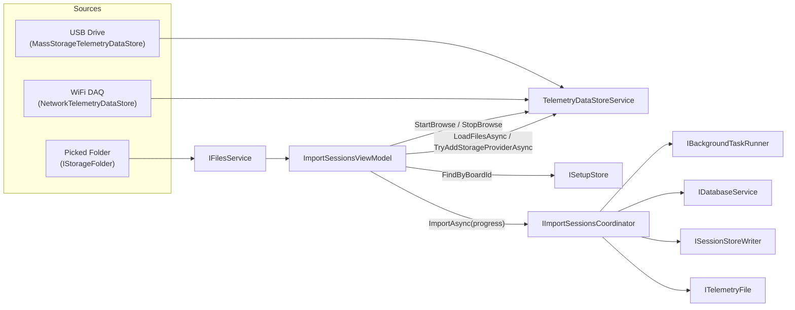
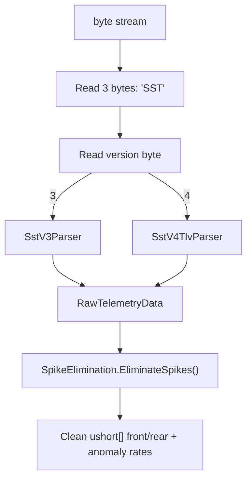

# Data Acquisition & File Format

> Part of the [Sufni.App architecture documentation](../ARCHITECTURE.md). This file covers how telemetry files reach the app and how the SST binary format is parsed.

## Data Acquisition

Three data store implementations feed telemetry files into the app through a common interface. The import-sessions screen is the clearest worked example of how those sources flow through the architecture: the view model owns selection and notifications, the setup store answers the "setup for this board" lookup, the data-store service owns browse and datastore registration, and the coordinator owns the per-file import lifecycle.



### Interfaces

**`ITelemetryDataStore`** (`Sufni.App/Sufni.App/Models/ITelemetryDataStore.cs`) exposes a `Name`, an optional `BoardId` (DAQ device GUID), and `GetFiles()` returning a list of `ITelemetryFile`.

**`ITelemetryFile`** (`Sufni.App/Sufni.App/Models/ITelemetryFile.cs`) represents a single SST file. Key members:

- `ShouldBeImported` — tri-state nullable bool: `null` if file duration < 5 seconds (too short to be useful), `true`/`false` for user decision
- `GeneratePsstAsync(BikeData)` — the full pipeline in one call: reads raw bytes, parses SST, runs signal processing, returns MessagePack-serialized `TelemetryData`
- `OnImported()` / `OnTrashed()` — post-action hooks (move file, send TCP delete command, etc.)
- `StartTime`, `Duration` — resolved eagerly from the SST header for display before import (source varies by implementation)

**`ITelemetryDataStoreService`** (`Sufni.App/Sufni.App/Services/ITelemetryDataStoreService.cs`) owns the live `DataStores` collection plus the browse and registration surfaces the UI uses: `StartBrowse()`, `StopBrowse()`, `LoadFilesAsync(...)`, `TryAddStorageProviderAsync(...)`, and `DetectConnectedBoardIdAsync(...)`. The import screen talks to this service directly, and the welcome create-setup flow reaches it through `ISetupCoordinator`; neither screen constructs concrete datastore implementations itself.

### Import Screen Boundaries

The import-sessions feature is the canonical worked example of the current boundary rules:

- `ImportSessionsViewModel` owns only screen-scoped state: available datastores/files, selected datastore/setup, notifications, and errors.
- It resolves the current board's setup through `ISetupStore.FindByBoardId(Guid)` and never reads `IDatabaseService` directly.
- It starts and stops browse in `Loaded` / `Unloaded`, asks `ITelemetryDataStoreService` to load files or register a picked folder, and uses `ImportSessionsCommand.IsRunning` as its busy-state source of truth.
- `ITelemetryDataStoreService` owns the live `DataStores` collection, mass-storage/network browse lifetime, storage-provider datastore construction, duplicate detection, and one-shot board detection for the welcome-screen create-setup flow.
- `IImportSessionsCoordinator` owns the full per-file import / trash workflow, session persistence, session-store upserts, background execution, and per-file progress reporting.

### Mass Storage

`MassStorageTelemetryDataStore` (`Sufni.App/Sufni.App/Models/MassStorageTelemetryDataStore.cs`) identifies DAQ drives by the presence of a `BOARDID` marker file at the drive root. The file contains the device serial as a hex string, converted to a UUID via `UuidUtil.CreateDeviceUuid()`.

`TelemetryDataStoreService` (`Sufni.App/Sufni.App/Services/TelemetryDataStoreService.cs`) still uses a `DispatcherTimer` for browse cadence, but the expensive work no longer lives on the UI thread. Drive probing, removed-storage-provider checks, mass-storage datastore creation, one-shot board detection, and file enumeration cross an explicit background boundary through `IBackgroundTaskRunner`; only `DataStores` mutation is marshaled back to the UI thread.

`MassStorageTelemetryDataStore.CreateAsync()` performs the `BOARDID` read and `uploaded/` directory creation off thread. `LoadFilesAsync()` is the service surface the import view model uses instead of calling `GetFiles()` directly, so the page stays responsive while enumerating files from the device.

On import, files move to an `uploaded/` subdirectory. On trash, files move to `trash/`.

### Network (WiFi DAQ)

`NetworkTelemetryDataStore` (`Sufni.App/Sufni.App/Models/NetworkTelemetryDataStore.cs`) connects to a DAQ device discovered via mDNS (service type `_gosst._tcp`). File listing uses a custom TCP binary protocol implemented in `SstTcpClient` (`Sufni.App/Sufni.App/Models/SstTcpClient.cs`):

```
Request:  [0x03, 0x00, 0x00, 0x00, fileId_LE(4)]
Response: [size_LE(4), padding(4)]  → ack [0x04] → data[size] → confirm [0x05]
```

- `fileId = 0` is a magic value that returns the directory listing instead of a file. The directory contains the board ID (8 bytes), sample rate (uint16), then 30-byte entries (9-char name + uint64 size + uint64 timestamp + uint32 durationMs + version byte).
- `fileId < 0` (negative) triggers a remote delete; the server responds with status code 10.

Network add / remove handling follows the same split as mass storage: any initialization work completes first, and only the `DataStores` collection mutation is marshaled back to the UI thread.

### Storage Provider

`StorageProviderTelemetryDataStore` (`Sufni.App/Sufni.App/Models/StorageProviderTelemetryDataStore.cs`) wraps Avalonia's `IStorageFolder` for platform-agnostic file access via the system file picker. All I/O is deferred to an async `Init()` task.

The view model may ask `IFilesService` for a folder, but it does not construct this datastore directly. Registration lives in `ITelemetryDataStoreService.TryAddStorageProviderAsync(...)`, which owns duplicate detection and returns a sealed `StorageProviderRegistrationResult` (`Added` or `AlreadyOpen`) together with the concrete datastore instance the caller should select. This keeps infrastructure creation out of the view model and makes duplicate handling deterministic.

---

## File Format & Parsing

SST files are the raw binary format written by the Pico DAQ. Two versions exist.



`RawTelemetryData.FromStream()` (`Sufni.Telemetry/RawTelemetryData.cs`) reads the magic bytes and version, then dispatches to the appropriate `ISstParser` implementation. Each parser (`ISstParser`) exposes two entry points: `Parse()` for full data extraction, and `Inspect()` for a lightweight header scan that returns an `SstFileInspection` (sealed hierarchy: `ValidSstFileInspection` or `MalformedSstFileInspection`) without reading the full payload. `RawTelemetryData.InspectStream()` is the corresponding entry point for the inspect path — file implementations use it for eager header inspection before import.

### SST V3 Format

| Offset | Size | Field                                          |
| ------ | ---- | ---------------------------------------------- |
| 0      | 3    | Magic: `"SST"`                                 |
| 3      | 1    | Version: `3`                                   |
| 4      | 2    | Sample rate (uint16, Hz)                       |
| 6      | 2    | Padding                                        |
| 8      | 8    | Timestamp (int64, Unix seconds)                |
| 16     | N×4  | Records: uint16 front + uint16 rear per sample |

Values use 12-bit two's complement: if `value >= 2048`, subtract 4096. A sentinel of `0xFFFF` for the first sample indicates no data on that channel.

### SST V4 TLV Format

| Offset | Size | Field                           |
| ------ | ---- | ------------------------------- |
| 0      | 3    | Magic: `"SST"`                  |
| 3      | 1    | Version: `4`                    |
| 4      | 4    | Padding                         |
| 8      | 8    | Timestamp (int64, Unix seconds) |
| 16     | ...  | TLV chunks                      |

Each chunk: 1-byte type + uint16 payload length + variable payload. Unknown chunk types are skipped by seeking past their payload.

| Type      | Value  | Payload                                                            | Description                                                                                                                                            |
| --------- | ------ | ------------------------------------------------------------------ | ------------------------------------------------------------------------------------------------------------------------------------------------------ |
| Rates     | `0x00` | N × (1-byte type + uint16 rate)                                    | Sample rates per stream type                                                                                                                           |
| Telemetry | `0x01` | N × (uint16 front + uint16 rear)                                   | Suspension encoder data                                                                                                                                |
| Marker    | `0x02` | (empty)                                                            | Event marker; timestamp derived from current telemetry sample count                                                                                    |
| Imu       | `0x03` | N × 6 × int16                                                      | Accelerometer (Ax,Ay,Az) + gyroscope (Gx,Gy,Gz)                                                                                                        |
| ImuMeta   | `0x04` | count(1) + N × (locId(1) + accelLsbPerG(f32) + gyroLsbPerDps(f32)) | IMU calibration per sensor location                                                                                                                    |
| Gps       | `0x05` | N × 46 bytes                                                       | date(u32 YYYYMMDD) + timeMs(u32) + lat(f64) + lon(f64) + alt(f32) + speed(f32) + heading(f32) + fixMode(u8) + satellites(u8) + epe2d(f32) + epe3d(f32) |

The parser (`Sufni.Telemetry/SstV4TlvParser.cs`) tracks `telemetrySampleCount` as it processes chunks. Marker timestamps are calculated as `telemetrySampleCount / telemetrySampleRate` at the point the marker chunk appears. IMU data is only retained if calibration metadata (`ImuMeta`) is present.

The `Inspect()` path scans only the header and rate/telemetry chunk metadata to compute duration and version without fully parsing all data — used for UI display before import. It also detects unknown TLV chunk types and malformed headers, returning a `MalformedSstFileInspection` with a diagnostic message when the file cannot be imported.

### Spike Elimination

`SpikeElimination.EliminateSpikes()` (`Sufni.Telemetry/SpikeElimination.cs`) cleans sensor data in four stages:

1. **Detect sudden changes** — multi-pass sliding window search (window sizes 5 down to 1). A change is flagged when the total magnitude exceeds `summaThreshold=100` ADC counts AND every individual step within the window exceeds `stepThreshold=30`. Already-flagged regions are excluded from subsequent passes.

2. **Flatten gradual spikes** — each detected change region is collapsed to a single step (all intermediate samples set to the end value).

3. **Handle early baseline shift** — if the first detected change occurs within the first 100 samples (~100ms at 1kHz), the entire signal after the change is shifted by the change magnitude. This corrects for sensor initialization drift.

4. **Handle temporary dips** — pairs of negative-then-positive changes are treated as sensor glitches. The dip region between them is shifted back to undo the anomaly.

Output is clamped to valid 12-bit ADC range `[0, 4095]`. The anomaly count is converted to an anomaly rate (per second) for quality reporting.

### V4 Data Structures

All are MessagePack-serializable types defined in `Sufni.Telemetry/`:

- **`GpsRecord`** — Timestamp (UTC DateTime), Latitude, Longitude, Altitude, Speed (m/s), Heading, FixMode, Satellites, Epe2d/Epe3d (error estimates in meters)
- **`ImuRecord`** — Ax, Ay, Az (raw int16 acceleration), Gx, Gy, Gz (raw int16 gyroscope)
- **`ImuMetaEntry`** — LocationId (sensor position: 0=frame, 1=fork, 2=shock), AccelLsbPerG, GyroLsbPerDps (calibration)
- **`RawImuData`** — Container: Meta list, SampleRate, Records list, ActiveLocations list
- **`MarkerData`** — TimestampOffset (seconds from session start)
