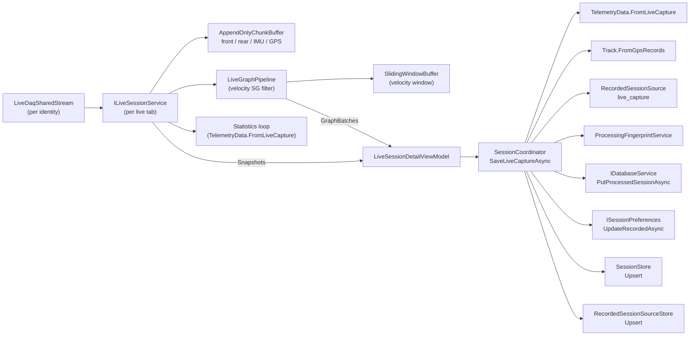

# Live Session Recording

> Part of the [Sufni.App architecture documentation](../ARCHITECTURE.md). This file covers the live-session recording slice: the per-tab capture service that subscribes to a shared live transport, accumulates raw samples for save, derives graphable batches, computes rolling statistics, and persists the result as a recorded `Session` row with a live-capture source and processing fingerprint. Both desktop and mobile heads expose the live-session tab. The transport, discovery, catalog, and diagnostics-tab side of the live feature lives in [Live DAQ Streaming](live-streaming.md).

## Contents

- [Overview](#overview)
- [Data Flow](#data-flow)
- [Configuration Lock](#configuration-lock)
- [Capture Service](#capture-service)
- [Buffers](#buffers)
- [Live Graph Pipeline](#live-graph-pipeline)
- [Stream Configuration](#stream-configuration)
- [Presentation Records](#presentation-records)
- [Live Session Detail View Model](#live-session-detail-view-model)
- [GPS Preview State](#gps-preview-state)
- [Save Flow](#save-flow)
- [Design Decisions](#design-decisions)

## Overview

The live-session slice runs in its own dedicated tab opened from the Live primary page through `LiveDaqCoordinator.OpenSessionAsync`. It is built on top of the per-identity `LiveDaqSharedStream` — the same transport the diagnostics tab uses — but layers per-tab capture, graphing, statistics, and a save path on top. One `LiveSessionDetailViewModel` and one `ILiveSessionService` exist per open live-session tab, and both are scoped to the lifetime of that tab.

The recording side is decoupled from the transport in three ways:

1. The shared stream owns connection, frame parsing, fan-out, and disconnect. Capture, graph batches, statistics, and save live in `ILiveSessionService` and never touch the socket directly.
2. The session-coordinator path is the only persistence surface. The live DAQ coordinator does not write `Session` rows; it just routes the tab.
3. The live-session view model holds no transport state of its own — it consumes `ILiveSessionService` snapshots and graph batches and forwards user choices back through `SessionPreferences`.



## Data Flow

```
Shared stream emits LiveProtocolFrame
  -> LiveSessionService.HandleFrame
    -> LiveTravelBatchFrame  -> AppendOnlyChunkBuffer<ushort> (front/rear) + LiveDisplayUpdate.Travel
    -> LiveImuBatchFrame     -> AppendOnlyChunkBuffer<ImuRecord>          + LiveDisplayUpdate.Imu
    -> LiveGpsBatchFrame     -> AppendOnlyChunkBuffer<GpsRecord> + projected TrackPoint[]
    -> LiveSessionStatsFrame -> latest queue/dropped counters

Display loop (Task.Run)
  -> Channel<LiveDisplayUpdate> reader
    -> ILiveGraphPipeline.AppendTravelSamples / AppendImuSamples
      -> SlidingWindowBuffer<double> recent travel + pending batch lists
        -> PeriodicTimer flush -> Savitzky-Golay velocity over recent window
          -> LiveGraphBatch (Travel/Velocity/IMU) -> Subject<LiveGraphBatch>
            -> LiveSessionDetailViewModel.QueueGraphBatchRefresh
              -> LiveSessionGraphWorkspaceViewModel.ApplyGraphDataPresence
    -> projected TrackPoint[] updates drive Speed/Elevation graph rows

Statistics loop (Task.Run)
  -> snapshot AppendOnlyChunkBuffers under lock
    -> TelemetryData.FromLiveCapture (background runner)
      -> SessionPresentationService.CalculateDamperPercentages
        -> LiveSessionPresentationSnapshot -> Subject<LiveSessionPresentationSnapshot>
          -> LiveSessionDetailViewModel.QueuePresentationRefresh
            -> ApplyPresentation -> spring/damper/balance pages + statistics state

User presses Save
  -> LiveSessionDetailViewModel.SaveImplementation
    -> ILiveSessionService.PrepareCaptureForSaveAsync
      -> snapshot all four buffers under lock
        -> background BuildCapture -> LiveTelemetryCapture
    -> SessionCoordinator.SaveLiveCaptureAsync(session, capture, preferences)
      -> TelemetryData.FromLiveCapture
      -> optional Track.FromGpsRecords
      -> RecordedSessionSource(live_capture) + processing fingerprint
      -> databaseService.PutProcessedSessionAsync(session, track, source)
      -> ISessionPreferences.UpdateRecordedAsync(sessionId, preferences)
      -> SessionStore.Upsert(snapshot) + RecordedSessionSourceStore.Upsert(source)
        -> LiveSessionSaveResult.Saved -> reset capture + open recorded editor

User presses Reset
  -> ILiveSessionService.ResetCaptureAsync
    -> clear AppendOnlyChunkBuffers, bump captureRevision/displayEpoch
      -> LiveGraphPipeline.Reset (clear pending + sliding window, emit empty batch)
        -> view model clears statistics pages and timeline
```

## Configuration Lock

The live-session service holds a configuration lock on the shared stream for the duration of the tab. This is how recording stays internally consistent while the diagnostics tab on the same DAQ remains attachable for read-only viewing.

`ILiveDaqSharedStream` exposes two lease kinds: `AcquireLease()` is a generic observer lease, and `AcquireConfigurationLock()` is a generic observer lease that _also_ increments the configuration-lock count published in `LiveDaqSharedStreamState.IsConfigurationLocked`. `LiveDaqSharedStream.ApplyConfigurationAsync(...)` checks `IsConfigurationLocked` and returns without reconfiguring while any configuration-lock lease is held — so the diagnostics tab cannot tear down the connection mid-capture by changing rates. `LiveSessionService.EnsureAttachedAsync` acquires both leases in one atomic block and disposes both during disposal; the diagnostics tab acquires only the observer lease.

## Capture Service

`ILiveSessionService` (`Sufni.App/Sufni.App/Services/LiveStreaming/ILiveSessionService.cs`) is the per-tab recording surface. `LiveSessionServiceFactory` (`ILiveSessionServiceFactory`) builds one instance per `LiveDaqCoordinator.OpenSessionAsync` call, giving it a `LiveDaqSessionContext` (identity, bike data, calibration), the per-identity `ILiveDaqSharedStream`, the shared `ISessionPresentationService`, an `IBackgroundTaskRunner`, and a freshly built `ILiveGraphPipeline`. The implementation in `LiveSessionService` runs three coordinated activities behind one lock plus a separate display-queue lock.

### Lifecycle and Attachment

`EnsureAttachedAsync` is idempotent and acquires resources in this order under the gate: observer lease, configuration-lock lease, `graphPipeline.Start()`, the display loop task, frame subscription, state subscription. Acquiring resources is followed by a non-locked `sharedStream.EnsureStartedAsync(...)` so connect work runs outside the gate; on failure the resources acquired during this attach are torn down again. `DisposeAsync` mirrors this: it stops subscriptions, completes the display channel, awaits the statistics and display loops, releases both leases, and disposes the graph pipeline.

`ResetCaptureAsync` clears all four `AppendOnlyChunkBuffer` instances, resets statistics and track points, and bumps two monotonic counters: `captureRevision` (observed by the statistics loop to detect that older work is stale) and `displayEpoch` (observed by the display loop to discard older display updates that were already in flight). It then resets the graph pipeline so its sliding window and pending batch are cleared and a single empty `LiveGraphBatch` is published.

### Frame Handlers

`HandleFrame` dispatches by the four data-bearing frame types. Travel and IMU batches accumulate raw samples into the chunk buffers under the gate, build a `LiveDisplayUpdate.Travel` or `LiveDisplayUpdate.Imu` carrying the calibrated values for the live plots, and push that update onto a bounded `Channel<LiveDisplayUpdate>` (`DisplayUpdateQueueCapacity = 8`, `BoundedChannelFullMode.DropOldest`). Drops increment `graphBatchesCoalesced` / `graphSamplesDiscarded` on the published drop counters. GPS frames append raw records and project `TrackPoint`s incrementally, falling back to a full re-projection when an out-of-order timestamp is observed. `LiveSessionStatsFrame` only refreshes the queue-depth and dropped-batch counters surfaced in `LiveSessionControlState`.

The travel handler is also where `CanSave` flips from `false` to `true` (>= 5 samples on either travel channel) and where the first saveable-capture snapshot is published so the tab's save command becomes enabled.

A change in `LiveDaqSharedStreamState.SessionHeader` to a different `SessionId` while the buffers already hold any data flips `isTerminalClosed = true` with a "DAQ started a new live session." error — the user must reset before more data is accepted, so a recorded save never mixes samples from two firmware sessions.

### Statistics Loop

Once a travel batch has produced enough samples for `CanBuildStatistics`, `QueueStatisticsRecompute` updates `queuedStatisticsRevision` and starts the statistics loop if it is not already running. The loop snapshots all four buffers under the gate, runs `TelemetryData.FromLiveCapture(BuildCapture(...))` on the background task runner, calls `ISessionPresentationService.CalculateDamperPercentages`, and republishes a fresh `LiveSessionPresentationSnapshot` carrying the new `TelemetryData` and damper percentages. Throttling has two parts: `nextStatisticsRunAt` enforces the `SessionGraphSettings.LiveStatisticsRefreshIntervalMs` minimum gap between recomputes, and a 500-ms `StatisticsPressureQuietPeriod` skips queueing entirely while `lastClientPressureUtc` is recent (set whenever the client- or display-channel drop counters increase). Skipped queueing is counted in `statisticsRecomputesSkipped`.

### Display Loop

The display loop reads `LiveDisplayUpdate` records off the bounded channel, drops any whose `Epoch` no longer matches `displayEpoch` (so updates produced before the most recent reset are skipped), and dispatches into the graph pipeline (`AppendTravelSamples` / `AppendImuSamples`). The loop never writes back into the chunk buffers — display and capture are appended in parallel from the frame handler under the same gate, then the display path runs entirely off-lock through the channel.

## Buffers

The capture service uses two specialised collection types. Both are internal sealed classes in `Sufni.App/Sufni.App/Services/LiveStreaming/`.

### `AppendOnlyChunkBuffer`

`AppendOnlyChunkBuffer<T>` (`AppendOnlyChunkBuffer.cs`) is the raw-sample sink for save and statistics. It backs the four capture buffers in `LiveSessionService`:

- `frontMeasurements`, `rearMeasurements` — `ushort` encoder counts (`MeasurementChunkSize = 4096` per chunk)
- `imuRecords` — `ImuRecord` per active IMU location tick (`ImuChunkSize = 2048`)
- `gpsRecords` — `GpsRecord` GPS fixes (`GpsChunkSize = 256`)

Internally the buffer keeps a `List<T[]>` of sealed full chunks plus one growing active chunk; `Append` rolls the active chunk into the sealed list once it fills. `CreateSnapshot()` captures the sealed-chunk references plus the active chunk and active count as a `ChunkedBufferSnapshot<T>` value type — the snapshot can be taken under the service's gate and flattened into a contiguous `T[]` later (off-lock, on the background task runner during statistics or save) without copying every sample twice.

This shape is what makes the recording side cheap: each `LiveTravelBatchFrame` appends in O(batch) without resizing a long-lived array, statistics recomputes can grab a snapshot in O(chunks) under the gate, and `BuildCapture` flattens to `T[]` once per save.

### `SlidingWindowBuffer`

`SlidingWindowBuffer<T>` (`SlidingWindowBuffer.cs`) is a fixed-capacity circular buffer that implements `IReadOnlyList<T>`. When full, `Append` silently overwrites the oldest element; indexing is logical (oldest = `[0]`, newest = `[count-1]`).

It is used only inside `LiveGraphPipeline` to hold the most recent travel times and front/rear travel values fed to the Savitzky-Golay velocity filter (`MaxVelocityWindowSamples = 127`, matching the upper bound on the SG window size). Each travel append updates the pending graph-batch lists and the sliding window in lockstep, and the periodic flush snapshots the window to drive velocity computation over a fixed local context. Capture and save never read this buffer — `AppendOnlyChunkBuffer` is the source of truth for the saved sample stream.

## Live Graph Pipeline

`ILiveGraphPipeline` and its `LiveGraphPipeline` implementation (`Sufni.App/Sufni.App/Services/LiveStreaming/LiveGraphPipeline.cs`, `ILiveGraphPipeline.cs`, `LiveGraphPipelineFactory.cs`) bridge per-frame `LiveDisplayUpdate` records into per-row `LiveGraphBatch` deltas the live graph workspace consumes. `LiveGraphPipelineFactory.Create()` constructs one with a flush interval driven by `SessionGraphSettings.LiveGraphRefreshIntervalMs`.

**Purpose.** The DataStreamer-backed live plots want batches of samples at a steady cadence, not a callback per inbound frame. The pipeline collects appended samples into a `PendingGraphBatch` and flushes once per timer tick, which gives the UI a predictable refresh rate and lets the velocity filter run over a stable window snapshot.

**Threading.** The pipeline owns one `Subject<LiveGraphBatch>`, one shared lock, and one flush loop task started by `Start()`. `AppendTravelSamples` and `AppendImuSamples` are called from the display-loop task off the UI thread; they take the lock just long enough to push into the pending lists and update the travel sliding window. `FlushPendingGraphBatch` (also off the UI thread, run from the periodic-timer loop) swaps the pending batch out under the lock, snapshots the sliding window arrays, then computes velocity and emits the batch outside the lock. A flush failure copies the unflushed work back into the pending batch under the lock and re-raises. `Reset` clears state, bumps the revision, and emits a single `LiveGraphBatch.Empty` so subscribers can drop their plot data; `DisposeAsync` cancels the flush loop and completes the subject.

**Batch shape.** `LiveGraphBatch` (defined in `LiveSessionPresentation.cs`) carries:

- `Revision` — monotonically increasing across appends and resets, so consumers can filter stale batches.
- `TravelTimes`, `FrontTravel`, `RearTravel` — exactly the samples appended since the previous flush.
- `VelocityTimes`, `FrontVelocity`, `RearVelocity` — velocity samples aligned with the same travel times for that batch only. Velocity is computed by running a Savitzky-Golay filter over the sliding-window snapshot (window <= 51, polynomial 3, 1st derivative; falls back to NaN if fewer than 5 samples are available or the snapshot contains a NaN) and slicing off the last `batchCount` outputs. The cached `SavitzkyGolay` instance is keyed on the chosen window size and lives entirely on the flush-loop thread.
- `ImuTimes`, `ImuMagnitudes` — per-`LiveImuLocation` series of times and accelerometer magnitudes, again only for samples appended since the previous flush.

`LiveSessionService` exposes `graphPipeline.GraphBatches` directly through its `GraphBatches` property, so `LiveSessionDetailViewModel` subscribes to the pipeline output without going through the service's snapshot subject.

## Stream Configuration

`LiveDaqStreamConfiguration` (`Sufni.App/Sufni.App/Services/LiveStreaming/LiveDaqStreamConfiguration.cs`) is the immutable record the configuration-lock holder sets to ask the DAQ for a particular live stream. It carries:

- `RequestedSensorMask` (`LiveSensorInstanceMask`) — which individual sensor instances to start (fork travel, shock travel, frame/fork/rear IMU, GPS).
- `TravelHz`, `ImuHz`, `GpsFixHz` — per-stream rate caps; zero means "do not request this stream" and disables the corresponding bit in the resolved mask.

`Default` requests Travel + IMU at 200 Hz with no GPS. `FromRequestedRates(travelHz, imuHz, gpsFixHz)` builds a configuration whose mask matches the rates: any rate at zero turns off that bit. `ToStartRequest()` ANDs the requested mask with the rate-derived mask before producing the wire-level `LiveStartRequest`, so a configuration with `Travel | Imu` mask but `ImuHz = 0` will not actually request IMU.

The shared stream stores one current `LiveDaqStreamConfiguration` and exposes it as `RequestedConfiguration`. `ApplyConfigurationAsync(configuration, ct)` reconfigures the stream by tearing down the existing connection, reconnecting, and sending a new `START_LIVE` derived from the config — but it returns a no-op while `IsConfigurationLocked` is set, which is the diagnostics tab's cue that a live-session tab on the same DAQ is currently recording. The config itself does not move with the lock; only the _ability_ to change it does. See [Configuration Lock](#configuration-lock) for the lease mechanics, and the [Live Wire Protocol](live-streaming.md#live-wire-protocol) for the on-wire shape.

## Presentation Records

`LiveSessionPresentation.cs` defines the records the service publishes for the view model:

- **`LiveSessionPresentationSnapshot`** — what the live-session tab projects. Carries the current `LiveSessionStreamPresentation`, the latest `TelemetryData` from the statistics loop, computed `SessionDamperPercentages`, the projected `TrackPoint[]` for the map, the full `LiveSessionControlState`, and a `CaptureRevision` integer the view model uses as a save-already-applied marker.
- **`LiveSessionStreamPresentation`** — sealed hierarchy `Idle` / `Connecting` / `Streaming(SessionStartLocalTime, SessionHeader)` / `Closed(ErrorMessage?)`. Built from `LiveDaqSharedStreamState.ConnectionState`, `SessionHeader`, and `IsClosed`.
- **`LiveGraphBatch`** — described under [Live Graph Pipeline](#live-graph-pipeline).
- **`LiveSessionCapturePackage(Context, TelemetryCapture)`** — the immutable result of `PrepareCaptureForSaveAsync`, fed to `SessionCoordinator.SaveLiveCaptureAsync`.

**`LiveSessionControlState`** (`LiveSessionControlState.cs`) is the recording state machine in record form. It carries the connection state, last error, accepted `LiveSessionHeader`, capture start UTC, capture duration, the per-stream queue-depth and dropped-batch counters from `LiveSessionStatsFrame`, the merged drop counters from the shared client and the display channel, and a `CanSave` boolean. The view model reads this directly to drive command enablement, sidebar text, and the save/reset buttons.

## Live Session Detail View Model

`LiveSessionDetailViewModel` (`Sufni.App/Sufni.App/ViewModels/Editors/LiveSessionDetailViewModel.cs`) extends `TabPageViewModelBase`, one instance per open live-session tab. It is the only writer of UI state for the tab and the only caller of `SessionCoordinator.SaveLiveCaptureAsync`.

The view model wires together five things and owns no transport state:

1. **Subscribes to `ILiveSessionService.Snapshots`** through `QueuePresentationRefresh`, which stashes the latest snapshot under a gate and lets a `DispatcherTimer` (`SessionGraphSettings.LiveUiRefreshIntervalMs`) project it into bindings via `ApplyPresentation`. This applies the session header to graph and media workspaces, recomputes statistics surface state, drives the timestamp, refreshes the control state, and queues the spring/damper/balance bake.
2. **Subscribes to `ILiveSessionService.GraphBatches`** through `QueueGraphBatchRefresh`, which collapses presence flags onto the UI thread and calls `LiveSessionGraphWorkspaceViewModel.ApplyGraphDataPresence` so each row's `SurfacePresentationState` reflects whether any travel or IMU data has arrived. Plot availability is recomputed from the latest accepted `LiveSessionHeader` (travel from `AcceptedTravelHz`, IMU from `AcceptedImuHz` plus active locations) and forwarded into `PreferencesPage.ApplyPlotAvailability`.
3. **Hosts a `PreferencesPageViewModel`** alongside the existing notes/spring/damper/balance pages. Travel/Velocity/IMU/Speed/Elevation plot toggles fire `OnPlotPreferenceChanged`, which calls `LiveSessionGraphWorkspaceViewModel.ApplyPlotPreferences(...)` so each row's `SurfacePresentationState` reflects the user's plot selection in real time.
4. **Bakes statistics** — when a fresh `TelemetryData` arrives in a snapshot, `MaybeQueueBake` runs `ISessionPresentationService.BuildCachePresentation(...)` on the background runner and posts the resulting SVGs back onto the spring/damper/balance pages, mirroring the recorded-session bake. Older bakes are cancelled on each new arrival.
5. **Drives the capture lifecycle** — `Loaded` calls `liveSessionService.EnsureAttachedAsync()`, `Unloaded` cancels the bake, `CloseImplementation` disposes the service. `ResetImplementation` calls `ResetCaptureAsync` and clears the statistics pages. `SaveImplementation` is the recording-side save entry point (see [Save Flow](#save-flow)).

The view model never holds the configuration lock itself — that lives on the service's lease — and never subscribes to the shared stream directly.

## GPS Preview State

`GpsPreviewState` (`Sufni.App/Sufni.App/Services/LiveStreaming/GpsPreviewState.cs`) is a small record interpreting the wire-level `GpsRecord.FixMode` byte. `FromRecord(record)` returns `NoFix` for mode 0 or null, a 2D-fix state for mode 1 (has fix but not ready for full use), a 3D-fix state for mode 2 (has fix and ready), and an "Other" state with the raw fix-mode number for anything else.

It is consumed by both the diagnostics tab (where it drives the GPS section's status text in `LiveDaqDetailViewModel`) and the live-session media workspace (where the same projection feeds the map preview during recording — see [Maps & Tracks](maps-and-tracks.md#gps-preview-state)). The capture-side GPS handling that turns `GpsRecord` records into projected `TrackPoint[]` for the live map and the saved track lives in `LiveSessionService.ApplyGpsBatchLocked` (shared `GpsTrackPointProjection.TryProject` / `ProjectAll`); `GpsPreviewState` is purely the per-record fix-mode interpretation used to render status text.

## Save Flow

The save lifecycle is split between the service (snapshotting capture state under lock) and the coordinator (everything that touches the database).

```
LiveSessionDetailViewModel.SaveImplementation
  -> liveSessionService.PrepareCaptureForSaveAsync
       (snapshot the four AppendOnlyChunkBuffer instances under lock,
        flatten to LiveTelemetryCapture on the background runner)
  -> session = new Session(name, description, setup, capture timestamp)
       with fork/shock spring + damping settings copied from NotesPage
  -> sessionCoordinator.SaveLiveCaptureAsync(session, capture, preferences)
       1. TelemetryData.FromLiveCapture (background runner)
       2. if telemetry has GPS data:
            track = await Track.FromGpsRecords(...)
       3. source = RecordedSessionSource(live_capture JSON payload)
       4. fingerprint = ProcessingFingerprintService.CreateCurrent(...)
       5. session.ProcessedData = telemetryData.BinaryForm
       6. session.ProcessingFingerprintJson = fingerprint JSON
       7. fresh = databaseService.PutProcessedSessionAsync(session, track, source)
       8. snapshot = SessionSnapshot.From(fresh)
       9. sessionPreferences.UpdateRecordedAsync(snapshot.Id, _ => preferences)
      10. sessionStore.Upsert(snapshot)
      11. recordedSessionSourceStore.Upsert(source snapshot)
       -> LiveSessionSaveResult.Saved(SessionId, Updated)
            | LiveSessionSaveResult.Failed(ErrorMessage)
  -> on Saved: liveSessionService.ResetCaptureAsync
              + sessionCoordinator.OpenEditAsync(savedId)
  -> on Failed: append to ErrorMessages
```

`SaveLiveCaptureAsync` (`SessionCoordinator.cs`) always inserts a fresh recorded session row — there is no edit path for live captures and no `BaselineUpdated` to enforce. The recorded source payload stores capture metadata, raw front/rear measurements, IMU data, GPS data, and markers; it does not store `BikeData`, so recorded recompute resolves calibration from the saved session's current setup and bike. `PutProcessedSessionAsync` persists the processed session, optional generated full track, and live-capture source in one transaction.

`SessionPreferences` (built from `PreferencesPage` plus the per-mode statistics pickers via `CreateCurrentSessionPreferences`) is persisted through `ISessionPreferences.UpdateRecordedAsync`, so when the user reopens the saved session in the recorded editor, their plot and statistics choices come back. After a successful save, the view model resets the live capture (so the same tab can immediately start a second one) and routes the user to the recorded editor for the new session via `sessionCoordinator.OpenEditAsync`.

`OperationCanceledException` is rethrown out of `SaveLiveCaptureAsync` — typical-failure paths (database errors, telemetry build failures) are swallowed into `LiveSessionSaveResult.Failed`. The view model also surfaces a "Live session was saved, but post-save cleanup failed" message when the post-save reset or `OpenEditAsync` throws after `Saved` has already been observed, so a partial post-save failure does not lose the saved row.

## Design Decisions

1. **Capture under the same lock as transport reads.** Frame handlers append to chunk buffers and build display updates in one `lock(gate)` so capture and display see the same sample order. Statistics and save snapshots are taken under the same lock and flattened off-lock, avoiding any need to copy hot data twice or to queue per-sample work.
2. **Bounded display channel with `DropOldest`.** The display loop is allowed to lag behind capture without ever holding the gate or dropping captured samples — only the _display_ update for those samples is coalesced, and the count is surfaced as backpressure on the control state. Capture itself is never dropped.
3. **Sliding window only inside the graph pipeline.** Velocity is a presentation concern (the saved telemetry recomputes velocity from the SG filter inside `TelemetryData.FromLiveCapture`), so the sliding window lives next to the flush loop and the pipeline owns the cached SG instance.
4. **Configuration lock instead of per-tab transport.** A live-session tab and the diagnostics tab on the same DAQ share one connection through the registry. The lock makes the diagnostics tab read-only for the duration of a recording so its rate controls cannot tear down a live capture.
5. **Create-only save path through `SessionCoordinator`.** Live captures persist as plain recorded sessions; the live DAQ coordinator only routes the tab and never writes to `SessionStore`. Post-save the user is moved to the recorded editor so the live tab is free to start the next capture.
6. **`SessionPreferences` round-tripped on save.** The same `PreferencesPage` and statistics pickers used in the recorded editor are forwarded through `SaveLiveCaptureAsync`, so reopening the saved session restores the user's plot/statistics choices.
