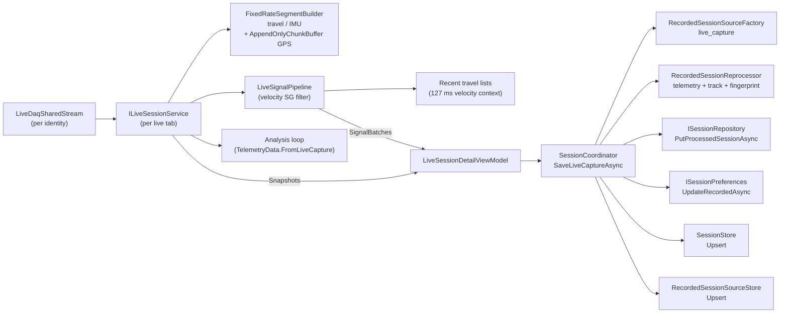

# Live Session Recording

> Part of the [Sufni.App architecture documentation](../ARCHITECTURE.md). This file covers the live-session recording slice: the per-tab capture service that subscribes to a shared live transport, accumulates raw samples for save, derives signal batches, computes rolling analysis state, and persists the result as a recorded `Session` row with a live-capture source and processing fingerprint. Both desktop and mobile heads expose the live-session tab. The transport, discovery, catalog, and diagnostics-tab side of the live feature lives in [Live DAQ Streaming](live-streaming.md).

## Contents

- [Overview](#overview)
- [Data Flow](#data-flow)
- [Configuration Lock](#configuration-lock)
- [Capture Service](#capture-service)
- [Capture Stores](#capture-stores)
- [Live Signal Pipeline](#live-signal-pipeline)
- [Stream Configuration](#stream-configuration)
- [Presentation Records](#presentation-records)
- [Live Session Detail View Model](#live-session-detail-view-model)
- [GPS Preview State](#gps-preview-state)
- [Save Flow](#save-flow)
- [Design Decisions](#design-decisions)

## Overview

The live-session slice runs in its own dedicated tab opened from the Live primary page through `LiveDaqCoordinator.OpenSessionAsync`. It is built on top of the per-identity `LiveDaqSharedStream` — the same transport the diagnostics tab uses — but layers per-tab capture, Telemetry Signals display, statistics, and a save path on top. One `LiveSessionDetailViewModel` and one `ILiveSessionService` exist per open live-session tab, and both are scoped to the lifetime of that tab.

The recording side is decoupled from the transport in three ways:

1. The shared stream owns connection, frame parsing, fan-out, and disconnect. Capture, signal batches, statistics, and save live in `ILiveSessionService` and never touch the socket directly.
2. The session-coordinator path is the only persistence surface. The live DAQ coordinator does not write `Session` rows; it just routes the tab.
3. The live-session view model holds no transport state of its own — it consumes `ILiveSessionService` snapshots and signal batches and forwards user choices back through `SessionPreferences`.


```mermaid
graph LR
    Shared["LiveDaqSharedStream<br/>(per identity)"] --> Service["ILiveSessionService<br/>(per live tab)"]
    Service --> CaptureStores["FixedRateSegmentBuilder<br/>travel / IMU<br/>+ AppendOnlyChunkBuffer GPS"]
    Service --> SignalPipe["LiveSignalPipeline<br/>(velocity SG filter)"]
    Service --> StatsLoop["Analysis loop<br/>(TelemetryData.FromLiveCapture)"]
    SignalPipe --> RecentTravel["Recent travel lists<br/>(127 ms velocity context)"]
    Service -->|"Snapshots"| DetailVM["LiveSessionDetailViewModel"]
    SignalPipe -->|"SignalBatches"| DetailVM
    DetailVM --> Coord["SessionCoordinator<br/>SaveLiveCaptureAsync"]
    Coord --> Source["RecordedSessionSourceFactory<br/>live_capture"]
    Coord --> Reprocessor["RecordedSessionReprocessor<br/>telemetry + track + fingerprint"]
    Coord --> Repo["ISessionRepository<br/>PutProcessedSessionAsync"]
    Coord --> Prefs["ISessionPreferences<br/>UpdateRecordedAsync"]
    Coord --> Store["SessionStore<br/>Upsert"]
    Coord --> SourceStore["RecordedSessionSourceStore<br/>Upsert"]
```

## Data Flow

```
Shared stream emits LiveProtocolFrame
  -> LiveSessionService.HandleFrame
    -> LiveTravelBatchFrame  -> FixedRateSegmentBuilder<ushort> (front/rear) + LiveDisplayUpdate.Travel
    -> LiveImuBatchFrame     -> FixedRateSegmentBuilder<ImuRecord> per active location + LiveDisplayUpdate.Imu (vibration RMS + frame pitch/roll)
    -> LiveTemperatureBatchFrame -> AppendOnlyChunkBuffer<TemperatureSample>
    -> LiveGpsBatchFrame     -> AppendOnlyChunkBuffer<GpsRecord> + projected TrackPoint[]
    -> LiveStatusFrame / LiveSessionStatsFrame -> latest queue/dropped counters
    -> LiveMarkerBatchFrame  -> marker list
    -> LiveSessionResultFrame -> final SST stream status

Display loop (Task.Run)
  -> Channel<LiveDisplayUpdate> reader
    -> ILiveSignalPipeline.AppendTravelSamples / AppendImuSamples
      -> recent travel lists + pending batch lists
        -> PeriodicTimer flush -> Savitzky-Golay velocity over recent 127 ms window
          -> LiveSignalBatch (Travel/Velocity/IMU/Pitch-Roll) -> Subject<LiveSignalBatch>
            -> LiveSessionDetailViewModel.QueueSignalBatchRefresh
              -> LiveSessionSignalsWorkspaceViewModel.ApplySignalDataPresence
    -> projected TrackPoint[] updates drive Speed/Elevation signal rows

Statistics loop (Task.Run)
  -> snapshot segment builders and GPS buffer under lock
    -> TelemetryData.FromLiveCapture (background runner)
      -> SessionPresentationService.CalculateDampingPercentages
        -> LiveSessionPresentationSnapshot -> Subject<LiveSessionPresentationSnapshot>
          -> LiveSessionDetailViewModel.QueuePresentationRefresh
            -> ApplyPresentation -> spring/damping/balance pages + analysis state

User presses Save
  -> LiveSessionDetailViewModel.SaveImplementation
    -> ILiveSessionService.PrepareCaptureForSaveAsync
      -> snapshot travel/IMU segment builders, temperature/GPS buffers, markers, gaps, and final status under lock
        -> background BuildCapture -> LiveTelemetryCapture
    -> SessionCoordinator.SaveLiveCaptureAsync(session, capture, preferences)
      -> RecordedSessionSourceFactory.CreateLiveCapture
      -> RecordedSessionReprocessor.ReprocessAsync
      -> databaseService.PutProcessedSessionAsync(session, track, source)
      -> ISessionPreferences.UpdateRecordedAsync(sessionId, preferences)
      -> SessionStore.Upsert(snapshot) + RecordedSessionSourceStore.Upsert(source)
        -> LiveSessionSaveResult.Saved -> reset capture + open recorded editor

User presses Reset
  -> ILiveSessionService.ResetCaptureAsync
    -> clear segment builders, temperature/GPS buffers, markers, gaps, final status, bump captureRevision/displayEpoch
      -> LiveSignalPipeline.Reset (clear pending + sliding window, emit empty batch)
        -> view model clears analysis pages and timeline
```

## Configuration Lock

The live-session service holds a configuration lock on the shared stream for the duration of the tab. This is how recording stays internally consistent while the diagnostics tab on the same DAQ remains attachable for read-only viewing.

`ILiveDaqSharedStream` exposes two lease kinds: `AcquireLease()` is a generic observer lease, and `AcquireConfigurationLock()` is a generic observer lease that _also_ increments the configuration-lock count published in `LiveDaqSharedStreamState.IsConfigurationLocked`. `LiveDaqSharedStream.ApplyConfigurationAsync(...)` checks `IsConfigurationLocked` and returns without reconfiguring while any configuration-lock lease is held — so the diagnostics tab cannot tear down the connection mid-capture by changing rates. `LiveSessionService.EnsureAttachedAsync` acquires both leases in one atomic block and disposes both during disposal; the diagnostics tab acquires only the observer lease.

## Capture Service

`ILiveSessionService` (`Sufni.App/Sufni.App/LiveDaq/Services/LiveStreaming/ILiveSessionService.cs`) is the per-tab recording surface. `LiveSessionServiceFactory` (`ILiveSessionServiceFactory`) builds one instance per `LiveDaqCoordinator.OpenSessionAsync` call, giving it a `LiveDaqSessionContext` (identity, bike data, calibration), the per-identity `ILiveDaqSharedStream`, the shared `ISessionPresentationService`, an `IBackgroundTaskRunner`, and a freshly built `ILiveSignalPipeline`. The implementation in `LiveSessionService` runs three coordinated activities behind one lock plus a separate display-queue lock.

### Lifecycle and Attachment

`EnsureAttachedAsync` is idempotent and acquires resources in this order under the gate: observer lease, configuration-lock lease, `signalPipeline.Start()`, the display loop task, frame subscription, state subscription. Acquiring resources is followed by a non-locked `sharedStream.EnsureStartedAsync(...)` so connect work runs outside the gate; on failure the resources acquired during this attach are torn down again. `DisposeAsync` mirrors this: it stops subscriptions, completes the display channel, awaits the statistics and display loops, releases both leases, and disposes the signal pipeline.

`ResetCaptureAsync` clears the travel and IMU segment builders, temperature and GPS buffers, markers, gaps, final status, analysis state, and track points, and bumps two monotonic counters: `captureRevision` (observed by the analysis loop to detect that older work is stale) and `displayEpoch` (observed by the display loop to discard older display updates that were already in flight). It then resets the signal pipeline so its sliding window and pending batch are cleared and a single empty `LiveSignalBatch` is published.

### Frame Handlers

`HandleFrame` dispatches by the data-bearing canonical frame types. Travel and IMU batches accumulate raw samples into fixed-rate segment builders under the gate, record invalid-validity and first-index gaps as `RawStreamGap`, build a `LiveDisplayUpdate.Travel` or `LiveDisplayUpdate.Imu` carrying the calibrated values for the live plots, and push that update onto a bounded `Channel<LiveDisplayUpdate>` (`DisplayUpdateQueueCapacity = 8`, `BoundedChannelFullMode.DropOldest`). IMU display values are derived by `LiveImuDisplaySignalProcessor`: firmware has already bias-corrected and rotated IMU readings into the bike frame, so per-location vibration RMS uses dynamic acceleration after low-pass gravity removal without waiting for a session-start rest window, and optional frame pitch/roll fuses frame accelerometer plus gyro data relative to the bike-frame calibration while accepting accelerometer correction only from gravity-like samples. Raw IMU segment records remain the saved source of truth; dense compatibility `RawImuData.Records` is populated only when all active locations have one aligned gap-free segment. Temperature frames append low-rate `TemperatureSample` values to a separate buffer and never enter the high-rate IMU motion path. Drops increment `signalBatchesCoalesced` / `signalSamplesDiscarded` on the published drop counters. GPS frames append raw records and project `TrackPoint`s incrementally, falling back to a full re-projection when an out-of-order timestamp is observed. `LiveStatusFrame` and legacy `LiveSessionStatsFrame` refresh the queue-depth and dropped-batch counters surfaced in `LiveSessionControlState`. `LiveMarkerBatchFrame` appends user markers, and `LiveSessionResultFrame` stores final SST stream status for v3 captures, including sink backlog batches.

The travel handler is also where `CanSave` flips from `false` to `true` (>= 5 samples on either travel channel) and where the first saveable-capture snapshot is published so the tab's save command becomes enabled.

A change in `LiveDaqSharedStreamState.SessionHeader` to a different `SessionId` while the capture stores already hold any data flips `isTerminalClosed = true` with a "DAQ started a new live session." error — the user must reset before more data is accepted, so a recorded save never mixes samples from two firmware sessions.

### Statistics Loop

Once a travel batch has produced enough samples for `CanBuildAnalysis`, `QueueAnalysisRecompute` updates `queuedAnalysisRevision` and starts the analysis loop if it is not already running. The loop snapshots travel/IMU segments and GPS records under the gate, runs `TelemetryData.FromLiveCapture(BuildCapture(...))` on the background task runner, calls `ISessionPresentationService.CalculateDampingPercentages`, and republishes a fresh `LiveSessionPresentationSnapshot` carrying the new `TelemetryData` and damping percentages. Throttling has two parts: `nextAnalysisRunAt` enforces the `PlotSettings.LiveAnalysisRefreshIntervalMs` minimum gap between recomputes, and a 500-ms `AnalysisPressureQuietPeriod` skips queueing entirely while `lastClientPressureUtc` is recent (set whenever the client- or display-channel drop counters increase). Skipped queueing is counted in `analysisRecomputesSkipped`.

### Display Loop

The display loop reads `LiveDisplayUpdate` records off the bounded channel, drops any whose `Epoch` no longer matches `displayEpoch` (so updates produced before the most recent reset are skipped), and dispatches into the signal pipeline (`AppendTravelSamples` / `AppendImuSamples`). The loop never writes back into the capture stores — display and capture are appended in parallel from the frame handler under the same gate, then the display path runs entirely off-lock through the channel.

## Capture Stores

The capture service uses fixed-rate segment builders for travel/IMU and an append-only chunk buffer for GPS. The segment builder is shared with SST v5 parsing so live v3 capture and file import preserve gaps the same way.

### `FixedRateSegmentBuilder`

`FixedRateSegmentBuilder<T>` (`Sufni.Telemetry/FixedRateSegmentBuilder.cs`) is the raw fixed-rate sink for segment-aware save and statistics. `LiveSessionService` owns one builder for front travel, one for rear travel, and one per active IMU location. Each builder keeps contiguous valid samples in `FixedRateSegment<T>` runs and emits `RawStreamGap` records for invalid source validity or first-index discontinuities. On save, travel builders become `RawCountSegment[]`, and IMU builders become `RawImuSegment` records grouped by physical location.

This is what lets live v3 captures retain the same gap semantics as SST v5 files. V2 live streams naturally produce one dense segment per active travel side or IMU location because their batches do not carry per-source validity gaps. Segment snapshots are cheap enough to take under the service gate and convert to `LiveTelemetryCapture` later on the background runner.

### `AppendOnlyChunkBuffer`

`AppendOnlyChunkBuffer<T>` (`AppendOnlyChunkBuffer.cs`) remains the raw GPS sink for save and statistics. GPS is event-like rather than fixed-rate, so it stays append-only:

- `gpsRecords` — `GpsRecord` GPS fixes (`GpsChunkSize = 256`)

Internally the buffer keeps a `List<T[]>` of sealed full chunks plus one growing active chunk; `Append` rolls the active chunk into the sealed list once it fills. `CreateSnapshot()` captures the sealed-chunk references plus the active chunk and active count as a `ChunkedBufferSnapshot<T>` value type — the snapshot can be taken under the service's gate and flattened into a contiguous `T[]` later (off-lock, on the background task runner during statistics or save) without copying every sample twice.

This shape keeps event-like GPS capture cheap: each `LiveGpsBatchFrame` appends in O(batch) without resizing a long-lived array, statistics recomputes can grab a snapshot in O(chunks) under the gate, and `BuildCapture` flattens to `T[]` once per save.

### Live Velocity Window

`LiveSignalPipeline` keeps recent travel times plus front/rear travel values only for live signal velocity display. The retained context is duration-based: samples older than 127 ms from the newest travel sample are trimmed while keeping at least the five samples required by the Savitzky-Golay implementation. Capture and save never read this window — the segment builders and GPS buffer are the source of truth for the saved sample stream.

## Live Signal Pipeline

`ILiveSignalPipeline` and its `LiveSignalPipeline` implementation (`Sufni.App/Sufni.App/LiveDaq/Services/LiveStreaming/LiveSignalPipeline.cs`, `ILiveSignalPipeline.cs`, `LiveSignalPipelineFactory.cs`) bridge per-frame `LiveDisplayUpdate` records into per-row `LiveSignalBatch` deltas the live Signals workspace consumes. `LiveSignalPipelineFactory.Create()` constructs one with a flush interval driven by `PlotSettings.LiveSignalRefreshIntervalMs`.

**Purpose.** The DataStreamer-backed live plots want batches of samples at a steady cadence, not a callback per inbound frame. The pipeline collects appended samples into a `PendingSignalBatch` and flushes once per timer tick, which gives the UI a predictable refresh rate and lets the velocity filter run over a stable window snapshot.

**Threading.** The pipeline owns one `Subject<LiveSignalBatch>`, one shared lock, and one flush loop task started by `Start()`. `AppendTravelSamples`, `AppendImuSamples`, and `AppendFramePitchRollSamples` are called from the display-loop task off the UI thread; they take the lock just long enough to push into the pending lists and update the recent travel window. `FlushPendingSignalBatch` (also off the UI thread, run from the periodic-timer loop) swaps the pending batch out under the lock, snapshots the recent travel arrays, then computes velocity and emits the batch outside the lock. A flush failure copies the unflushed work back into the pending batch under the lock and re-raises. `Reset` clears state, bumps the revision, and emits a single `LiveSignalBatch.Empty` so subscribers can drop their plot data; `DisposeAsync` cancels the flush loop and completes the subject.

**Batch shape.** `LiveSignalBatch` (defined in `LiveSessionPresentation.cs`) carries:

- `Revision` — monotonically increasing across appends and resets, so consumers can filter stale batches.
- `TravelTimes`, `FrontTravel`, `RearTravel` — exactly the samples appended since the previous flush.
- `VelocityTimes`, `FrontVelocity`, `RearVelocity` — velocity samples aligned with the same travel times for that batch only. Velocity is computed by running a Savitzky-Golay filter over the recent travel snapshot. The filter window targets 51 ms, is converted to an odd sample count from the observed sample period, and falls back to NaN if fewer than five samples are available or the snapshot contains a NaN. The cached `SavitzkyGolay` instance is keyed on the chosen window size and lives entirely on the flush-loop thread.
- `ImuTimes`, `ImuVibrationRms` — per-`LiveImuLocation` series of times and rolling vibration RMS values, again only for samples appended since the previous flush.
- `FramePitchRollTimes`, `FramePitchDegrees`, `FrameRollDegrees` — frame-only pitch/roll samples for the same flush window. They are empty when frame IMU accelerometer or gyro data is unavailable.

`LiveSessionService` exposes `signalPipeline.SignalBatches` directly through its `SignalBatches` property, so `LiveSessionDetailViewModel` subscribes to the pipeline output without going through the service's snapshot subject.

## Stream Configuration

`LiveDaqStreamConfiguration` (`Sufni.App/Sufni.App/LiveDaq/Services/LiveStreaming/LiveDaqStreamConfiguration.cs`) is the immutable record the configuration-lock holder sets to ask the DAQ for a particular live stream. It carries:

- `RequestedSensorMask` (`LiveSensorInstanceMask`) — which individual sensor instances to start (fork travel, shock travel, frame/fork/rear IMU, GPS).
- `TravelRateMhz`, `ImuRateMhz`, `GpsRateMhz` — per-stream rate caps in millihertz; zero means "do not request this stream" and disables the corresponding bit in the resolved mask. UI-facing `TravelHz`, `ImuHz`, and `GpsFixHz` properties are rounded whole-Hz projections for existing controls.

`Default` requests Travel + IMU at 200 Hz with no GPS. `FromRequestedRates(travelHz, imuHz, gpsFixHz)` builds a configuration whose mask matches the rates: any rate at zero turns off that bit. `ToStartRequest()` ANDs the requested mask with the rate-derived mask before producing the wire-level `LiveStartRequest`, so a configuration with `Travel | Imu` mask but `ImuHz = 0` will not actually request IMU.

The shared stream stores one current `LiveDaqStreamConfiguration` and exposes it as `RequestedConfiguration`. `ApplyConfigurationAsync(configuration, ct)` reconfigures the stream by tearing down the existing connection, reconnecting, and sending a new start request derived from the config — but it returns a no-op while `IsConfigurationLocked` is set, which is the diagnostics tab's cue that a live-session tab on the same DAQ is currently recording. The config itself does not move with the lock; only the _ability_ to change it does. V2 clients round millihertz to whole-Hz wire fields; v3 clients send millihertz directly. See [Configuration Lock](#configuration-lock) for the lease mechanics, and the [Live Wire Protocol](live-streaming.md#live-wire-protocol) for the on-wire shape.

## Presentation Records

`LiveSessionPresentation.cs` defines the records the service publishes for the view model:

- **`LiveSessionPresentationSnapshot`** — what the live-session tab projects. Carries the current `LiveSessionStreamPresentation`, the latest `TelemetryData` from the statistics loop, computed `SessionDampingPercentages`, the projected `TrackPoint[]` for the map, the full `LiveSessionControlState`, and a `CaptureRevision` integer the view model uses as a save-already-applied marker.
- **`LiveSessionStreamPresentation`** — sealed hierarchy `Idle` / `Connecting` / `Streaming(SessionStartLocalTime, SessionHeader)` / `Closed(ErrorMessage?)`. Built from `LiveDaqSharedStreamState.ConnectionState`, `SessionHeader`, and `IsClosed`.
- **`LiveSignalBatch`** — described under [Live Signal Pipeline](#live-signal-pipeline).
- **`LiveSessionCapturePackage(Context, TelemetryCapture)`** — the immutable result of `PrepareCaptureForSaveAsync`, fed to `SessionCoordinator.SaveLiveCaptureAsync`.

**`LiveSessionControlState`** (`LiveSessionControlState.cs`) is the recording state machine in record form. It carries the connection state, last error, accepted `LiveSessionHeader`, capture start UTC, capture duration, the per-stream queue-depth and dropped-batch counters from `LiveSessionStatsFrame`, the merged drop counters from the shared client and the display channel, and a `CanSave` boolean. The view model reads this directly to drive command enablement, sidebar text, and the save/reset buttons.

## Live Session Detail View Model

`LiveSessionDetailViewModel` (`Sufni.App/Sufni.App/LiveDaq/ViewModels/Editors/LiveSessionDetailViewModel.cs`) extends `TabPageViewModelBase`, one instance per open live-session tab. It is the only writer of UI state for the tab and the only caller of `SessionCoordinator.SaveLiveCaptureAsync`.

The view model wires together five things and owns no transport state:

1. **Subscribes to `ILiveSessionService.Snapshots`** through `QueuePresentationRefresh`, which stashes the latest snapshot under a gate and lets a `DispatcherTimer` (`PlotSettings.LiveUiRefreshIntervalMs`) project it into bindings via `ApplyPresentation`. This applies the session header to signals and media workspaces, recomputes analysis surface state, drives the timestamp, refreshes the control state, and queues the spring/damping/balance bake.
2. **Subscribes to `ILiveSessionService.SignalBatches`** through `QueueSignalBatchRefresh`, which collapses presence flags onto the UI thread and calls `LiveSessionSignalsWorkspaceViewModel.ApplySignalDataPresence` so each row's `SurfacePresentationState` reflects whether any travel, IMU vibration RMS, or frame pitch/roll data has arrived. Plot availability is recomputed from the latest accepted `LiveSessionHeader` (travel from `AcceptedTravelHz`, IMU from `AcceptedImuHz` plus active locations, pitch/roll from accepted frame IMU with valid scales) and forwarded into `PreferencesPage.ApplyPlotAvailability`.
3. **Hosts a `PreferencesPageViewModel`** alongside the existing notes/spring/damping pages. `BalancePage` is constructed by the view model but inserted into `Pages` only while balance presentation is available or the layout needs to reserve the page. Travel/Velocity/IMU/Pitch-Roll/Speed/Elevation plot toggles fire `OnPlotPreferenceChanged`, which calls `LiveSessionSignalsWorkspaceViewModel.ApplyPlotPreferences(...)` so each row's `SurfacePresentationState` reflects the user's plot selection in real time.
4. **Bakes analysis presentation** — when a fresh `TelemetryData` arrives in a snapshot, `MaybeQueueBake` runs `ISessionPresentationService.BuildCachePresentation(...)` on the background runner and posts the resulting SVGs back onto the spring/damping/balance pages, mirroring the recorded-session bake. Older bakes are cancelled on each new arrival.
5. **Drives the capture lifecycle** — `Loaded` calls `liveSessionService.EnsureAttachedAsync()`, `Unloaded` cancels the bake, `CloseImplementation` disposes the service. `ResetImplementation` calls `ResetCaptureAsync` and clears the analysis pages. `SaveImplementation` is the recording-side save entry point (see [Save Flow](#save-flow)).

The view model never holds the configuration lock itself — that lives on the service's lease — and never subscribes to the shared stream directly.

## GPS Preview State

`GpsPreviewState` (`Sufni.App/Sufni.App/LiveDaq/Services/LiveStreaming/GpsPreviewState.cs`) is a small record interpreting the wire-level `GpsRecord.FixMode` byte. `FromRecord(record)` returns `NoFix` for mode 0 or null, a 2D-fix state for mode 1 (has fix but not ready for full use), a 3D-fix state for mode 2 (has fix and ready), and an "Other" state with the raw fix-mode number for anything else.

It is consumed by the diagnostics tab, where it drives the GPS section's status text in `LiveDaqDetailViewModel`. The live-session media workspace does not consume `GpsPreviewState`; it gates map availability from the accepted session header and then renders projected `TrackPoint[]` values published by the live session service. The capture-side GPS handling that turns `GpsRecord` records into projected `TrackPoint[]` for the live map and the saved track lives in `LiveSessionService.ApplyGpsBatchLocked` (shared `GpsTrackPointProjection.TryProject` / `ProjectAll`).

## Save Flow

The save lifecycle is split between the service (snapshotting capture state under lock) and the coordinator (everything that touches the database).

```
LiveSessionDetailViewModel.SaveImplementation
  -> liveSessionService.PrepareCaptureForSaveAsync
       (snapshot segment builders, temperature/GPS buffers, markers, gaps, and final status under lock,
        flatten to LiveTelemetryCapture on the background runner)
  -> session = new Session(name, description, setup, capture timestamp)
       with fork/shock spring + damping settings copied from NotesPage
  -> sessionCoordinator.SaveLiveCaptureAsync(session, capture, preferences)
       1. source = RecordedSessionSourceFactory.CreateLiveCapture(...)
       2. RecordedSessionReprocessor.ReprocessAsync(...)
          -> telemetryData + optional generated track + fingerprint
       3. session.ProcessedData = telemetryData.BinaryForm
       4. session.ProcessingFingerprintJson = fingerprint JSON
       5. fresh = databaseService.PutProcessedSessionAsync(session, track, source)
       6. snapshot = SessionSnapshot.From(fresh)
       7. sessionPreferences.UpdateRecordedAsync(snapshot.Id, _ => preferences)
       8. sessionStore.Upsert(snapshot)
       9. recordedSessionSourceStore.Upsert(source snapshot)
       -> LiveSessionSaveResult.Saved(SessionId, Updated)
            | LiveSessionSaveResult.Failed(ErrorMessage)
  -> on Saved: liveSessionService.ResetCaptureAsync
              + sessionCoordinator.OpenEditAsync(savedId)
  -> on Failed: append to ErrorMessages
```

`SaveLiveCaptureAsync` (`SessionCoordinator.cs`) always inserts a fresh recorded session row — there is no edit path for live captures and no `BaselineUpdated` to enforce. It creates the live-capture source through `RecordedSessionSourceFactory`, then delegates telemetry, generated-track, and fingerprint derivation to `IRecordedSessionReprocessor`. The recorded source payload stores capture metadata, raw front/rear segments, IMU data, temperature data, GPS data, markers, stream gaps, final status with sink backlog counters, and missing-final-status flags; compatibility reading still accepts older flat front/rear measurement payloads. It does not store `BikeData`, so recorded recompute resolves calibration from the saved session's current setup and bike. `PutProcessedSessionAsync` persists the processed session, optional generated full track, and live-capture source in one transaction.

`SessionPreferences` (built from `PreferencesPage` plus the per-mode analysis pickers via `CreateCurrentSessionPreferences`) is persisted through `ISessionPreferences.UpdateRecordedAsync`, so when the user reopens the saved session in the recorded editor, their plot and analysis choices come back. After a successful save, the view model resets the live capture (so the same tab can immediately start a second one) and routes the user to the recorded editor for the new session via `sessionCoordinator.OpenEditAsync`.

`OperationCanceledException` is rethrown out of `SaveLiveCaptureAsync` — typical-failure paths (database errors, telemetry build failures) are swallowed into `LiveSessionSaveResult.Failed`. The view model also surfaces a "Live session was saved, but post-save cleanup failed" message when the post-save reset or `OpenEditAsync` throws after `Saved` has already been observed, so a partial post-save failure does not lose the saved row.

## Design Decisions

1. **Capture under the same lock as transport reads.** Frame handlers append to segment builders or GPS buffers and build display updates in one `lock(gate)` so capture and display see the same sample order. Statistics and save snapshots are taken under the same lock and materialized off-lock, avoiding any need to copy hot data twice or to queue per-sample work.
2. **Bounded display channel with `DropOldest`.** The display loop is allowed to lag behind capture without ever holding the gate or dropping captured samples — only the _display_ update for those samples is coalesced, and the count is surfaced as backpressure on the control state. Capture itself is never dropped.
3. **Sliding window only inside the signal pipeline.** Velocity is a presentation concern (the saved telemetry recomputes velocity from the SG filter inside `TelemetryData.FromLiveCapture`), so the sliding window lives next to the flush loop and the pipeline owns the cached SG instance.
4. **Configuration lock instead of per-tab transport.** A live-session tab and the diagnostics tab on the same DAQ share one connection through the registry. The lock makes the diagnostics tab read-only for the duration of a recording so its rate controls cannot tear down a live capture.
5. **Create-only save path through `SessionCoordinator`.** Live captures persist as plain recorded sessions; the live DAQ coordinator only routes the tab and never writes to `SessionStore`. Post-save the user is moved to the recorded editor so the live tab is free to start the next capture.
6. **`SessionPreferences` round-tripped on save.** The same `PreferencesPage` and analysis pickers used in the recorded editor are forwarded through `SaveLiveCaptureAsync`, so reopening the saved session restores the user's plot/analysis choices.
