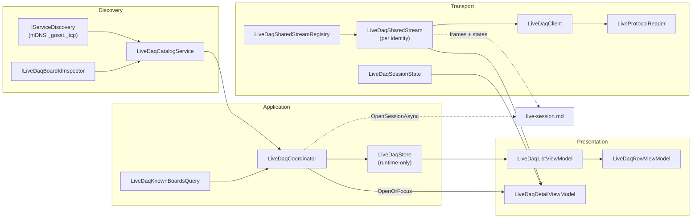

# Live DAQ Streaming

> Part of the [Sufni.App architecture documentation](../../ARCHITECTURE.md). This file covers the live preview transport: the framed TCP protocol, discovery and catalog services, the runtime-only store, the per-identity shared stream, and the diagnostics tab. The recording / capture / save side that turns a live stream into a persisted `Session` row lives in [Live Session Recording](live-session.md).

## Contents

- [Overview](#overview)
- [Data Flow](#data-flow)
- [Live Wire Protocol](#live-wire-protocol)
- [Transport Layer](#transport-layer)
- [Discovery & Catalog](#discovery--catalog)
- [Known-Board Query](#known-board-query)
- [Runtime Store](#runtime-store)
- [Coordinator](#coordinator)
- [View Models](#view-models)
- [Views](#views)
- [Design Decisions](#design-decisions)

## Overview

The live feature lets a user inspect a connected DAQ in a diagnostics tab and optionally open a separate live-session tab on top of the same connection. This file covers the side of the feature that delivers frames to those tabs: discovery, the per-identity shared transport, and the diagnostics tab itself. The recording / capture / save side — `ILiveSessionService`, statistics, the live graph pipeline, and the `Session` save path — lives in [Live Session Recording](live-session.md).

It exists as a dedicated feature slice: a primary page lists known and discovered DAQs, selection opens a diagnostics tab, and `Start Session` opens a second tab that subscribes to the same underlying transport. Both desktop and mobile heads expose the Live tab and the diagnostics/live-session tabs.

The feature is intentionally separate from the import pipeline. It does not reuse `ITelemetryDataStoreService.DataStores` for list state and does not share browse stop/start behavior with the import page. The diagnostics and live-session tabs share a per-identity transport through the live-streaming service layer. The diagnostics tab also exposes management actions (Set Time, Edit CONFIG, and Replace Config) that run through a separate management service and only while the live client is disconnected.



## Data Flow

```
mDNS announcement
  -> LiveDaqCatalogService (inspect board ID via ILiveDaqBoardIdInspector)
    -> LiveDaqCoordinator.Reconcile (merge with known boards from query)
      -> LiveDaqStore.ReplaceAll
        -> DynamicData -> LiveDaqListViewModel -> LiveDaqRowViewModel -> UI

User selects row
  -> LiveDaqCoordinator.SelectAsync
    -> shell.OpenOrFocus<LiveDaqDetailViewModel>

Diagnostics tab loads
  -> LiveDaqSharedStream.AcquireLease()
    -> LiveDaqSharedStream.EnsureStartedAsync
      -> LiveDaqClient.ConnectAsync (TCP)
        -> LiveDaqClient.StartPreviewAsync (START_LIVE frame)
          -> receive loop parses ACK + SESSION_HEADER + data frames
            -> LiveDaqSharedStream state/frames
              -> LiveDaqSessionState.ApplyFrame
                -> DispatcherTimer tick -> CreateSnapshot -> UI binding

User presses Start Session
  -> LiveDaqCoordinator.OpenSessionAsync
    -> shell.OpenOrFocus<LiveSessionDetailViewModel>
      -> handed off to live-session.md (capture / statistics / save)

Tab closes
  -> lease released
    -> shared stream disconnects only when the last diagnostics/live-session observer closes

Management action while disconnected
  -> LiveDaqDetailViewModel.SetTime / EditConfig / SelectConfigFile / UploadConfig
    -> IFilesService (CONFIG picker/load), IDaqManagementService (MGMT TCP workflow), IDialogService (CONFIG editor)
      -> ViewModelBase.Notifications / ErrorMessages
```

The capture, statistics, save, and live-session view-model side of this flow continues in [Live Session Recording](live-session.md#data-flow).

## Live Wire Protocol

The live protocol uses a framed TCP stream separate from the framed management protocol used by import, remote trash, Set Time, and Replace Config. Both protocols share the DAQ's single-client TCP port, so only one live or management connection can be active at a time. Every LIVE message consists of a 16-byte header followed by a typed payload.

### Frame Header

| Offset | Size | Field         | Description                                    |
| ------ | ---- | ------------- | ---------------------------------------------- |
| 0      | 4    | Magic         | `0x4556494C` (`"LIVE"` little-endian)          |
| 4      | 2    | Version       | Protocol version (currently `2`)               |
| 6      | 2    | FrameType     | Identifies the payload layout                  |
| 8      | 4    | PayloadLength | Byte count of the payload following the header |
| 12     | 4    | Sequence      | Monotonically increasing frame counter         |

### Frame Types

| Type            | Value | Direction     | Payload size | Description                                                                |
| --------------- | ----- | ------------- | ------------ | -------------------------------------------------------------------------- |
| `StartLive`     | `1`   | client -> DAQ | 16           | Request to begin streaming with individual sensor mask and rate caps       |
| `StopLive`      | `2`   | client -> DAQ | 0            | Request to stop the active session                                         |
| `Ping`          | `3`   | client -> DAQ | 0            | Keep-alive ping                                                            |
| `Identify`      | `4`   | client -> DAQ | 0            | Request the board serial without starting a live session                   |
| `StartLiveAck`  | `16`  | DAQ -> client | 12           | Result code, session ID, accepted sensor mask                              |
| `StopLiveAck`   | `17`  | DAQ -> client | 4            | Confirms session stopped                                                   |
| `Error`         | `18`  | DAQ -> client | 4            | Error code for rejected or failed operations                               |
| `Pong`          | `19`  | DAQ -> client | 0            | Keep-alive pong                                                            |
| `SessionHeader` | `20`  | DAQ -> client | 72           | Accepted rates, calibration, IMU locations, requested and accepted sensors |
| `IdentifyAck`   | `21`  | DAQ -> client | 8            | 8-byte board serial used to derive the device GUID                         |
| `TravelBatch`   | `32`  | DAQ -> client | variable     | Suspension encoder data batch                                              |
| `ImuBatch`      | `33`  | DAQ -> client | variable     | IMU sensor data batch                                                      |
| `GpsBatch`      | `34`  | DAQ -> client | variable     | GPS fix records                                                            |
| `SessionStats`  | `48`  | DAQ -> client | 28           | Running session statistics (duration, sample counts)                       |

### Start Request

`START_LIVE` carries a 16-byte payload of four `uint32` fields: `RequestedSensorMask`, `TravelHz`, `ImuHz`, `GpsFixHz`. The Hz fields cap each stream's rate; zero means use the device default. `RequestedSensorMask` is an individual sensor-instance mask: fork travel, shock travel, frame IMU, fork IMU, rear IMU, and GPS each have their own bit. The app derives the mask from the requested rate controls: nonzero travel requests both travel channels, nonzero IMU requests all IMU locations, and nonzero GPS requests GPS. The configuration the shared stream actually sends is described under [Stream Configuration](live-session.md#stream-configuration).

### Start Handshake

A successful start produces two frames in sequence: `START_LIVE_ACK` (result `Ok`, session ID, accepted stream-family mask) followed by `SESSION_HEADER` (full session parameters including accepted rates, calibration scales, IMU locations, and requested/accepted individual sensor masks). A rejected start produces either a `START_LIVE_ACK` with a non-Ok result or an `ERROR` frame.

The DAQ may partially accept a start request. If at least one requested sensor instance can stream, the start succeeds and `SESSION_HEADER.AcceptedSensorMask` identifies the accepted subset. The app computes missing sensors as `RequestedSensorMask & ~AcceptedSensorMask`. Missing sensors are surfaced in the diagnostics tab as a notification while the shared stream remains connected. If no requested sensor can start, the DAQ rejects the request with `NoSensorsStarted`.

### Result Codes

| Code | Name             | Meaning                                   |
| ---- | ---------------- | ----------------------------------------- |
| 0    | Ok               | Request accepted                          |
| -1   | InvalidRequest   | Malformed or unsupported request          |
| -2   | Busy             | Another client is already streaming       |
| -5   | NoSensorsStarted | None of the requested sensors could start |

### Result Shape

`StartPreviewAsync` returns a sealed record hierarchy rather than raw error codes:

```csharp
public abstract record LivePreviewStartResult
{
    public sealed record Started(LiveSessionHeader Header) : LivePreviewStartResult;
    public sealed record Rejected(LiveStartErrorCode ErrorCode, string UserMessage) : LivePreviewStartResult;
    public sealed record Failed(string ErrorMessage) : LivePreviewStartResult;
}
```

## Transport Layer

All transport types live in `Sufni.App/Sufni.App/Services/LiveStreaming/`.

### Protocol Reader

`LiveProtocolReader` is a frame accumulator that handles partial TCP reads across header and payload boundaries. It maintains a growable byte buffer with offset tracking: `Append()` adds incoming bytes, `TryReadFrame()` attempts to parse a complete frame from buffered data. The buffer compacts when the read offset passes the midpoint and doubles geometrically when capacity is needed. `Reset()` clears all buffered state for connection reuse.

### Client

`LiveDaqClient` owns the concrete TCP connection lifecycle: `ConnectAsync` -> `StartPreviewAsync` -> streaming -> `StopPreviewAsync` -> `DisconnectAsync`. Two background tasks run off the UI thread: a socket drain loop reads exact frame headers and payloads from the network stream and pushes raw telemetry frames into a bounded channel, while a separate parse loop decodes those bytes into `LiveProtocolFrame` records. Both loops are started with `Task.Factory.StartNew`. Parsed frames and other client events are dispatched through a `Subject<LiveDaqClientEvent>` observable. A `SemaphoreSlim` gate serializes all lifecycle state mutations. Start and stop handshakes use `TaskCompletionSource` — the caller awaits the TCS while the parse loop completes it when the matching ACK or error arrives.

The client is no longer owned directly by a tab view model. It sits under `LiveDaqSharedStream`, which reuses one client per DAQ identity and fans out stream state and frames to both the diagnostics tab and any attached live-session tabs.

### Drop Counters

`LiveDaqClientDropCounters` is the immutable record published as part of `LiveDaqSharedStreamState` and rolled into the live-session control state. It tracks four kinds of pressure: raw telemetry frames skipped at the socket-drain channel, parsed telemetry frames dropped at the subscriber boundary, subscriber frames dropped, and live-session-side coalescing (graph batches coalesced and graph samples discarded). Recording-side counters added by the live-session display channel are merged on top by `LiveSessionService` before it publishes them to the UI.

### Shared Stream

`LiveDaqSharedStreamRegistry` owns one `LiveDaqSharedStream` per DAQ identity key. A shared stream keeps the current requested configuration, accepted session header, connection state, and frame fan-out for that identity. Observers acquire a generic lease; live-session observers also hold a configuration-lock lease so the diagnostics tab cannot reconfigure rates while a live capture is attached. The lease mechanics on the recording side are described under [Configuration Lock](live-session.md#configuration-lock).

When the last observer releases its lease, the registry disconnects and evicts the stream. If the transport drops or discovery loses the DAQ while observers are still attached, the current stream closes immediately, publishes terminal state to those observers, and is evicted for future lookups so the next attachment creates a fresh stream instance.

### Session State

`LiveDaqSessionState` is a thread-safe accumulator for decoded sensor values used by the diagnostics tab. It holds latest travel, per-location IMU, GPS, and stats frames behind a single lock. `ApplyFrame()` updates internal state from any `LiveProtocolFrame`; `CreateSnapshot()` produces an immutable `LiveDaqUiSnapshot` for UI binding. The snapshot captures connection state, accepted session parameters, requested/accepted individual sensor masks, and latest raw protocol values at a single point in time. Travel remains raw measurement data here; calibration and `mm (percent)` formatting are applied later in the detail view model. `LiveTravelUiSnapshot` carries front/rear active flags; when only one travel channel is accepted, the inactive channel is left empty so firmware neutral values are not presented as real measurements.

The recording side does not use `LiveDaqSessionState`. It subscribes to `ILiveDaqSharedStream.Frames` directly and accumulates raw samples into its own buffers — see [Capture Service](live-session.md#capture-service).

### GPS Preview State

`GpsPreviewState` interprets GPS fix modes for UI display: fix mode 0 is no fix, mode 1 is 2D fix (has fix but not ready for full use), mode 2 is 3D fix (has fix and ready). It is consumed by both the diagnostics tab and the live-session media workspace; see [GPS Preview State](live-session.md#gps-preview-state).

## Discovery & Catalog

### Browse Ownership

`LiveDaqBrowseOwner` implements reference-counted lease-based browse ownership. `AcquireBrowse()` returns a disposable lease; the first lease starts the underlying `IServiceDiscovery` mDNS browse, and the last disposed lease stops it. This keeps live discovery decoupled from the import pipeline — both features can browse concurrently without one clearing the other's state. The lease uses `Interlocked.Exchange` for safe double-dispose.

### Board-ID Inspector

`LiveDaqBoardIdInspector` opens a short-lived LIVE connection, sends an `IDENTIFY` frame, and parses the matching `IDENTIFY_ACK` to recover the board GUID. The inspector runs entirely off the UI thread via `IBackgroundTaskRunner` and is shared by both the live catalog service and the network import path.

### Catalog Service

`LiveDaqCatalogService` subscribes to `IServiceDiscovery` (keyed `"gosst"`) for mDNS `_gosst._tcp` announcements. When a service appears, it fires a board-ID inspection to resolve the device GUID. Entries are emitted through a `BehaviorSubject<IReadOnlyList<LiveDaqCatalogEntry>>` — each entry carries an identity key, display name, host, port, and optional board ID. When a service disappears, its entry is removed and the catalog re-emitted.

## Known-Board Query

`LiveDaqKnownBoardsQuery` merges three data sources to produce enriched board records: `Board` rows from the database, `ISetupStore` for setup names, and `IBikeStore` for bike names. For each board, it attempts two setup lookups: direct `board.SetupId` first, then fallback via `SetupStore.FindByBoardId()`. It exposes a `Changes` observable that fires when setup or bike stores change, keyed lookup by identity key, and a travel-calibration answer for a specific DAQ identity so the detail view model can format calibrated travel without depending directly on setup or bike stores.

## Runtime Store

`LiveDaqStore` is a runtime-only in-memory `SourceCache<LiveDaqSnapshot, string>` keyed by identity key (board ID when known, `host:port` fallback). It does not persist to the database, has no `RefreshAsync()`, and snapshots carry no `Updated` timestamp. The read-only `ILiveDaqStore` is injected into the list view model; the `ILiveDaqStoreWriter` is reserved for the coordinator.

`LiveDaqSnapshot` is an immutable sealed record carrying identity key, display name, board ID, host/port, online status, setup name, and bike name.

## Coordinator

`LiveDaqCoordinator` owns all store writes, browse lifecycle, and tab routing.

**Activate / Deactivate** — called by `MainPagesViewModel` when the Live page becomes selected or deselected. On activate: acquires a browse lease, subscribes to catalog changes and known-board query changes, seeds the store with offline known boards. On deactivate: disposes all subscriptions and the browse lease, clears online state from the store.

**Reconcile** — the core merge logic. Takes current catalog entries and known-board records, builds a dictionary of snapshots. Known boards always appear (offline if not discovered). Discovered DAQs with a board ID matching a known board get enriched with setup and bike names. Unknown discovered DAQs appear with `host:port` identity. The store is cleared and rebuilt on each reconciliation.

**SelectAsync** — routes row selection through `shell.OpenOrFocus<LiveDaqDetailViewModel>` with an identity-key matcher. If a diagnostics tab for that DAQ already exists, it focuses it; otherwise it creates a new detail view model from the snapshot, the shared stream registry, the shared known-board query, `IDaqManagementService`, and `IFilesService`.

**OpenSessionAsync** — resolves `LiveDaqSessionContext` for a known DAQ, gets the shared stream for that identity, and routes one `LiveSessionDetailViewModel` per identity through `shell.OpenOrFocus`. The coordinator remains a routing layer only; live capture accumulation and save happen below it (see [Live Session Recording](live-session.md)).

## View Models

**`LiveDaqListViewModel`** projects the store's `Connect()` stream through DynamicData (`Filter` -> `TransformWithInlineUpdate` -> `SortAndBind`) into a `ReadOnlyObservableCollection<LiveDaqRowViewModel>` sorted online-first then by display name. Owns search filtering via `BehaviorSubject`. Delegates activate/deactivate to the coordinator.

**`LiveDaqRowViewModel`** is a lightweight observable wrapper around a `LiveDaqSnapshot`. Exposes display properties (name, online status, endpoint, setup, bike). Intentionally does not implement `IListItemRow` — live DAQs are not deletable and need a custom row surface with online/offline presentation.

**`LiveDaqDetailViewModel`** extends `TabPageViewModelBase`, one instance per open diagnostics tab. It no longer owns a `LiveDaqClient` directly. Instead it acquires a generic observer lease on the per-identity `ILiveDaqSharedStream`, projects the shared stream frames through `LiveDaqSessionState`, and uses a `DispatcherTimer` to publish a throttled `LiveDaqUiSnapshot` for raw diagnostics UI binding. It remains the only editable surface for connect, disconnect, and requested-rate reconfiguration. Partial sensor starts add a diagnostics notification for the missing requested sensors instead of populating the error list. It also hosts the management actions, all driven by a single shared `managementOperation` `CancellableOperation` (separate from the connect operation) so any new management action implicitly cancels an in-flight one and the tab lifecycle can cancel them all on unload.

Management actions stay in the detail view model rather than the transport layer or coordinator:

- `SetTimeCommand` calls `IDaqManagementService.SetTimeAsync(...)` and reports success/failure through `Notifications` and `ErrorMessages`.
- `EditConfigCommand` downloads the current CONFIG via `IDaqManagementService.GetFileAsync(...)`, parses it into a `DaqConfigDocument`, and shows the `LiveDaqConfigEditorViewModel` dialog; saving from the dialog re-uploads through `IDaqManagementService`.
- `SelectConfigFileCommand` calls `IFilesService.OpenDeviceConfigFileAsync(...)`, validates an exact `CONFIG` filename, and stages the selected bytes.
- `UploadConfigCommand` calls `IDaqManagementService.ReplaceConfigAsync(...)`, then clears the staged CONFIG regardless of success, typed failure, or exception.

The management endpoint is resolved from the latest `ILiveDaqStore` snapshot on every evaluation of `CanManage` and at command execution time, not from a constructor-captured host/port. The management affordances are enabled only when the DAQ endpoint is known and the live connection state is `Disconnected`. This avoids overlapping LIVE and MGMT connections on the shared single-client port, while letting a staged CONFIG blob survive temporary offline transitions.

The live-session tab view model (`LiveSessionDetailViewModel`) is described in [Live Session Recording § Live Session Detail View Model](live-session.md#live-session-detail-view-model).

## Views

Both desktop and mobile heads add the Live tab and bind to the same view models. Desktop-only views live under `Sufni.App/Sufni.App/DesktopViews/`; mobile/shared views live under `Sufni.App/Sufni.App/Views/`.

- `MainPagesDesktopView.axaml` / `MainPagesView.axaml` — both add a "Live" tab to the primary page set, bound to `LiveDaqsPage`
- `LiveDaqListDesktopView.axaml` / `LiveDaqListView.axaml` — list of known and discovered DAQs with search, notifications, and error bars
- `LiveDaqListItemButton.axaml` (desktop) — custom row control showing display name, setup/bike labels, endpoint, and an online/offline badge
- `LiveDaqDetailDesktopView.axaml` / `LiveDaqDetailView.axaml` — diagnostics tab with connection controls, requested rate inputs, accepted session info, a disconnected-only Device Management card (Set Time, Edit CONFIG, Replace Config, Upload CONFIG), notifications/error bars, and travel/IMU/GPS sensor sections
- `LiveDaqConfigEditorView.axaml` — CONFIG editor dialog launched from the detail tab on either head

## Design Decisions

1. **Separate from import** — the live feature does not reuse `ITelemetryDataStoreService.DataStores` or the import browse start/stop. Discovery, catalog, and browse ownership are independent seams.
2. **Runtime-only store** — `LiveDaqStore` has no persistence, no `RefreshAsync()`, and no optimistic-concurrency surface. It exists only to project discovered and known boards into the list.
3. **Custom row type** — `LiveDaqRowViewModel` does not implement `IListItemRow` because live rows are not deletable and need online/offline presentation rather than the entity-list pattern.
4. **Per-identity shared stream** — one `LiveDaqSharedStream` owns the transport for one DAQ identity, and both the diagnostics tab and the live-session tab subscribe to it through leases.
5. **Throttled UI updates** — sensor data arrives at packet rate but UI binding updates are snapshot-based and throttled by `DispatcherTimer`, not by raw frame arrival.
6. **Lease-based browse** — browse ownership uses reference counting so import and live can browse concurrently without interfering.
7. **Coordinator activation** — the coordinator activates only when the Live page is selected and deactivates when another page is selected, avoiding always-on mDNS browse for a page that may never be visited.
8. **Disconnected-only management** — the detail tab disables management actions while its live client is connected instead of trying to arbitrate concurrent LIVE and MGMT workflows on the DAQ's single-client port.
9. **Recording is its own slice** — capture, statistics, the live graph pipeline, and the `Session` save path are owned by `ILiveSessionService` and `SessionCoordinator.SaveLiveCaptureAsync`, not by anything in this file. See [Live Session Recording](live-session.md).
