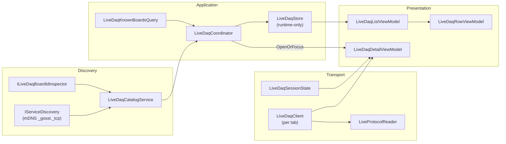

# Live DAQ Streaming

> Part of the [Sufni.App architecture documentation](../../ARCHITECTURE.md). This file covers the desktop live preview feature: real-time telemetry streaming from a DAQ device, the binary framed protocol, discovery and catalog services, the runtime-only store, and the detail tab lifecycle.

## Overview

The live preview feature lets a desktop user stream real-time sensor data from a connected DAQ device without recording or importing a session. It exists as a dedicated desktop feature slice: a primary page lists known and discovered DAQs, and each selected DAQ opens an independent detail tab that owns its own TCP connection and session state.

The feature is intentionally separate from the import pipeline. It does not write to the database, does not reuse `ITelemetryDataStoreService.DataStores` for list state, and does not share browse stop/start behavior with the import page.



## Data Flow

```
mDNS announcement
  -> LiveDaqCatalogService (inspect board ID via ILiveDaqBoardIdInspector)
    -> LiveDaqCoordinator.Reconcile (merge with known boards from query)
      -> LiveDaqStore.Upsert
        -> DynamicData -> LiveDaqListViewModel -> LiveDaqRowViewModel -> UI

User selects row
  -> LiveDaqCoordinator.SelectAsync
    -> shell.OpenOrFocus<LiveDaqDetailViewModel>

Tab loads
  -> LiveDaqClient.ConnectAsync (TCP)
    -> LiveDaqClient.StartPreviewAsync (START_LIVE frame)
      -> receive loop parses ACK + SESSION_HEADER
        -> LiveDaqClientEvent.FrameReceived
          -> LiveDaqSessionState.ApplyFrame
            -> DispatcherTimer tick -> CreateSnapshot -> UI binding

Tab closes
  -> Unloaded -> connectOperation.Cancel
    -> LiveDaqClient.DisconnectAsync (STOP_LIVE frame)
      -> TCP connection closed
```

## Live Wire Protocol

The live protocol uses a framed TCP stream separate from the file-transfer protocol in `SstTcpClient`. Every message consists of a 16-byte header followed by a typed payload.

### Frame Header

| Offset | Size | Field         | Description                                    |
| ------ | ---- | ------------- | ---------------------------------------------- |
| 0      | 4    | Magic         | `0x4556494C` (`"LIVE"` little-endian)          |
| 4      | 2    | Version       | Protocol version (currently `1`)               |
| 6      | 2    | FrameType     | Identifies the payload layout                  |
| 8      | 4    | PayloadLength | Byte count of the payload following the header |
| 12     | 4    | Sequence      | Monotonically increasing frame counter         |

### Frame Types

| Type            | Value | Direction     | Payload size | Description                                               |
| --------------- | ----- | ------------- | ------------ | --------------------------------------------------------- |
| `StartLive`     | `1`   | client -> DAQ | 16           | Request to begin streaming with sensor mask and rate caps |
| `StopLive`      | `2`   | client -> DAQ | 0            | Request to stop the active session                        |
| `Ping`          | `3`   | client -> DAQ | 0            | Keep-alive ping                                           |
| `StartLiveAck`  | `16`  | DAQ -> client | 12           | Result code, session ID, accepted sensor mask             |
| `StopLiveAck`   | `17`  | DAQ -> client | 4            | Confirms session stopped                                  |
| `Error`         | `18`  | DAQ -> client | 4            | Error code for rejected or failed operations              |
| `Pong`          | `19`  | DAQ -> client | 0            | Keep-alive pong                                           |
| `SessionHeader` | `20`  | DAQ -> client | 64           | Accepted rates, calibration, IMU locations, capacities    |
| `TravelBatch`   | `32`  | DAQ -> client | variable     | Suspension encoder data batch                             |
| `ImuBatch`      | `33`  | DAQ -> client | variable     | IMU sensor data batch                                     |
| `GpsBatch`      | `34`  | DAQ -> client | variable     | GPS fix records                                           |
| `SessionStats`  | `48`  | DAQ -> client | 28           | Running session statistics (duration, sample counts)      |

### Start Request

`START_LIVE` carries a 16-byte payload of four `uint32` fields: `SensorMask`, `TravelHz`, `ImuHz`, `GpsFixHz`. The Hz fields cap each stream's rate; zero means use the device default. The sensor mask selects which streams to activate (travel, IMU, GPS).

### Start Handshake

A successful start produces two frames in sequence: `START_LIVE_ACK` (result `Ok`, session ID, accepted sensor mask) followed by `SESSION_HEADER` (full session parameters including accepted rates, calibration scales, IMU locations, and queue capacities). A rejected start produces either a `START_LIVE_ACK` with a non-Ok result or an `ERROR` frame.

### Result Codes

| Code | Name           | Meaning                             |
| ---- | -------------- | ----------------------------------- |
| 0    | Ok             | Request accepted                    |
| -1   | InvalidRequest | Malformed or unsupported request    |
| -2   | Busy           | Another client is already streaming |
| -3   | Unavailable    | Device cannot stream right now      |
| -4   | InternalError  | Unexpected device-side failure      |

### Result Shape

`StartPreviewAsync` returns a sealed record hierarchy rather than raw error codes:

```csharp
public abstract record LivePreviewStartResult
{
    public sealed record Started(LiveSessionHeader Header) : LivePreviewStartResult;
    public sealed record Rejected(LiveStartErrorCode ErrorCode, string UserMessage) : LivePreviewStartResult;
    public sealed record Failed(string ErrorMessage) : LivePreviewStartResult;
}
```

## Transport Layer

All transport types live in `Sufni.App/Sufni.App/Services/LiveStreaming/`.

### Protocol Reader

`LiveProtocolReader` is a frame accumulator that handles partial TCP reads across header and payload boundaries. It maintains a growable byte buffer with offset tracking: `Append()` adds incoming bytes, `TryReadFrame()` attempts to parse a complete frame from buffered data. The buffer compacts when the read offset passes the midpoint and doubles geometrically when capacity is needed. `Reset()` clears all buffered state for connection reuse.

### Client

`LiveDaqClient` owns the full connection lifecycle: `ConnectAsync` -> `StartPreviewAsync` -> streaming -> `StopPreviewAsync` -> `DisconnectAsync`. The receive loop runs off the UI thread via `IBackgroundTaskRunner`, reading into a 4096-byte buffer and feeding it through the protocol reader. Parsed frames are dispatched through a `Subject<LiveDaqClientEvent>` observable. A `SemaphoreSlim` gate serializes all lifecycle state mutations. Start and stop handshakes use `TaskCompletionSource` — the caller awaits the TCS while the receive loop completes it when the matching ACK or error arrives.

Each detail tab creates its own client instance via `ILiveDaqClientFactory`. There is no singleton connection gate.

### Session State

`LiveDaqSessionState` is a thread-safe accumulator for decoded sensor values. It holds latest travel, per-location IMU, GPS, and stats frames behind a single lock. `ApplyFrame()` updates internal state from any `LiveProtocolFrame`; `CreateSnapshot()` produces an immutable `LiveDaqUiSnapshot` for UI binding. The snapshot captures connection state, accepted session parameters, and latest raw protocol values at a single point in time. Travel remains raw measurement data here; calibration and `mm (percent)` formatting are applied later in the detail view model.

### GPS Preview State

`GpsPreviewState` interprets GPS fix modes for UI display: fix mode 0 is no fix, mode 1 is 2D fix (has fix but not ready for full use), mode 2 is 3D fix (has fix and ready).

## Discovery & Catalog

### Browse Ownership

`LiveDaqBrowseOwner` implements reference-counted lease-based browse ownership. `AcquireBrowse()` returns a disposable lease; the first lease starts the underlying `IServiceDiscovery` mDNS browse, and the last disposed lease stops it. This keeps live discovery decoupled from the import pipeline — both features can browse concurrently without one clearing the other's state. The lease uses `Interlocked.Exchange` for safe double-dispose.

### Board-ID Inspector

`LiveDaqBoardIdInspector` connects to a DAQ's TCP port via `SstTcpClient`, fetches the file directory listing, and extracts the board GUID. The inspector runs entirely off the UI thread via `IBackgroundTaskRunner`.

### Catalog Service

`LiveDaqCatalogService` subscribes to `IServiceDiscovery` (keyed `"gosst"`) for mDNS `_gosst._tcp` announcements. When a service appears, it fires a board-ID inspection to resolve the device GUID. Entries are emitted through a `BehaviorSubject<IReadOnlyList<LiveDaqCatalogEntry>>` — each entry carries an identity key, display name, host, port, and optional board ID. When a service disappears, its entry is removed and the catalog re-emitted.

## Known-Board Query

`LiveDaqKnownBoardsQuery` merges three data sources to produce enriched board records: `Board` rows from the database, `ISetupStore` for setup names, and `IBikeStore` for bike names. For each board, it attempts two setup lookups: direct `board.SetupId` first, then fallback via `SetupStore.FindByBoardId()`. It exposes a `Changes` observable that fires when setup or bike stores change, keyed lookup by identity key, and a travel-calibration answer for a specific DAQ identity so the detail view model can format calibrated travel without depending directly on setup or bike stores.

## Runtime Store

`LiveDaqStore` is a runtime-only in-memory `SourceCache<LiveDaqSnapshot, string>` keyed by identity key (board ID when known, `host:port` fallback). It does not persist to the database, has no `RefreshAsync()`, and snapshots carry no `Updated` timestamp. The read-only `ILiveDaqStore` is injected into the list view model; the `ILiveDaqStoreWriter` is reserved for the coordinator.

`LiveDaqSnapshot` is an immutable sealed record carrying identity key, display name, board ID, host/port, online status, setup name, and bike name.

## Coordinator

`LiveDaqCoordinator` owns all store writes, browse lifecycle, and tab routing.

**Activate / Deactivate** — called by `MainPagesViewModel` when the Live page becomes selected or deselected. On activate: acquires a browse lease, subscribes to catalog changes and known-board query changes, seeds the store with offline known boards. On deactivate: disposes all subscriptions and the browse lease, clears online state from the store.

**Reconcile** — the core merge logic. Takes current catalog entries and known-board records, builds a dictionary of snapshots. Known boards always appear (offline if not discovered). Discovered DAQs with a board ID matching a known board get enriched with setup and bike names. Unknown discovered DAQs appear with `host:port` identity. The store is cleared and rebuilt on each reconciliation.

**SelectAsync** — routes row selection through `shell.OpenOrFocus<LiveDaqDetailViewModel>` with an identity-key matcher. If a tab for that DAQ already exists, it focuses it; otherwise it creates a new detail view model from the snapshot and the shared known-board query.

## View Models

**`LiveDaqListViewModel`** projects the store's `Connect()` stream through DynamicData (`Filter` -> `TransformWithInlineUpdate` -> `Bind`) into a `ReadOnlyObservableCollection<LiveDaqRowViewModel>`. Owns search filtering via `BehaviorSubject`. Delegates activate/deactivate to the coordinator.

**`LiveDaqRowViewModel`** is a lightweight observable wrapper around a `LiveDaqSnapshot`. Exposes display properties (name, online status, endpoint, setup, bike). Intentionally does not implement `IListItemRow` — live DAQs are not deletable and need a custom row surface with online/offline presentation.

**`LiveDaqDetailViewModel`** extends `TabPageViewModelBase`, one instance per open tab. Owns a `ILiveDaqClient` instance (from factory), a `LiveDaqSessionState` accumulator, a `CancellableOperation` for the connect workflow, and a `DispatcherTimer` that periodically projects session state into a raw `LiveDaqUiSnapshot` for throttled UI binding. It also subscribes to `ILiveDaqKnownBoardsQuery` so it can format travel as calibrated `mm (percent)` when a known setup and bike calibration are available, otherwise fall back to the raw measurement. On `Loaded`: starts the timer, subscribes to client events and query changes, auto-connects. On `Unloaded`: cancels the connect operation, stops the timer, disposes subscriptions, disconnects. On rejection: shows a dialog and closes the tab. On mid-session disconnect: leaves the tab open in a disconnected state.

## Desktop Views

- `MainPagesDesktopView.axaml` — adds a "Live" tab to the primary page set
- `LiveDaqListDesktopView.axaml` — `ItemsRepeater` bound to the list VM's `Items`, with search bar, notifications, and error bars
- `LiveDaqListItemButton.axaml` — custom row control showing display name, setup/bike labels, endpoint, and an online/offline badge
- `LiveDaqDetailDesktopView.axaml` — split layout with connection controls, requested rate inputs, accepted session info, travel/IMU/GPS sensor sections, and error/status display

## Design Decisions

1. **Separate from import** — the live feature does not reuse `ITelemetryDataStoreService.DataStores` or the import browse start/stop. Discovery, catalog, and browse ownership are independent seams.
2. **Runtime-only store** — `LiveDaqStore` has no persistence, no `RefreshAsync()`, and no optimistic-concurrency surface. It exists only to project discovered and known boards into the list.
3. **Custom row type** — `LiveDaqRowViewModel` does not implement `IListItemRow` because live rows are not deletable and need online/offline presentation rather than the entity-list pattern.
4. **Per-tab client** — each detail tab owns its own `LiveDaqClient` instance. Multiple DAQs can stream simultaneously in separate tabs.
5. **Throttled UI updates** — sensor data arrives at packet rate but UI binding updates are snapshot-based and throttled by `DispatcherTimer`, not by raw frame arrival.
6. **Lease-based browse** — browse ownership uses reference counting so import and live can browse concurrently without interfering.
7. **Coordinator activation** — the coordinator activates only when the Live page is selected and deactivates when another page is selected, avoiding always-on mDNS browse for a page that may never be visited.
