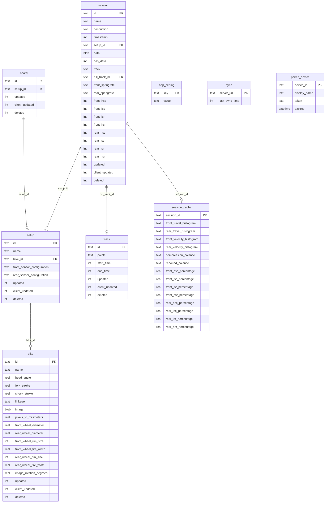

# Persistence & Serialization

> Part of the [Sufni.App architecture documentation](../ARCHITECTURE.md). This file covers the SQLite schema, the database service, soft deletes, and conflict resolution semantics shared with [cross-device synchronization](sync.md).

## Schema

## Database Service

`SqLiteDatabaseService` (`Sufni.App/Sufni.App/Services/SQLiteDatabaseService.cs`) implements `IDatabaseService` using sqlite-net-pcl with WAL mode. The database path uses `Environment.SpecialFolder.LocalApplicationData` + `Sufni.App/sst.db`.

Generic operations on any `Synchronizable` subclass:

- `GetAllAsync<T>()` — returns all records where `Deleted == null`
- `GetChangedAsync<T>(long since)` — returns records where `Updated > since` OR (`Deleted != null` AND `Deleted > since`)
- `PutAsync<T>(item)` — upsert with `Updated = DateTimeOffset.Now`
- `DeleteAsync<T>(id)` — sets `Deleted` timestamp (soft delete)

Session-specific operations split metadata from blob handling:

- `PutSessionAsync()` — updates metadata columns only, never touches the `data` blob
- `PatchSessionPsstAsync(id, bytes)` — updates only the `data` column
- `GetSessionPsstAsync(id)` — deserializes MessagePack blob to `TelemetryData`

## Soft Delete

All `Synchronizable` entities (`Sufni.App/Sufni.App/Models/Synchronizable.cs`) carry `Updated` (server timestamp), `ClientUpdated` (local timestamp), and nullable `Deleted` (soft delete timestamp). On database initialization, records with `Deleted` older than 1 day and expired paired devices are permanently removed.

## Conflict Resolution

`MergeAsync<T>()` handles incoming sync data:

1. **New entity** (not in local DB): set `ClientUpdated = entity.Updated`, set `Updated = now`, insert
2. **Remote delete** (`entity.Deleted` set): set local `Deleted` and `Updated` to remote values, update
3. **Local wins** (`existing.ClientUpdated > entity.Updated`): keep local content, set `Updated = now`
4. **Remote wins** (otherwise): set `ClientUpdated = entity.Updated`, set `Updated = now`, replace local

This gives local client changes precedence in conflicts while accepting remote deletes.
