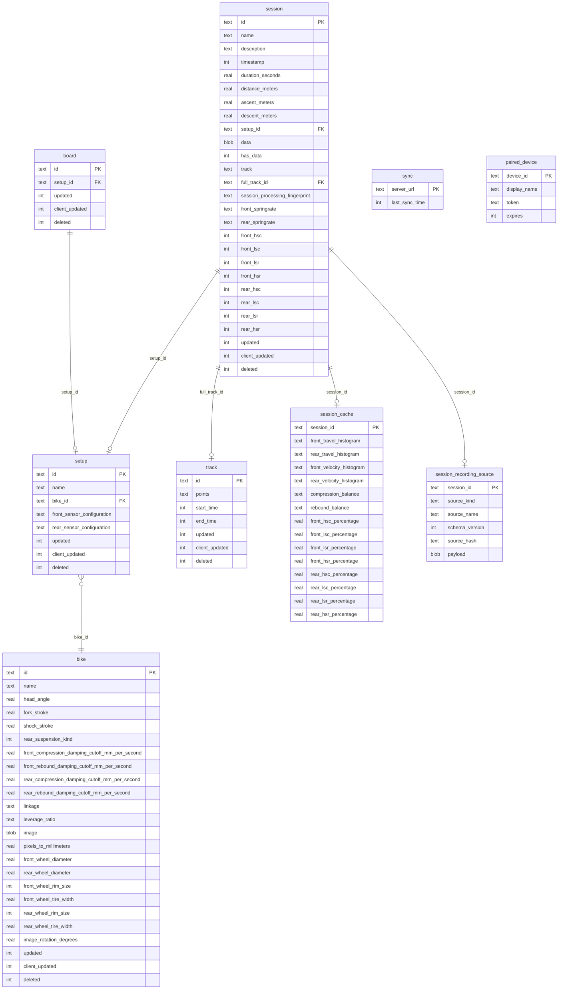

# Persistence & Serialization

> Part of the [Sufni.App architecture documentation](../ARCHITECTURE.md). This file covers the SQLite schema, the database service, soft deletes, and conflict resolution semantics shared with [cross-device synchronization](sync.md).

## Schema

## Database Service

`SqLiteDatabaseService` (`Sufni.App/Sufni.App/Services/SQLiteDatabaseService.cs`) implements `IDatabaseService` using the sqlite-net API (`sqlite-net-e` package) with WAL mode. The database path uses `Environment.SpecialFolder.LocalApplicationData` + `Sufni.App/sst.db`.

Bike rows include presentation-owned damping speed cutoffs for front/rear compression and rebound. These values default to 200 mm/s, are synchronized and exported with the bike, and are backfilled on startup for legacy schemas. They are not session preferences and do not affect telemetry processing fingerprints.

Repeated session SQL inside `SQLiteDatabaseService` is kept behind private projection and bind-value helpers. There is no repository or public query-builder layer: `IDatabaseService` remains the persistence boundary, and the helper extraction does not change transaction boundaries or merge behavior.

Generic operations on any `Synchronizable` subclass:

- `GetAllAsync<T>()` — returns all records where `Deleted == null`
- `GetChangedAsync<T>(long since)` — returns records where `Updated > since` OR (`Deleted != null` AND `Deleted > since`)
- `PutAsync<T>(item)` — upsert. Stamps `Updated = DateTimeOffset.UtcNow.ToUnixTimeSeconds()` and clears `Deleted` (resurrecting any tombstoned row with the same id).
- `DeleteAsync<T>(id)` — sets `Deleted` timestamp (soft delete); idempotent — leaves the existing tombstone in place if the row is already deleted.

Session-specific operations split metadata, processed data, and recording source handling. `session.data` is the authoritative local processed-telemetry cache; `session.has_data` remains in the row for schema compatibility and snapshot projection, but session reads derive the availability flag from `data IS NOT NULL` so the flag cannot drift away from the blob. Nullable summary columns (`duration_seconds`, `distance_meters`, `ascent_meters`, `descent_meters`) are derived list-summary cache values, not user-authored session metadata.

- `PutSessionAsync()` — updates user-authored session metadata columns, the processing fingerprint, and stamps `Updated`/`Deleted` like `PutAsync`. Existing derived summary metrics are preserved on metadata updates; the `data` blob and cached `track` are only filled via `COALESCE(?, existing)` for compatibility with older callers and soft-deleted-row reuse, while normal metadata-only saves pass them as null.
- `PutProcessedSessionAsync(session, newFullTrack, source)` — persists a processed session in one explicit transaction. It writes a new full `Track` when supplied, stamps `session.full_track_id`, writes all session metadata plus `data` and `session_processing_fingerprint`, derives `duration_seconds` from `TelemetryData.Metadata.Duration`, derives GPS distance/ascent/descent from the generated or session-window `TrackPoint` list when available, and optionally inserts/replaces the matching `RecordedSessionSource`. When no new full track is supplied and the session has no existing `full_track_id`, it links the session to an active track whose `[start_time, end_time]` window contains the session timestamp. If any write fails, the session, generated track, and source write roll back together.
- `PutProcessedSessionIfUnchangedAsync(session, newFullTrack, source, baselineUpdated)` — the optimistic-concurrency variant used by recorded-session recompute. It runs the same processed-session / optional full-track / optional source transaction only when the current `session.updated` still equals `baselineUpdated`; on conflict it returns `null` and rolls back any generated track/source writes.
- `FindTrackByTimeRangeAsync(startTime, endTime)` — returns the active track whose cached `start_time` and `end_time` exactly match the supplied values. GPX import uses this to skip already-imported tracks before writing.
- `PatchSessionPsstAsync(id, bytes)` — validates the MessagePack blob by deserializing it to `TelemetryData` before writing, rejects invalid bytes without changing the row, updates the `data` column, refreshes `duration_seconds` from the patched blob, and preserves existing GPS metrics unless a cached session-window track can be recalculated
- `PatchSessionTrackAsync(id, points)` — updates the cached session-window `track` JSON, refreshes GPS distance/ascent/descent from the supplied projected points, and stamps `updated`
- `GetSessionPsstAsync(id)` — deserializes MessagePack blob to `TelemetryData`
- `GetSessionRawPsstAsync(id)` — returns the raw MessagePack blob for sync transfer
- `GetRecordedSessionSourcesAsync()` / `GetRecordedSessionSourceAsync(id)` — load recorded-source rows or one full source payload
- `GetSessionIdsMissingRecordedSourceAsync()` — returns non-deleted session ids that do not have a source row, or whose source row hash differs from the persisted processing fingerprint's `SourceHash`
- `PutRecordedSessionSourceAsync(source)` / `DeleteRecordedSessionSourceAsync(sessionId)` — insert/replace or remove a recorded source outside the processed-session transaction, used by source sync and source-store writes

## Soft Delete

`Synchronizable` entities (`Sufni.App/Sufni.App/Models/Synchronizable.cs`) — `bike`, `setup`, `session`, `board`, `track` — carry `Updated` (server timestamp), `ClientUpdated` (local timestamp), and nullable `Deleted` (soft delete timestamp). `paired_device`, `session_cache`, `session_recording_source`, and `sync` are not `Synchronizable` and have their own lifecycles. Startup cleanup also soft-deletes duplicate active tracks that share the same cached start/end seconds, keeps one canonical row, repoints non-deleted sessions to it, and clears affected cached session-window tracks so they regenerate from the canonical full track.

On database initialization, the `Cleanup()` pass permanently removes:

- `Synchronizable` rows with `Deleted` older than 1 day
- Orphaned `session_cache` rows whose parent session is past that 1-day grace window
- `session_recording_source` rows for purged sessions, plus any source row without a parent session
- `paired_device` rows where `Expires < DateTime.UtcNow`

## Conflict Resolution

`MergeAsync<T>()` is invoked per entity inside the `MergeAllAsync(SynchronizationData)` transaction. It compares against a derived "content version" — `existing.ClientUpdated` if set, otherwise `existing.Updated` — so locally-authored rows that have not yet round-tripped through a sync still compare correctly.

The merge cases, in evaluation order:

1. **New entity** (not in local DB): persist with `ClientUpdated = entity.Updated`, `Updated = now`. Insert.
2. **Existing already locally deleted**: keep the local tombstone; if the remote tombstone is later (`entity.Deleted > existing.Deleted`), advance `existing.Deleted` to the remote value. Always bump `existing.Updated = now`. (No content is ever revived once locally deleted.)
3. **Remote delete with `entity.Deleted > existingContentVersion`**: accept the delete — set `existing.Deleted = entity.Deleted`, `existing.Updated = now`. (Note: `Updated` is set to *now*, not to the remote's `Updated`.)
4. **Stale remote delete** (`entity.Deleted <= existingContentVersion`): ignore the delete; only bump `existing.Updated = now`.
5. **Local wins** (`existingContentVersion > entity.Updated`): keep local content; bump `existing.Updated = now`.
6. **Remote wins** (otherwise): persist remote content with `ClientUpdated = entity.Updated`, `Updated = now`. Update.

This gives local client changes precedence in conflicts while accepting remote deletes that are newer than the local content.

Session merge accepts metadata, nullable derived summary metrics (`duration_seconds`, `distance_meters`, `ascent_meters`, `descent_meters`), track linkage/cache JSON, tuning fields, and `session_processing_fingerprint`, but it does not move the processed telemetry BLOB or the raw recording source through `SynchronizationData`. Those payloads are synchronized by the session-data and recorded-source endpoints described in [Cross-Device Synchronization](sync.md).
