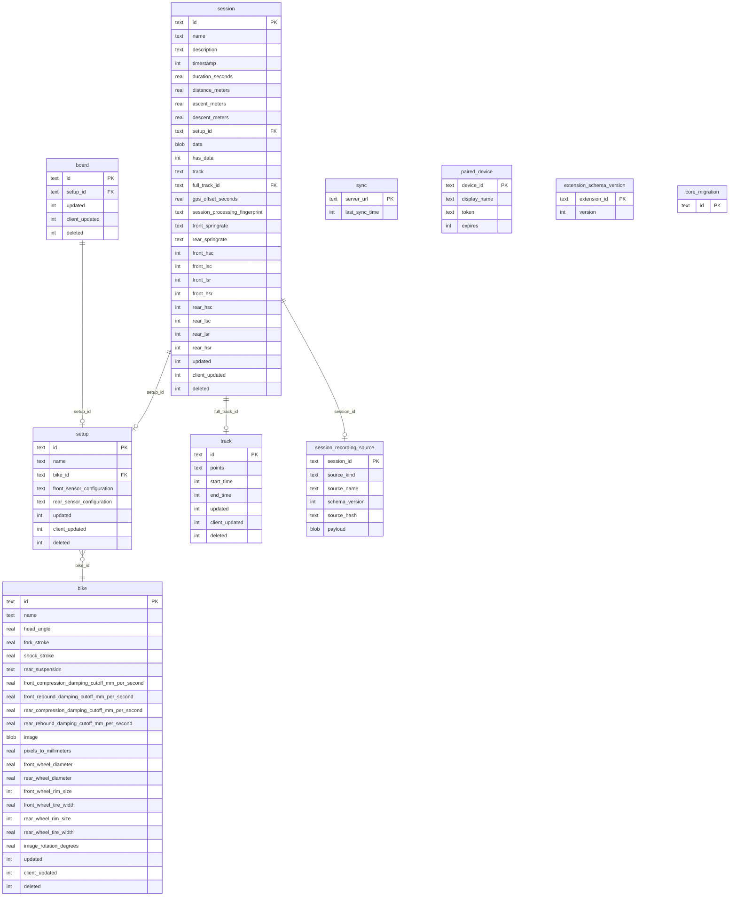

# Persistence & Serialization

> Part of the [Sufni.App architecture documentation](../ARCHITECTURE.md). This file covers the SQLite schema, the connection context, per-aggregate repositories, soft deletes, and conflict resolution semantics shared with [cross-device synchronization](sync.md).

## Schema

```mermaid
erDiagram
    session ||--o| setup : "setup_id"
    session ||--o| track : "full_track_id"
    session ||--o| session_recording_source : "session_id"
    setup }o--|| bike : "bike_id"
    board ||--o| setup : "setup_id"

    session {
        text id PK
        text name
        text description
        int timestamp
        real duration_seconds
        real distance_meters
        real ascent_meters
        real descent_meters
        text setup_id FK
        blob data
        int has_data
        text track
        text full_track_id FK
        real gps_offset_seconds
        text session_processing_fingerprint
        text front_springrate
        text rear_springrate
        int front_hsc
        int front_lsc
        int front_lsr
        int front_hsr
        int rear_hsc
        int rear_lsc
        int rear_lsr
        int rear_hsr
        int updated
        int client_updated
        int deleted
    }

    session_recording_source {
        text session_id PK
        text source_kind
        text source_name
        int schema_version
        text source_hash
        blob payload
    }

    bike {
        text id PK
        text name
        real head_angle
        real fork_stroke
        real shock_stroke
        text rear_suspension
        real front_compression_damping_cutoff_mm_per_second
        real front_rebound_damping_cutoff_mm_per_second
        real rear_compression_damping_cutoff_mm_per_second
        real rear_rebound_damping_cutoff_mm_per_second
        blob image
        real pixels_to_millimeters
        real front_wheel_diameter
        real rear_wheel_diameter
        int front_wheel_rim_size
        real front_wheel_tire_width
        int rear_wheel_rim_size
        real rear_wheel_tire_width
        real image_rotation_degrees
        int updated
        int client_updated
        int deleted
    }

    setup {
        text id PK
        text name
        text bike_id FK
        text front_sensor_configuration
        text rear_sensor_configuration
        int updated
        int client_updated
        int deleted
    }

    board {
        text id PK
        text setup_id FK
        int updated
        int client_updated
        int deleted
    }

    track {
        text id PK
        text points
        int start_time
        int end_time
        int updated
        int client_updated
        int deleted
    }

    sync {
        text server_url PK
        int last_sync_time
    }

    paired_device {
        text device_id PK
        text display_name
        text token
        int expires
    }

    extension_schema_version {
        text extension_id PK
        int version
    }

    core_migration {
        text id PK
    }
```

## SQLite Persistence Repositories

`SqliteConnectionContext` (`Sufni.App/Sufni.App/Infrastructure/SqliteConnectionContext.cs`) owns the single `SQLiteAsyncConnection`, the extension table catalog, and the initialization gate. It constructs the database at `Environment.SpecialFolder.LocalApplicationData` + `Sufni.App/sst.db` and starts `DatabaseMigrationRunner`, which enables WAL mode, creates core tables, applies compatibility migrations/backfills, runs extension migrations, performs startup cleanup, repairs duplicate track ranges, and runs extension orphan repair.

The connection context is also the only app-owned transaction entry point for multi-statement repository writes. `RunInTransactionAsync(...)` awaits initialization, then delegates to sqlite-net's `RunInTransactionAsync(Action<SQLiteConnection>)`, so the connection/transaction lock is held for the whole callback. Transaction bodies use synchronous `SQLiteConnection` operations; raw `BEGIN TRANSACTION` / `COMMIT` / `ROLLBACK` statement sequences are not used.

Bike rows include presentation-owned damping speed cutoffs for front/rear compression and rebound. These values default to 200 mm/s, are synchronized and exported with the bike, and are backfilled on startup for legacy schemas. They are not session preferences and do not affect telemetry processing fingerprints.

Startup migration ensures bike rows use the single `rear_suspension` union JSON column. Legacy schemas with `rear_suspension_kind`, `linkage`, and/or `leverage_ratio` are backfilled into `RearSuspensionSpec` JSON, linkage shock stroke is reconciled against the bike-level `shock_stroke` column, draft rows preserve the selected mode when the payload is missing or unparseable, and the legacy columns are dropped after backfill.

Startup schema migration no longer backfills `session_processing_fingerprint`.
Legacy processed rows are normalized by `ProcessingOptionsResetMigration`, the
post-initialization pass that recomputes source-backed sessions through the
normal recompute engine when needed. New source, derivation-window, or
dependency-hash mismatches remain stale so recompute can surface real
derived-data changes.

Startup migration does not repair or currentize stale `session_processing_fingerprint` values. Legacy, missing, malformed, or dependency-mismatched fingerprints remain classified as stale by the recorded-session projection so recompute can surface derived-data changes explicitly instead of silently rewriting fingerprint state at database initialization.

Persistence consumers inject narrow repository interfaces instead of a single database facade. `ISynchronizableRepository<T>` owns generic soft-delete CRUD for `Synchronizable` entities; `ISessionRepository`, `IRecordedSessionSourceRepository`, `ITrackRepository`, and `IPairedDeviceRepository` own aggregate-specific operations and intent-specific projections; `ISyncDataStore` / `SynchronizationMergeEngine` owns sync timestamps, delta projection, remote apply, and merge conflict resolution. Read paths that only need ids, source snapshots, track payload metadata, full-track reference checks, or processing fingerprint inputs use those projections instead of loading whole aggregates or BLOB columns. `DatabaseMigrationRunner` is the only schema initializer/migrator, and repositories assume `SqliteConnectionContext` has run initialization before handing out the shared connection.

Repositories do not publish UI state. The reactive boundary above SQLite is the
store writer layer: single-aggregate commit methods call repositories, re-read
the persisted snapshot when needed, and publish through the store cache;
publish-only writer methods re-read or remove cache entries after another owner
has already changed persistence. Cross-aggregate workflows such as setup import,
session delete, and processed-session save run all SQL rows in one
`RunInTransactionAsync` callback, then publish each affected store only after
the transaction commits. Sync merge and server endpoint handlers likewise change
SQLite first; inbound coordinators, appliers, or the refresh orchestrator then
use publish-only writer paths to reflect those already-persisted rows.

`ISynchronizableRepository<T>` operations on any `Synchronizable` subclass:

- `GetAllAsync<T>()` — returns all records where `Deleted == null`
- `GetChangedAsync<T>(long since)` — returns records where `Updated > since` OR (`Deleted != null` AND `Deleted > since`)
- `PutAsync<T>(item)` — upsert. Stamps `Updated = DateTimeOffset.UtcNow.ToUnixTimeSeconds()` and clears `Deleted` (resurrecting any tombstoned row with the same id).
- `DeleteAsync<T>(id)` — runs in one transaction, soft-deletes the core row when it exists and is not already tombstoned, and applies matching extension cascade rules for the entity kind/id in the same transaction. Cascade rules still run when the core row is already tombstoned or missing, so extension rows referencing that id can be cleaned. Extension state refresh runs after commit only when rules matched.

`ISessionRepository` operations split metadata and processed-data handling, and store the values they are given: telemetry validation, summary-metric derivation, and session-window track association/generation happen in `SessionTelemetryWriter` before the repository is called. `session.data` is the authoritative local processed-telemetry cache; `session.has_data` remains in the row for schema compatibility and snapshot projection, but session reads derive the availability flag from `data IS NOT NULL` so the flag cannot drift away from the blob. Nullable summary columns (`duration_seconds`, `distance_meters`, `ascent_meters`, `descent_meters`) are derived list-summary cache values, not user-authored session metadata. `gps_offset_seconds` is per-session state applied when deriving the cached session-window GPS track from a reusable full `Track`; it is stored on `session` rather than `track` because the same full ride track can back multiple recorded sessions or segments.

- `PutSessionAsync()` — updates user-authored session metadata columns and stamps `Updated`/`Deleted` like `PutAsync`. Existing derived summary metrics are preserved on metadata updates; the `data` blob and cached `track` are only filled via `COALESCE(?, existing)` for compatibility with older callers and soft-deleted-row reuse, while normal metadata-only saves pass them as null. The full-track linkage and processing fingerprint are owned by the processed-write path and are preserved on metadata-only saves.
- `PutProcessedSessionAsync(session, newFullTrack, source)` — persists a processed session in one lock-held `RunInTransactionAsync` callback. It writes a new full `Track` when supplied, stamps `session.full_track_id`, writes all session metadata plus `data`, `session_processing_fingerprint`, and the summary-metric values already set on the session, and optionally inserts/replaces the matching `RecordedSessionSource`. If any write fails, the session, full-track, and source write roll back together.
- `UpdateProcessedDerivedDataAsync(session, newFullTrack, expectedInputFingerprint)` — the derived-only write used by recorded-session recompute. In one lock-held transaction it re-reads the row, recomputes the **DB-input** part of the processing fingerprint from the freshly read setup/bike/source/version state, and compares it to `expectedInputFingerprint`; on a mismatch (a passive dependency change) it rolls back and returns `null`. When the expected fingerprint carries a derivation window, the source row is resolved by `DerivationWindow.SourceSessionId` rather than by the session id. The preference-stored processing option is deliberately **not** re-checked here — it is not a DB column and is guarded by the recompute engine's commit-time check. On a match it writes **only** the derived columns (`data`, `session_processing_fingerprint`, the four summary metrics, cached `track`, `full_track_id`), optionally inserts `newFullTrack`, stamps `updated`, and never touches user-metadata columns, returning the fresh row.
- `UpdateSessionPsstAsync(id, data, fingerprintJson, metrics)` — overwrites the BLOB-bound pair (`data` and `session_processing_fingerprint`) plus the supplied summary metrics on a non-deleted row, with **no `updated` bump** so a sync swap/fill creates no metadata-sync feedback edge; the blob, fingerprint, and metrics arrive pre-validated/pre-computed from `SessionTelemetryWriter`
- `UpdateSessionTrackAsync(id, points, metrics, gpsOffsetSeconds?)` — replaces the cached session-window `track` JSON and the supplied summary metrics, optionally updates the per-session GPS offset, and stamps `updated`; callers that omit the offset preserve the existing `gps_offset_seconds`
- `GetSessionRawPsstAsync(id)` / `GetSessionRawPsstWithFingerprintAsync(id)` — return the raw MessagePack blob (sync transfer, consumer-side deserialization); the second also returns the fingerprint of those bytes so the session-data push can carry both
- `GetSessionsAsync()` / `GetSessionAsync(id)` / `GetActiveSessionIdsAsync()` / `GetSessionTrackAsync(id)` / `GetIncompleteSessionIdsAsync()` / `GetIncompleteSessionIdsWithFingerprintAsync()` — metadata projections, active ids for recompute-all, cached session-window track points, and ids of rows without processed data (the last pairs each id with its stored fingerprint as the session-data pull's download match target)
- `HasOtherActiveSessionWithFullTrackAsync(fullTrackId, excludingSessionId)` — a full-track reference projection used before deleting a previous generated track after recompute
- `GetProcessingInputBundleAsync(sessionId)` — a constrained join over session/setup/bike/source columns that builds the database-resident processing input bundle for transaction-time fingerprint checks without loading processed telemetry or source payload bytes

There is no `GetSessionPsstAsync` on the repository: consumers that need a `TelemetryData` fetch the raw blob and deserialize it themselves through `ISessionTelemetryProcessor`, so MessagePack knowledge stays out of the persistence layer.

`ISessionTelemetryWriter` (`Sufni.App/Sufni.App/Sessions/Processing/Services/SessionTelemetryWriter.cs`) sits in front of `ISessionRepository` for processed-data writes and owns the domain computation that precedes persistence:

- `PutProcessedSessionAsync` / `UpdateProcessedDerivedDataAsync` — prepare the session, then delegate to the matching repository transaction. Preparation links a session without a `full_track_id` to an active track whose `[start_time, end_time]` window contains the session timestamp (`ITrackRepository.FindTrackContainingTimestampAsync`), derives `duration_seconds` from the processed telemetry metadata, derives GPS distance/ascent/descent from the session-window points (the supplied generated track, or points regenerated from the linked full track), **and now persists those resolved points as the cached session-window `track`** so import, live-save, and recompute all store the polyline at derivation time instead of through a later lazy load-path patch.
- `PatchSessionPsstAsync(id, bytes, fingerprint)` — the **hub upload sink**. It rejects an `InvalidDataException` (mapped to a sync 400) both for bytes that fail MessagePack validation and for a `fingerprint` that does not ordinal-match the row's stored `session_processing_fingerprint` (the bytes are not the ones this row is awaiting). On acceptance it refreshes `duration_seconds` from the blob, preserves existing GPS metrics unless a cached session-window track allows recomputation, and writes through `UpdateSessionPsstAsync`.
- `SwapSessionPsstAsync(id, bytes, fingerprint)` — the **client sync commit**. Same metric recomputation, but with no fingerprint reject: the caller has already matched the downloaded fingerprint against its swap/fill target, so it overwrites the row's blob and fingerprint coherently (a swap may replace a held blob whose fingerprint differs). See [download-then-swap](sync.md#processed-blob-coherence-download-then-swap).
- `PatchSessionTrackAsync(id, points, gpsOffsetSeconds?)` — recomputes GPS distance/ascent/descent from the supplied projected points and the persisted `duration_seconds` column when it is present. For legacy rows where `duration_seconds` is null but the processed BLOB exists, it reads only the BLOB duration before deriving metrics so a GPS/track edit does not erase the session duration. It then calls `UpdateSessionTrackAsync`, passing a GPS offset only when the caller is intentionally realigning the session-window GPS segment.

`ITrackRepository` owns track lookups: `FindTrackByTimeRangeAsync(startTime, endTime)` returns the active track whose cached `start_time` and `end_time` exactly match the supplied values (GPX import uses this to skip already-imported tracks before writing), `FindTrackContainingTimestampAsync` resolves the session-window containment lookup — ordering by `(end_time - start_time)`, then `start_time`, then `id`, so the tightest covering window wins deterministically — and `GetTracksByIdsAsync` loads full track payloads for write-path metric derivation. Read-only full-track display uses `GetTrackPayloadMetadataAsync(trackId)` followed by `GetTrackPayloadAsync(trackId, updated)`, so `IFullTrackPointReader` can cache deserialized point payloads by `(trackId, updated)` and retry once if the row changes between metadata and payload reads. Session-to-track association is owned by the processed-write pipeline (`ISessionTelemetryWriter`), not the repository.

`IRecordedSessionSourceRepository` owns recorded-source rows:

- `GetRecordedSessionSourcesAsync()` / `GetRecordedSessionSourceAsync(id)` — load recorded-source rows or one full source payload
- `GetRecordedSessionSourceSnapshotsAsync()` / `GetRecordedSessionSourceSnapshotAsync(id)` — metadata-only source projections for stores and refreshes
- `GetSessionIdsMissingRecordedSourceAsync()` — returns non-deleted session ids that do not have a source row, or whose source row hash differs from the persisted processing fingerprint's `SourceHash`
- `GetSourceBackedSessionIdsAsync()` — returns ids that currently own a recorded-source row without loading payload BLOBs; startup normalization uses it to enumerate recomputable source-backed sessions
- `DeleteOrphanedRecordedSessionSourcesAsync(retainedIds)` — removes source rows whose owner session no longer exists unless the id is retained by the derivation-window provider
- `PutRecordedSessionSourceAsync(source)` / `DeleteRecordedSessionSourceAsync(sessionId)` — insert/replace or remove a recorded source outside the processed-session transaction, used by source sync and source-store writes

## JSON Serialization

`AppJson` (`Sufni.App/Sufni.App/Infrastructure/AppJson.cs`) centralizes System.Text.Json configuration behind a source-generated `AppJsonContext` and exposes two profiles:

- **Lenient** (`AppJson.Options` / `AppJson.Context`) — all local round-trips (entity, track, and preferences JSON columns; the processing dependency hash) and the entire sync client. Case-insensitive binding with a snake_case enum converter. Its output is deliberately **byte-stable**: `ProcessingDependencyHash` SHA-256s the `AppJson.Options`-serialized payload, so any change to the lenient options would silently invalidate every stored processing fingerprint. Treat the lenient profile as a wire/hash contract, not a tunable.
- **Hardened** (`AppJson.InboundOptions` / `AppJson.InboundContext`) — network-inbound deserialization on the desktop sync server only (the two `PATCH` session/source-data endpoints). Built from the .NET 10 `Strict` preset — reject duplicate keys and unmapped members, case-sensitive binding, required non-nullable members and constructor parameters — plus the same snake_case enum converter. Because the client always emits every snake_case key explicitly (including explicit nulls for optional members), well-formed first-party traffic is unaffected while malformed or truncated bodies are rejected at the trust boundary. See [Cross-Device Sync § Server](sync.md#server).

Bike persistence, sync, and export JSON carry `RearSuspensionSpec` union values, `LinkageSpec`, `LeverageRatioSpec`, and `WheelSpec`. Sync rows and schema-versioned bike export files require `rear_suspension`; missing unions, malformed unions, and the legacy `rear_suspension_kind` / `linkage` / `leverage_ratio` JSON triple are invalid outside the local SQLite startup migration. The pre-refactor mutable linkage classes are not serialization roots.

## Extension Schema

`ExtensionDatabaseConnection` is the concrete singleton behind
`IExtensionDatabaseConnection`. `OpenSessionAsync()` awaits normal startup
initialization before returning an `IExtensionDatabaseSession` scoped to
declared extension table types. Extension services can query and mutate their
owned rows through the session operations, while undeclared table types and
core table names are rejected before reaching sqlite-net.
For extension-owned multi-statement writes, the session exposes
`RunInTransactionAsync(Action<IExtensionDatabaseTransaction>)`. The transaction
object provides synchronous table/find/insert/insert-or-replace/update/delete
counterparts with the same declared-table validation, and callback exceptions
roll the whole extension transaction back.

Extension migrations are declared by `IExtensionDatabaseMigrator`.
Each migrator declares:

- `ExtensionId`
- `TargetVersion`
- `TableTypes` owned by that extension
- ordered `ExtensionDatabaseMigrationStep` entries

During `DatabaseMigrationRunner.RunAsync()`, extension work runs after core
tables/compatibility columns are created and before cleanup completes:

1. Create `extension_schema_version`.
2. Create tables declared by all extension migrators.
3. Run missing migration steps in ascending target version.
4. Update the schema-version row after each successful step.
5. Run core cleanup.
6. Run extension orphan repair.

The public schema tracks only extension ids and versions. Extension
table columns and payload fields remain owned by the declaring module.
Migrator validation rejects blank or duplicate extension ids, invalid target
versions, duplicate migration step versions, reserved core table names, and
duplicate extension table ownership during connection-context construction.

## Soft Delete

`Synchronizable` entities (`Sufni.App/Sufni.App/SyncAndPairing/Models/Synchronizable.cs`) — `bike`, `setup`, `session`, `board`, `track` — carry `Updated` (server timestamp), `ClientUpdated` (local timestamp), and nullable `Deleted` (soft delete timestamp). `paired_device`, `session_recording_source`, and `sync` are not `Synchronizable` and have their own lifecycles. Startup cleanup also soft-deletes duplicate active tracks that share the same cached start/end seconds, keeps one canonical row, repoints non-deleted sessions to it, and clears affected cached session-window tracks so they regenerate from the canonical full track.

On database initialization, the `Cleanup()` pass permanently removes:

- `Synchronizable` rows with `Deleted` older than 1 day
- `paired_device` rows where `Expires < DateTime.UtcNow`

Recorded-source orphan cleanup runs after initialization through
`RecordedSessionSourceRetentionCleanup`, not inside the schema cleanup pass. It
asks the single `IRecordedSessionDerivationWindowProvider` for referenced source
ids and then deletes orphan `session_recording_source` rows except those retained
ids. This lets a split/trimmed derived session keep using a source row whose
original owner session has been purged.

Extension-owned rows that reference core entities are cleaned through
declared cascade rules rather than ad hoc core knowledge.
`IExtensionCascadeRuleProvider` declares the extension table, core
entity kind, foreign-key column, and `SoftDelete` or `HardDelete`
action. `ExtensionCascadeService` validates that the target table is
owned by an extension migrator. `ISynchronizableRepository<T>.DeleteAsync`
applies matching rules inside the same transaction as the core soft delete,
including tombstoned or missing core rows where extension rows still reference
the id. Startup orphan repair repeats the same declared cleanup after core
cleanup. `IExtensionStateRefreshParticipant` lets extension state refresh after
cascade work without exposing extension stores to core coordinators; delete
workflows invoke refresh after the delete transaction commits.

## Conflict Resolution

`MergeAsync<T>()` is invoked per entity inside the lock-held `MergeAllAsync(SynchronizationData)` transaction. It compares against a derived "content version" — `existing.ClientUpdated` if set, otherwise `existing.Updated` — so locally-authored rows that have not yet round-tripped through a sync still compare correctly.

The merge cases, in evaluation order:

1. **New entity** (not in local DB): persist with `ClientUpdated = entity.Updated`, `Updated = now`. Insert.
2. **Existing already locally deleted**: keep the local tombstone; if the remote tombstone is later (`entity.Deleted > existing.Deleted`), advance `existing.Deleted` to the remote value. Always bump `existing.Updated = now`. (No content is ever revived once locally deleted.)
3. **Remote delete with `entity.Deleted > existingContentVersion`**: accept the delete — set `existing.Deleted = entity.Deleted`, `existing.Updated = now`. (Note: `Updated` is set to *now*, not to the remote's `Updated`.)
4. **Stale remote delete** (`entity.Deleted <= existingContentVersion`): ignore the delete; only bump `existing.Updated = now`.
5. **Local wins** (`existingContentVersion > entity.Updated`): keep local content; bump `existing.Updated = now`.
6. **Remote wins** (otherwise): persist remote content with `ClientUpdated = entity.Updated`, `Updated = now`. Update.

This gives local client changes precedence in conflicts while accepting remote deletes that are newer than the local content.

Session merge accepts metadata, nullable derived summary metrics (`duration_seconds`, `distance_meters`, `ascent_meters`, `descent_meters`), track linkage/cache JSON, `gps_offset_seconds`, tuning fields, and `session_processing_fingerprint`, but it does not move the processed telemetry BLOB or the raw recording source through `SynchronizationData`. Those payloads are synchronized by the session-data and recorded-source endpoints described in [Cross-Device Synchronization](sync.md). One exception keeps the BLOB and its fingerprint coherent: when the local row already holds a processed BLOB, both inbound merge paths defer `session_processing_fingerprint` (they write every other accepted column but leave the fingerprint, and the BLOB, untouched) so the row keeps advertising the bytes it actually holds; the fingerprint and BLOB then move together later through the session-data endpoint's [download-then-swap](sync.md#processed-blob-coherence-download-then-swap).
