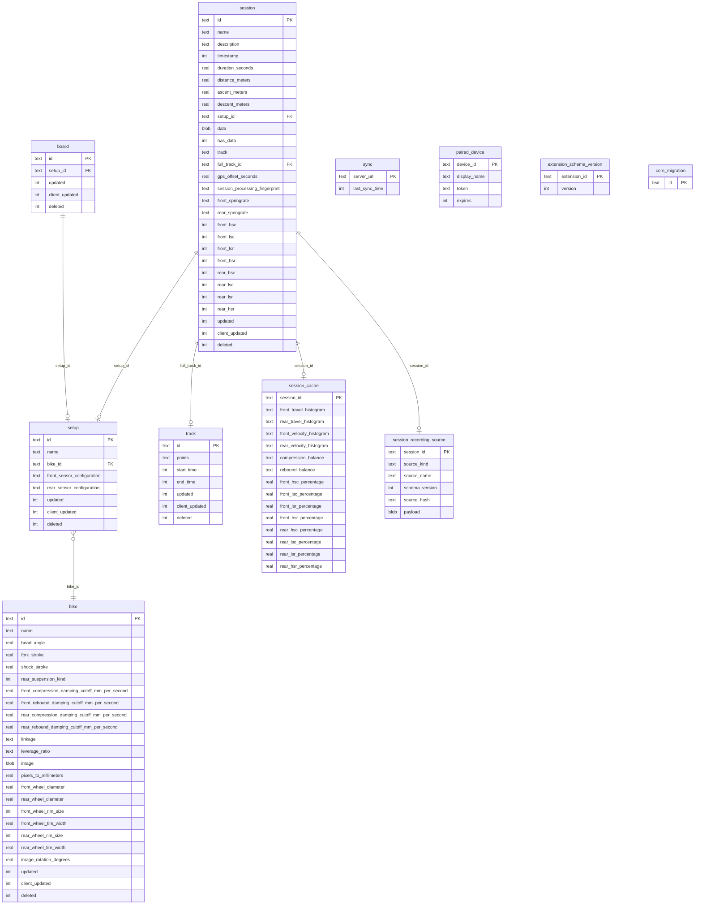

# Persistence & Serialization

> Part of the [Sufni.App architecture documentation](../ARCHITECTURE.md). This file covers the SQLite schema, the connection context, per-aggregate repositories, soft deletes, and conflict resolution semantics shared with [cross-device synchronization](sync.md).

## Schema

```mermaid
erDiagram
    session ||--o| setup : "setup_id"
    session ||--o| track : "full_track_id"
    session ||--o| session_cache : "session_id"
    session ||--o| session_recording_source : "session_id"
    setup }o--|| bike : "bike_id"
    board ||--o| setup : "setup_id"

    session {
        text id PK
        text name
        text description
        int timestamp
        real duration_seconds
        real distance_meters
        real ascent_meters
        real descent_meters
        text setup_id FK
        blob data
        int has_data
        text track
        text full_track_id FK
        real gps_offset_seconds
        text session_processing_fingerprint
        text front_springrate
        text rear_springrate
        int front_hsc
        int front_lsc
        int front_lsr
        int front_hsr
        int rear_hsc
        int rear_lsc
        int rear_lsr
        int rear_hsr
        int updated
        int client_updated
        int deleted
    }

    session_recording_source {
        text session_id PK
        text source_kind
        text source_name
        int schema_version
        text source_hash
        blob payload
    }

    bike {
        text id PK
        text name
        real head_angle
        real fork_stroke
        real shock_stroke
        int rear_suspension_kind
        real front_compression_damping_cutoff_mm_per_second
        real front_rebound_damping_cutoff_mm_per_second
        real rear_compression_damping_cutoff_mm_per_second
        real rear_rebound_damping_cutoff_mm_per_second
        text linkage
        text leverage_ratio
        blob image
        real pixels_to_millimeters
        real front_wheel_diameter
        real rear_wheel_diameter
        int front_wheel_rim_size
        real front_wheel_tire_width
        int rear_wheel_rim_size
        real rear_wheel_tire_width
        real image_rotation_degrees
        int updated
        int client_updated
        int deleted
    }

    setup {
        text id PK
        text name
        text bike_id FK
        text front_sensor_configuration
        text rear_sensor_configuration
        int updated
        int client_updated
        int deleted
    }

    board {
        text id PK
        text setup_id FK
        int updated
        int client_updated
        int deleted
    }

    track {
        text id PK
        text points
        int start_time
        int end_time
        int updated
        int client_updated
        int deleted
    }

    session_cache {
        text session_id PK
        text front_travel_histogram
        text rear_travel_histogram
        text front_velocity_histogram
        text rear_velocity_histogram
        text compression_balance
        text rebound_balance
        real front_hsc_percentage
        real front_lsc_percentage
        real front_lsr_percentage
        real front_hsr_percentage
        real rear_hsc_percentage
        real rear_lsc_percentage
        real rear_lsr_percentage
        real rear_hsr_percentage
    }

    sync {
        text server_url PK
        int last_sync_time
    }

    paired_device {
        text device_id PK
        text display_name
        text token
        int expires
    }

    extension_schema_version {
        text extension_id PK
        int version
    }

    core_migration {
        text id PK
    }
```

## SQLite Persistence Repositories

`SqliteConnectionContext` (`Sufni.App/Sufni.App/Services/SqliteConnectionContext.cs`) owns the single `SQLiteAsyncConnection`, the extension table catalog, and the initialization gate. It constructs the database at `Environment.SpecialFolder.LocalApplicationData` + `Sufni.App/sst.db` and starts `DatabaseMigrationRunner`, which enables WAL mode, creates core tables, applies compatibility migrations/backfills, runs extension migrations, performs startup cleanup, repairs duplicate track ranges, and runs extension orphan repair.

Bike rows include presentation-owned damping speed cutoffs for front/rear compression and rebound. These values default to 200 mm/s, are synchronized and exported with the bike, and are backfilled on startup for legacy schemas. They are not session preferences and do not affect telemetry processing fingerprints.

Startup migration also backfills `session_processing_fingerprint` for legacy processed sessions when the session has a processed BLOB, an undeleted setup and bike, and recorded-source metadata. The backfill writes only the fingerprint column and does not update the processed BLOB, summary metrics, or `updated` timestamp. The `core_migration` marker table records the one-time `session_processing_fingerprint_backfill_v2_202606` migration: during that first run, existing source-backed processed rows whose fingerprint already references the same setup, bike, track-projection version, and source hash are currentized even if their dependency hash came from a previous compatibility shape or from pre-refactor dependency state. After the marker exists, startup only repairs explicitly known legacy shapes such as missing/legacy fingerprints, the version-1 to version-2 processing-fingerprint compatibility case, the old snake_case dependency-hash serialization, and the legacy linkage-bike `rear_suspension_kind = None` value being normalized to `Linkage`; new source or dependency hash mismatches remain stale so recompute can still surface real derived-data changes.

Persistence consumers inject narrow repository interfaces instead of a single database facade. `ISynchronizableRepository<T>` owns generic soft-delete CRUD for `Synchronizable` entities; `ISessionRepository`, `IRecordedSessionSourceRepository`, `ITrackRepository`, `ISessionCacheStore`, and `IPairedDeviceRepository` own aggregate-specific operations; `ISyncDataStore` / `SynchronizationMergeEngine` owns sync timestamps, delta projection, remote apply, and merge conflict resolution. `DatabaseMigrationRunner` is the only schema initializer/migrator, and repositories assume `SqliteConnectionContext` has run initialization before handing out the shared connection.

`ISynchronizableRepository<T>` operations on any `Synchronizable` subclass:

- `GetAllAsync<T>()` — returns all records where `Deleted == null`
- `GetChangedAsync<T>(long since)` — returns records where `Updated > since` OR (`Deleted != null` AND `Deleted > since`)
- `PutAsync<T>(item)` — upsert. Stamps `Updated = DateTimeOffset.UtcNow.ToUnixTimeSeconds()` and clears `Deleted` (resurrecting any tombstoned row with the same id).
- `DeleteAsync<T>(id)` — sets `Deleted` timestamp (soft delete); idempotent — leaves the existing tombstone in place if the row is already deleted.

`ISessionRepository` operations split metadata and processed-data handling, and store the values they are given: telemetry validation, summary-metric derivation, and session-window track association/generation happen in `SessionTelemetryWriter` before the repository is called. `session.data` is the authoritative local processed-telemetry cache; `session.has_data` remains in the row for schema compatibility and snapshot projection, but session reads derive the availability flag from `data IS NOT NULL` so the flag cannot drift away from the blob. Nullable summary columns (`duration_seconds`, `distance_meters`, `ascent_meters`, `descent_meters`) are derived list-summary cache values, not user-authored session metadata. `gps_offset_seconds` is per-session state applied when deriving the cached session-window GPS track from a reusable full `Track`; it is stored on `session` rather than `track` because the same full ride track can back multiple recorded sessions or segments.

- `PutSessionAsync()` — updates user-authored session metadata columns, the processing fingerprint, and stamps `Updated`/`Deleted` like `PutAsync`. Existing derived summary metrics are preserved on metadata updates; the `data` blob and cached `track` are only filled via `COALESCE(?, existing)` for compatibility with older callers and soft-deleted-row reuse, while normal metadata-only saves pass them as null.
- `PutProcessedSessionAsync(session, newFullTrack, source)` — persists a processed session in one explicit transaction. It writes a new full `Track` when supplied, stamps `session.full_track_id`, writes all session metadata plus `data`, `session_processing_fingerprint`, and the summary-metric values already set on the session, and optionally inserts/replaces the matching `RecordedSessionSource`. If any write fails, the session, full-track, and source write roll back together.
- `PutProcessedSessionIfUnchangedAsync(session, newFullTrack, source, baselineUpdated)` — the optimistic-concurrency variant used by recorded-session recompute. It runs the same processed-session / optional full-track / optional source transaction only when the current `session.updated` still equals `baselineUpdated`; on conflict it returns `null` and rolls back any track/source writes.
- `UpdateSessionPsstAsync(id, data, metrics)` — overwrites the `data` column and the supplied summary metrics on a non-deleted row; the blob and metrics arrive pre-validated/pre-computed from `SessionTelemetryWriter`
- `UpdateSessionTrackAsync(id, points, metrics, gpsOffsetSeconds?)` — replaces the cached session-window `track` JSON and the supplied summary metrics, optionally updates the per-session GPS offset, and stamps `updated`; callers that omit the offset preserve the existing `gps_offset_seconds`
- `GetSessionRawPsstAsync(id)` — returns the raw MessagePack blob (sync transfer, consumer-side deserialization)
- `GetSessionsAsync()` / `GetSessionAsync(id)` / `GetSessionTrackAsync(id)` / `GetIncompleteSessionIdsAsync()` — metadata projections, cached session-window track points, and ids of rows without processed data

There is no `GetSessionPsstAsync` on the repository: consumers that need a `TelemetryData` fetch the raw blob and deserialize it themselves through `ISessionTelemetryProcessor`, so MessagePack knowledge stays out of the persistence layer.

`ISessionTelemetryWriter` (`Sufni.App/Sufni.App/Services/SessionTelemetryWriter.cs`) sits in front of `ISessionRepository` for processed-data writes and owns the domain computation that precedes persistence:

- `PutProcessedSessionAsync` / `PutProcessedSessionIfUnchangedAsync` — prepare the session, then delegate to the matching repository transaction. Preparation links a session without a `full_track_id` to an active track whose `[start_time, end_time]` window contains the session timestamp (`ITrackRepository.FindTrackContainingTimestampAsync`), derives `duration_seconds` from the processed telemetry metadata, and derives GPS distance/ascent/descent from the session-window points, the supplied generated track, or points regenerated from the linked full track.
- `PatchSessionPsstAsync(id, bytes)` — validates the MessagePack blob by deserializing it through `ISessionTelemetryProcessor` before writing (invalid bytes are rejected without changing the row), refreshes `duration_seconds` from the patched blob, preserves existing GPS metrics unless a cached session-window track allows recomputation, then calls `UpdateSessionPsstAsync`.
- `PatchSessionTrackAsync(id, points, gpsOffsetSeconds?)` — recomputes GPS distance/ascent/descent from the supplied projected points and calls `UpdateSessionTrackAsync`, passing a GPS offset only when the caller is intentionally realigning the session-window GPS segment.

`ITrackRepository` owns track lookups: `FindTrackByTimeRangeAsync(startTime, endTime)` returns the active track whose cached `start_time` and `end_time` exactly match the supplied values (GPX import uses this to skip already-imported tracks before writing), `FindTrackContainingTimestampAsync` resolves the session-window containment lookup above, `AssociateSessionWithTrackAsync` links an existing session row, and `GetTracksByIdsAsync` loads full track payloads.

`IRecordedSessionSourceRepository` owns recorded-source rows:

- `GetRecordedSessionSourcesAsync()` / `GetRecordedSessionSourceAsync(id)` — load recorded-source rows or one full source payload
- `GetSessionIdsMissingRecordedSourceAsync()` — returns non-deleted session ids that do not have a source row, or whose source row hash differs from the persisted processing fingerprint's `SourceHash`
- `PutRecordedSessionSourceAsync(source)` / `DeleteRecordedSessionSourceAsync(sessionId)` — insert/replace or remove a recorded source outside the processed-session transaction, used by source sync and source-store writes

## Extension Schema

`ExtensionDatabaseConnection` is the concrete singleton behind
`IExtensionDatabaseConnection`. `OpenSessionAsync()` awaits normal startup
initialization before returning an `IExtensionDatabaseSession` scoped to
declared extension table types. Extension services can query and mutate their
owned rows through the session operations, while undeclared table types and
core table names are rejected before reaching sqlite-net.

Extension migrations are declared by `IExtensionDatabaseMigrator`.
Each migrator declares:

- `ExtensionId`
- `TargetVersion`
- `TableTypes` owned by that extension
- ordered `ExtensionDatabaseMigrationStep` entries

During `DatabaseMigrationRunner.RunAsync()`, extension work runs after core
tables/compatibility columns are created and before cleanup completes:

1. Create `extension_schema_version`.
2. Create tables declared by all extension migrators.
3. Run missing migration steps in ascending target version.
4. Update the schema-version row after each successful step.
5. Run core cleanup.
6. Run extension orphan repair.

The public schema tracks only extension ids and versions. Extension
table columns and payload fields remain owned by the declaring module.
Migrator validation rejects blank or duplicate extension ids, invalid target
versions, duplicate migration step versions, reserved core table names, and
duplicate extension table ownership during connection-context construction.

## Soft Delete

`Synchronizable` entities (`Sufni.App/Sufni.App/Models/Synchronizable.cs`) — `bike`, `setup`, `session`, `board`, `track` — carry `Updated` (server timestamp), `ClientUpdated` (local timestamp), and nullable `Deleted` (soft delete timestamp). `paired_device`, `session_cache`, `session_recording_source`, and `sync` are not `Synchronizable` and have their own lifecycles. Startup cleanup also soft-deletes duplicate active tracks that share the same cached start/end seconds, keeps one canonical row, repoints non-deleted sessions to it, and clears affected cached session-window tracks so they regenerate from the canonical full track.

On database initialization, the `Cleanup()` pass permanently removes:

- `Synchronizable` rows with `Deleted` older than 1 day
- Orphaned `session_cache` rows whose parent session is past that 1-day grace window
- `session_recording_source` rows for purged sessions, plus any source row without a parent session
- `paired_device` rows where `Expires < DateTime.UtcNow`

Extension-owned rows that reference core entities are cleaned through
declared cascade rules rather than ad hoc core knowledge.
`IExtensionCascadeRuleProvider` declares the extension table, core
entity kind, foreign-key column, and `SoftDelete` or `HardDelete`
action. `ExtensionCascadeService` validates that the target table is
owned by an extension migrator, applies rules after successful core
delete workflows, and repeats the same declared cleanup during startup
orphan repair. `IExtensionStateRefreshParticipant` lets extension
state refresh after cascade work without exposing extension stores to
core coordinators.

## Conflict Resolution

`MergeAsync<T>()` is invoked per entity inside the `MergeAllAsync(SynchronizationData)` transaction. It compares against a derived "content version" — `existing.ClientUpdated` if set, otherwise `existing.Updated` — so locally-authored rows that have not yet round-tripped through a sync still compare correctly.

The merge cases, in evaluation order:

1. **New entity** (not in local DB): persist with `ClientUpdated = entity.Updated`, `Updated = now`. Insert.
2. **Existing already locally deleted**: keep the local tombstone; if the remote tombstone is later (`entity.Deleted > existing.Deleted`), advance `existing.Deleted` to the remote value. Always bump `existing.Updated = now`. (No content is ever revived once locally deleted.)
3. **Remote delete with `entity.Deleted > existingContentVersion`**: accept the delete — set `existing.Deleted = entity.Deleted`, `existing.Updated = now`. (Note: `Updated` is set to *now*, not to the remote's `Updated`.)
4. **Stale remote delete** (`entity.Deleted <= existingContentVersion`): ignore the delete; only bump `existing.Updated = now`.
5. **Local wins** (`existingContentVersion > entity.Updated`): keep local content; bump `existing.Updated = now`.
6. **Remote wins** (otherwise): persist remote content with `ClientUpdated = entity.Updated`, `Updated = now`. Update.

This gives local client changes precedence in conflicts while accepting remote deletes that are newer than the local content.

Session merge accepts metadata, nullable derived summary metrics (`duration_seconds`, `distance_meters`, `ascent_meters`, `descent_meters`), track linkage/cache JSON, `gps_offset_seconds`, tuning fields, and `session_processing_fingerprint`, but it does not move the processed telemetry BLOB or the raw recording source through `SynchronizationData`. Those payloads are synchronized by the session-data and recorded-source endpoints described in [Cross-Device Synchronization](sync.md).
