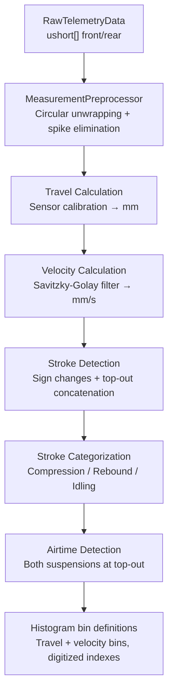

# Signal Processing & Suspension Kinematics

> Part of the [Sufni.App architecture documentation](../ARCHITECTURE.md). This file covers the signal-processing pipeline that turns raw SST samples into analysis-ready telemetry, the linkage kinematics solver, and the sensor calibration strategy.

## Signal Processing Pipeline



`TelemetryData.FromRecording(RawTelemetryData, Metadata, BikeData)` (`Sufni.Telemetry/TelemetryData.cs`) orchestrates the entire pipeline. `BikeData` is a record carrying `HeadAngle` (`double`) plus nullable `FrontMaxTravel` / `RearMaxTravel` (`double?`) and nullable calibration functions `FrontMeasurementToTravel` / `RearMeasurementToTravel` (`Func<ushort, double>?`), and `FrontMeasurementWraps` / `RearMeasurementWraps` flags that select the linear vs. circular preprocessing path; the nullables are populated only for the suspensions actually present on the bike.

The pipeline produces histogram **bin definitions** and per-stroke digitized indexes, but does not compute the histogram tallies, statistics, FFT frequency histogram, balance, or velocity-band breakdown — those are computed lazily on demand by `Calculate*` methods on the `TelemetryStatistics` static partial class (e.g., `CalculateTravelHistogram`, `CalculateVelocityHistogram`, `CalculateTravelFrequencyHistogram`, `CalculateBalance`, `CalculateVelocityBands`).

### Measurement Preprocessing

`MeasurementPreprocessor.Process(ushort[], MeasurementSensorType)` (`Sufni.Telemetry/MeasurementPreprocessor.cs`) is the first stage of the pipeline, called for each present suspension before travel conversion. The selected path is `Linear` or `Rotational`, picked by `MeasurementPreprocessor.SensorTypeForWrapping(bool)` from `BikeData.FrontMeasurementWraps` / `BikeData.RearMeasurementWraps`. Those flags are sourced from each sensor configuration's `MeasurementWraps` property — only the rotational sensor types currently set them.

- **Linear path** (`MeasurementWraps == false`, the default): convert each `ushort` straight to `int`, run `SpikeElimination.EliminateSpikesAsInt`, clamp every result back into `[0, 4095]` (the 12-bit ADC range).
- **Rotational path** (`MeasurementWraps == true`, rotary sensors): unwrap the 12-bit (4096-step) circular ADC into a continuous `int` signal — each step's delta to the previous sample is examined, and a `±4096` offset is accumulated whenever the delta crosses the half-range (`±2048`) so wrap-arounds become continuous deltas. Run `SpikeElimination.EliminateSpikesAsInt` on the unwrapped integer signal, then re-wrap each result modulo 4096 back to `ushort`.

`SpikeElimination.EliminateSpikesAsInt` (`Sufni.Telemetry/SpikeElimination.cs`) walks the signal three times: it first detects sudden changes (windows up to 5 samples where the cumulative change is >= 100 and every per-step change is >= 30) and flattens each window to its endpoint; it then corrects an early-recording baseline jump if the first detected change starts within the first 100 samples; finally it tracks negative excursions that never recover and shifts the trailing tail back to the pre-excursion baseline. The number of detected sudden changes is returned alongside the cleaned samples and surfaced as the per-suspension `AnomalyRate` (anomalies per second) on the `Suspension` record.

The preprocessor return record `MeasurementPreprocessorResult(Samples, AnomalyCount)` feeds directly into `SuspensionTraceProcessor.Process` inside `TelemetryData.FromRecording(...)`.

### Travel Calculation

Each preprocessed sample is then passed through the sensor's `MeasurementToTravel` function (see [Sensor Calibration](#sensor-calibration)) to produce travel in millimeters. Values are clamped to `[0, MaxTravel]`.

### Velocity Calculation

A Savitzky-Golay filter (`Sufni.Telemetry/Filters.cs`) computes the smoothed first derivative of the travel signal. Parameters: window size up to 51 points (clamped down to fit short recordings, decremented if even, with a hard minimum of 5 — recordings with fewer than 5 samples skip processing and both suspensions are flagged not-present), polynomial order 3, 1st derivative. The implementation uses Gram polynomial basis functions with recursive computation, and handles signal boundaries by precomputing one weight row per evaluation offset within the fixed-size window: edge samples reuse the same first/last `windowSize` data points but apply weights centred at the appropriate off-centre row instead of shrinking the window. Positive velocity = compression (fork/shock compressing), negative = rebound (extending).

### Stroke Detection

`Strokes.FilterStrokes()` (`Sufni.Telemetry/Strokes.cs`) identifies strokes by finding sign changes in velocity. Adjacent strokes where both have max position < 5mm (near full extension) are concatenated — this prevents small oscillations at top-out from fragmenting the data into many tiny strokes. Strokes too short AND too brief to qualify as any category are silently discarded.

Each stroke records its start/end sample indices, length (travel delta in mm), duration, and aggregated statistics (`StrokeStat`: sum/max travel, sum/max velocity, bottomout count, sample count).

### Stroke Categorization

- **Compression**: length >= 5mm
- **Rebound**: length <= -5mm
- **Idling**: |length| < 5mm AND duration >= 0.1s

Only compressions and rebounds are MessagePack-serialized — `Strokes.Idlings` is `[IgnoreMember]`. Idlings are populated only during the same pipeline run that computes airtimes; after deserialization the `Idlings` array is not reconstructed, but the resolved `Airtimes[]` it produced is itself serialized.

### Airtime Detection

An idling stroke is marked as an air candidate during stroke categorization when: max travel <= 5mm, duration >= 0.2s, and the next stroke's max velocity >= 500 mm/s (landing impact). The first and last strokes in the recording cannot be tagged as air candidates because the categorization rule requires both a previous and a next stroke. When both suspensions are present, airtimes are confirmed by pairing front and rear candidates whose sample ranges overlap by >= 50%; any remaining unpaired candidate from either side is still confirmed if the average of the two suspensions' mean travel during that idling is <= 4% of the averaged max travel. When only one suspension is present, every air candidate from that suspension becomes an airtime.

### Processing Parameters

All constants in `Sufni.Telemetry/Parameters.cs`:

| Constant                          | Value    | Description                                                   |
| --------------------------------- | -------- | ------------------------------------------------------------- |
| `StrokeLengthThreshold`           | 5 mm     | Min travel to classify as compression/rebound                 |
| `IdlingDurationThreshold`         | 0.10 s   | Min duration for an idling stroke                             |
| `AirtimeDurationThreshold`        | 0.20 s   | Min duration for airtime candidate                            |
| `AirtimeVelocityThreshold`        | 500 mm/s | Min landing impact velocity                                   |
| `AirtimeOverlapThreshold`         | 0.50     | Front/rear overlap ratio for airtime                          |
| `AirtimeTravelMeanThresholdRatio` | 0.04     | Max mean travel as ratio of max for single-suspension airtime |
| `BottomoutThreshold`              | 3 mm     | Distance from max travel to count as bottomout                |
| `TravelHistBins`                  | 20       | Number of travel histogram bins                               |
| `VelocityHistStep`                | 100 mm/s | Coarse velocity histogram bin width                           |
| `VelocityHistStepFine`            | 15 mm/s  | Fine velocity histogram bin width                             |
| `DeepTravelThresholdRatio`        | 0.75     | Travel ratio above which deep-travel stroke counts start      |

### Serialized Structure

`TelemetryData` uses MessagePack with `[MessagePackObject]` attributes:

```
TelemetryData
├── Metadata (SourceName, Version, SampleRate, Timestamp, Duration)
├── Front: Suspension
│   ├── Present, MaxTravel, AnomalyRate
│   ├── Travel[], Velocity[]
│   ├── TravelBins[], VelocityBins[], FineVelocityBins[]
│   └── Strokes (Compressions[], Rebounds[])
├── Rear: Suspension (same structure)
├── Airtimes[] (Start, End in seconds)
├── ImuData: RawImuData? (V4 only)
├── GpsData: GpsRecord[]? (V4 only)
└── Markers: MarkerData[] (V4 only)
```

The serialized form is accessed via `TelemetryData.BinaryForm` and stored as a derived BLOB in the `session.data` column. The original recording source is persisted separately so the BLOB can be regenerated when processing inputs change.

### Recorded Session Derivation

Recorded sessions have two durable data layers:

- **Recording source** — `RecordedSessionSource` in `session_recording_source`, keyed by `session_id`. Imported SST sessions store compressed original SST bytes (`SourceKind = ImportedSst`). Saved live captures store a schema-versioned JSON payload (`SourceKind = LiveCapture`) containing capture metadata, raw front/rear measurements, IMU data, GPS data, and markers. The live-capture source deliberately excludes `BikeData`; calibration is resolved again from the current setup and bike when the source is processed.
- **Processed telemetry** — MessagePack `TelemetryData` in `session.data`, derived from the recording source plus the current setup/bike calibration and the current `TelemetryProcessingVersion`.

`RecordedSessionReprocessor` is the single recorded-session derivation path. For imported SST sources it decompresses the stored source bytes, parses them with `RawTelemetryData.FromByteArray`, rebuilds `Metadata` from the raw file, and calls `TelemetryData.FromRecording(...)`. For live-capture sources it deserializes the saved live payload, rebuilds `LiveTelemetryCapture`, and calls `TelemetryData.FromLiveCapture(...)`. In both cases it also produces a generated full `Track` when GPS data is present.

`ProcessingFingerprintService` records the inputs used for the derived BLOB: fingerprint schema version, `TelemetryProcessingVersion.Current`, setup id, bike id, a deterministic dependency hash, and the recorded-source hash. The dependency hash includes the setup's front/rear sensor configuration, the bike geometry needed for processing, rear suspension kind, linkage joints/links/shock definition, and leverage-ratio points. Fields that do not affect processing, such as display names or notes, are not part of the hash.

When the stored fingerprint is missing, uses an older processing version, references different processing inputs, or the processed BLOB is absent while the raw source exists, the recorded session is recomputable. Missing setup/bike dependencies make it stale but not recomputable. A missing raw source is displayed separately as "No Raw"; the app can still load existing processed data, but it cannot regenerate it until the source is restored.

---

## Suspension Kinematics

The `Sufni.Kinematics` library models bike suspension linkages to compute how wheel travel relates to shock compression.

### Linkage Model

A `Linkage` (`Sufni.Kinematics/Linkage.cs`) consists of named `Joint`s and `Link`s. Joints have a type that determines their behavior during solving:

| JointType       | Behavior                     |
| --------------- | ---------------------------- |
| `Fixed`         | Immovable frame attachment   |
| `BottomBracket` | Immovable (treated as fixed) |
| `HeadTube`      | Fork crown pivot             |
| `Floating`      | Free to move during solving  |
| `RearWheel`     | Rear axle position           |
| `FrontWheel`    | Front axle position          |

A `Link` (`Sufni.Kinematics/Link.cs`) connects two joints and stores their Euclidean distance as a constraint. The `Shock` link is special — its length is varied during solving to simulate compression.

Linkages are stored as JSON in the `bike` table and deserialized with `Linkage.FromJson()`, which resolves joint name references to object references for fast lookup.

### Kinematic Solver

`KinematicSolver` (`Sufni.Kinematics/KinematicSolver.cs`) uses iterative constraint satisfaction (Gauss-Seidel relaxation) to find valid joint positions through the full range of shock compression.

Constructor: `KinematicSolver(Linkage, steps=200, iterations=1000)` — deep-copies the linkage via JSON round-trip.

For each of the 200 steps (0% to 100% shock compression):

1. Set the shock's target length: `maxLength - (shockStroke * step / (steps-1))`
2. Run 1000 iterations of `EnforceLength()` on every link

`EnforceLength()` corrects each link toward its target along the link axis. When both endpoints are free (`movableEndpointCount == 2`), each moves by half the error so the link length matches in a single pass. When only one endpoint is free, that endpoint receives the *full* correction (`correctionScale = 1.0`). Multiple iterations are still required for the system to converge because every move perturbs the neighboring links sharing those joints.

Output: `Dictionary<string, CoordinateList>` mapping each joint name to its X,Y positions across all 200 steps.

### Bike Characteristics

`BikeCharacteristics` (`Sufni.Kinematics/BikeCharacteristics.cs`) derives datasets from the solved motion:

- **`LeverageRatioData`** = lazily computed and cached. For each step `i`, the ratio is `(wheelTravel[i] - wheelTravel[i-1]) / (shockStroke[i] - shockStroke[i-1])`, where wheel travel is the per-step Euclidean distance from the rear wheel's initial position and shock stroke is the per-step reduction of the shock-eye-to-shock-eye distance from its initial value.
- **`AngleToTravelDataset(centralJoint, adjacentJoint1, adjacentJoint2)`** — angle at a specified joint vs. rear wheel travel across the full range, used for visualizing pivot behavior.
- **`AngleToShockStrokeDataset(...)`** — the same angle paired with shock stroke instead of wheel travel.
- **`ShockStrokeToWheelTravelDataset()`** — used by `RearTravelCalibrationBuilder` to derive rear max travel from a linkage solve.

Front and rear max travel for the processing pipeline do **not** live on `BikeCharacteristics`. Front max travel is computed inside the front sensor configuration itself (e.g., `LinearForkSensorConfiguration.MaxTravel = bike.ForkStroke * sin(headAngle)` — see [Sensor Calibration](#sensor-calibration)). Rear max travel is produced by `RearTravelCalibrationBuilder` from either the linkage solve (`ShockStrokeToWheelTravelDataset.Y[^1]`) or the leverage-ratio curve (`LeverageRatio.WheelTravelAt(maxShockStroke)`).

### Utilities

- **`CoordinateRotation`** — 2D point rotation about an arbitrary centre, plus rotated-rectangle bounding-box computation, used by the bike image canvas and the linkage editor
- **`GroundCalculator`** — computes rotation angle to level ground contact points given wheel positions and radii
- **`EtrtoRimSize`** — ETRTO standard rim sizes (507/559/584/622mm) with tire diameter calculation
- **`GeometryUtils`** — distance and angle calculations using dot product, with float clamping to avoid NaN from precision errors

---

## Sensor Calibration

Four sensor types convert raw ADC counts to millimeters of travel through the `ISensorConfiguration` strategy pattern.

`ISensorConfiguration` (`Sufni.App/Sufni.App/Models/SensorConfigurations/SensorConfiguration.cs`) defines the front-suspension calibration surface used directly by the telemetry pipeline:

- `Type` — `SensorType` enum discriminator (`LinearFork`, `RotationalFork`, `LinearShock`, `LinearShockStroke`, `RotationalShock`)
- `MeasurementToTravel` — `Func<ushort, double>` calibration closure
- `MaxTravel` — physical suspension limit in mm

Polymorphic JSON deserialization: `SensorConfiguration.FromJson(json, bike)` reads the `Type` field first, then dispatches to the concrete class's `FromJson()` which deserializes the type-specific parameters and computes calibration factors using bike geometry. Front-suspension types build their `MeasurementToTravel` closure during this deserialization step. Rear shock payloads (`LinearShockSensorConfiguration`, `RotationalShockSensorConfiguration`) are deserialized as data-only records and the closure is built later by [`RearTravelCalibrationBuilder`](#rear-travel-calibration), which keeps the linkage and leverage-ratio rules out of the sensor-configuration types.

For example, `LinearForkSensorConfiguration` stores `Length` (sensor physical range) and `Resolution` (ADC bit depth). Its calibration:

```csharp
// Computed once during FromJson():
measurementToStroke = Length / (Math.Pow(2, Resolution) - 1); // ADC count → mm of fork stroke
strokeToTravel = Math.Sin(headAngle * Math.PI / 180.0);    // fork stroke → vertical wheel travel

// Applied per sample:
MeasurementToTravel = measurement => measurement * measurementToStroke * strokeToTravel;
MaxTravel = bike.ForkStroke * strokeToTravel;
```

The denominator is the ADC's full-scale count for an `n`-bit sensor: `2^Resolution - 1`.

The bike context (head angle, fork stroke, shock stroke) is injected at deserialization time, making the closure self-contained for the processing pipeline.

| Implementation                       | Parameters                                   | Calibration                                                            |
| ------------------------------------ | -------------------------------------------- | ---------------------------------------------------------------------- |
| `LinearForkSensorConfiguration`      | Length, Resolution                           | Linear potentiometer on fork, projected by head angle                  |
| `RotationalForkSensorConfiguration`  | MaxLength, ArmLength                         | Rotary encoder on fork, cosine-based rigid-arm geometric projection    |
| `LinearShockSensorConfiguration`     | Length, Resolution                           | Rear shock payload (`SensorType.LinearShock` for linkage bikes, `SensorType.LinearShockStroke` for leverage-ratio bikes) consumed by `RearTravelCalibrationBuilder`; maps shock stroke to wheel travel via linkage interpolation or `LeverageRatio.WheelTravelAt(...)` |
| `RotationalShockSensorConfiguration` | CentralJoint, AdjacentJoint1, AdjacentJoint2 | Rear shock payload consumed by `RearTravelCalibrationBuilder`; resolves angle-to-shock-stroke from linkage motion, then converts to wheel travel |

### Rear Travel Calibration

`RearTravelCalibrationBuilder` (`Sufni.App/Sufni.App/Services/RearTravelCalibrationBuilder.cs`) extends the `ISensorConfiguration` strategy pattern for the rear shock, where shock-stroke ADC counts have to be converted to wheel travel through either a linkage solve or a leverage-ratio curve. Its single entry point — `TryBuild(Setup, Bike, out RearTravelCalibration?, out string?)` — returns a `RearTravelCalibration(MaxTravel, MeasurementToTravel, MeasurementWraps)` record that `TelemetryBikeData.Create(setup, bike)` (`Sufni.App/Sufni.App/TelemetryBikeData.cs`) feeds into `BikeData` for `TelemetryData.FromRecording(...)`. It is invoked at processing time (recorded session import, recompute, live capture launch) — never at sensor-configuration deserialization time, so the rear `LinearShockSensorConfiguration` / `RotationalShockSensorConfiguration` instances persisted on a `Setup` carry only their JSON parameters.

The build flow:

1. Resolve the rear suspension model via `RearSuspensionResolver` from `Bike.RearSuspensionKind` (`Hardtail`, `Linkage`, `LeverageRatio`). A hardtail returns success with no calibration; an `Invalid` resolution returns the resolver's error verbatim.
2. Deserialize `Setup.RearSensorConfigurationJson` as a data-only `SensorConfiguration` payload and pattern-match it against the resolved suspension:
   - `LinearShockSensorConfiguration` with `SensorType.LinearShock` + `Linkage`, or `SensorType.LinearShockStroke` + `LeverageRatio` — compatible.
   - `RotationalShockSensorConfiguration` + `Linkage` — compatible.
   - Any other combination — incompatible, returns a setup-level error.
3. Compute the per-sample shock stroke from the payload (linear: `Length / (2^Resolution - 1)`; rotational: `2π / 4096` rad per ADC count, then a cubic polynomial fit of the linkage's angle-to-shock-stroke dataset).
4. Convert shock stroke to wheel travel through the resolved suspension: linkage suspensions interpolate `BikeCharacteristics.ShockStrokeToWheelTravelDataset()`, leverage-ratio suspensions call `LeverageRatio.WheelTravelAt(...)`.
5. For leverage-ratio bikes, `LeverageRatioShockStrokeRules.TryValidate` checks that the bike's configured shock stroke matches the curve's `MaxShockStroke` within tolerance before the calibration is accepted; the resulting `MaxTravel` is the wheel travel at that validated stroke, not a separately configured number.

The `MeasurementWraps` flag on the produced `RearTravelCalibration` is `true` for the rotational-shock path (the rotary encoder reports modulo-4096 angles) and `false` for the linear-shock paths; `TelemetryBikeData.Create` copies it onto `BikeData.RearMeasurementWraps`, which selects the [Measurement Preprocessing](#measurement-preprocessing) path for the rear samples.

### Leverage-Ratio CSV Import

`LeverageRatioCsvParser` (`Sufni.App/Sufni.App/Services/LeverageRatioCsvParser.cs`) parses the leverage-ratio curve a user can attach to a leverage-ratio rear suspension when no full linkage is modelled. The expected CSV format:

| Header / column   | Meaning                                       |
| ----------------- | --------------------------------------------- |
| `shock_travel_mm` | Shock stroke in mm (monotonically increasing) |
| `wheel_travel_mm` | Wheel travel in mm at that shock stroke       |

Other rules: header is required and matched case-insensitively, BOM is stripped, comma or semicolon delimiter (auto-detected from the header line), `.` decimal separator only (decimal commas are rejected), invariant-culture `double` parsing, blank lines skipped. Rows are validated through `LeverageRatioValidation.Validate(...)` after parsing so format and curve-shape errors surface together.

`Parse(Stream)` and `Parse(string)` both return a `LeverageRatioParseResult` discriminated record:

- `Parsed(LeverageRatio Value)` — the points were valid; the wrapped `LeverageRatio` (`Sufni.Kinematics/LeverageRatio/LeverageRatio.cs`) exposes `MaxShockStroke`, `MaxWheelTravel`, and `WheelTravelAt(shockStroke)` for downstream consumers.
- `Invalid(IReadOnlyList<LeverageRatioParseError> Errors)` — one error per offending line; each error carries an optional 1-based line number plus a human-readable message.

The parser is wired into the bike editor flow: `BikeEditorService.ImportLeverageRatioAsync(...)` (`Sufni.App/Sufni.App/Services/BikeEditorService.cs`) opens the CSV picker, runs `LeverageRatioCsvParser.Parse` on a background task, and surfaces the result to `LeverageRatioEditorViewModel.ApplyImportResult` as a `LeverageRatioImportResult` (`Imported` / `Invalid` / `Failed` / `Canceled`). The imported curve is what `RearTravelCalibrationBuilder` later reads off `Bike.LeverageRatio` when building the rear calibration closure.
