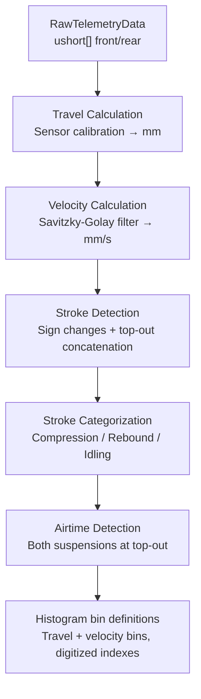

# Signal Processing & Suspension Kinematics

> Part of the [Sufni.App architecture documentation](../ARCHITECTURE.md). This file covers the signal-processing pipeline that turns raw SST samples into analysis-ready telemetry, the linkage kinematics solver, and the sensor calibration strategy.

## Signal Processing Pipeline



`TelemetryData.FromRecording(RawTelemetryData, Metadata, BikeData)` (`Sufni.Telemetry/TelemetryData.cs`) orchestrates the entire pipeline. `BikeData` is a record carrying `HeadAngle` (`double`) plus nullable `FrontMaxTravel` / `RearMaxTravel` (`double?`) and nullable calibration functions `FrontMeasurementToTravel` / `RearMeasurementToTravel` (`Func<ushort, double>?`); the nullables are populated only for the suspensions actually present on the bike.

The pipeline produces histogram **bin definitions** and per-stroke digitized indexes, but does not compute the histogram tallies, statistics, FFT frequency histogram, balance, or velocity-band breakdown — those are computed lazily on demand by `Calculate*` methods on `TelemetryData` (e.g., `CalculateTravelHistogram`, `CalculateVelocityHistogram`, `CalculateTravelFrequencyHistogram`, `CalculateBalance`, `CalculateVelocityBands`).

### Travel Calculation

Each raw encoder count is passed through the sensor's `MeasurementToTravel` function (see [Sensor Calibration](#sensor-calibration)) to produce travel in millimeters. Values are clamped to `[0, MaxTravel]`.

### Velocity Calculation

A Savitzky-Golay filter (`Sufni.Telemetry/Filters.cs`) computes the smoothed first derivative of the travel signal. Parameters: window size up to 51 points (clamped down to fit short recordings, decremented if even, with a hard minimum of 5 — suspensions with fewer than 5 samples are flagged not-present), polynomial order 3, 1st derivative. The implementation uses Gram polynomial basis functions with recursive computation, and handles signal boundaries with asymmetric windows that shrink toward edges. Positive velocity = compression (fork/shock compressing), negative = rebound (extending).

### Stroke Detection

`Strokes.FilterStrokes()` (`Sufni.Telemetry/Strokes.cs`) identifies strokes by finding sign changes in velocity. Adjacent strokes where both have max position < 5mm (near full extension) are concatenated — this prevents small oscillations at top-out from fragmenting the data into many tiny strokes. Strokes too short AND too brief to qualify as any category are silently discarded.

Each stroke records its start/end sample indices, length (travel delta in mm), duration, and aggregated statistics (`StrokeStat`: sum/max travel, sum/max velocity, bottomout count, sample count).

### Stroke Categorization

- **Compression**: length >= 5mm
- **Rebound**: length <= -5mm
- **Idling**: |length| < 5mm AND duration >= 0.1s

Only compressions and rebounds are MessagePack-serialized. Idlings are reconstructed from gaps on deserialization.

### Airtime Detection

An idling stroke is marked as an air candidate when: max travel <= 5mm, duration >= 0.2s, and the next stroke's max velocity >= 500 mm/s (landing impact). Airtimes are confirmed when front and rear air candidates overlap by >= 50%, or when the average of both suspensions' mean travel is <= 4% of the averaged max travel.

### Processing Parameters

All constants in `Sufni.Telemetry/Parameters.cs`:

| Constant                          | Value    | Description                                                   |
| --------------------------------- | -------- | ------------------------------------------------------------- |
| `StrokeLengthThreshold`           | 5 mm     | Min travel to classify as compression/rebound                 |
| `IdlingDurationThreshold`         | 0.10 s   | Min duration for an idling stroke                             |
| `AirtimeDurationThreshold`        | 0.20 s   | Min duration for airtime candidate                            |
| `AirtimeVelocityThreshold`        | 500 mm/s | Min landing impact velocity                                   |
| `AirtimeOverlapThreshold`         | 0.50     | Front/rear overlap ratio for airtime                          |
| `AirtimeTravelMeanThresholdRatio` | 0.04     | Max mean travel as ratio of max for single-suspension airtime |
| `BottomoutThreshold`              | 3 mm     | Distance from max travel to count as bottomout                |
| `TravelHistBins`                  | 20       | Number of travel histogram bins                               |
| `VelocityHistStep`                | 100 mm/s | Coarse velocity histogram bin width                           |
| `VelocityHistStepFine`            | 15 mm/s  | Fine velocity histogram bin width                             |

### Serialized Structure

`TelemetryData` uses MessagePack with `[MessagePackObject]` attributes:

```
TelemetryData
├── Metadata (SourceName, Version, SampleRate, Timestamp, Duration)
├── Front: Suspension
│   ├── Present, MaxTravel, AnomalyRate
│   ├── Travel[], Velocity[]
│   ├── TravelBins[], VelocityBins[], FineVelocityBins[]
│   └── Strokes (Compressions[], Rebounds[])
├── Rear: Suspension (same structure)
├── Airtimes[] (Start, End in seconds)
├── ImuData: RawImuData? (V4 only)
├── GpsData: GpsRecord[]? (V4 only)
└── Markers: MarkerData[] (V4 only)
```

The serialized form is accessed via `TelemetryData.BinaryForm` and stored as a BLOB in the session table.

---

## Suspension Kinematics

The `Sufni.Kinematics` library models bike suspension linkages to compute how wheel travel relates to shock compression.

### Linkage Model

A `Linkage` (`Sufni.Kinematics/Linkage.cs`) consists of named `Joint`s and `Link`s. Joints have a type that determines their behavior during solving:

| JointType       | Behavior                     |
| --------------- | ---------------------------- |
| `Fixed`         | Immovable frame attachment   |
| `BottomBracket` | Immovable (treated as fixed) |
| `HeadTube`      | Fork crown pivot             |
| `Floating`      | Free to move during solving  |
| `RearWheel`     | Rear axle position           |
| `FrontWheel`    | Front axle position          |

A `Link` (`Sufni.Kinematics/Link.cs`) connects two joints and stores their Euclidean distance as a constraint. The `Shock` link is special — its length is varied during solving to simulate compression.

Linkages are stored as JSON in the `bike` table and deserialized with `Linkage.FromJson()`, which resolves joint name references to object references for fast lookup.

### Kinematic Solver

`KinematicSolver` (`Sufni.Kinematics/KinematicSolver.cs`) uses iterative constraint satisfaction (Gauss-Seidel relaxation) to find valid joint positions through the full range of shock compression.

Constructor: `KinematicSolver(Linkage, steps=200, iterations=1000)` — deep-copies the linkage via JSON round-trip.

For each of the 200 steps (0% to 100% shock compression):

1. Set the shock's target length: `maxLength - (shockStroke * step / (steps-1))`
2. Run 1000 iterations of `EnforceLength()` on every link

`EnforceLength()` corrects each link toward its target along the link axis. When both endpoints are free (`movableEndpointCount == 2`), each moves by half the error so the link length matches in a single pass. When only one endpoint is free, that endpoint receives the *full* correction (`correctionScale = 1.0`). Multiple iterations are still required for the system to converge because every move perturbs the neighboring links sharing those joints.

Output: `Dictionary<string, CoordinateList>` mapping each joint name to its X,Y positions across all 200 steps.

### Bike Characteristics

`BikeCharacteristics` (`Sufni.Kinematics/BikeCharacteristics.cs`) derives datasets from the solved motion:

- **`LeverageRatioData`** = lazily computed and cached. For each step `i`, the ratio is `(wheelTravel[i] - wheelTravel[i-1]) / (shockStroke[i] - shockStroke[i-1])`, where wheel travel is the per-step Euclidean distance from the rear wheel's initial position and shock stroke is the per-step reduction of the shock-eye-to-shock-eye distance from its initial value.
- **`AngleToTravelDataset(centralJoint, adjacentJoint1, adjacentJoint2)`** — angle at a specified joint vs. rear wheel travel across the full range, used for visualizing pivot behavior.
- **`AngleToShockStrokeDataset(...)`** — the same angle paired with shock stroke instead of wheel travel.
- **`ShockStrokeToWheelTravelDataset()`** — used by `RearTravelCalibrationBuilder` to derive rear max travel from a linkage solve.

Front and rear max travel for the processing pipeline do **not** live on `BikeCharacteristics`. Front max travel is computed inside the front sensor configuration itself (e.g., `LinearForkSensorConfiguration.MaxTravel = bike.ForkStroke * sin(headAngle)` — see [Sensor Calibration](#sensor-calibration)). Rear max travel is produced by `RearTravelCalibrationBuilder` from either the linkage solve (`ShockStrokeToWheelTravelDataset.Y[^1]`) or the leverage-ratio curve (`LeverageRatio.WheelTravelAt(maxShockStroke)`).

### Utilities

- **`CoordinateRotation`** — 2D rotation matrix operations for bike image display
- **`GroundCalculator`** — computes rotation angle to level ground contact points given wheel positions and radii
- **`EtrtoRimSize`** — ETRTO standard rim sizes (507/559/584/622mm) with tire diameter calculation
- **`GeometryUtils`** — distance and angle calculations using dot product, with float clamping to avoid NaN from precision errors

---

## Sensor Calibration

Four sensor types convert raw ADC counts to millimeters of travel through the `ISensorConfiguration` strategy pattern.

`ISensorConfiguration` (`Sufni.App/Sufni.App/Models/SensorConfigurations/SensorConfiguration.cs`) defines the front-suspension calibration surface used directly by the telemetry pipeline:

- `Type` — `SensorType` enum discriminator (`LinearFork`, `RotationalFork`, `LinearShock`, `LinearShockStroke`, `RotationalShock`)
- `MeasurementToTravel` — `Func<ushort, double>` calibration closure
- `MaxTravel` — physical suspension limit in mm

Polymorphic JSON deserialization: `SensorConfiguration.FromJson(json, bike)` reads the `Type` field first, then dispatches to the concrete class's `FromJson()` which deserializes the type-specific parameters and computes calibration factors using bike geometry.

Rear shock payloads are deserialized as data-only `SensorConfiguration` records, then `RearTravelCalibrationBuilder.TryBuild(setup, bike, ...)` combines that payload with the resolved rear-suspension model to produce the rear `MaxTravel` and `MeasurementToTravel` closure that `TelemetryBikeData.Create(setup, bike)` passes into `TelemetryData.FromRecording(...)`. This split keeps rear calibration rules in one place instead of spreading linkage and leverage-ratio logic across the sensor-configuration types.

For example, `LinearForkSensorConfiguration` stores `Length` (sensor physical range) and `Resolution` (ADC bit depth). Its calibration:

```csharp
// Computed once during FromJson():
measurementToStroke = Length / (Math.Pow(2, Resolution) - 1); // ADC count → mm of fork stroke
strokeToTravel = Math.Sin(headAngle * Math.PI / 180.0);    // fork stroke → vertical wheel travel

// Applied per sample:
MeasurementToTravel = measurement => measurement * measurementToStroke * strokeToTravel;
MaxTravel = bike.ForkStroke * strokeToTravel;
```

The denominator is the ADC's full-scale count for an `n`-bit sensor: `2^Resolution - 1`.

The bike context (head angle, fork stroke, shock stroke) is injected at deserialization time, making the closure self-contained for the processing pipeline.

| Implementation                       | Parameters                                   | Calibration                                                            |
| ------------------------------------ | -------------------------------------------- | ---------------------------------------------------------------------- |
| `LinearForkSensorConfiguration`      | Length, Resolution                           | Linear potentiometer on fork, projected by head angle                  |
| `RotationalForkSensorConfiguration`  | MaxLength, ArmLength                         | Rotary encoder on fork, cosine-based rigid-arm geometric projection    |
| `LinearShockSensorConfiguration`     | Length, Resolution                           | Rear shock payload (`SensorType.LinearShock` for linkage bikes, `SensorType.LinearShockStroke` for leverage-ratio bikes) consumed by `RearTravelCalibrationBuilder`; maps shock stroke to wheel travel via linkage interpolation or `LeverageRatio.WheelTravelAt(...)` |
| `RotationalShockSensorConfiguration` | CentralJoint, AdjacentJoint1, AdjacentJoint2 | Rear shock payload consumed by `RearTravelCalibrationBuilder`; resolves angle-to-shock-stroke from linkage motion, then converts to wheel travel |

For leverage-ratio bikes, `RearTravelCalibrationBuilder` validates that the bike's configured shock stroke matches the leverage-ratio curve's `MaxShockStroke` (within a small tolerance) before it accepts the calibration. The resulting rear max travel is the wheel travel at that validated max shock stroke, not a separately configured number.
