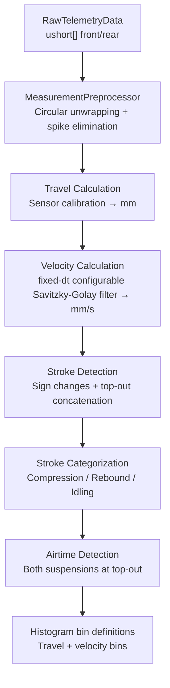

# Signal Processing & Suspension Kinematics

> Part of the [Sufni.App architecture documentation](../ARCHITECTURE.md). This file covers the signal-processing pipeline that turns raw SST samples into analysis-ready telemetry, the linkage kinematics solver, and the sensor calibration strategy.

## Signal Processing Pipeline


```mermaid
graph TD
    Raw["RawTelemetryData<br/>ushort[] front/rear"] --> Pre["MeasurementPreprocessor<br/>Circular unwrapping + spike elimination"]
    Pre --> Travel["Travel Calculation<br/>Sensor calibration → mm"]
    Travel --> Velocity["Velocity Calculation<br/>fixed-dt configurable Savitzky-Golay filter → mm/s"]
    Velocity --> Strokes["Stroke Detection<br/>Sign changes + top-out concatenation"]
    Strokes --> Cat["Stroke Categorization<br/>Compression / Rebound / Idling"]
    Cat --> Air["Airtime Detection<br/>Both suspensions at top-out"]
    Air --> Hist["Histogram bin definitions<br/>Travel + velocity bins"]
```

`TelemetryData.FromRecording(RawTelemetryData, Metadata, BikeData)` (`Sufni.Telemetry/TelemetryData.cs`) orchestrates the entire pipeline. `BikeData` is a record carrying `HeadAngle` (`double`) plus nullable `FrontMaxTravel` / `RearMaxTravel` (`double?`) and nullable calibration functions `FrontMeasurementToTravel` / `RearMeasurementToTravel` (`Func<ushort, double>?`), and `FrontMeasurementWraps` / `RearMeasurementWraps` flags that select the linear vs. circular preprocessing path; the nullables are populated only for the suspensions actually present on the bike.

The pipeline produces histogram **bin definitions**, but does not compute per-stroke digitized indexes, histogram tallies, statistics, FFT frequency histograms, balance, vibration summaries, or velocity-band breakdown. Those values are computed lazily on demand by `Calculate*` methods on the `TelemetryStatistics` static partial class (e.g., `CalculateTravelHistogram`, `CalculateVelocityHistogram`, `CalculateTravelFrequencyHistogram`, `CalculateBalance`, `CalculateVelocityBands`). Coarse travel/velocity indexes needed by active-suspension travel histograms, sample-averaged velocity histograms, and sample damping highlights are derived once by the nonserialized `StrokeCoarseIndexes` owned by each `TelemetryData` result and reused for that result's lifetime. Recorded-session views request the higher-level derived analysis results through the per-open `IRecordedSessionAnalysisResultState`; the state keys include the telemetry generation plus the semantic inputs for each analysis family, runs computation off the UI path through `RecordedSessionAnalysisComputer`, and plot controls render immutable result records so theme and overlay refreshes do not recalculate telemetry statistics. The recorded IMU display projection is a telemetry-generation-only result: the computer calls `ImuDisplaySignalProcessor.ProcessRecorded(TelemetryData)` once to produce both vibration RMS and context-correct frame pitch/roll, and the visible Signals rows share that immutable projection. Front and rear suspension sides are processed independently and in parallel for both dense recordings and SST v5 segment-aware recordings; shared objects passed into those workers are immutable or side-specific. Velocity-band and balance low/high-speed calculations accept presentation-owned damping speed cutoffs, with separate compression and rebound thresholds. Compression values compare against the compression cutoff; rebound values compare against the negative rebound cutoff, and exact threshold values are treated as high speed. Histogram binning has one shared interval contract: interior bins are `[lower, upper)`, exact interior edges belong to the upper bin, the final edge belongs to the last bin, and out-of-range values clamp to the nearest bin. `HistogramBuilder.Digitize(...)` and `DigitizeValue(...)` both use that same rule so lazy per-sample indexes and scalar statistics agree on bin-edge placement.

### Measurement Preprocessing

`MeasurementPreprocessor.Process(ushort[], MeasurementSensorType, sampleRate)` (`Sufni.Telemetry/MeasurementPreprocessor.cs`) is the first stage of the pipeline, called for each present suspension before travel conversion. The selected path is `Linear` or `Rotational`, picked by `MeasurementPreprocessor.SensorTypeForWrapping(bool)` from `BikeData.FrontMeasurementWraps` / `BikeData.RearMeasurementWraps`. Those flags are sourced from each sensor configuration's `MeasurementWraps` property — only the rotational sensor types currently set them. The preprocessor rents temporary integer buffers from `ArrayPool<int>.Shared` and returns them before leaving the stage; spike elimination likewise pools its transient inclusion bitmap.

- **Linear path** (`MeasurementWraps == false`, the default): convert each `ushort` straight to `int`, run `SpikeElimination.EliminateSpikesAsInt`, clamp every result back into `[0, 4095]` (the 12-bit ADC range).
- **Rotational path** (`MeasurementWraps == true`, rotary sensors): unwrap the 12-bit (4096-step) circular ADC into a continuous `int` signal — each step's delta to the previous sample is examined, and a `±4096` offset is accumulated whenever the delta crosses the half-range (`±2048`) so wrap-arounds become continuous deltas. Run `SpikeElimination.EliminateSpikesAsInt` on the unwrapped integer signal, then re-wrap each result modulo 4096 back to `ushort`.

`SpikeElimination.EliminateSpikesAsInt` (`Sufni.Telemetry/SpikeElimination.cs`) walks the signal three times: it first detects sudden changes using fixed 5 ms search/lookahead windows, a fixed 100 ms early-jump gate, a per-step threshold derived from `MinimumAdjacentStepChangeRateCountsPerSecond=30_000`, and an unscaled total-change threshold of `MinimumCandidateTotalChangeCounts=100`; it skips candidates that keep moving in the same direction and flattens the remaining windows to their endpoints; it then corrects an early-recording baseline jump if the first detected change starts inside the 100 ms gate; finally it tracks negative excursions that never recover and shifts the trailing tail back to the pre-excursion baseline. The number of detected sudden changes is returned alongside the cleaned samples and surfaced as the per-suspension `AnomalyRate` (anomalies per second) on the `Suspension` record.

The preprocessor return record `MeasurementPreprocessorResult(Samples, AnomalyCount)` feeds directly into `SuspensionTraceProcessor.Process` inside `TelemetryData.FromRecording(...)`.

### Travel Calculation

Each preprocessed sample is then passed through the sensor's `MeasurementToTravel` function (see [Sensor Calibration](#sensor-calibration)) to produce travel in millimeters. Values are clamped to `[0, MaxTravel]`.

### Velocity Calculation

A Savitzky-Golay filter (`Sufni.Telemetry/Filters.cs`) computes the smoothed first derivative of the travel signal unless the session's processing preferences disable it. The recorded-processing preference is stored as `VelocityFilterWindowMilliseconds` in `TelemetryProcessingOptions`: default 25 ms, valid range 0-1000 ms, with 0 meaning "no velocity filter" and falling back to unfiltered slope velocity. For nonzero windows the target sample count is derived from `sampleRate * windowSeconds`, rounded to an odd value, clamped to the recording length, then raised to the hard minimum of 5 when needed; recordings with fewer than 5 samples skip processing and both suspensions are flagged not-present. The polynomial order is 3 and the derivative order is 1. `SavitzkyGolay.Create(...)` validates those parameters, then returns a shared immutable filter instance from `Sufni.Telemetry.Caching.SingleFlightLruCache`, keyed by `(windowSize, derivative, polynomial)`, so repeated processing runs do not rebuild the same coefficient rows. The cache retains at most 64 entries and 16 MiB of coefficient doubles (`windowSize * windowSize * 8` bytes); a table larger than that budget is shared with concurrent callers but not retained. The implementation uses Gram polynomial basis functions with recursive computation, and handles signal boundaries by precomputing one weight row per evaluation offset within the fixed-size window: edge samples reuse the same first/last `windowSize` data points but apply weights centred at the appropriate off-centre row instead of shrinking the window. Positive velocity = compression (fork/shock compressing), negative = rebound (extending). The per-offset weight row is applied to the window with `TensorPrimitives.Dot` (SIMD). Recorded processing calls the fixed-sample-rate overload (`Process(data, dt)`) instead of allocating a uniform `time[]` array; the result is equivalent to the explicit-time overload for uniform samples within the tolerated low-bit range.

### Stroke Detection

`Strokes.FilterStrokes()` (`Sufni.Telemetry/Strokes.cs`) identifies strokes by finding sign changes in velocity. Adjacent strokes where both have max position < 5mm (near full extension) are concatenated — this prevents small oscillations at top-out from fragmenting the data into many tiny strokes. Strokes too short AND too brief to qualify as any category are silently discarded.

Each stroke records its start/end sample indices, length (travel delta in mm), duration, and aggregated statistics (`StrokeStat`: sum/max travel, sum/max velocity, bottomout count, sample count). New processing does not populate the legacy `DigitizedTravel`, `DigitizedVelocity`, or `FineDigitizedVelocity` arrays. When a coarse-index consumer first runs, `StrokeCoarseIndexes` accepts the legacy travel/velocity arrays only as one complete, in-range pair matching the stroke's source range; otherwise it derives both arrays from the processed samples. Segment-aware derivation uses the stroke's original segment-local coarse velocity-bin domain so gapped recordings retain their established histogram semantics. Fine digitized velocity is not read by production analysis.

### Stroke Categorization

- **Compression**: length >= 5mm
- **Rebound**: length <= -5mm
- **Idling**: |length| < 5mm AND duration >= 0.1s

Only compressions and rebounds are MessagePack-serialized — `Strokes.Idlings` is `[IgnoreMember]`. Idlings are populated only during the same pipeline run that computes airtimes; after deserialization the `Idlings` array is not reconstructed, but the resolved `Airtimes[]` it produced is itself serialized.

### Airtime Detection

An idling stroke is marked as an air candidate during stroke categorization when: max travel <= 5mm, duration >= 0.2s, and the next stroke's max velocity >= 500 mm/s (landing impact). The first and last strokes in the recording cannot be tagged as air candidates because the categorization rule requires both a previous and a next stroke. When both suspensions are present, airtimes are confirmed by pairing front and rear candidates whose sample ranges overlap by >= 50%; any remaining unpaired candidate from either side is still confirmed if the average of the two suspensions' mean travel during that idling is <= 4% of the averaged max travel. When only one suspension is present, every air candidate from that suspension becomes an airtime.

### Processing Parameters

All constants in `Sufni.Telemetry/Parameters.cs`:

| Constant                          | Value    | Description                                                   |
| --------------------------------- | -------- | ------------------------------------------------------------- |
| `StrokeLengthThreshold`           | 5 mm     | Min travel to classify as compression/rebound                 |
| `IdlingDurationThreshold`         | 0.10 s   | Min duration for an idling stroke                             |
| `AirtimeDurationThreshold`        | 0.20 s   | Min duration for airtime candidate                            |
| `AirtimeVelocityThreshold`        | 500 mm/s | Min landing impact velocity                                   |
| `AirtimeOverlapThreshold`         | 0.50     | Front/rear overlap ratio for airtime                          |
| `AirtimeTravelMeanThresholdRatio` | 0.04     | Max mean travel as ratio of max for single-suspension airtime |
| `BottomoutThreshold`              | 3 mm     | Distance from max travel to count as bottomout                |
| `TravelHistBins`                  | 20       | Number of travel histogram bins                               |
| `VelocityHistStep`                | 100 mm/s | Coarse velocity histogram bin width                           |
| `VelocityHistStepFine`            | 15 mm/s  | Fine velocity histogram bin width                             |
| `DeepTravelThresholdRatio`        | 0.75     | Travel ratio above which deep-travel stroke counts start      |

### Serialized Structure

`TelemetryData` uses MessagePack with `[MessagePackObject]` attributes:

```
TelemetryData
├── Metadata (SourceName, Version, SampleRate, Timestamp, Duration)
├── Front: Suspension
│   ├── Present, MaxTravel, AnomalyRate
│   ├── Travel[], Velocity[]
│   ├── TravelBins[], VelocityBins[], FineVelocityBins[]
│   ├── Strokes (Compressions[], Rebounds[])
│   └── Segments[] (FirstDenseIndex, FirstSourceIndex, StartSeconds, SampleCount), HasGaps
├── Rear: Suspension (same structure)
├── Airtimes[] (Start, End in seconds)
├── ImuData: RawImuData? (v4/v5/live capture)
├── GpsData: GpsRecord[]? (v4/v5/live capture)
├── Markers: MarkerData[] (v4/v5/live capture)
├── TemperatureAverages: TemperatureAverage[] (V4/V5/live samples, averaged by location)
├── StreamGaps[] (stream/location/index/count/time/reason gap metadata)
├── FinalStatus: SstFinalStatus? (V5 stream/session stop status)
└── MissingFinalStatus: bool
```

Suspension `Travel[]` and `Velocity[]` are always the flat dense processed arrays for that side. `ProcessedSuspensionSegment` stores a range over those arrays (`FirstDenseIndex`, `SampleCount`) plus the source timeline anchor (`FirstSourceIndex`, `StartSeconds`); per-segment travel/velocity arrays are no longer serialized. `SuspensionTimeSeriesSampler` samples segment-aware data by combining the segment range with the flat arrays. `TelemetryData.FromBinary(...)` normalizes old blobs whose segments predate `SampleCount`, inferring counts from the next segment's `FirstDenseIndex` or the flat array length so legacy dense and gapped data still samples correctly.

Each newly written `Stroke` map contains only `Start`, `End`, `Stat`, `StartSeconds`, and `EndSeconds`. `StrokeFormatter` permanently reads the three legacy digitization fields, but omits them when writing both new results and rewritten legacy results. Source-less legacy processed BLOBs therefore remain readable while future rewrites stop carrying the duplicate arrays.

`RawImuData` is written as compact encoding version 1: a six-field indexed array containing the version, sample rate, indexed metadata entries, binary active-location IDs, indexed per-location segments with six-value sample arrays, and `HasGaps`. New processed data serializes one segment/sample graph and never serializes the dense compatibility `Records` list. `RawImuDataFormatter` permanently reads both this compact shape and the legacy named-map dense-only, segment-only, and dense-plus-segment shapes; dense-only values are adapted through `SampleSegments` when rewritten.

The serialized form is accessed via `TelemetryData.BinaryForm` and stored as a derived BLOB in the `session.data` column. The original recording source is persisted separately so the BLOB can be regenerated when processing inputs change.

### Recorded Session Derivation

Recorded sessions have two durable data layers:

- **Recording source** — `RecordedSessionSource` in `session_recording_source`, keyed by `session_id`. Imported SST sessions store compressed original SST bytes (`SourceKind = ImportedSst`). Saved live captures keep source schema version 1 and store a JSON payload (`SourceKind = LiveCapture`) containing capture metadata, raw front/rear segments, segment-only IMU data, GPS data, temperature samples, and markers. Old schema-v1 payloads with flat travel or dense IMU records remain readable; missing or explicitly null temperature arrays are normalized to empty before processing. The live-capture source deliberately excludes `BikeData`; calibration is resolved again from the current setup and bike when the source is processed.
- **Processed telemetry** — MessagePack `TelemetryData` in `session.data`, derived from the recording source plus the current setup/bike calibration and the current `TelemetryProcessingVersion`.
- **Derivation window** — optional extension-owned state saying that a
  session derives from `[StartSeconds, EndSeconds)` of `SourceSessionId`'s
  recording source. Public builds use a no-op provider; an extended build can
  supply the single durable provider. The window is source-absolute, not nested:
  splits of splits still point back to the original source timeline.

`RecordedSessionSourceFactory` is the only app-layer factory for persisted recording sources: imports call `CreateImportedSst(...)`, while live saves call `CreateLiveCapture(...)`. `RecordedSessionReprocessor` is the single recorded-session derivation path for import, recompute, and live-save persistence. For imported SST sources it decompresses the stored source bytes, parses them with `RawTelemetryData.FromByteArray`, applies the derivation window with `RawTelemetryData.Slice(...)` when one is present, rebuilds `Metadata` from the effective raw file, and calls `TelemetryData.FromRecording(...)`. For live-capture sources it deserializes the saved live payload bytes through the generated `AppJsonContext`, rebuilds `LiveTelemetryCapture`, applies the window with `LiveTelemetryCapture.Slice(...)` when present, and calls `TelemetryData.FromLiveCapture(...)`. In both cases it also produces a generated full `Track` when GPS data is present.

Before calling telemetry processing, the reprocessor asks `ITelemetryBikeProcessingContextFactory` for the shared bike-processing context keyed by structural `ProcessingDependencyInputs` copied from the setup and bike processing inputs. The same normalized input model is serialized by `ProcessingDependencyHash` for the fingerprint's deterministic dependency-hash string. The context carries the `BikeData` delegates used by `TelemetryData.FromRecording(...)` and `FromLiveCapture(...)`, the front sensor configuration, and the rear calibration build result. The reprocessor returns `RecordedSessionReprocessResult` with a `ProcessedTelemetryPayload` containing the decoded `TelemetryData`, its serialized `BinaryForm`, and the serialized processing fingerprint. `SessionTelemetryWriter` consumes that payload for full writes and recompute writes: it computes duration and summary metrics from `payload.TelemetryData`, assigns `session.data` and `session.processing_fingerprint_json` from the payload, and does not decode `payload.Data` again. Patch/swap BLOB paths still decode incoming bytes for validation/metrics. Track patch writes use the persisted nullable `duration_seconds` column when present; for legacy rows where that summary column is null but a processed BLOB exists, they read only the duration from the BLOB before recomputing session-window track metrics.

`ProcessingFingerprintService` records the inputs used for the derived BLOB: fingerprint schema version, `TelemetryProcessingVersion.Current`, setup id, bike id, `GpsTrackPointProjection.ProjectionVersion`, a deterministic dependency hash, the recorded-source hash, the session's clamped velocity-filter option (`TelemetryProcessingOptions.ClampedVelocityFilterWindowMilliseconds`), and the optional normalized derivation window. The window field is null-omitted so legacy schema-v3 fingerprints without a window remain byte-stable. Because the option and normalized window are part of the fingerprint, changing only the velocity-filter window or source window makes the stored BLOB stale and recomputable. The dependency hash includes the setup's front/rear sensor configuration, the bike geometry needed for processing, rear suspension kind, linkage joints/links/shock definition, and leverage-ratio points. Fields that do not affect processing, such as display names, notes, bike images, and damping speed cutoffs, are not part of the hash. Track-projection-version changes make GPS-derived generated tracks stale/recomputable even if the suspension processing inputs are unchanged.

`IProcessingDependencyHashIndex` keeps that setup/bike dependency hash reactive. It subscribes to setup and bike store changes, stores the current hash per setup id, and emits only when a setup's processing-relevant hash changes. `RecordedSessionProjection` uses that index to avoid recomputing every session for display-only bike/setup edits, while `RecordedSessionDomainQuery` uses the same cached hash for command-side staleness checks.

Transaction-time commit checks do not trust the in-memory projection alone.
`ISessionRepository.GetProcessingInputBundleAsync(sessionId)` projects the
database-resident processing inputs — session id/setup id, setup sensor JSON,
bike geometry/rear suspension, recorded-source metadata for the effective source session, and the normalized derivation window when present — without loading the processed BLOB or source payload. `ProcessingFingerprintService.CreateCurrentDatabaseInputs(SessionProcessingInputBundle, RecordedSessionDerivationWindow?)` builds the DB-input half of the fingerprint from that bundle inside `UpdateProcessedDerivedDataAsync`; if it no longer matches the reprocess result's expected fingerprint, the write rolls back and the recompute engine loops with freshly read inputs.

When the stored fingerprint is missing, uses an older processing version, references different processing inputs, has a different normalized derivation window (`SourceWindowChanged`), or the processed BLOB is absent while the raw source exists, the recorded session is recomputable. Missing setup/bike dependencies make it stale but not recomputable. A missing raw source is displayed separately as "No Raw"; the app can still load existing processed data, but it cannot regenerate it until the source is restored. If the source is missing and the persisted processed state is known to be stale, `SessionStaleness.MissingRawSource(ProcessedStateStale: true)` keeps the stale flag while still reporting the session as not recomputable. The source-less stale check compares the same database inputs as the source-backed path — **including the clamped velocity-filter option and normalized derivation window** — so changing either marks a source-less session stale too; it simply cannot be acted on until the source returns.

Because adding the velocity-filter option to the fingerprint marks every pre-existing fingerprint legacy (stale and recomputable), a one-time, per-device startup pass — `ProcessingOptionsResetMigration` — normalizes the existing library. It resets every source-backed session's stored option to the 25 ms default (written local-only, without advancing the synced preferences clock so it cannot win whole-document sync and clobber peers' unrelated preferences) and recomputes the BLOB at 25 ms through `ISessionRecomputeEngine`, so the stored fingerprint records the option it was produced with. Because the target is a constant, every device converges on 25 ms independently of preference-sync ordering; a deliberate non-default per-session window is reset, by design. The pass runs off the UI thread after database initialization, iterates sessions sequentially, and records itself in the `core_migration` table (shared with the schema migrator through `CoreMigrationStore`) so it runs once. It is resumable: an interrupted run — or a non-empty library with no source-backed sessions yet observed — leaves the marker unwritten and retries on the next launch. Source-less ("No Raw") sessions cannot be recomputed and are left untouched. An earlier legacy-fingerprint backfill in `DatabaseMigrationRunner` was gated on processing version 2, became dead code at version 3, and has been removed in favour of this pass.

Derivation is **deterministic for a fixed processing binary**: `TelemetryData.FromRecording` / `FromLiveCapture` are pure functions of `(recorded-source bytes, derivation window, setup configuration, bike geometry, GpsTrackPointProjection.ProjectionVersion, TelemetryProcessingVersion, TelemetryProcessingOptions)`, and recompute persistence is serialized per session through `SessionRecomputeEngine`, the single derived-data writer (see [recompute flow](ui-state.md#recorded-session-projection)). Reproducibility is **scoped to that binary/runtime**, not guaranteed bit-for-bit across CPU architectures — low-bit floating-point differences in the FFT and Savitzky-Golay output are tolerated by design. This is why cross-device coherence is defined on the **fingerprint, never on the BLOB bytes**: two devices that recompute the same source with the same inputs on the same build produce the same fingerprint and are treated as in sync even if their serialized bytes differ in the last bits (see [Cross-Device Sync](sync.md#processed-blob-coherence-download-then-swap)). The fingerprint is the identity of the derived data; the bytes are not.

`TelemetryProcessingVersion.Current` is `6`. Version 6 coordinates the processed-format transition to compact segment-only IMU writes and stroke maps without the three legacy digitization arrays; the permanent readers still accept the older dense/segment IMU maps and digitized stroke fields. It also includes version 5's fixed-dt Savitzky-Golay path, parallel front/rear side processing, pooled preprocessing scratch, and flattened segment serialization. The version bump marks every prior-version source-backed BLOB recomputable so each device regenerates once on the current binary; source-less legacy BLOBs remain readable. It is a recompute-eligibility change only — there is no database schema migration.

### Processed Telemetry Read Cache

`ISessionProcessedTelemetryReader` is the decoded-telemetry read path for session detail loads and recorded-session extensions. Its latest-content operation asks `ISessionRepository.GetSessionPsstPayloadMetadataAsync(...)` for the lightweight processed-payload metadata before loading the raw processed BLOB, while its exact operation accepts a caller-supplied `ProcessedTelemetryRevision` and never advances to a newer revision. While a `SessionDetailViewModel` is loaded it retains its session id; retained sessions reuse one decoded `TelemetryData` instance for the same `(sessionId, ProcessedTelemetryRevision)` key, and a key change replaces the retained lazy decode. Unretained reads decode one-off. The view model releases the retention after recorded-session extension scopes are disposed on unload. Because the same `TelemetryData` instance can be shared by plots, mobile detail building, and extension readers, consumers must treat decoded telemetry as read-only.

---

## Suspension Kinematics

The `Sufni.Kinematics` library models bike suspension linkages to compute how wheel travel relates to shock compression.

### Linkage Model

A linkage is stored as an immutable `LinkageSpec` (`Sufni.Kinematics/LinkageSpec.cs`) made of ordered `JointSpec` values, ordered `LinkSpec` constraints, a shock `LinkSpec`, and the linkage's shock stroke. Joint specs have a nullable type that determines behavior during solving:

| JointType       | Behavior                     |
| --------------- | ---------------------------- |
| `Fixed`         | Immovable frame attachment   |
| `BottomBracket` | Immovable (treated as fixed) |
| `HeadTube`      | Fork crown pivot             |
| `Floating`      | Free to move during solving  |
| `RearWheel`     | Rear axle position           |
| `FrontWheel`    | Front axle position          |

Each `LinkSpec` connects two joints by name. `LinkageResolver.Resolve(LinkageSpec)` validates referenced joint names, duplicate joints/links, the shock endpoints, and degenerate link lengths, then produces a fresh mutable `ResolvedLinkage` runtime graph for the solver. `ResolvedLink` stores the Euclidean length constraint. The shock link is special — its length is varied during solving to simulate compression.

Linkages are stored inside the `bike.rear_suspension` union JSON. The persisted JSON is pure spec data; deserialization has no side effects and does not resolve object references until the solver or validation explicitly asks the resolver to do so.

### Kinematic Solver

`KinematicSolver` (`Sufni.Kinematics/KinematicSolver.cs`) uses iterative constraint satisfaction (Gauss-Seidel relaxation) to find valid joint positions through the full range of shock compression.

Constructor: `KinematicSolver(LinkageSpec, steps=200, iterations=1000)` — resolves the spec into fresh mutable runtime state for that solver instance. The immutable spec is never mutated.

For each of the 200 steps (0% to 100% shock compression):

1. Set the shock's target length: `maxLength - (shockStroke * step / (steps-1))`
2. Run 1000 iterations of `EnforceLength()` on every link

`EnforceLength()` corrects each link toward its target along the link axis. When both endpoints are free (`movableEndpointCount == 2`), each moves by half the error so the link length matches in a single pass. When only one endpoint is free, that endpoint receives the *full* correction (`correctionScale = 1.0`). Multiple iterations are still required for the system to converge because every move perturbs the neighboring links sharing those joints.

Output: `KinematicSolution`, a deeply immutable set of `JointPath` values mapping each joint name to its X,Y positions across all steps. `ToCoordinateDictionary()` returns fresh mutable `CoordinateList` copies on every call and is currently used by tests/diagnostics rather than production plotting.

The app layer wraps solver construction in `IKinematicSolutionCache` (`Sufni.App/Sufni.App/Bikes/Services/KinematicSolutionCache.cs`), a capacity-64 single-flight LRU keyed by `(LinkageSpec, steps, iterations)`. Editor analysis, save validation, rear calibration, and telemetry bike-processing context creation all request immutable solutions through this cache instead of constructing independent solvers for the same linkage.

### Bike Characteristics

`BikeCharacteristics` (`Sufni.Kinematics/BikeCharacteristics.cs`) derives datasets from the `KinematicSolution` returned by `KinematicSolver`:

- **`LeverageRatioData`** = recomputed on each access from the current immutable `KinematicSolution`. For each step `i`, the ratio is `(wheelTravel[i] - wheelTravel[i-1]) / (shockStroke[i] - shockStroke[i-1])`, where wheel travel is the per-step Euclidean distance from the rear wheel's initial position and shock stroke is the per-step reduction of the shock-eye-to-shock-eye distance from its initial value. **X-coordinate convention:** each ratio is a finite difference over a segment, so its X value is the segment's wheel-travel *midpoint* (`LeverageRatioDerivation`). The plotted curve therefore deliberately starts and ends half a segment inside the 0…max-travel span; the same convention applies to user-supplied leverage-ratio curves. Pinned by `LeverageRatioData_PinsMidpointXConvention_AtCurveEndpoints` in `Sufni.Kinematics.Tests`.
- **`AngleToTravelDataset(centralJoint, adjacentJoint1, adjacentJoint2)`** — angle at a specified joint vs. rear wheel travel across the full range, used for visualizing pivot behavior.
- **`AngleToShockStrokeDataset(...)`** — the same angle paired with shock stroke instead of wheel travel.
- **`ShockStrokeToWheelTravelDataset()`** — used by `RearTravelCalibrationBuilder` to derive rear max travel from a linkage solve.

Front and rear max travel for the processing pipeline do **not** live on `BikeCharacteristics`. Front max travel is computed inside the front sensor configuration itself (e.g., `LinearForkSensorConfiguration.MaxTravel = bike.ForkStroke * sin(headAngle)` — see [Sensor Calibration](#sensor-calibration)). Rear max travel is produced by `RearTravelCalibrationBuilder` from either the linkage solve (`ShockStrokeToWheelTravelDataset.Y[^1]`) or the leverage-ratio curve (`LeverageRatioSpec.WheelTravelAt(maxShockStroke)`).

### Utilities

- **`CoordinateRotation`** — 2D point rotation about an arbitrary centre, plus rotated-rectangle bounding-box computation, used by the bike image canvas and the linkage editor
- **`GroundCalculator`** — computes rotation angle to level ground contact points given wheel positions and radii
- **`EtrtoRimSize`** — ETRTO standard rim sizes (507/559/584/622mm) with tire diameter calculation
- **`GeometryUtils`** — distance and angle calculations using dot product, with float clamping to avoid NaN from precision errors

---

## Sensor Calibration

Four sensor types convert raw ADC counts to millimeters of travel through the `ISensorConfiguration` strategy pattern.

`ISensorConfiguration` (`Sufni.App/Sufni.App/Setups/Models/SensorConfigurations/SensorConfiguration.cs`) defines the front-suspension calibration surface used directly by the telemetry pipeline:

- `Type` — `SensorType` enum discriminator (`LinearFork`, `RotationalFork`, `LinearShock`, `LinearShockStroke`, `RotationalShock`)
- `MeasurementToTravel` — `Func<ushort, double>` calibration closure
- `MaxTravel` — physical suspension limit in mm

Polymorphic JSON deserialization is single-pass. `SensorConfiguration.FromJson(json)` delegates to the app JSON context, whose converter peeks at the `Type` discriminator and materializes the concrete data record. The bike-aware overload `SensorConfiguration.FromJson(json, BikeSnapshot)` reuses that data-only parse and binds only front sensor configurations to the supplied bike so their calibration closures can include fork geometry. Rear shock payloads (`LinearShockSensorConfiguration`, `RotationalShockSensorConfiguration`) stay data-only at deserialization time; their closure is built later by [`RearTravelCalibrationBuilder`](#rear-travel-calibration), which keeps the linkage and leverage-ratio rules out of the sensor-configuration types.

For example, `LinearForkSensorConfiguration` stores `Length` (sensor physical range) and `Resolution` (ADC bit depth). Its calibration:

```csharp
// Computed once during FromJson():
measurementToStroke = Length / (Math.Pow(2, Resolution) - 1); // ADC count → mm of fork stroke
strokeToTravel = Math.Sin(headAngle * Math.PI / 180.0);    // fork stroke → vertical wheel travel

// Applied per sample:
MeasurementToTravel = measurement => measurement * measurementToStroke * strokeToTravel;
MaxTravel = bike.ForkStroke * strokeToTravel;
```

The denominator is the ADC's full-scale count for an `n`-bit sensor: `2^Resolution - 1`.

For front sensors, bike context (head angle and fork stroke) is bound immediately after the data record is deserialized, making the closure self-contained for the processing pipeline.

| Implementation                       | Parameters                                   | Calibration                                                            |
| ------------------------------------ | -------------------------------------------- | ---------------------------------------------------------------------- |
| `LinearForkSensorConfiguration`      | Length, Resolution                           | Linear potentiometer on fork, projected by head angle                  |
| `RotationalForkSensorConfiguration`  | MaxLength, ArmLength                         | Rotary encoder on fork, cosine-based rigid-arm geometric projection    |
| `LinearShockSensorConfiguration`     | Length, Resolution                           | Rear shock payload (`SensorType.LinearShock` for linkage bikes, `SensorType.LinearShockStroke` for leverage-ratio bikes) consumed by `RearTravelCalibrationBuilder`; maps shock stroke to wheel travel via linkage interpolation or `LeverageRatioSpec.WheelTravelAt(...)` |
| `RotationalShockSensorConfiguration` | CentralJoint, AdjacentJoint1, AdjacentJoint2 | Rear shock payload consumed by `RearTravelCalibrationBuilder`; resolves angle-to-shock-stroke from linkage motion, then converts to wheel travel |

### Rear Travel Calibration

`IRearTravelCalibrationBuilder` / `RearTravelCalibrationBuilder` (`Sufni.App/Sufni.App/Bikes/Services/RearTravelCalibrationBuilder.cs`) extends the `ISensorConfiguration` strategy pattern for the rear shock, where shock-stroke ADC counts have to be converted to wheel travel through either a linkage solve or a leverage-ratio curve. Its entry point, `TryBuild(SetupSnapshot, BikeSnapshot)`, returns `RearTravelCalibrationBuildResult(Succeeded, Calibration, ErrorMessage)`. `TelemetryBikeProcessingContextFactory` feeds the successful `RearTravelCalibration(MaxTravel, MeasurementToTravel, MeasurementWraps)` into `TelemetryBikeData.Create(...)` to build the `BikeData` used by `TelemetryData.FromRecording(...)` and live-capture processing. Calibration is invoked at processing-context construction time — never at sensor-configuration deserialization time, so the rear `LinearShockSensorConfiguration` / `RotationalShockSensorConfiguration` instances persisted on a `Setup` carry only their JSON parameters.

The build flow:

1. Pattern-match `BikeSnapshot.RearSuspension` into the five app cases: hardtail returns success with no calibration; linkage and leverage-ratio drafts fail with "Rear suspension is incomplete."; complete linkage and leverage-ratio specs continue; unknown values fail with "Unknown rear suspension."
2. Deserialize `SetupSnapshot.RearSensorConfigurationJson` as a data-only `SensorConfiguration` payload and pattern-match it against the suspension spec:
   - `LinearShockSensorConfiguration` with `SensorType.LinearShock` + `RearSuspensionSpec.Linkage`, or `SensorType.LinearShockStroke` + `RearSuspensionSpec.LeverageRatio` — compatible.
   - `RotationalShockSensorConfiguration` + `Linkage` — compatible.
   - Any other combination — incompatible, returns a setup-level error.
3. Compute the per-sample shock stroke from the payload (linear: `Length / (2^Resolution - 1)`; rotational: `2π / 4096` rad per ADC count, then a cubic polynomial fit of the linkage's angle-to-shock-stroke dataset).
4. Convert shock stroke to wheel travel through the suspension spec: linkage suspensions resolve `LinkageSpec` through `IKinematicSolutionCache.GetOrSolve(...)` and interpolate `BikeCharacteristics.ShockStrokeToWheelTravelDataset()`, while leverage-ratio suspensions call `LeverageRatioSpec.WheelTravelAt(...)`. The rotational-shock linkage path builds one `BikeCharacteristics` over the cached solution and reuses it for both angle-to-shock-stroke and shock-stroke-to-wheel-travel datasets.
5. For leverage-ratio bikes, `LeverageRatioShockStrokeRules.TryValidate` checks that the bike's configured shock stroke matches the curve's `MaxShockStroke` within tolerance before the calibration is accepted; the resulting `MaxTravel` is the wheel travel at that validated stroke, not a separately configured number.

The `MeasurementWraps` flag on the produced `RearTravelCalibration` is `true` for the rotational-shock path (the rotary encoder reports modulo-4096 angles) and `false` for the linear-shock paths; `TelemetryBikeData.Create` copies it onto `BikeData.RearMeasurementWraps`, which selects the [Measurement Preprocessing](#measurement-preprocessing) path for the rear samples.

### Leverage-Ratio CSV Import

`LeverageRatioCsvParser` (`Sufni.App/Sufni.App/Bikes/Services/LeverageRatioCsvParser.cs`) parses the leverage-ratio curve a user can attach to a leverage-ratio rear suspension when no full linkage is modelled. The expected CSV format:

| Header / column   | Meaning                                       |
| ----------------- | --------------------------------------------- |
| `shock_travel_mm` | Shock stroke in mm (monotonically increasing) |
| `wheel_travel_mm` | Wheel travel in mm at that shock stroke       |

Other rules: header is required and matched case-insensitively, BOM is stripped, comma or semicolon delimiter (auto-detected from the header line), `.` decimal separator only (decimal commas are rejected), invariant-culture `double` parsing, blank lines skipped. Rows are validated through `LeverageRatioValidation.Validate(...)` after parsing so format and curve-shape errors surface together.

`Parse(Stream)` and `Parse(string)` both return a `LeverageRatioParseResult` discriminated record:

- `Parsed(LeverageRatioSpec Value)` — the points were valid; the wrapped `LeverageRatioSpec` (`Sufni.Kinematics/LeverageRatio/LeverageRatioSpec.cs`) exposes `MaxShockStroke`, `MaxWheelTravel`, and `WheelTravelAt(shockStroke)` for downstream consumers.
- `Invalid(IReadOnlyList<LeverageRatioParseError> Errors)` — one error per offending line; each error carries an optional 1-based line number plus a human-readable message.

The parser is wired into the bike editor flow: `BikeEditorService.ImportLeverageRatioAsync(...)` (`Sufni.App/Sufni.App/Bikes/Services/BikeEditorService.cs`) opens the CSV picker, runs `LeverageRatioCsvParser.Parse` on a background task, and surfaces the result to `LeverageRatioEditorViewModel.ApplyImportResult` as a `LeverageRatioImportResult` (`Imported` / `Invalid` / `Failed` / `Canceled`). The imported curve is what `RearTravelCalibrationBuilder` later reads from `BikeSnapshot.RearSuspension` when building the rear calibration closure.
