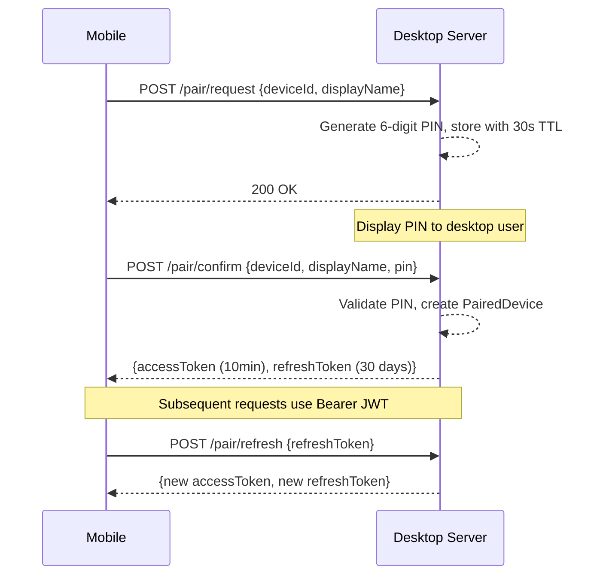

# Cross-Device Synchronization

> Part of the [Sufni.App architecture documentation](../ARCHITECTURE.md). This file covers the desktop sync server, the mobile client, and the pairing flow that connects them. Conflict semantics for the entity payloads live in [Persistence](persistence.md#conflict-resolution).

Desktop acts as a hub server; mobile devices sync with it.

## Pairing Flow



## Server

`SynchronizationServerService` (`Sufni.App/Sufni.App.Desktop/Services/SynchronizationServerService.cs`) embeds ASP.NET Core Kestrel on port 5575 with:

- **TLS**: Self-signed ECDSA P-256 certificate (password stored in `SecureStorage`), served with TLS 1.2 and TLS 1.3 enabled
- **JWT**: HS256 with a 64-byte random secret (stored in `SecureStorage`)
- **Discovery**: mDNS advertisement as `_sstsync._tcp`

| Endpoint                       | Method | Auth | Purpose                                                     |
| ------------------------------ | ------ | ---- | ----------------------------------------------------------- |
| `/pair/request`                | POST   | No   | Start pairing, generates 6-digit PIN with 30s TTL           |
| `/pair/confirm`                | POST   | No   | Confirm PIN, returns access + refresh tokens                |
| `/pair/refresh`                | POST   | No   | Rotate both access and refresh tokens                       |
| `/pair/unpair`                 | POST   | No   | Revoke pairing (validates `deviceId` + refresh token in body) |
| `/sync/push`                   | PUT    | JWT  | Receive `SynchronizationData` from mobile                   |
| `/sync/pull`                   | GET    | JWT  | Return changes since `?since=` timestamp                    |
| `/session/incomplete`          | GET    | JWT  | List session IDs missing processed telemetry blobs          |
| `/session/data/{id}`           | GET    | JWT  | Download MessagePack processed telemetry blob               |
| `/session/data/{id}`           | PATCH  | JWT  | Upload MessagePack processed telemetry blob                 |
| `/session/source/incomplete`   | GET    | JWT  | List session IDs missing recorded-source rows               |
| `/session/source/data/{id}`    | GET    | JWT  | Download a `RecordedSessionSourceTransfer` JSON payload      |
| `/session/source/data/{id}`    | PATCH  | JWT  | Upload a `RecordedSessionSourceTransfer` JSON payload        |

`PATCH /session/data/{id}` raises `SessionDataArrived`; `PATCH /session/source/data/{id}` raises `SessionSourceDataArrived`. `SessionCoordinator` listens to both events and updates `SessionStore` or `RecordedSessionSourceStore` on the UI thread after the database write succeeds.

## Client

`SynchronizationClientService` (`Sufni.App/Sufni.App/Services/SynchronizationClientService.cs`) runs `SyncAll()` in six phases:

1. **Push local changes** — collect all entities changed since last sync, PUT to `/sync/push`
2. **Pull remote changes** — GET `/sync/pull?since=`, apply deletes or upserts locally
3. **Push incomplete sessions** — for each server-side session missing processed data, upload the local MessagePack blob
4. **Pull incomplete sessions** — for each local session missing processed data, download the MessagePack blob from the server
5. **Push incomplete recorded sources** — for each server-side session missing a recorded-source row, upload the local `RecordedSessionSourceTransfer`
6. **Pull incomplete recorded sources** — for each local session missing a recorded-source row, download the server's `RecordedSessionSourceTransfer`

Source sync runs after metadata sync so both sides know which session ids exist before asking for missing source payloads. Existing source rows are treated as immutable for transfer purposes; the incomplete-source endpoints only ask for ids without a local source row.

`SyncCoordinator` (`Sufni.App/Sufni.App/Coordinators/SyncCoordinator.cs`) is the application-layer entry point: it owns `IsRunning` / `IsPaired` / `CanSync`, drives `SyncAllAsync()`, and refreshes every store after a successful round-trip, including `RecordedSessionSourceStore` immediately after `SessionStore`. On mobile it subscribes to `IPairingClientCoordinator.PairingConfirmed` so a fresh pair triggers an immediate sync. Inbound sync arrival is split by entity family — see [Coordinators](ui.md#coordinators) — so that each store has exactly one writer.

`HttpApiService` (`Sufni.App/Sufni.App/Services/HttpApiService.cs`) handles JWT auto-refresh: when the access token is within 30 seconds of expiry, it calls `/pair/refresh` (which rotates both the access and refresh tokens). If `/pair/refresh` itself returns 401, the stored pairing credentials are cleared. The client enables TLS 1.2 and TLS 1.3 to match the desktop server.

TLS validation is performed by `SynchronizationCertificateValidator.TryValidate(...)` and is stricter than a generic CN check: it rejects expired certificates, requires an exact subject match against the constant `SynchronizationProtocol.CertificateSubjectName` (`cn=com.sghctoma.sst-api`), and pins the **certificate thumbprint** captured at pairing time against `SecureStorage`. The certificate chain itself is not validated — that's what makes LAN self-signed certs viable, but the thumbprint pin replaces the missing chain trust with TOFU.

`SynchronizationData` (`Sufni.App/Sufni.App/Models/Synchronizable.cs`) is the sync payload:

```
SynchronizationData
├── Boards[]
├── Bikes[]
├── Setups[]
├── Sessions[] (metadata, tuning fields, full-track link, processing fingerprint; no blob)
└── Tracks[]
```

Processed telemetry blobs (`session.data`) and raw recorded sources (`session_recording_source.payload`) are transferred through the dedicated session-data and session-source endpoints, not through `SynchronizationData`.
