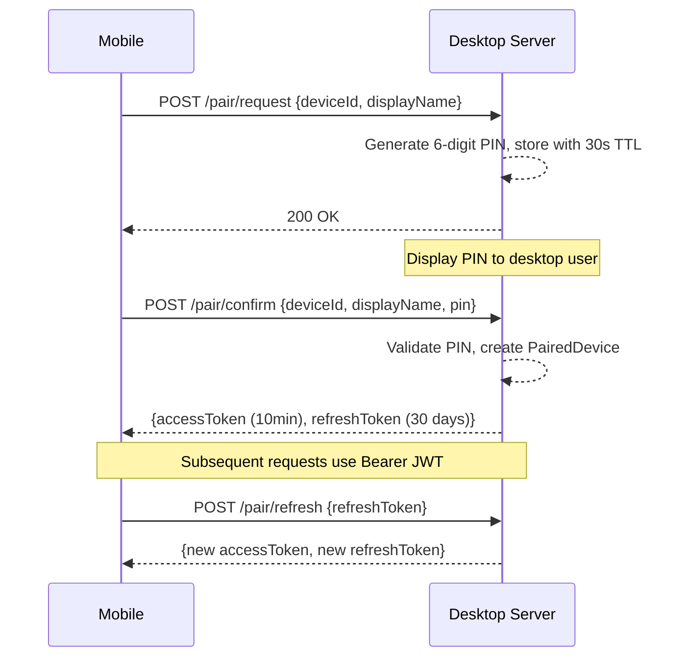

# Cross-Device Synchronization

> Part of the [Sufni.App architecture documentation](../ARCHITECTURE.md). This file covers the desktop sync server, the mobile client, and the pairing flow that connects them. Conflict semantics for the entity payloads live in [Persistence](persistence.md#conflict-resolution).

Desktop acts as a hub server; mobile devices sync with it.

## Pairing Flow


```mermaid
sequenceDiagram
    participant Mobile
    participant Server as Desktop Server

    Mobile->>Server: POST /pair/request {deviceId, displayName}
    Server-->>Server: Generate 6-digit PIN, store with 30s TTL
    Server-->>Mobile: 200 OK
    Note over Server: Display PIN to desktop user

    Mobile->>Server: POST /pair/confirm {deviceId, displayName, pin}
    Server-->>Server: Validate PIN, create PairedDevice
    Server-->>Mobile: {accessToken (10min), refreshToken (30 days)}

    Note over Mobile,Server: Subsequent requests use Bearer JWT

    Mobile->>Server: POST /pair/refresh {refreshToken}
    Server-->>Mobile: {new accessToken, new refreshToken}
```

## Server

`SynchronizationServerService` (`Sufni.App/Sufni.App.Desktop/SyncAndPairing/Services/SynchronizationServerService.cs`) embeds ASP.NET Core Kestrel on port 5575 with:

- **TLS**: Self-signed ECDSA P-256 certificate (password stored in `SecureStorage`), served with TLS 1.2 and TLS 1.3 enabled
- **JWT**: HS256 with a 64-byte random secret (stored in `SecureStorage`)
- **Discovery**: mDNS advertisement as `_sstsync._tcp`
- **Rate limiting**: the anonymous `/pair/*` surface is throttled per remote IP by a fixed-window limiter — 10 requests per PIN-TTL window (30 s) — bounding PIN guesses per source per PIN lifetime. Excess requests get `429` with a `Retry-After` header and are logged; the partition key fails closed to `"unknown"` when the peer IP is unavailable.
- **Strict inbound JSON**: request bodies bind with a hardened profile (reject duplicate keys, reject unmapped members, case-sensitive names, required non-nullable members and constructor parameters). Well-formed first-party traffic is unaffected because the client emits every snake_case key explicitly; responses and other serialization stay on the lenient profile. See [Persistence § JSON Serialization](persistence.md#json-serialization).

All sync HTTP requests, including pairing, carry `X-Sufni-Sync-Protocol: 3`.
Both the anonymous pairing group and the JWT-protected sync group reject missing
or mismatched protocol headers with `426 Upgrade Required`. Protocol v3 gives
push and pull separate persisted watermarks and bounds each metadata snapshot
with one sampled `upper_bound`. The client installs the header on its shared
`HttpClient`, so new endpoint groups must either stay behind that service or
explicitly add the same version gate. Kestrel caps sync request bodies at 256
MiB.

| Endpoint                       | Method | Auth | Purpose                                                     |
| ------------------------------ | ------ | ---- | ----------------------------------------------------------- |
| `/pair/request`                | POST   | No   | Start pairing, generates 6-digit PIN with 30s TTL           |
| `/pair/confirm`                | POST   | No   | Confirm PIN, returns access + refresh tokens                |
| `/pair/refresh`                | POST   | No   | Rotate both access and refresh tokens                       |
| `/pair/unpair`                 | POST   | No   | Revoke pairing (validates `deviceId` + refresh token in body) |
| `/sync/push`                   | PUT    | JWT  | Receive one bounded `SynchronizationData` snapshot from mobile |
| `/sync/pull`                   | GET    | JWT  | Return changes in `(since, upper_bound]`                    |
| `/session/incomplete`          | GET    | JWT  | List session IDs the hub needs a blob for: missing-blob **fills** and held-blob **push-swaps** |
| `/session/data/{id}`           | GET    | JWT  | Download a processed telemetry blob as `application/octet-stream`; `X-Sufni-Processing-Fingerprint` carries the fingerprint of those bytes |
| `/session/data/{id}`           | PATCH  | JWT  | Upload a processed telemetry blob as `application/octet-stream` with optional `X-Sufni-Processing-Fingerprint`. Commits a **swap** when it matches a recorded push-swap target (a non-match on a push-swap row is ignored, not an error); a **fill** is **400** when it does not match the row's stored fingerprint |
| `/session/source/incomplete`   | GET    | JWT  | List recorded-source ids this peer should upload: ordinary missing source rows plus referenced derivation source ids absent locally |
| `/session/source/data/{id}`    | GET    | JWT  | Download a recorded-source payload as `application/octet-stream`; source kind/name/schema/hash travel in `X-Sufni-Source-*` headers |
| `/session/source/data/{id}`    | PATCH  | JWT  | Upload a recorded-source payload as `application/octet-stream` with source kind/name/schema/hash in `X-Sufni-Source-*` headers |

Authorization is enforced as a route group — `MapGroup("").RequireAuthorization()` wrapping the eight JWT endpoints — not a per-endpoint attribute. The four `/pair/*` endpoints form a separate anonymous, rate-limited group. `/pair/unpair` stays in that anonymous group and authenticates by matching `deviceId` + refresh token in its body, because a device revoking itself may no longer hold a valid access token.

`PATCH /session/data/{id}` raises `SessionDataArrived`; `PATCH /session/source/data/{id}` raises `SessionSourceDataArrived`. `SessionSyncApplier` listens to both events and calls publish-only session/source store writer methods after the database write succeeds. The server service remains UI-agnostic; subscribers that publish stores or bound state own the UI-thread hop through the store writer infrastructure.

## Client

`SynchronizationClientService` (`Sufni.App/Sufni.App/SyncAndPairing/Services/SynchronizationClientService.cs`) runs `SyncAll()` in six phases. Protocol v3 persists `last_push_time` and `last_pull_time` independently, so a successful push cannot skip a failed or partially applied pull, and vice versa. Each direction replays the previous whole-second timestamp bucket (`sinceExclusive = cursor - 1` for a positive cursor) and de-duplicates through normal merge semantics; this closes the gap created when multiple writes share the same second as the prior upper bound.

1. **Push local changes** — sample one `upperInclusive`, collect core entities, app preferences, and outgoing extension envelopes in `(lastPushTime - 1, upperInclusive]`, PUT that bounded snapshot to `/sync/push`, then advance only `last_push_time` after success
2. **Pull remote changes** — GET `/sync/pull?since=` from the pull watermark, receive the server-sampled `upper_bound`, prepare every known extension envelope before committing core rows, merge core rows in one SQLite transaction, apply app preferences, then apply the prepared extension batches. Advance only `last_pull_time`, and only after extension apply and processed-BLOB swap handling leave the pull complete
3. **Push incomplete sessions** — for each session id the server advertises (a missing-blob *fill* or a held-blob *push-swap*), upload the local blob **and its stored fingerprint**; the server commits a fill or a push-swap when the fingerprint matches its target, ignores a non-matching push-swap upload, and rejects (400) a non-matching fill
4. **Pull incomplete sessions** — download blobs for two kinds of target and commit each only when the downloaded fingerprint matches the target (otherwise keep what is local and retry later): **fills** (local rows with no blob, target = the row's own stored fingerprint) and **swaps** (rows whose held blob has a different current-schema fingerprint than the one just pulled, target = the accepted remote fingerprint — see *Processed-BLOB coherence* below)
5. **Push incomplete recorded sources** — for each source id the server advertises, upload the local `RecordedSessionSourcePayload`
6. **Pull incomplete recorded sources** — for each local source id produced by `IRecordedSessionSourceSyncQuery`, download the server's `RecordedSessionSourcePayload`

The metadata snapshot's one `upper_bound` applies to every core table, app
preferences, and extension batch. Core delta queries include updates and
tombstones only in `(sinceExclusive, upperInclusive]`; tracks added because a
changed session references them are also constrained to `updated <=
upperInclusive`, so related-row expansion cannot leak a later generation into
the response.

The four blob/source transfer phases run with bounded client concurrency
(`SyncTransferDop = 3`). Session pulls preserve fill-before-swap phasing:
all missing-blob fills are downloaded and committed before swap downloads
start. Any unresolved transient swap or extension partial-apply result holds
back the pull watermark, so the same bounded metadata delta is replayed and the
swap/preparation work is re-derived on the next run.

Source sync runs after metadata and extension sync so both sides know which
session ids and derivation windows exist before asking for missing source
payloads. Source rows are transferred through the incomplete-source endpoints
when a side has no source row or when its local source hash no longer matches
the `SourceHash` stored in the session's processing fingerprint. For derived
sessions, the query does not ask for a source under the derived session id; it
uses the fingerprint/window source id (`DerivationWindow.SourceSessionId`) and
also asks for any referenced source ids that are absent locally. Push uses the
stored source hash on the local row; it does not rehash the local payload before
upload — the receiving server's patch gate (and the repository's put-time
validation) still verifies it. Pull rehashes each downloaded payload against its
advertised source hash before persisting: a mismatch is an item-level skip that
leaves the source pending for a future run, while a failure from the repository
put itself propagates and fails the run. The pull watermark has already advanced
after metadata and processed-BLOB swaps; source completeness is retried
independently from the missing-source queries rather than by replaying metadata.

Local write flows use semantic store commit methods when the app itself owns
the write intent. Sync apply is different: `SynchronizationMergeEngine`, the
session-data endpoints, and the recorded-source endpoints persist or merge rows
first, then the app reflects those rows through publish-only store writer
methods or a full `IAppStateRefreshOrchestrator.RefreshAllStateAsync()` run.
Publish-only methods never write repositories; they re-read changed ids or
remove deleted ids from the cache so sync/server application does not duplicate
the persistence operation.

### Processed-BLOB coherence (download-then-swap)

`session.data` (the processed telemetry blob) never travels in `SynchronizationData`; only metadata does. Because a recompute can replace an *existing* blob — not just fill a missing one — the protocol keeps one invariant: **the processed generation describes one coherent result**. A generation contains the blob and fingerprint plus `duration_seconds`, `distance_meters`, `ascent_meters`, `descent_meters`, `full_track_id`, `gps_offset_seconds`, and the cached session-window `track`; those values are retained or replaced together.

- **Deferred metadata merge.** When an inbound metadata update arrives for a row that already holds a blob, both merge paths — the client pull (`ApplyRemoteSession`) and the desktop hub's push merge (`MergeSessionMetadata`) — apply independent user metadata but retain the complete held processed generation. The row therefore never advertises a fingerprint, summary, track linkage/alignment, or cached track from bytes it does not yet hold.
- **Transient pull-swap set.** During the client's pull, every deferred row whose held fingerprint differs from the accepted remote fingerprint — when **both are current-schema** and the row has the raw source described by the remote fingerprint (`DerivationWindow.SourceSessionId` when present, otherwise the session id) — is queued as a *swap* containing the id, target fingerprint, and accepted target generation. The set is never persisted; it is re-derived from the metadata delta each run. A network error, extension partial apply, or unresolved swap (`404` or fingerprint mismatch) holds `last_pull_time` back, so the next run re-pulls the same delta and retries. Fills are not swaps — they are re-derived every run from `data IS NULL` regardless of the watermark, so they are never lost.
- **Validate and match before commit.** A sync pull download commits only when its advertised fingerprint ordinal-matches the target. `SessionTelemetryWriter.SwapSessionPsstAsync` deserializes the transferred MessagePack before persistence; invalid bytes leave the current generation untouched. New swaps then pass the accepted `SessionProcessedGeneration` to `UpdateSessionProcessedGenerationAsync`, which replaces the blob, fingerprint, four summary metrics, full-track id, normalized GPS offset, and cached track in one SQLite `UPDATE` with no sync-facing `updated` bump. Legacy fingerprint-only requests keep the previous validated metric-recomputation path. Session detail loading never fetches missing BLOBs; sync localizes them before open.
- **Hub push-swap (push direction).** The desktop hub runs no pull phase, so to *receive* a recomputed blob for a row it already holds it records a durable push-swap request during the same transaction as the deferred metadata merge. `session_blob_swap_request` stores the session id, target fingerprint, and serialized target generation; legacy rows without `target_generation` remain readable. A request is created only when the incoming current-schema fingerprint is eligible against the hub's current database inputs while the held one is not (or when the referenced source has not arrived yet, preserving the accepted target until source sync completes). Invalid/legacy/equal/ineligible targets clear the request. For derived sessions, the input probe resolves the source through the incoming derivation window. `GET /session/incomplete` advertises requests alongside data-null fills; `PATCH /session/data` validates the bytes and commits the coherent generation only for a matching target, then clears the request. A non-matching push-swap upload is ignored (`204`, not `400`) and leaves the request pending.
- **Request cleanup and excluded rows.** Startup removes swap requests whose session is missing or soft-deleted, and database triggers remove them on physical or soft deletion; the incomplete-session query repeats the orphan cleanup before listing requests. Source-less rows keep their only blob (they cannot self-heal by recompute) and never swap it out — they only ever *gain* a blob through a fill. A legacy (pre-current-schema) fingerprint on either side defers to the one-time per-device normalization pass rather than swapping during the mixed-version upgrade window. Because every device recomputes the same source at the same options on the same binary, fingerprints converge and there is normally nothing to swap post-upgrade.

"Incomplete," for the purpose of these phases, therefore means **missing _or_ awaiting a matching processed blob**.

`SyncCoordinator` (`Sufni.App/Sufni.App/SyncAndPairing/Coordinators/SyncCoordinator.cs`) is the application-layer entry point: it owns `IsRunning` / `IsPaired` / `CanSync`, drives `SyncAllAsync()`, publishes the current `SynchronizationProgressSnapshot`, and refreshes all core plus extension state through `IAppStateRefreshOrchestrator` after a successful round-trip. On mobile it derives pairing availability from `IPairingClientCoordinator.PairedState`, which mirrors the replayed state published by `HttpApiService`; this lets sync availability drop immediately when the HTTP service clears local credentials. It also subscribes to `IPairingClientCoordinator.PairingConfirmed` so a fresh pair triggers an immediate sync. Mobile outbound sync is reported as an 8-step determinate run: resolve server, the six `SynchronizationClientService` phases, then refresh local lists. The remote client phases run through `IBackgroundTaskRunner`; progress is marshalled back to the UI thread so large session BLOB downloads, recorded-source transfers, and local patching do not block the mobile shell spinner. Desktop inbound sync activity is reported from `SynchronizationServerService` activity results that cover the full request and response-body lifetime, then normalized by `SyncCoordinator` into the same six service phases as one determinate run. The coordinator bridges longer endpoint gaps during session-data transfer so the desktop shell does not flash or fall back to indeterminate activity while the mobile side is doing local work between requests. Inbound sync arrival is split by entity family — see [Coordinators](ui-workflows.md#coordinators) — so that each store has exactly one writer.

`HttpApiService` (`Sufni.App/Sufni.App/SyncAndPairing/Services/HttpApiService.cs`) handles JWT auto-refresh and owns the replayed `PairedState` stream: startup publishes whether a refresh token exists, confirm publishes paired, and local credential clearing publishes unpaired. When the access token is within 30 seconds of expiry, it calls `/pair/refresh` (which rotates both the access and refresh tokens). If `/pair/refresh` itself returns 401, the stored pairing credentials are cleared and `PairedState` publishes `false`. The client enables TLS 1.2 and TLS 1.3 to match the desktop server.

TLS validation is performed by `SynchronizationCertificateValidator.TryValidate(...)` and is stricter than a generic CN check: it rejects expired certificates, requires an exact subject match against the constant `SynchronizationProtocol.CertificateSubjectName` (`cn=com.sghctoma.sst-api`), and pins the **certificate thumbprint** captured at pairing time against `SecureStorage`. The certificate chain itself is not validated — that's what makes LAN self-signed certs viable, but the thumbprint pin replaces the missing chain trust with TOFU.

`SynchronizationData` (`Sufni.App/Sufni.App/SyncAndPairing/Models/Synchronizable.cs`) is the sync payload:

```
SynchronizationData
├── UpperBound
├── Boards[]
├── Bikes[] (includes `rear_suspension` union JSON)
├── Setups[]
├── Sessions[] (metadata, tuning fields, full-track link, processing fingerprint; no blob)
├── Tracks[]
├── AppPreferences? (map/session preferences as AppPreferencesSyncData)
└── ExtensionBatches[] (opaque extension envelopes)
```

Every bike sync row must carry the `rear_suspension` union. Payloads that omit
it, use the legacy `rear_suspension_kind` / `linkage` / `leverage_ratio` triple,
or contain a malformed union are rejected during deserialization on both the
client pull path and the desktop inbound push path; legacy rear-suspension data
is accepted only by the local SQLite startup migration.

Processed telemetry blobs (`session.data`) and raw recorded sources (`session_recording_source.payload`) are transferred through the dedicated session-data and session-source endpoints, not through `SynchronizationData`. Their bodies are binary `application/octet-stream`; row metadata travels in HTTP headers so large BLOBs are not base64-encoded in JSON.

Extension envelopes are handled by `ExtensionSyncService`. Outgoing
participants create bounded batches containing an extension id, payload version,
and opaque bytes from the same `(sinceExclusive, upperInclusive]` window as core
state. Incoming unknown ids are ignored. Every known envelope is first passed to
`PrepareBatchAsync`; all preparation must succeed before core rows are committed,
so payload validation and extension-owned planning happen before mutation.
Prepared batches apply after the core transaction and app preferences. That apply
stage is deliberately not one cross-extension/core database transaction: if a
known participant fails there, the result is reported as partially applied and
the client does not advance `last_pull_time`, so replay must be idempotent. Core
sync code never interprets extension payload fields.
