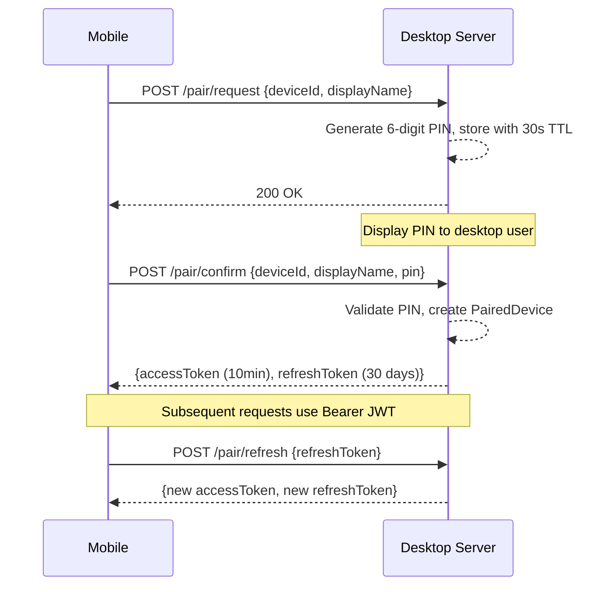

# Cross-Device Synchronization

> Part of the [Sufni.App architecture documentation](../ARCHITECTURE.md). This file covers the desktop sync server, the mobile client, and the pairing flow that connects them. Conflict semantics for the entity payloads live in [Persistence](persistence.md#conflict-resolution).

Desktop acts as a hub server; mobile devices sync with it.

## Pairing Flow


```mermaid
sequenceDiagram
    participant Mobile
    participant Server as Desktop Server

    Mobile->>Server: POST /pair/request {deviceId, displayName}
    Server-->>Server: Generate 6-digit PIN, store with 30s TTL
    Server-->>Mobile: 200 OK
    Note over Server: Display PIN to desktop user

    Mobile->>Server: POST /pair/confirm {deviceId, displayName, pin}
    Server-->>Server: Validate PIN, create PairedDevice
    Server-->>Mobile: {accessToken (10min), refreshToken (30 days)}

    Note over Mobile,Server: Subsequent requests use Bearer JWT

    Mobile->>Server: POST /pair/refresh {refreshToken}
    Server-->>Mobile: {new accessToken, new refreshToken}
```

## Server

`SynchronizationServerService` (`Sufni.App/Sufni.App.Desktop/SyncAndPairing/Services/SynchronizationServerService.cs`) embeds ASP.NET Core Kestrel on port 5575 with:

- **TLS**: Self-signed ECDSA P-256 certificate (password stored in `SecureStorage`), served with TLS 1.2 and TLS 1.3 enabled
- **JWT**: HS256 with a 64-byte random secret (stored in `SecureStorage`)
- **Discovery**: mDNS advertisement as `_sstsync._tcp`
- **Rate limiting**: the anonymous `/pair/*` surface is throttled per remote IP by a fixed-window limiter — 10 requests per PIN-TTL window (30 s) — bounding PIN guesses per source per PIN lifetime. Excess requests get `429` with a `Retry-After` header and are logged; the partition key fails closed to `"unknown"` when the peer IP is unavailable.
- **Strict inbound JSON**: request bodies bind with a hardened profile (reject duplicate keys, reject unmapped members, case-sensitive names, required non-nullable members and constructor parameters). Well-formed first-party traffic is unaffected because the client emits every snake_case key explicitly; responses and other serialization stay on the lenient profile. See [Persistence § JSON Serialization](persistence.md#json-serialization).

| Endpoint                       | Method | Auth | Purpose                                                     |
| ------------------------------ | ------ | ---- | ----------------------------------------------------------- |
| `/pair/request`                | POST   | No   | Start pairing, generates 6-digit PIN with 30s TTL           |
| `/pair/confirm`                | POST   | No   | Confirm PIN, returns access + refresh tokens                |
| `/pair/refresh`                | POST   | No   | Rotate both access and refresh tokens                       |
| `/pair/unpair`                 | POST   | No   | Revoke pairing (validates `deviceId` + refresh token in body) |
| `/sync/push`                   | PUT    | JWT  | Receive `SynchronizationData` from mobile                   |
| `/sync/pull`                   | GET    | JWT  | Return changes since `?since=` timestamp                    |
| `/session/incomplete`          | GET    | JWT  | List session IDs the hub needs a blob for: missing-blob **fills** and held-blob **push-swaps** |
| `/session/data/{id}`           | GET    | JWT  | Download a processed telemetry blob **and the fingerprint of those bytes** (`SessionDataTransfer`) |
| `/session/data/{id}`           | PATCH  | JWT  | Upload a processed telemetry blob with its fingerprint. Commits a **swap** when it matches a recorded push-swap target (a non-match on a push-swap row is ignored, not an error); a **fill** is **400** when it does not match the row's stored fingerprint |
| `/session/source/incomplete`   | GET    | JWT  | List session IDs missing recorded-source rows               |
| `/session/source/data/{id}`    | GET    | JWT  | Download a `RecordedSessionSourceTransfer` JSON payload      |
| `/session/source/data/{id}`    | PATCH  | JWT  | Upload a `RecordedSessionSourceTransfer` JSON payload        |

Authorization is enforced as a route group — `MapGroup("").RequireAuthorization()` wrapping the eight JWT endpoints — not a per-endpoint attribute. The four `/pair/*` endpoints form a separate anonymous, rate-limited group. `/pair/unpair` stays in that anonymous group and authenticates by matching `deviceId` + refresh token in its body, because a device revoking itself may no longer hold a valid access token.

`PATCH /session/data/{id}` raises `SessionDataArrived`; `PATCH /session/source/data/{id}` raises `SessionSourceDataArrived`. `SessionSyncApplier` listens to both events and updates `SessionStore` or `RecordedSessionSourceStore` on the UI thread after the database write succeeds. The server service remains UI-agnostic; subscribers that mutate stores or bound state own the `IUiThreadDispatcher` hop.

## Client

`SynchronizationClientService` (`Sufni.App/Sufni.App/SyncAndPairing/Services/SynchronizationClientService.cs`) runs `SyncAll()` in six phases:

1. **Push local changes** — collect all entities changed since last sync, add app-preference changes from `IAppPreferences.GetSyncDataAsync`, append outgoing extension envelopes, and PUT to `/sync/push`
2. **Pull remote changes** — GET `/sync/pull?since=`, apply deletes or upserts locally, apply `AppPreferencesSyncData` through `IAppPreferences.ApplySyncDataAsync`, then route extension envelopes
3. **Push incomplete sessions** — for each session id the server advertises (a missing-blob *fill* or a held-blob *push-swap*), upload the local blob **and its fingerprint**; the server commits a fill or a push-swap when the fingerprint matches its target, ignores a non-matching push-swap upload, and rejects (400) a non-matching fill
4. **Pull incomplete sessions** — download blobs for two kinds of target and commit each only when the downloaded fingerprint matches the target (otherwise keep what is local and retry later): **fills** (local rows with no blob, target = the row's own stored fingerprint) and **swaps** (rows whose held blob has a different current-schema fingerprint than the one just pulled, target = the accepted remote fingerprint — see *Processed-BLOB coherence* below)
5. **Push incomplete recorded sources** — for each server-side session missing a recorded-source row, upload the local `RecordedSessionSourceTransfer`
6. **Pull incomplete recorded sources** — for each local session missing a recorded-source row, download the server's `RecordedSessionSourceTransfer`

Source sync runs after metadata sync so both sides know which session ids exist before asking for missing source payloads. Source rows are transferred through the incomplete-source endpoints when a side has no source row or when its local source hash no longer matches the `SourceHash` stored in the session's processing fingerprint.

### Processed-BLOB coherence (download-then-swap)

`session.data` (the processed telemetry blob) never travels in `SynchronizationData`; only the metadata, including `session_processing_fingerprint`, does. Because a recompute can change an *existing* blob — not just fill a missing one — the protocol keeps one invariant: **`session_processing_fingerprint` always describes the bytes the row actually holds**, and the blob and its fingerprint move together as an all-or-nothing pair.

- **Deferred metadata merge.** When an inbound metadata update arrives for a row that already holds a blob, both merge paths — the client pull (`ApplyRemoteSessionAsync`) and the desktop hub's push merge (`MergeSessionMetadataAsync`) — write everything *except* the blob-bound columns: `session_processing_fingerprint` and the four BLOB-derived summary metrics (`duration_seconds`, `distance_meters`, `ascent_meters`, `descent_meters`); the metadata write already never writes `data`. The row keeps advertising the fingerprint **and the metrics** of the bytes it holds, so neither `GET /session/data` nor the row's summary ever describes bytes the row does not have. The user-metadata and the remaining non-blob derived fields (`full_track_id`, `gps_offset_seconds`, cached `track`) still sync immediately; the deferred columns move together when the matching blob commits.
- **Transient pull-swap set.** During the client's pull, every deferred row whose held fingerprint differs from the accepted remote fingerprint — when **both are current-schema** and the session **has a raw source** — is queued as a *swap* (id + target remote fingerprint). The set is never persisted; it is re-derived from the metadata delta each run. The client reads `lastSyncTime` once and advances it once, and only when the run leaves **no unresolved swap** behind: a network error (which aborts the run) and an unresolved swap (a `404` or a fingerprint mismatch — the peer has no matching bytes yet) both hold the watermark back, so the next run re-pulls the same delta and retries the swap. Fills are not swaps — they are re-derived every run from `data IS NULL` regardless of the watermark, so they are never lost.
- **Match before commit.** A download commits the new bytes (and overwrites the fingerprint + BLOB-derived metrics to match) only when the downloaded fingerprint equals the target; the commit writes no `updated`, so it creates no metadata-sync feedback edge, and it invalidates `session_cache`. This fingerprint check is the integrity guard that replaces an option/fingerprint field inside the blob.
- **Hub push-swap (push direction).** The desktop hub runs no pull phase, so to *receive* a recomputed blob for a row it already holds it records a durable push-swap request (`session_blob_swap_request`, an `(id, target fingerprint)` row) during the deferred push merge — but only when the incoming fingerprint matches the hub's **current database inputs** while the held one does not (so it never pulls toward a stale client blob, and an option-only difference does not trigger a swap, avoiding cross-device ping-pong; option drift self-heals through each device's own recompute-on-open). `GET /session/incomplete` then advertises those ids alongside the data-null fills, and `PATCH /session/data` commits a swap and clears the request when the uploaded fingerprint matches the recorded target; a non-matching upload to a push-swap row is **ignored** (`204`, not `400`) so the uploading client's run never fails. It is the push-direction analogue of the client's transient pull-swap set, made durable because a client push carries no further metadata delta to re-derive it from. In the common case it self-resolves within one run: the recomputing client's own push creates the request, then its push-incomplete phase uploads the matching blob.
- **Excluded rows.** Source-less rows keep their only blob (they cannot self-heal by recompute) and never swap it out — they only ever *gain* a blob through a fill. A legacy (pre-current-schema) fingerprint on either side defers to the one-time per-device normalization pass rather than swapping during the mixed-version upgrade window. Because every device recomputes the same source at the same options on the same binary, fingerprints converge and there is normally nothing to swap post-upgrade.

"Incomplete," for the purpose of these phases, therefore means **missing _or_ awaiting a matching processed blob**.

`SyncCoordinator` (`Sufni.App/Sufni.App/SyncAndPairing/Coordinators/SyncCoordinator.cs`) is the application-layer entry point: it owns `IsRunning` / `IsPaired` / `CanSync`, drives `SyncAllAsync()`, publishes the current `SynchronizationProgressSnapshot`, and refreshes every store after a successful round-trip, including `RecordedSessionSourceStore` immediately after `SessionStore`. On mobile it subscribes to `IPairingClientCoordinator.PairingConfirmed` so a fresh pair triggers an immediate sync. Mobile outbound sync is reported as an 8-step determinate run: resolve server, the six `SynchronizationClientService` phases, then refresh local lists. The remote client phases run through `IBackgroundTaskRunner`; progress is marshalled back to the UI thread so large session BLOB downloads, recorded-source transfers, and local patching do not block the mobile shell spinner. Desktop inbound sync activity is reported from `SynchronizationServerService` activity results that cover the full request and response-body lifetime, then normalized by `SyncCoordinator` into the same six service phases as one determinate run. The coordinator bridges longer endpoint gaps during session-data transfer so the desktop shell does not flash or fall back to indeterminate activity while the mobile side is doing local work between requests. Inbound sync arrival is split by entity family — see [Coordinators](ui-workflows.md#coordinators) — so that each store has exactly one writer.

`HttpApiService` (`Sufni.App/Sufni.App/SyncAndPairing/Services/HttpApiService.cs`) handles JWT auto-refresh: when the access token is within 30 seconds of expiry, it calls `/pair/refresh` (which rotates both the access and refresh tokens). If `/pair/refresh` itself returns 401, the stored pairing credentials are cleared. The client enables TLS 1.2 and TLS 1.3 to match the desktop server.

TLS validation is performed by `SynchronizationCertificateValidator.TryValidate(...)` and is stricter than a generic CN check: it rejects expired certificates, requires an exact subject match against the constant `SynchronizationProtocol.CertificateSubjectName` (`cn=com.sghctoma.sst-api`), and pins the **certificate thumbprint** captured at pairing time against `SecureStorage`. The certificate chain itself is not validated — that's what makes LAN self-signed certs viable, but the thumbprint pin replaces the missing chain trust with TOFU.

`SynchronizationData` (`Sufni.App/Sufni.App/SyncAndPairing/Models/Synchronizable.cs`) is the sync payload:

```
SynchronizationData
├── Boards[]
├── Bikes[] (includes `rear_suspension` union JSON)
├── Setups[]
├── Sessions[] (metadata, tuning fields, full-track link, processing fingerprint; no blob)
├── Tracks[]
├── AppPreferences? (map/session preferences as AppPreferencesSyncData)
└── ExtensionBatches[] (opaque extension envelopes)
```

Every bike sync row must carry the `rear_suspension` union. Payloads that omit
it, use the legacy `rear_suspension_kind` / `linkage` / `leverage_ratio` triple,
or contain a malformed union are rejected during deserialization on both the
client pull path and the desktop inbound push path; legacy rear-suspension data
is accepted only by the local SQLite startup migration.

Processed telemetry blobs (`session.data`) and raw recorded sources (`session_recording_source.payload`) are transferred through the dedicated session-data and session-source endpoints, not through `SynchronizationData`.

Extension envelopes are handled by `ExtensionSyncService`. Outgoing
participants create batches containing an extension id, payload
version, and opaque bytes. Incoming batches are ignored when no
participant is registered for the id; known batches are handed to that
participant after core entity and app-preference application. If a
known participant fails to apply a batch, the sync request fails before
the client advances its last-sync timestamp. Core sync code never
interprets extension payload fields.
