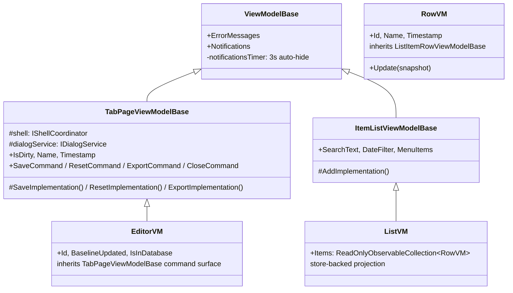

# UI View Models

> Part of the [Sufni.App architecture documentation](../ARCHITECTURE.md). This file covers presentation view-model categories and the session sub-page composition model. Layering invariants live in [UI Architecture](ui.md), read-state ownership lives in [UI State, Read Graphs, and Queries](ui-state.md), and coordinator/navigation ownership lives in [UI Workflows, Composition, and Navigation](ui-workflows.md).

## View Models



There are five kinds of view model in the presentation layer:

- **Shell view models** — `MainViewModel` (mobile), `MainWindowViewModel`
  (desktop), and `MainPagesViewModel` compose the page view models for
  binding and forward shell-level concerns. `MainPagesViewModel` is
  the only place that holds references to multiple page view models
  at once; this is the explicit "view composition" carve-out from the
  no-VM-on-VM rule. It keeps observable mirrors of `SyncCoordinator`'s
  `IsRunning` / `IsPaired` / progress snapshot and forwards
  `SyncCompleted` / `SyncFailed` notifications to the active page, but
  it owns no workflows of its own. Mobile binds those mirrors to a
  blocking shell-level `BusyOverlay`; desktop binds them to the
  paired-devices surface, using a panel overlay when the paired-devices
  list is open and a spinner in the paired-devices button when it is
  closed. The triggering of the initial store refresh
  (`LoadDatabaseContent`) also lives here so the database load happens
  exactly once after the shell is constructed.

- **Feature page view models** — non-entity top-level screens such as `ImportSessionsViewModel`, `WelcomeScreenViewModel`, and the pairing pages. They own only screen-scoped state, bind directly to controls, attach subscriptions and browse lifetime in `Loaded` / `Unloaded`, and delegate workflows to coordinators and services. `ImportSessionsViewModel` is the canonical example: it keeps datastore / file selection, notifications, and errors; resolves `SelectedSetup` from `ISetupStore.FindByBoardId`; asks `ITelemetryDataStoreService` to browse, load files, and register storage-provider folders; and delegates the actual import lifecycle to `ImportSessionsCoordinator`. For long-running screen actions they prefer the generated async-command `IsRunning` state over duplicate busy flags.

- **List view models** (`ViewModels/ItemLists/`) — `BikeListViewModel`,
  `SetupListViewModel`, `SessionListViewModel`,
  `PairedDeviceListViewModel`, `LiveDaqListViewModel`. Most take a
  read-only store plus the matching coordinator and project the
  store's `Connect()` change stream through DynamicData into a typed
  `ReadOnlyObservableCollection` of row view models:

  ```
  store.Connect()
      .Filter(filterSubject)              // search text + date range
      .TransformWithInlineUpdate(
          snapshot => new XxxRowViewModel(snapshot, coordinator),
          (row, snapshot) => row.Update(snapshot))
      .Bind(out items)                    // .SortAndBind for sessions
      .Subscribe();
  ```

  `BikeListViewModel` deliberately reorders this pipeline to
  `Transform → DisposeMany → Filter → Bind` so `DisposeMany` only
  fires when a row leaves the source store, not when the filter
  merely hides it — the trade-off is that the predicate sees the
  row VM rather than the raw snapshot.

  Each list owns its own `Items` `ReadOnlyObservableCollection`
  and pushes a fresh predicate to a `BehaviorSubject` whenever
  filter state changes. `ItemListViewModelBase` itself contributes
  only the cross-cutting search / date-filter / menu-item state
  and the `AddCommand` plumbing (it does not declare an `Items`
  property — there is nothing to shadow). Individual lists
  override `AddImplementation()` to delegate to their coordinator.
  `SessionListViewModel` follows the same projection shape but uses
  `IRecordedSessionGraph.ConnectSessions()` instead of
  `ISessionStore.Connect()`, so rows include processed-data presence,
  staleness, raw-source availability, and summary metrics without each
  row doing its own store lookups. It keeps the flat `Items` collection
  for compatibility and exposes `DateGroups` as the grouped list surface
  used by the desktop sidebar and mobile pull-menu scroll view.

- **Row view models** (`ViewModels/Rows/`) — `BikeRowViewModel`,
  `SetupRowViewModel`, `SessionRowViewModel`,
  `PairedDeviceRowViewModel`, `LiveDaqRowViewModel`. Cheap,
  non-editable wrappers around a single snapshot. They expose a
  `Update(snapshot)` method that DynamicData calls when the underlying
  snapshot changes, plus an `IRelayCommand`-based open/delete surface
  inherited from `ListItemRowViewModelBase` (a single shared `x:DataType` for the
  `DeletableListItemButton` / `SwipeToDeleteButton` /
  `PairedDeviceListItemButton` controls). Open and delete commands
  route through the entity coordinator. `LiveDaqRowViewModel` is an
  exception: it does not derive from `ListItemRowViewModelBase` because live DAQ
  rows are not deletable and use a custom row control with
  online/offline presentation.
  `SessionRowViewModel` wraps `RecordedSessionSummary` rather than
  `SessionSnapshot`; it keeps the unadorned `BaseName`, appends
  `(Stale)` or `(No Raw)` to the display name when appropriate, formats
  the always-visible row timestamp as local time only because the group
  header owns the date, formats the optional subtitle from unit-labelled
  duration plus GPS distance/ascent/descent, and exposes flags the view
  can style independently of the text.

- **Editor view models** (`ViewModels/Editors/`) — `BikeEditorViewModel`,
  `SetupEditorViewModel`, `SessionDetailViewModel`,
  `LiveDaqDetailViewModel`, `LiveSessionDetailViewModel`. Constructed by the entity coordinator from
  a snapshot, never by another view model and never stored in a list.
  Persisted-entity editors keep the snapshot's `Updated` value as
  `BaselineUpdated` for optimistic conflict detection at save time,
  derive editable state from the snapshot in `ResetImplementation`,
  and call back into the coordinator's `SaveAsync` / `DeleteAsync`. On
  `SaveResult.Conflict` they prompt the user via
  `IDialogService.ShowConfirmationAsync` and rebuild from the
  conflict's current snapshot. Persisted-entity editors share the
  `TabPageViewModelBase` command surface, which is the single
  `x:DataType` used by the shared `CommonButtonLine` editor button
  strip. `LiveDaqDetailViewModel` and
  `LiveSessionDetailViewModel` are the two live-only exceptions: the
  diagnostics tab is a transport/configuration surface over the shared
  stream, while the live session tab is a create-only capture editor
  backed by `ILiveSessionService`. `LiveDaqDetailViewModel` projects a
  throttled diagnostics snapshot from `LiveDaqSessionState` and also
  owns the disconnected-only Set Time / Replace Config / Upload CONFIG
  command flow, reusing `ViewModelBase.Notifications` and
  `ErrorMessages` while keeping management busy state separate from the
  live connect/disconnect workflow. The live session editor projects
  graph/media/statistics state from the live session service and
  persists through `SessionCoordinator.SaveLiveCaptureAsync(...)`.

  `SessionDetailViewModel` and `LiveSessionDetailViewModel` both
  compose session sub-pages from `ViewModels/SessionPages/` instead of
  putting graph/spring/damper/balance/notes/preferences state directly
  on the editor — see [Session Sub-Pages](#session-sub-pages) below.
  The recorded editor subscribes to `IRecordedSessionGraph.WatchSession`
  in `Loaded` and disposes that subscription in `Unloaded`. Initial or
  runtime domain snapshots that are recomputable prompt the user to
  recompute; inactive desktop session tabs defer that prompt until the
  tab is selected again. Unrecomputable stale snapshots report an
  error; processed data arriving for a current session reloads the
  presentation data.

### Session Sub-Pages

`Sufni.App/Sufni.App/ViewModels/SessionPages/` holds the per-page view
models that `SessionDetailViewModel` (recorded sessions) and
`LiveSessionDetailViewModel` (live captures) compose into a
swipe/tab UI. They share a tiny base, `PageViewModelBase`, which
extends `ObservableObject` and adds two members: an immutable
`DisplayName` used as the tab header, and an `[ObservableProperty]
bool Selected` that the shell view (`SessionShellMobileView`) toggles
when the user navigates between tabs. Pages do not own commands,
notification bars, or shell navigation — the editor is still the
`TabPageViewModelBase` and keeps the `Save` / `Reset` / `Close`
surface.

Each editor exposes an `ObservableCollection<PageViewModelBase>
Pages` that the shell view binds against for both the tab header
strip and the tab body. The two editors compose different sets:

- Recorded sessions: graph, spring, strokes, damper, balance,
  vibration, analysis, notes, preferences.
- Live captures: graph, spring, damper, notes, preferences; balance is
  inserted when the current live statistics produce balance data.

Both editors add or remove `BalancePage` at runtime via an
`EnsureBalancePage(bool)` helper based on whether the current
telemetry produces a balance plot, so `Pages` is mutated rather than
rebuilt. Graph pages are constructed with the editor's graph and media
workspaces as constructor arguments — `RecordedGraphPageViewModel` for
the recorded editor, `LiveGraphPageViewModel` for the live editor.
Several statistics pages are also workspace-backed so their
presentation states and SVG surfaces can be built from the editor's
analysis service; notes and preferences remain the mostly local
parameterless pages.

Most pages are pure projection surfaces over data the editor pushes
in: `SpringPageViewModel`, `DamperPageViewModel`, and
`BalancePageViewModel` carry per-plot strings and
`SurfacePresentationState` values that the editor sets after each
analysis run. Recorded-session statistics distinguish unavailable
finished data from live warm-up: a stored session or selected range
with too little travel movement shows a no-data message without a
spinner, while live-session statistics keep a waiting state because
the relevant stream samples may still arrive. `NotesPageViewModel` carries the description plus
fork/shock `SuspensionSettings` and exposes its own
`IsDirty(Session)` so the editor can fold notes-page edits into its
`IsDirty` evaluation. The editors do not subscribe to most of these —
they write to the page from analysis result handlers.

Two pages diverge from that pattern:

- **Graph pages** wrap the editor's graph workspace and a shared
  media workspace and forward bindings into a reusable
  `TelemetryPlotsRoot`. The root owns a vertical `ScrollViewer` and a
  collapsible row hierarchy rather than a fixed graph grid:
  Travel hosts Velocity, IMU vibration RMS hosts Frame Pitch/Roll, and
  GPS speed hosts Elevation. Desktop graph roots live inside the graph/statistics
  splitter region and grow visible base rows once all preferred row
  content fits; mobile graph roots are measured by the page scroll and
  report preferred content height. Rows are draggable from their
  headers within that hierarchy: dropping on another row appends the
  dragged row to that row's children, while dropping in the divider
  band between root rows makes the dragged row a root row at that
  position. Row visibility is still controlled
  by `TravelGraphState` / `VelocityGraphState` / `ImuGraphState` /
  `PitchRollGraphState` / `SpeedGraphState` / `ElevationGraphState`
  on the workspace
  (recorded: on the editor itself, projected onto the workspace; live:
  directly on `LiveSessionGraphWorkspaceViewModel`). Hosted row titles
  are progressively inset by hierarchy depth. Expanded parent rows draw
  short connector branches in the child-row band, starting at each
  direct child row's top edge and stopping before that child row's
  header glyph; those branches disappear with the parent's expanded
  content. The guides stay in the left title/glyph gutter, avoid the
  glyph text itself, and do not enter plot chrome or shift plot
  content, so graph data remains vertically aligned across parent and
  hosted rows.
  The row hierarchy and each row's expanded/collapsed state are stored
  in `SessionPreferences.Graph` as stable row IDs. For recorded
  sessions, `SessionDetailViewModel.GraphPreferences` loads and writes
  that graph preference through `ISessionPreferences`; live captures
  carry the current live graph preference into
  `SessionCoordinator.SaveLiveCaptureAsync(...)` so the newly saved
  session opens with the same row layout. The pure
  `SessionGraphPreferenceTree` helper owns preference normalization,
  capture, root moves, child moves, duplicate removal, unknown-row
  skipping, missing-default appends, and cycle prevention; the Avalonia
  `TelemetryPlotsRoot` still owns materialization, drag/drop hit
  testing, brushes, and visual rebuilding. Hidden rows are not
  duplicated in the graph hierarchy preference: plot visibility remains
  the existing `SessionPlotPreferences` contract, so hidden rows keep
  their saved hierarchy position and reappear there when re-enabled.
- **`PreferencesPageViewModel`** owns the per-plot `Selected` and
  `SelectedSmoothing` toggles plus a per-plot `Available` flag, and
  exposes `CreatePlotPreferences()` / `ApplyPlotPreferences(...)` /
  `ApplyPlotAvailability(...)` so the editor can round-trip through
  `SessionPlotPreferences` without reaching into individual
  `PlotPreferenceItemViewModel` instances. It also owns the
  processing preference `VelocityFilterWindowMilliseconds` and emits a
  commit event when the user finishes changing that slider, allowing
  the recorded editor to recompute and persist processed telemetry
  with the new `TelemetryProcessingOptions`. Both editors subscribe to
  `PropertyChanged` on the plot rows in their constructor and react to
  toggle/smoothing changes by re-applying preferences to the graph
  workspace — the recorded editor re-applies plot selection over its
  base presentation states, while the live editor calls
  `LiveSessionGraphWorkspaceViewModel.ApplyPlotPreferences`. The
  recorded editor also persists changes through `ISessionPreferences`
  (loaded on `Loaded`, written via `UpdateRecordedAsync`) and folds
  the statistics preferences (travel-histogram mode,
  velocity-average mode, balance-displacement mode, target profile)
  and processing preferences through the same persistence path; the
  live editor seeds those preferences for the new session through
  `SessionCoordinator.SaveLiveCaptureAsync(...)` because there is no
  persisted entity to write back to until the capture is saved.

`TabPageViewModelBase` (`ViewModels/TabPageViewModelBase.cs`) is the
shared base for everything that opens as a top-level tab or stacked
view (editors, the import view, the welcome screen). It takes
`IShellCoordinator` and `IDialogService` via its constructor and
provides the shared `IsDirty` machinery, the
`SaveCommand`/`ResetCommand`/`ExportCommand`/`CloseCommand`
implementation, and the `OpenPreviousPageCommand` that delegates to
`shell.GoBack()`. The `CloseCommand` flow uses
`IDialogService.ShowCloseConfirmationAsync` to prompt for save / discard
/ cancel before letting the shell close the tab.

`ViewModelBase` (`ViewModels/ViewModelBase.cs`) extends
`ObservableObject` and contributes the notification / error-message
collections plus the 3-second auto-hide timer that pauses on pointer
hover. Navigation surface belongs to `IShellCoordinator`, not
`ViewModelBase`; small projection-only view models such as session
pages, sensor-configuration rows, and linkage parts use
`ObservableObject` directly when they do not need the shared
notification/error surface. `ViewLocator` still maps those known
projection view models through its explicit view-factory table.
