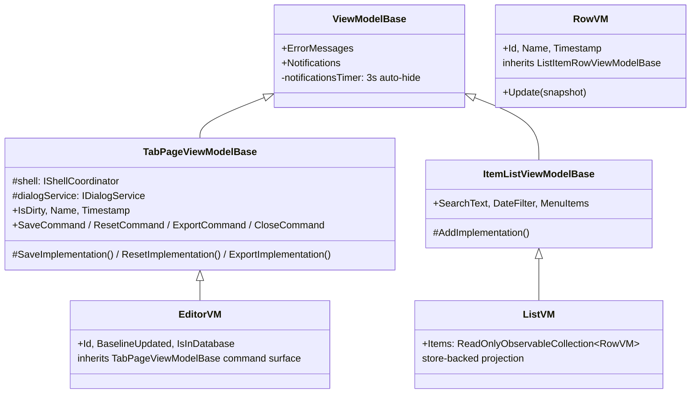

# UI View Models

> Part of the [Sufni.App architecture documentation](../ARCHITECTURE.md). This file covers presentation view-model categories and the session sub-page composition model. Layering invariants live in [UI Architecture](ui.md), read-state ownership lives in [UI State, Read Graphs, and Queries](ui-state.md), and coordinator/navigation ownership lives in [UI Workflows, Composition, and Navigation](ui-workflows.md).

## View Models


```mermaid
classDiagram
    class ViewModelBase {
        +ErrorMessages
        +Notifications
        -notificationsTimer: 3s auto-hide
    }

    class TabPageViewModelBase {
        #shell: IShellCoordinator
        #dialogService: IDialogService
        +IsDirty, Name, Timestamp
        +SaveCommand / ResetCommand / ExportCommand / CloseCommand
        #SaveImplementation() / ResetImplementation() / ExportImplementation()
    }

    class ItemListViewModelBase {
        +SearchText, DateFilter, MenuItems
        #AddImplementation()
    }

    class EditorVM {
        +Id, BaselineUpdated, IsInDatabase
      inherits TabPageViewModelBase command surface
    }

    class ListVM {
        +Items: ReadOnlyObservableCollection~RowVM~
        store-backed projection
    }

    class RowVM {
        +Id, Name, Timestamp
      inherits ListItemRowViewModelBase
        +Update(snapshot)
    }

    ViewModelBase <|-- TabPageViewModelBase
    ViewModelBase <|-- ItemListViewModelBase
    TabPageViewModelBase <|-- EditorVM
    ItemListViewModelBase <|-- ListVM
```

There are five kinds of view model in the presentation layer:

- **Shell view models** — `ShellRootViewModel`, `ShellWorkspaceViewModel`,
  and `MainPagesViewModel` compose the app shell for both platform
  lifetimes. `ShellRootViewModel` is the root data context for `MainWindow`
  and `MainView`; it exposes the selected layout profile, platform
  capabilities, the primary page surface, and the shared workspace.
  `ShellWorkspaceViewModel` owns the logical tab collection, current tab,
  tab history, open/focus, background open, close, restore, back, and reorder
  behavior used by both compact and workspace presentations. `MainPagesViewModel`
  is the only place that holds references to multiple primary page view models
  at once; this is the explicit "view composition" carve-out from the
  no-VM-on-VM rule. It keeps observable mirrors of `SyncCoordinator`'s
  `IsRunning` / `IsPaired` / progress snapshot and forwards `SyncCompleted` /
  `SyncFailed` notifications to the active page, but it owns no workflows of
  its own. Compact and workspace shell views bind those mirrors differently,
  but both read the same view models. The triggering of the initial store
  refresh (`LoadDatabaseContent`) also lives here so the database load happens
  exactly once after the shell is constructed. It also exposes app toolbar
  command and view contributions from DI-created app toolbar contribution
  providers; profile-specific shell chrome renders those neutral app-level
  contributions without knowing extension workflow types.

- **Feature page view models** — non-entity top-level screens such as `ImportSessionsViewModel` and the pairing pages. They own only screen-scoped state, bind directly to controls, attach subscriptions and browse lifetime in `Loaded` / `Unloaded`, and delegate workflows to coordinators and services. `ImportSessionsViewModel` is the canonical example: it keeps datastore / file selection, notifications, and errors; resolves `SelectedSetup` from `ISetupStore.FindByBoardId`; asks `ITelemetryDataStoreService` to browse, load files, and register storage-provider folders; and delegates the actual import lifecycle to `ImportSessionsCoordinator`. For long-running screen actions they prefer the generated async-command `IsRunning` state over duplicate busy flags.

- **List view models** (`ViewModels/ItemLists/`) — `BikeListViewModel`,
  `SetupListViewModel`, `SessionListViewModel`,
  `PairedDeviceListViewModel`, `LiveDaqListViewModel`. Most take a
  read-only store plus the matching coordinator and project the
  store's `Connect()` change stream through DynamicData into a typed
  `ReadOnlyObservableCollection` of row view models:

  ```
  store.Connect()
      .Filter(filterSubject)              // search text + date range
      .TransformWithInlineUpdate(
          snapshot => new XxxRowViewModel(snapshot, coordinator),
          (row, snapshot) => row.Update(snapshot))
      .Bind(out items)                    // .SortAndBind for sessions
      .Subscribe();
  ```

  `BikeListViewModel` deliberately reorders this pipeline to
  `Transform → DisposeMany → Filter → Bind` so `DisposeMany` only
  fires when a row leaves the source store, not when the filter
  merely hides it — the trade-off is that the predicate sees the
  row VM rather than the raw snapshot.

  Each list owns its own `Items` `ReadOnlyObservableCollection`
  and pushes a fresh predicate to a `BehaviorSubject` whenever
  filter state changes. `ItemListViewModelBase` itself contributes
  only the cross-cutting search / date-filter / menu-item state
  and the `AddCommand` plumbing (it does not declare an `Items`
  property — there is nothing to shadow). Individual lists
  override `AddImplementation()` to delegate to their coordinator.
  `SessionListViewModel` follows the same projection shape but uses
  `IRecordedSessionProjection.ConnectSessions()` instead of
  `ISessionStore.Connect()`, so rows include processed-data presence,
  staleness, raw-source availability, and summary metrics without each
  row doing its own store lookups. It keeps the flat `Items` collection
  for compatibility and exposes `DateGroups` as the grouped list surface
  used by the desktop sidebar and mobile pull-menu scroll view.

- **Row view models** (`ViewModels/Rows/`) — `BikeRowViewModel`,
  `SetupRowViewModel`, `SessionRowViewModel`,
  `PairedDeviceRowViewModel`, `LiveDaqRowViewModel`. Cheap,
  non-editable wrappers around a single snapshot. They expose a
  `Update(snapshot)` method that DynamicData calls when the underlying
  snapshot changes, plus an `IRelayCommand`-based open/delete surface
  inherited from `ListItemRowViewModelBase` (a single shared `x:DataType` for the
  `DeletableListItemButton` / `SwipeToDeleteButton` /
  `PairedDeviceListItemButton` controls). Open and delete commands
  route through the entity coordinator. `LiveDaqRowViewModel` is an
  exception: it does not derive from `ListItemRowViewModelBase` because live DAQ
  rows are not deletable and use a custom row control with
  online/offline presentation.
  `SessionRowViewModel` wraps `RecordedSessionSummary` rather than
  `SessionSnapshot`; it keeps the unadorned `BaseName`, appends
  `(Stale)` or `(No Raw)` to the display name when appropriate, formats
  the always-visible row timestamp as local time only because the group
  header owns the date, formats the optional subtitle from unit-labelled
  duration plus GPS distance/ascent/descent, and exposes flags the view
  can style independently of the text.

- **Editor view models** (`ViewModels/Editors/`) — `BikeEditorViewModel`,
  `SetupEditorViewModel`, `SessionDetailViewModel`,
  `LiveDaqDetailViewModel`, `LiveSessionDetailViewModel`. Constructed
  by `IEditorFactory` from a snapshot or live-session context, never by
  another view model and never stored in a list. Entity coordinators
  route open/focus/close requests through the factory instead of
  referencing concrete editor view-model types.
  Persisted-entity editors keep the snapshot's `Updated` value as
  `BaselineUpdated` for optimistic conflict detection at save time,
  derive editable state from the snapshot in `ResetImplementation`,
  and call back into the coordinator's `SaveAsync` / `DeleteAsync`. On
  `SaveResult.Conflict` they prompt the user via
  `IDialogService.ShowConfirmationAsync` and rebuild from the
  conflict's current snapshot. Persisted-entity editors share the
  `TabPageViewModelBase` command surface, which is the single
  `x:DataType` used by the shared `CommonButtonLine` editor button
  strip. `LiveDaqDetailViewModel` and
  `LiveSessionDetailViewModel` are the two live-only exceptions: the
  diagnostics tab is a transport/configuration surface over the shared
  stream, while the live session tab is a create-only capture editor
  backed by `ILiveSessionService`. `LiveDaqDetailViewModel` projects a
  throttled diagnostics snapshot from `LiveDaqSessionState` and also
  owns the disconnected-only Set Time / Replace Config / Upload CONFIG
  command flow, reusing `ViewModelBase.Notifications` and
  `ErrorMessages` while keeping management busy state separate from the
  live connect/disconnect workflow. The live session editor projects
  signals/media/analysis state from the live session service and
  persists through `SessionCoordinator.SaveLiveCaptureAsync(...)`.

  `SessionDetailViewModel` and `LiveSessionDetailViewModel` both
  compose session sub-pages from `ViewModels/SessionPages/` and expose
  workspace contracts for signals, media, analysis, sidebar, and mobile
  shell surfaces instead of putting every binding directly on the
  editor — see [Session Sub-Pages](#session-sub-pages) below.
  For recorded sessions, `RecordedSessionEditorState` is the projected state
  surface consumed by the signals, media, analysis, and mobile-shell
  workspaces. User-originated workspace setters call
  `RecordedSessionEditorActions` instead of mutating backing fields directly;
  the editor applies validated intents, derives fresh state from typed input
  streams, and drives named effects such as analysis invalidation, command refresh,
  extension-host publication, map/media synchronization, and dirty/baseline
  tracking. Stable runtime objects such as the page collection, timeline link,
  source-visibility store, map view model, and recorded-session extension slots
  are owned directly by the editor or extension manager and passed to workspaces
  by reference; state emissions update projected presentation without replacing
  those objects. Internal collaborators in `ViewModels/Editors/` keep
  flows off the editor itself: `SignalRowActionsController` builds the
  built-in signal-row header actions (airtime and analysis-selection toggles)
  through owner-supplied state accessors and actions;
  `RecordedSessionExtensionPagesController` mirrors contributed extension
  pages and contributed analysis tabs into the editor's stable `Pages`
  collection and resolves contributed-page selection through the action
  gateway; and `ProcessingPreferenceWorkflow` owns the
  confirm-recompute-persist flow that runs when a processing preference change
  is committed. The editor constructs them and delegates; it no longer owns
  those flows. Session detail loading uses one local-only
  `SessionCoordinator.LoadDetailAsync` path; inactive-tab deferral is supplied
  by `EditorFactory` as workspace/profile policy. Collaborators reach the
  editor through the `ISessionOperationGateway` contract rather than delegate
  bundles.
  The recorded editor subscribes to `IRecordedSessionProjection.WatchSession`
  in `Loaded` and disposes that subscription in `Unloaded`. Initial or
  runtime domain snapshots that are recomputable prompt the user to
  recompute; inactive desktop session tabs defer that prompt until the
  tab is selected again. Unrecomputable stale snapshots report an
  error; processed data arriving for a current session reloads the
  presentation data.

### Session Sub-Pages

The `ViewModels/SessionPages/` folders within the Sessions areas and `LiveDaq/` (e.g. `Sessions/Signals/ViewModels/SessionPages/`, `Sessions/Pages/ViewModels/SessionPages/`, `LiveDaq/ViewModels/SessionPages/`) hold the per-page view
models that `SessionDetailViewModel` (recorded sessions) and
`LiveSessionDetailViewModel` (live captures) compose into the mobile
session page surface. They share a tiny base, `PageViewModelBase`,
which extends `ObservableObject` and exposes only the immutable
`DisplayName` used as the page header. Page selection belongs to the
owning session workspace, not to individual pages: recorded sessions
project it from `RecordedSessionEditorState.Intent.SelectedPageIndex`
through `SessionShellMobileWorkspaceViewModel` and write changes through
`RecordedSessionEditorActions.SelectPageIndex`; live sessions store it
directly on `LiveSessionDetailViewModel`. Both surfaces expose
`SelectedPageIndex`, `SelectedPage`, `PageCount`, and
`SelectedPageDisplayName` through `ISessionShellMobileWorkspace`.
Pages do not own commands, notification bars, selected flags, or shell
navigation — the editor is still the `TabPageViewModelBase` and keeps
the `Save` / `Reset` / `Close` surface.

Each editor exposes an `ObservableCollection<PageViewModelBase>
Pages`. `SessionShellMobileView` binds that collection to a
`CarouselPage` and binds the shared selected index to both the
`CarouselPage` and `PipsPager`, so swipes, pips, and contributed page
selection all update the same workspace-owned index. The two editors
compose different page sets:

- Recorded sessions: signals, spring, strokes, damping, balance,
  vibration, insights, notes, preferences.
- Live captures: signals, spring, damping, notes, preferences; balance is
  inserted when the current live analysis produces balance data.

Both editors add or remove `BalancePage` at runtime via an
`EnsureBalancePage(bool)` helper based on whether the current
telemetry produces a balance plot, so `Pages` is mutated rather than
rebuilt. Signals pages are constructed with the editor's signals and media
workspaces as constructor arguments — `RecordedSignalsPageViewModel` for
the recorded editor, `LiveSignalsPageViewModel` for the live editor.
Several analysis pages are also workspace-backed so their
presentation states and SVG surfaces can be built from the editor's
analysis service; notes and preferences remain the mostly local
parameterless pages. Recorded-session extension scopes can contribute
additional analysis tabs; mobile projects those tabs into the same
`Pages` collection at the matching analysis-page position.
`RecordedSessionExtensionPagesController` satisfies contributed-page
selection requests by dispatching `SelectPageIndex` for the matching page. On
desktop, the recorded-session analysis view composes built-in and
contributed analysis tabs into one tab strip and places the selected
analysis body plus extension banners inside one vertical scroll
region; analysis plot hosts use natural fixed plot heights instead
of stretching to the current analysis pane height.

Most pages are pure projection surfaces over data the editor pushes
in: `SpringPageViewModel`, `DampingPageViewModel` (the Damping page), and
`BalancePageViewModel` carry per-plot strings and
`SurfacePresentationState` values that the editor sets after each
analysis run. Recorded-session analysis pages distinguish unavailable
finished data from live warm-up: a stored session or selected range
with too little travel movement shows a no-data message without a
spinner, while live-session analysis keeps a waiting state because
the relevant stream samples may still arrive. `NotesPageViewModel` carries the description plus
fork/shock `SuspensionSettings` and exposes its own
`IsDirty(Session)` so the editor can fold notes-page edits into its
`IsDirty` evaluation. The editors do not subscribe to most of these —
they write to the page from analysis result handlers.

Two pages diverge from that pattern:

- **Signals pages** wrap the editor's signals workspace and a shared
  media workspace and forward bindings into a reusable
  `SignalRowsRoot`. The root owns a vertical `ScrollViewer` and a
  collapsible row hierarchy rather than a fixed signals grid:
  Travel hosts Velocity, IMU vibration RMS hosts Frame Pitch/Roll, and
  GPS speed hosts Elevation. Desktop signal roots live inside the signals/analysis
  splitter region and grow visible base rows once all preferred row
  content fits; mobile signal roots are measured by the page scroll and
  report preferred content height. Rows are draggable from their
  headers within that hierarchy: dropping on another row appends the
  dragged row to that row's children, while dropping in the divider
  band between root rows makes the dragged row a root row at that
  position. Row visibility is still controlled
  by `TravelSignalState` / `VelocitySignalState` / `ImuSignalState` /
  `PitchRollSignalState` / `SpeedSignalState` / `ElevationSignalState`
  on the workspace
  (recorded: projected from
  `RecordedSessionEditorState.Presentation.Signals`; live: directly on
  `LiveSessionSignalsWorkspaceViewModel`). Hosted row titles
  are progressively inset by hierarchy depth. Expanded parent rows draw
  short connector branches in the child-row band, starting at each
  direct child row's top edge and stopping before that child row's
  header glyph; those branches disappear with the parent's expanded
  content. The guides stay in the left title/glyph gutter, avoid the
  glyph text itself, and do not enter plot chrome or shift plot
  content, so signal data remains vertically aligned across parent and
  hosted rows.
  The row hierarchy, each row's expanded/collapsed state, and manually
  resized root-row height ratios are stored in
  `SessionPreferences.SignalLayout` as stable row IDs plus normalized ratios.
  For recorded
  sessions, `SessionDetailViewModel.SignalLayoutPreferences` loads and writes
  that signal layout preference through `ISessionPreferences`; live captures
  carry the current live signal layout preference into
  `SessionCoordinator.SaveLiveCaptureAsync(...)` so the newly saved
  session opens with the same row layout. The pure
  `SignalLayoutPreferenceTree` helper owns preference normalization,
  capture, root moves, child moves, duplicate removal, unknown-row
  skipping, missing-default appends, and cycle prevention; the Avalonia
  `SignalRowsRoot` still owns materialization, drag/drop hit
  testing, brushes, manual row-size capture, and visual rebuilding. If
  any visible resizable root row has no stored height ratio, the signal layout
  falls back to default sizing so new or unknown panes do not inherit a
  partial old layout. Hidden rows are not
  duplicated in the signal hierarchy preference: plot visibility remains
  the existing `SessionPlotPreferences` contract, so hidden rows keep
  their saved hierarchy position and reappear there when re-enabled.
- **Recorded-session extension scopes** are owned by
  `SessionDetailViewModel` for each open recorded session. On
  `Loaded`, the editor initializes `RecordedSessionExtensionManager`
  with the current domain snapshot and constrained host context; on
  `Unloaded` / final close it disposes all scopes. The manager mirrors
  each scope's `RecordedSessionExtensionSlots` into one host slot
  collection. Recorded signals, media, and analysis workspaces expose
  that same slot object so views can render contributed pages, toolbar
  content, media panes, map overlays, analysis banners/overlays,
  session-list indicators/actions, signal-row actions, hosted signal rows,
  and time-range overlays without adding workflow-specific properties
  to public workspace contracts. Extension scopes can request analysis
  range changes, timeline range changes, notifications, page selection,
  and cancellable host operations through `RecordedSessionHostContext`;
  they do not write editor state directly.
- **`PreferencesPageViewModel`** owns the per-plot `Selected` and
  `SelectedSmoothing` toggles plus a per-plot `Available` flag, and
  exposes `CreatePlotPreferences()` / `ApplyPlotPreferences(...)` /
  `ApplyPlotAvailability(...)` so the editor can round-trip through
  `SessionPlotPreferences` without reaching into individual
  `PlotPreferenceItemViewModel` instances. It also owns the
  processing preference `VelocityFilterWindowMilliseconds` and emits a
  commit event when the user finishes changing that slider; the
  recorded editor forwards that commit to its
  `ProcessingPreferenceWorkflow` collaborator, which confirms with the
  user, recomputes, and persists processed telemetry with the new
  `TelemetryProcessingOptions`. Both editors subscribe to
  `PropertyChanged` on the plot rows in their constructor and react to
  toggle/smoothing changes by re-applying preferences to the signals
  workspace — the recorded editor re-applies plot selection over its
  base presentation states, while the live editor calls
  `LiveSessionSignalsWorkspaceViewModel.ApplyPlotPreferences`. The
  recorded editor also persists changes through `ISessionPreferences`
  (loaded on `Loaded`, written via `UpdateRecordedAsync`) and folds
  the analysis preferences (travel-distribution mode,
  velocity-average mode, balance-displacement mode, target profile)
  processing preferences, and desktop session-detail layout ratios
  through the same persistence path. Desktop shell/media splitters write
  normalized pane ratios into `SessionPreferences.Layout`; restoring
  uses star sizing so a reopened session keeps the same shape when the
  window size changes, while missing pane ratios reset the affected
  group to defaults. The
  live editor seeds those preferences for the new session through
  `SessionCoordinator.SaveLiveCaptureAsync(...)` because there is no
  persisted entity to write back to until the capture is saved.

`TabPageViewModelBase` (`Shared/Base/TabPageViewModelBase.cs`) is the
shared base for everything that opens as a top-level tab or stacked
view (editors and the import view). It takes
`IShellCoordinator` and `IDialogService` via its constructor and
provides the shared `IsDirty` machinery, the
`SaveCommand`/`ResetCommand`/`ExportCommand`/`CloseCommand`
implementation, and the `OpenPreviousPageCommand` that delegates to
`shell.GoBack()`. The `CloseCommand` flow uses
`IDialogService.ShowCloseConfirmationAsync` to prompt for save / discard
/ cancel before letting the shell close the tab.

`ViewModelBase` (`Shared/Base/ViewModelBase.cs`) extends
`ObservableObject` and contributes the notification / error-message
collections plus the 3-second auto-hide timer that pauses on pointer
hover. Navigation surface belongs to `IShellCoordinator`, not
`ViewModelBase`; small projection-only view models such as session
pages, sensor-configuration rows, and linkage parts use
`ObservableObject` directly when they do not need the shared
notification/error surface. `ViewLocator` still maps those known
projection view models through its explicit view-factory table.
