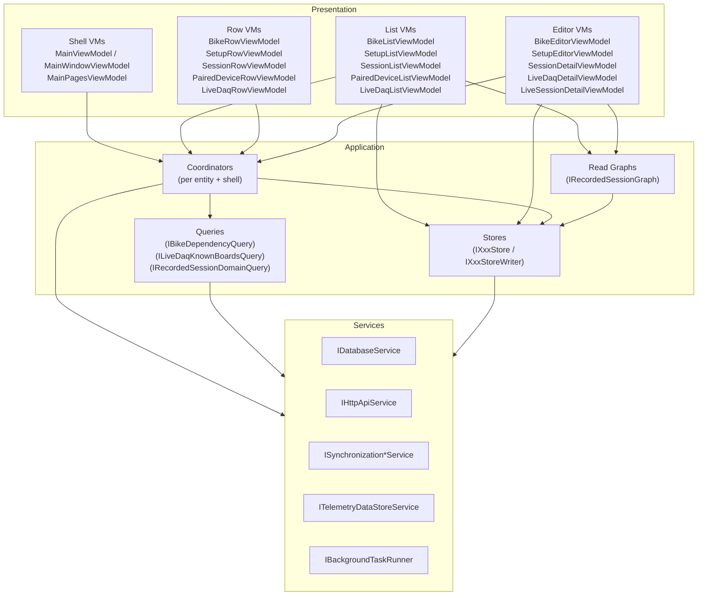
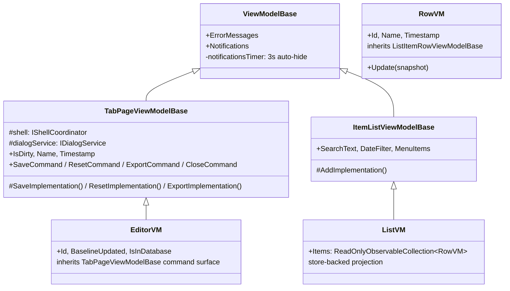

# UI Architecture

> Part of the [Sufni.App architecture documentation](../ARCHITECTURE.md). This file covers the presentation layer in depth: invariants, layering, threading, stores, coordinators, queries, view models, dependency injection, navigation, controls, and ScottPlot-based plot rendering.

The presentation code is organized in five layers with a strict
one-way dependency chain:

```
Views → ViewModels → Coordinators / Stores / Queries → Services → Platform
```

CommunityToolkit.Mvvm source generators (`[ObservableProperty]`,
`[RelayCommand]`) drive bindings; views are XAML with compiled
bindings; shared read state is reactive and uses DynamicData
(`SourceCache<T, TKey>` → `ReadOnlyObservableCollection<T>`).

## Architectural Invariants

These boundaries are the invariants worth preserving even if type names
or feature wording evolve:

- A view model owns screen state, command flow, and binding-friendly projection.
- A store owns shared read state for an entity family and direct lookups over its own read model.
- A read graph owns a joined projection across stores and publishes derived state for screens that need more than one entity family.
- A query answers a business question that crosses domains or requires derived reasoning; it does not own the shared collection.
- A coordinator owns workflows with side effects, store writes, navigation decisions, and long-lived event subscriptions.
- A service or factory owns infrastructure-facing work such as datastore construction, file-picker lifetime, platform integration, and explicit background execution.

## Layered Architecture



Rules enforced by convention:

- A view model may depend on coordinators, **read-only** stores, read graphs, queries, services, and other shell composition view models. It may not depend on another feature view model or on a store writer. Any remaining direct feature-VM dependency outside shell composition is technical debt, not a pattern to copy.
- A coordinator may depend on services, **read/write** stores, other coordinators, queries, the shell coordinator, and dialogs. It may not depend on any view model.
- A service or factory may depend on platform or infrastructure APIs and may create concrete datastores, own file-picker lifetime, and own background execution. View models ask services and factories to do this work; they do not `new` concrete infrastructure types.
- A store may depend only on services. A read graph may depend on read-only stores and pure derivation services. A query may depend on services or read-only stores.
- Controls in `Views/Controls/` and `DesktopViews/Controls/` resolve nothing from the DI container — parent views supply everything via bindings or attached behaviours.

## Threading & Lifecycle

Thread ownership is explicit:

- The UI thread is reserved for bound-property updates, `ObservableCollection` mutation, notifications, native picker interaction, and lightweight read-store lookups.
- Filesystem work, network work, datastore enumeration, SST parsing, PSST generation, and similar slow operations must cross an explicit background boundary (`IBackgroundTaskRunner` or a service-owned equivalent) before they run.
- Services may still use UI-thread primitives for cadence or collection ownership (for example `DispatcherTimer`), but only the UI-bound collection mutation belongs back on the UI thread.
- Singleton page view models do not imply always-on work. Browse lifetimes and store subscriptions attach in `Loaded` and tear down in `Unloaded`.
- Prefer generated async-command state such as `Command.IsRunning` as the busy-state source of truth instead of maintaining duplicate booleans.

### Cancellation & Result Coherence

Background workflows whose results can be superseded should take a
`CancellationToken` from their caller and propagate it through the
coordinator/service chain.

- The owner that started the work — typically a page view model — cancels the token in `Unloaded` or before replacing the workflow with a newer request.
- Cancellation is a neutral exit, not a failure outcome. Do not translate `OperationCanceledException` into domain results such as `Failed`, `Unavailable`, or user-facing errors.
- Replaceable read/refresh workflows should be cancellable. Once a workflow has crossed into persistence or other committed side effects, prefer explicit result shapes over best-effort cancellation.

Result application must still enforce coherence after awaited work returns:

- A canceled or superseded workflow must not apply UI state, overwrite newer data, or clear busy indicators that belong to newer work.
- The component that owns the current workflow identity should only clear or dispose its current cancellation state when the completing workflow is still the active one.
- If multiple refresh triggers arrive while only the latest result matters, coalesce them or drop stale completions rather than partially merging old and new state.

## Stores

Stores own shared read state. One per entity family, registered as a
singleton, exposed behind two interfaces: a read-only `IXxxStore`
injected into list/row/editor view models and queries, and a
`IXxxStoreWriter` (which extends the read interface) reserved for
coordinators and the composition root. The implementation lives in
`Sufni.App/Sufni.App/Stores/`.

| Store                        | Read interface                  | Writer interface                  | Snapshot type                   | Key      |
| ---------------------------- | ------------------------------- | --------------------------------- | ------------------------------- | -------- |
| `BikeStore`                  | `IBikeStore`                    | `IBikeStoreWriter`                | `BikeSnapshot`                  | `Guid`   |
| `SetupStore`                 | `ISetupStore`                   | `ISetupStoreWriter`               | `SetupSnapshot`                 | `Guid`   |
| `SessionStore`               | `ISessionStore`                 | `ISessionStoreWriter`             | `SessionSnapshot`               | `Guid`   |
| `RecordedSessionSourceStore` | `IRecordedSessionSourceStore`   | `IRecordedSessionSourceStoreWriter` | `RecordedSessionSourceSnapshot` | `Guid`   |
| `PairedDeviceStore`          | `IPairedDeviceStore`            | `IPairedDeviceStoreWriter`        | `PairedDeviceSnapshot`          | `string` |
| `LiveDaqStore`               | `ILiveDaqStore`                 | `ILiveDaqStoreWriter`             | `LiveDaqSnapshot`               | `string` |

Persisted stores share the internal `SourceCacheStoreBase<TSnapshot, TKey>` for the repeated DynamicData mechanics. The base owns the cache lifetime, `Connect()`, `Get(key)`, writer `Upsert`/`Remove`, and load-and-replace refresh flow; concrete stores keep their public read/write interfaces and any domain-specific lookups. `LiveDaqStore` remains separate because it is runtime-only and publishes `Clear()` / `ReplaceAll(...)` rather than database refresh.

Each persisted store exposes:

- `Connect()` — DynamicData change stream consumed by list view models.
- `Get(key)` — synchronous lookup that returns the current snapshot or
  `null`.
- `RefreshAsync()` — load (or reload) all rows from the database via
  `IDatabaseService` and replace the cache contents. Called once at
  startup by `MainPagesViewModel.LoadDatabaseContent()` and again after
  every successful `SyncCoordinator.SyncAllAsync()`.
- `Upsert(snapshot)` / `Remove(key)` (writer interface only) — invoked
  by coordinators after a save / delete / sync arrival.

Snapshots are immutable records, not view models. Snapshots for
editor-backed persisted entities such as bikes, setups, and sessions
carry an `Updated` timestamp that the editors keep as their
`BaselineUpdated` for optimistic conflict detection. Runtime-only or
metadata-only snapshots that are not edited through that flow, such as
`LiveDaqSnapshot`, `PairedDeviceSnapshot`, and
`RecordedSessionSourceSnapshot`, do not expose an editor baseline.

`SessionSnapshot` is metadata-only: it carries `HasProcessedData`
and `ProcessingFingerprintJson`, but not the MessagePack telemetry
BLOB and not the raw recorded source. Those large payloads stay in
SQLite and are loaded on demand.

`SessionStore` additionally exposes `Watch(Guid)`, a low-level per-id
observable filtered to `Add`/`Update` change reasons. Recorded-session
screens consume the higher-level `RecordedSessionGraph` instead, so
they see session metadata together with setup, bike, source, and
staleness state.

`RecordedSessionSourceStore` is the metadata cache for
`session_recording_source`: source kind, source name, schema version,
and source hash. The full payload is not kept in the store; callers
use `LoadAsync(sessionId)` to load a `RecordedSessionSource` from
SQLite when recompute needs the bytes. The writer surface persists
or removes source rows and then updates the cache, while sync-server
source arrivals are applied through `SessionCoordinator` so this
store still has one application-layer writer.

`SetupStore` exposes `FindByBoardId(Guid)` so the import flow can
look up the existing setup for the currently selected DAQ board
without scanning anything from the UI side. This remains a store
responsibility because the answer is a direct lookup over the store's
own read model, not a cross-domain business query.

`LiveDaqStore` is a runtime-only store that does not persist to the
database. It has no `RefreshAsync()`, its snapshots carry no `Updated`
timestamp, and it is populated entirely by `LiveDaqCoordinator` from
discovery and known-board query results. Its writer interface adds
`Clear()` and `ReplaceAll(IEnumerable<LiveDaqSnapshot>)` on top of
`Upsert` / `Remove`; `LiveDaqCoordinator.ReconcileLocked` uses
`ReplaceAll` to publish a fresh reconciled set in one update. See
[Live DAQ Streaming](live-streaming.md) for the full feature
architecture.

## Recorded Session Graph

`IRecordedSessionGraph` is the read-side projection for recorded
session screens. It subscribes to `ISessionStore`, `ISetupStore`,
`IBikeStore`, and `IRecordedSessionSourceStore`, joins their current
snapshots, evaluates processing staleness, and publishes two reactive
surfaces:

- `ConnectSessions()` — a DynamicData stream of `RecordedSessionSummary`
  records for the session list. `SessionListViewModel` filters and
  sorts this stream directly; `SessionRowViewModel` displays `(Stale)`
  when the summary is stale and `(No Raw)` when the processed data may
  exist but the raw source is unavailable.
- `WatchSession(sessionId)` — a replaying observable of
  `RecordedSessionDomainSnapshot` for the recorded detail editor. The
  snapshot carries the session, setup, bike, current fingerprint,
  persisted fingerprint, source metadata, staleness result, and a
  `DerivedChangeKind` flags value describing what changed since the
  previous domain snapshot.

Graph recomputes are coalesced through an injected
`IRecordedSessionGraphScheduler`; the default
`AvaloniaRecordedSessionGraphScheduler` posts to
`Dispatcher.UIThread` at background priority rather than using the
ambient synchronization context of the thread that queued the change.
This lets a batch of session/setup/bike/source updates produce
coherent summaries and domain snapshots instead of a cascade of
partial UI states. Dependency changes recompute all sessions because a
setup or bike update can affect any recorded session linked through
that dependency.

`ProcessingFingerprintService` is the pure derivation service behind
the graph. It parses the persisted fingerprint JSON from
`SessionSnapshot`, computes the current fingerprint from session,
setup, bike, and source snapshots, and classifies staleness as:

- `Current` — processed data matches the recorded source and current
  processing inputs.
- `MissingProcessedData`, `ProcessingVersionChanged`,
  `DependencyHashChanged`, `UnknownLegacyFingerprint` — stale and
  recomputable when setup, bike, and raw source are available.
- `MissingDependencies` — stale but not recomputable until the setup
  or bike is restored.
- `MissingRawSource(ProcessedStateStale)` — displayed as "No Raw" and
  not recomputable because the raw source is unavailable. Existing
  processed data can still be opened. `ProcessedStateStale` preserves
  whether the processed BLOB/fingerprint is known to be stale even
  though the app cannot repair it until the source is restored.

`IRecordedSessionDomainQuery` is the command-side companion. It reads
the current session/setup/bike/source snapshots synchronously from
stores and returns one `RecordedSessionDomainSnapshot` for workflows
such as `SessionCoordinator.RecomputeAsync`. Coordinators use the
query for current-state decisions; they do not subscribe to the graph
stream.

## Coordinators

Coordinators own feature workflows. They are the only layer that
writes to stores, the only layer that decides post-save navigation
(e.g. pop the page on mobile), and the only layer that subscribes to
synchronization events. They live in `Sufni.App/Sufni.App/Coordinators/`
and are registered as singletons.

| Coordinator                                                               | Lifetime     | Owns                                                                                                                                                                                                                                                                                                                                                                                                                                                                |
| ------------------------------------------------------------------------- | ------------ | ------------------------------------------------------------------------------------------------------------------------------------------------------------------------------------------------------------------------------------------------------------------------------------------------------------------------------------------------------------------------------------------------------------------------------------------------------------------- |
| `IShellCoordinator` (`DesktopShellCoordinator`, `MobileShellCoordinator`) | per shell    | `Open` / `OpenOrFocus<T>` / `Close` / `CloseIfOpen<T>` / `GoBack` — the only navigation surface                                                                                                                                                                                                                                                                                                                                                                     |
| `BikeCoordinator`                                                         | shared       | Open create/edit, save with conflict detection, delete (gated by `IBikeDependencyQuery`)                                                                                                                                                                                                                                                                                                                                                                            |
| `SetupCoordinator`                                                        | shared       | Same as above + the `Board` row association (clears the previous board on save / delete) and the "create setup for detected board" flow                                                                                                                                                                                                                                                                                                                             |
| `SessionCoordinator`                                                      | shared       | Save/delete, create-only `SaveLiveCaptureAsync(...)`, `RecomputeAsync(...)`, recorded-source arrival handling, mobile `LoadMobileDetailAsync` which transparently fetches missing processed telemetry from the server before returning; preserves processing fingerprints on metadata-only saves; persists live captures as processed session + raw source + optional generated track; clears the session's stored preferences and recorded source on delete; subscribes to the desktop server's `SynchronizationDataArrived`, `SessionDataArrived`, and `SessionSourceDataArrived` |
| `PairedDeviceCoordinator`                                                 | shared       | Local-only unpair; subscribes to the desktop server's `PairingConfirmed` and `Unpaired`                                                                                                                                                                                                                                                                                                                                                                             |
| `ImportSessionsCoordinator`                                               | shared       | Opens the import view, runs the full per-file import / trash workflow off thread, reads original SST bytes, persists raw source + processed session + optional generated track atomically, reports per-file progress, and upserts new sessions/sources into their stores                                                                                                                                                                                              |
| `SyncCoordinator`                                                         | shared       | `IsRunning` / `IsPaired` / `CanSync` state, drives `SynchronizationClientService.SyncAll()`, refreshes every store on success, including `RecordedSessionSourceStore` after `SessionStore`                                                                                                                                                                                                                                                                          |
| `IPairingClientCoordinator` (`PairingClientCoordinator`)                  | mobile only  | `DeviceId` / `DisplayName` / `ServerUrl` / `IsPaired` source of truth, mDNS browse lifecycle, request/confirm/unpair HTTP plumbing                                                                                                                                                                                                                                                                                                                                  |
| `IPairingServerCoordinator` (`PairingServerCoordinator`)                  | desktop only | Re-exposes `ISynchronizationServerService` pairing events as plain .NET events for `PairingServerViewModel`, plus `StartServerAsync()` passthrough                                                                                                                                                                                                                                                                                                                  |
| `IInboundSyncCoordinator` (`InboundSyncCoordinator`)                      | desktop only | Marker interface; constructor subscribes to `SynchronizationDataArrived` and writes incoming bikes/setups into their stores. Sessions and paired devices have their own coordinators, so each entity family has exactly one inbound writer                                                                                                                                                                                                                          |
| `TrackCoordinator`                                                        | shared       | GPX import and session-track loading/association                                                                                                                                                                                                                                                                                                                                                                                                                    |
| `LiveDaqCoordinator`                                                      | shared       | Owns `LiveDaqStore` writes, browse lease lifecycle (activate/deactivate), discovery-to-known-board reconciliation, and detail tab open/focus routing. When it creates a detail tab, it threads shared `IDaqManagementService` and `IFilesService` instances into `LiveDaqDetailViewModel`. Activates lazily when the Live primary page is selected — no constructor event subscriptions, so no eager resolution needed. See [Live DAQ Streaming](live-streaming.md) |

`InboundSyncCoordinator`, `SessionCoordinator`, `PairedDeviceCoordinator`,
`PairingClientCoordinator` (mobile), `PairingServerCoordinator`
(desktop) and `SyncCoordinator` are eagerly resolved in
`App.axaml.cs` after `BuildServiceProvider()` so their constructor
event subscriptions wire up before any sync, pairing, or telemetry
arrival can happen.

## Result Shapes

Operations with multiple semantically distinct outcomes return a sealed
record hierarchy with a private constructor so callers must
pattern-match on known cases instead of relying on bool flags, `null`,
or magic strings. This convention applies to both coordinator and
service contracts when the caller's next step differs by outcome.

`SaveAsync` on the entity coordinators follows this pattern with
`Saved(NewBaselineUpdated)`, `Conflict(CurrentSnapshot)`, or
`Failed(ErrorMessage)`. `BikeSaveResult.Saved` additionally carries
a `BikeEditorAnalysisResult AnalysisResult` so the editor can react
to leverage-ratio recomputation without a second round-trip; the
other `Saved` variants are payload-only. Editors pattern-match on
the result and, on conflict, prompt the user via `IDialogService`
before reloading the snapshot. The coordinator detects conflicts by
comparing the baseline `Updated` value the editor opened on against
the store's current snapshot — so a sync arrival or another tab's
save during an edit cannot silently overwrite the user's changes.
The live session path is deliberately separate:
`SaveLiveCaptureAsync(...)` is create-only and returns
`Saved(SessionId, Updated)` or `Failed(ErrorMessage)` because there
is no optimistic-concurrency baseline for an in-memory live capture.

Recorded-session recompute follows the same explicit-result pattern:
`SessionCoordinator.RecomputeAsync(sessionId, baselineUpdated)`
returns `Recomputed(NewBaselineUpdated)`, `Conflict(CurrentSnapshot)`,
`NotRecomputable(SessionStaleness)`, or `Failed(ErrorMessage)`.
The coordinator checks the editor baseline before loading the source
and again before persistence, so a recompute cannot overwrite a
metadata edit or sync arrival that happened while processing was
running.

The same convention is used for infrastructure-facing service outcomes
such as `StorageProviderRegistrationResult` (`Added` / `AlreadyOpen`)
and for small sealed event hierarchies such as `SessionImportEvent`
(`Imported` / `Failed` / `Progress(Current, Total)`) when a
long-running workflow streams progress back to the UI.

## Queries

Queries answer business questions across entity families without
going through view models. They are stateless singletons in
`Sufni.App/Sufni.App/Queries/`.

`IBikeDependencyQuery.IsBikeInUseAsync(Guid)` (backed by
`BikeDependencyQuery` over `IDatabaseService`) reports whether any
setup currently references a bike. `BikeCoordinator.DeleteAsync` uses
it to short-circuit deletes with `BikeDeleteOutcome.InUse`. The
answer is sourced from the database, not from any list view model, so
it does not depend on which screens the user has visited.

`ILiveDaqKnownBoardsQuery` (backed by `LiveDaqKnownBoardsQuery`)
merges `Board` rows from the database with `ISetupStore` and
`IBikeStore` to produce enriched records carrying board identity,
setup name, and bike name. It also exposes keyed lookup and travel-
calibration answers for a specific live DAQ identity, so the live
detail view model can project calibrated travel text without pushing
setup or bike logic into the transport/session-state layer. Unlike
`BikeDependencyQuery`, it caches its projection and auto-refreshes via
store change subscriptions so consumers can re-enrich display names
and calibration context without repeated database round-trips. See
[Live DAQ Streaming](live-streaming.md).

`IRecordedSessionDomainQuery` lives in `SessionGraph/` rather than
`Queries/`, but it follows the same command-side rule: it answers one
current business question without owning a collection. It joins the
current session, setup, bike, and recorded-source snapshots and
returns the same domain snapshot shape that `IRecordedSessionGraph`
publishes. `SessionCoordinator.RecomputeAsync` uses it for
baseline/staleness checks before loading the raw source and before
committing recomputed data.

## View Models



There are five kinds of view model in the presentation layer:

- **Shell view models** — `MainViewModel` (mobile), `MainWindowViewModel`
  (desktop), and `MainPagesViewModel` compose the page view models for
  binding and forward shell-level concerns. `MainPagesViewModel` is
  the only place that holds references to multiple page view models
  at once; this is the explicit "view composition" carve-out from the
  no-VM-on-VM rule. It keeps observable mirrors of `SyncCoordinator`'s
  `IsRunning` / `IsPaired` and forwards `SyncCompleted` / `SyncFailed`
  notifications to the active page, but it owns no workflows of its
  own. The triggering of the initial store refresh
  (`LoadDatabaseContent`) also lives here so the database load happens
  exactly once after the shell is constructed.

- **Feature page view models** — non-entity top-level screens such as `ImportSessionsViewModel`, `WelcomeScreenViewModel`, and the pairing pages. They own only screen-scoped state, bind directly to controls, attach subscriptions and browse lifetime in `Loaded` / `Unloaded`, and delegate workflows to coordinators and services. `ImportSessionsViewModel` is the canonical example: it keeps datastore / file selection, notifications, and errors; resolves `SelectedSetup` from `ISetupStore.FindByBoardId`; asks `ITelemetryDataStoreService` to browse, load files, and register storage-provider folders; and delegates the actual import lifecycle to `ImportSessionsCoordinator`. For long-running screen actions they prefer the generated async-command `IsRunning` state over duplicate busy flags.

- **List view models** (`ViewModels/ItemLists/`) — `BikeListViewModel`,
  `SetupListViewModel`, `SessionListViewModel`,
  `PairedDeviceListViewModel`, `LiveDaqListViewModel`. Most take a
  read-only store plus the matching coordinator and project the
  store's `Connect()` change stream through DynamicData into a typed
  `ReadOnlyObservableCollection` of row view models:

  ```
  store.Connect()
      .Filter(filterSubject)              // search text + date range
      .TransformWithInlineUpdate(
          snapshot => new XxxRowViewModel(snapshot, coordinator),
          (row, snapshot) => row.Update(snapshot))
      .Bind(out items)                    // .SortAndBind for sessions
      .Subscribe();
  ```

  `BikeListViewModel` deliberately reorders this pipeline to
  `Transform → DisposeMany → Filter → Bind` so `DisposeMany` only
  fires when a row leaves the source store, not when the filter
  merely hides it — the trade-off is that the predicate sees the
  row VM rather than the raw snapshot.

  Each list owns its own `Items` `ReadOnlyObservableCollection`
  and pushes a fresh predicate to a `BehaviorSubject` whenever
  filter state changes. `ItemListViewModelBase` itself contributes
  only the cross-cutting search / date-filter / menu-item state
  and the `AddCommand` plumbing (it does not declare an `Items`
  property — there is nothing to shadow). Individual lists
  override `AddImplementation()` to delegate to their coordinator.
  `SessionListViewModel` follows the same projection shape but uses
  `IRecordedSessionGraph.ConnectSessions()` instead of
  `ISessionStore.Connect()`, so rows include processed-data presence,
  staleness, and raw-source availability without each row doing its
  own store lookups.

- **Row view models** (`ViewModels/Rows/`) — `BikeRowViewModel`,
  `SetupRowViewModel`, `SessionRowViewModel`,
  `PairedDeviceRowViewModel`, `LiveDaqRowViewModel`. Cheap,
  non-editable wrappers around a single snapshot. They expose a
  `Update(snapshot)` method that DynamicData calls when the underlying
  snapshot changes, plus an `IRelayCommand`-based open/delete surface
  inherited from `ListItemRowViewModelBase` (a single shared `x:DataType` for the
  `DeletableListItemButton` / `SwipeToDeleteButton` /
  `PairedDeviceListItemButton` controls). Open and delete commands
  route through the entity coordinator. `LiveDaqRowViewModel` is an
  exception: it does not derive from `ListItemRowViewModelBase` because live DAQ
  rows are not deletable and use a custom row control with
  online/offline presentation.
  `SessionRowViewModel` wraps `RecordedSessionSummary` rather than
  `SessionSnapshot`; it keeps the unadorned `BaseName`, appends
  `(Stale)` or `(No Raw)` to the display name when appropriate, and
  exposes flags the view can style independently of the text.

- **Editor view models** (`ViewModels/Editors/`) — `BikeEditorViewModel`,
  `SetupEditorViewModel`, `SessionDetailViewModel`,
  `LiveDaqDetailViewModel`, `LiveSessionDetailViewModel`. Constructed by the entity coordinator from
  a snapshot, never by another view model and never stored in a list.
  Persisted-entity editors keep the snapshot's `Updated` value as
  `BaselineUpdated` for optimistic conflict detection at save time,
  derive editable state from the snapshot in `ResetImplementation`,
  and call back into the coordinator's `SaveAsync` / `DeleteAsync`. On
  `SaveResult.Conflict` they prompt the user via
  `IDialogService.ShowConfirmationAsync` and rebuild from the
  conflict's current snapshot. Persisted-entity editors share the
  `TabPageViewModelBase` command surface, which is the single
  `x:DataType` used by the shared `CommonButtonLine` editor button
  strip. `LiveDaqDetailViewModel` and
  `LiveSessionDetailViewModel` are the two live-only exceptions: the
  diagnostics tab is a transport/configuration surface over the shared
  stream, while the live session tab is a create-only capture editor
  backed by `ILiveSessionService`. `LiveDaqDetailViewModel` projects a
  throttled diagnostics snapshot from `LiveDaqSessionState` and also
  owns the disconnected-only Set Time / Replace Config / Upload CONFIG
  command flow, reusing `ViewModelBase.Notifications` and
  `ErrorMessages` while keeping management busy state separate from the
  live connect/disconnect workflow. The live session editor projects
  graph/media/statistics state from the live session service and
  persists through `SessionCoordinator.SaveLiveCaptureAsync(...)`.

  `SessionDetailViewModel` and `LiveSessionDetailViewModel` both
  compose session sub-pages from `ViewModels/SessionPages/` instead of
  putting graph/spring/damper/balance/notes/preferences state directly
  on the editor — see [Session Sub-Pages](#session-sub-pages) below.
  The recorded editor subscribes to `IRecordedSessionGraph.WatchSession`
  in `Loaded` and disposes that subscription in `Unloaded`. Initial or
  runtime domain snapshots that are recomputable prompt the user to
  recompute; inactive desktop session tabs defer that prompt until the
  tab is selected again. Unrecomputable stale snapshots report an
  error; processed data arriving for a current session reloads the
  presentation data.

### Session Sub-Pages

`Sufni.App/Sufni.App/ViewModels/SessionPages/` holds the per-page view
models that `SessionDetailViewModel` (recorded sessions) and
`LiveSessionDetailViewModel` (live captures) compose into a
swipe/tab UI. They share a tiny base, `PageViewModelBase`, which
extends `ViewModelBase` and adds two members: an immutable
`DisplayName` used as the tab header, and an `[ObservableProperty]
bool Selected` that the shell view (`SessionShellMobileView`) toggles
when the user navigates between tabs. Pages do not own commands or
shell navigation — the editor is still the `TabPageViewModelBase` and
keeps the `Save` / `Reset` / `Close` surface.

Each editor exposes an `ObservableCollection<PageViewModelBase>
Pages` that the shell view binds against for both the tab header
strip and the tab body. The two editors compose different sets:

- Recorded sessions: graph, spring, strokes, damper, balance,
  vibration, analysis, notes, preferences.
- Live captures: graph, spring, damper, notes, preferences; balance is
  inserted when the current live statistics produce balance data.

Both editors add or remove `BalancePage` at runtime via an
`EnsureBalancePage(bool)` helper based on whether the current
telemetry produces a balance plot, so `Pages` is mutated rather than
rebuilt. Graph pages are constructed with the editor's graph and media
workspaces as constructor arguments — `RecordedGraphPageViewModel` for
the recorded editor, `LiveGraphPageViewModel` for the live editor.
Several statistics pages are also workspace-backed so their
presentation states and SVG surfaces can be built from the editor's
analysis service; notes and preferences remain the mostly local
parameterless pages.

Most pages are pure projection surfaces over data the editor pushes
in: `SpringPageViewModel`, `DamperPageViewModel`, and
`BalancePageViewModel` carry per-plot strings and
`SurfacePresentationState` values that the editor sets after each
analysis run; `NotesPageViewModel` carries the description plus
fork/shock `SuspensionSettings` and exposes its own
`IsDirty(Session)` so the editor can fold notes-page edits into its
`IsDirty` evaluation. The editors do not subscribe to most of these —
they write to the page from analysis result handlers.

Two pages diverge from that pattern:

- **Graph pages** wrap the editor's graph workspace and a shared
  media workspace and forward bindings into a reusable
  `TelemetryPlotsRoot`. The root owns a vertical `ScrollViewer` and a
  collapsible row hierarchy rather than a fixed five-slot graph grid:
  Travel hosts Velocity, IMU is its own base row, and GPS speed hosts
  Elevation. Desktop graph roots live inside the graph/statistics
  splitter region and grow visible base rows once all preferred row
  content fits; mobile graph roots are measured by the page scroll and
  report preferred content height. Rows are draggable from their
  headers within that hierarchy: dropping on another row appends the
  dragged row to that row's children, while dropping in the divider
  band between root rows makes the dragged row a root row at that
  position. Row visibility is still controlled
  by `TravelGraphState` / `VelocityGraphState` / `ImuGraphState` /
  `SpeedGraphState` / `ElevationGraphState` on the workspace
  (recorded: on the editor itself, projected onto the workspace; live:
  directly on `LiveSessionGraphWorkspaceViewModel`). Hosted row titles
  are progressively inset by hierarchy depth. Expanded parent rows draw
  short connector branches in the child-row band, starting at each
  direct child row's top edge and stopping before that child row's
  header glyph; those branches disappear with the parent's expanded
  content. The guides stay in the left title/glyph gutter, avoid the
  glyph text itself, and do not enter plot chrome or shift plot
  content, so graph data remains vertically aligned across parent and
  hosted rows.
  The row hierarchy and each row's expanded/collapsed state are stored
  in `SessionPreferences.Graph` as stable row IDs. For recorded
  sessions, `SessionDetailViewModel.GraphPreferences` loads and writes
  that graph preference through `ISessionPreferences`; live captures
  carry the current live graph preference into
  `SessionCoordinator.SaveLiveCaptureAsync(...)` so the newly saved
  session opens with the same row layout. The pure
  `SessionGraphPreferenceTree` helper owns preference normalization,
  capture, root moves, child moves, duplicate removal, unknown-row
  skipping, missing-default appends, and cycle prevention; the Avalonia
  `TelemetryPlotsRoot` still owns materialization, drag/drop hit
  testing, brushes, and visual rebuilding. Hidden rows are not
  duplicated in the graph hierarchy preference: plot visibility remains
  the existing `SessionPlotPreferences` contract, so hidden rows keep
  their saved hierarchy position and reappear there when re-enabled.
- **`PreferencesPageViewModel`** owns the per-plot `Selected` and
  `SelectedSmoothing` toggles plus a per-plot `Available` flag, and
  exposes `CreatePlotPreferences()` / `ApplyPlotPreferences(...)` /
  `ApplyPlotAvailability(...)` so the editor can round-trip through
  `SessionPlotPreferences` without reaching into individual
  `PlotPreferenceItemViewModel` instances. It also owns the
  processing preference `VelocityFilterWindowMilliseconds` and emits a
  commit event when the user finishes changing that slider, allowing
  the recorded editor to recompute and persist processed telemetry
  with the new `TelemetryProcessingOptions`. Both editors subscribe to
  `PropertyChanged` on the plot rows in their constructor and react to
  toggle/smoothing changes by re-applying preferences to the graph
  workspace — the recorded editor re-applies plot selection over its
  base presentation states, while the live editor calls
  `LiveSessionGraphWorkspaceViewModel.ApplyPlotPreferences`. The
  recorded editor also persists changes through `ISessionPreferences`
  (loaded on `Loaded`, written via `UpdateRecordedAsync`) and folds
  the statistics preferences (travel-histogram mode,
  velocity-average mode, balance-displacement mode, target profile)
  and processing preferences through the same persistence path; the
  live editor seeds those preferences for the new session through
  `SessionCoordinator.SaveLiveCaptureAsync(...)` because there is no
  persisted entity to write back to until the capture is saved.

`TabPageViewModelBase` (`ViewModels/TabPageViewModelBase.cs`) is the
shared base for everything that opens as a top-level tab or stacked
view (editors, the import view, the welcome screen). It takes
`IShellCoordinator` and `IDialogService` via its constructor and
provides the shared `IsDirty` machinery, the
`SaveCommand`/`ResetCommand`/`ExportCommand`/`CloseCommand`
implementation, and the `OpenPreviousPageCommand` that delegates to
`shell.GoBack()`. The `CloseCommand` flow uses
`IDialogService.ShowCloseConfirmationAsync` to prompt for save / discard
/ cancel before letting the shell close the tab.

`ViewModelBase` (`ViewModels/ViewModelBase.cs`) extends
`ObservableObject` and contributes the notification / error-message
collections plus the 3-second auto-hide timer that pauses on pointer
hover. Navigation surface belongs to `IShellCoordinator`, not
`ViewModelBase`.

## Testing Boundaries

The architecture is intended to be tested in layers:

- View model tests assert screen-scoped behavior such as property changes, stale-result guards, `Loaded` / `Unloaded` lifecycle, generated command or local busy-state transitions, and progress-driven notification updates under a test `SynchronizationContext`.
- Read-graph tests assert joined projections and derived-change flags across session, setup, bike, and recorded-source updates.
- Coordinator tests assert workflow semantics such as persistence, store writes, branching, result shapes, per-file progress emission, and background-runner usage.
- Service tests cover infrastructure ownership when the behavior is non-trivial, for example datastore registration, duplicate detection, or one-shot board detection.

## Dependency Injection

The DI container is a `ServiceCollection` exposed as a static field
on `App` (`App.axaml.cs`). Each platform entry point
(`Sufni.App.{Windows,macOS,Linux,Android,iOS}/Program.cs` or
`AppDelegate.cs` / `MainActivity.cs`) adds its platform-specific
registrations to `App.ServiceCollection` before
`OnFrameworkInitializationCompleted` runs the shared registrations
and calls `BuildServiceProvider()`. There is no separate
`RegisteredServices` indirection — the `ServiceCollection` itself is
the composition root.

Shared registrations in `App.OnFrameworkInitializationCompleted`:

- **Shell**: `IShellCoordinator` chosen by application lifetime —
  `DesktopShellCoordinator` for `IClassicDesktopStyleApplicationLifetime`,
  `MobileShellCoordinator` for `ISingleViewApplicationLifetime`. Both
  receive a factory for a narrow shell-host interface rather than the
  concrete shell view model, so the shell can be resolved lazily and
  tested against substitutes.
- **Services**: `IHttpApiService`, `IBackgroundTaskRunner`,
  `IDaqManagementService`, `ITelemetryDataStoreService`,
  `IDatabaseService`, `IFilesService`,
  `IDialogService`, plus `IAppPreferences` and the two facets
  it exposes — `IMapPreferences` and `ISessionPreferences` —
  registered as singletons via factory delegates that resolve the
  same `IAppPreferences` instance. Recorded-session derivation
  services (`IProcessingFingerprintService`,
  `IRecordedSessionReprocessor`) are also singleton services. The
  recorded-source factory is static and stays in `SessionGraph/`
  beside the reprocessor.
- **Stores**: each concrete store registered as a singleton, then
  re-registered behind both its read and writer interfaces via
  factory delegates that resolve the same instance. This includes
  `RecordedSessionSourceStore`, registered behind
  `IRecordedSessionSourceStore` and
  `IRecordedSessionSourceStoreWriter`.
- **Coordinators**: every shared entity coordinator plus `SyncCoordinator`,
  `ImportSessionsCoordinator` (the latter takes both an
  `IBackgroundTaskRunner` and a `Func<ImportSessionsViewModel>` so it
  can open / focus the singleton import page while keeping the import
  workflow itself view-model-free).
- **Queries and read graphs**: `IBikeDependencyQuery`,
  `ILiveDaqKnownBoardsQuery`, `IRecordedSessionDomainQuery`, and
  `IRecordedSessionGraph`.
- **Live DAQ**: `LiveDaqStore` (singleton behind both
  `ILiveDaqStore` and `ILiveDaqStoreWriter`),
  `ILiveDaqBrowseOwner`, `ILiveDaqBoardIdInspector`,
  `ILiveDaqCatalogService`, `Func<ILiveDaqClient>`,
  `ILiveDaqSharedStreamRegistry`, `ILiveSessionServiceFactory`,
  `LiveDaqCoordinator`, `LiveDaqListViewModel`. All registered
  unconditionally; `MainPagesViewModel` receives
  `LiveDaqListViewModel` as a required dependency on both shells.
- **View models**: list view models, the import view model and the
  welcome screen as singletons; `MainViewModel` and
  `MainWindowViewModel` as singletons; `MainPagesViewModel` via an
  explicit factory because it takes both store refresh roots and
  platform-optional page view models. Two of its dependencies
  (`PairingClientViewModel`, `PairingServerViewModel`) are optional
  and platform-specific.

Concrete datastore construction, management-protocol ownership,
file-picker lifetime (including loaded `SelectedDeviceConfigFile`
results for device CONFIG replacement), and background execution stay
behind these service registrations rather than being created ad hoc in
view models.

Platform entry points add (a strict subset depending on the
platform): `ISecureStorage`, `IServiceDiscovery` (registered as
keyed singletons under `"gosst"` and optionally `"sync"`),
`IHapticFeedback`, `IFriendlyNameProvider`,
`ISynchronizationServerService` + `IPairingServerCoordinator` +
`IInboundSyncCoordinator` + `PairingServerViewModel` (desktop only),
or `ISynchronizationClientService` + `IPairingClientCoordinator` +
`PairingClientViewModel` (mobile only). Platform mode is determined
once from the Avalonia application lifetime and stored on `App.IsDesktop`,
which is the single runtime source of truth for desktop versus mobile
branches.

After `BuildServiceProvider()`, `App` eagerly resolves
`SessionCoordinator`, `PairedDeviceCoordinator`,
`SyncCoordinator`, plus the desktop-only
`IPairingServerCoordinator` and `IInboundSyncCoordinator` (or the
mobile-only `IPairingClientCoordinator`). This is necessary because
their constructors subscribe to synchronization-server / pairing /
service-discovery events and nothing else depends on them at
startup.

## Navigation

Navigation is owned exclusively by `IShellCoordinator`. View models
never poke at the shell view model directly — they call
`shell.Open(view)`, `shell.OpenOrFocus<T>(match, factory)`,
`shell.Close(view)`, `shell.CloseIfOpen<T>(match)`, or `shell.GoBack()`.

- **Mobile** — `MobileShellCoordinator` wraps `MainViewModel`, which
  maintains a `Stack<ViewModelBase>`. `Open` pushes; `Close` pops if
  the supplied view is current; `GoBack` always pops; `OpenOrFocus`
  always pushes (mobile has no concept of focusing an existing tab).
  The Android back button is wired in `App.OnFrameworkInitializationCompleted`
  to call `MainViewModel.OpenPreviousView()`.
- **Desktop** — `DesktopShellCoordinator` wraps `MainWindowViewModel`,
  which holds an `ObservableCollection<TabPageViewModelBase> Tabs`
  and a `CurrentView`. `OpenOrFocus<T>(match, create)` walks
  `Tabs.OfType<T>().FirstOrDefault(match)` and reuses the existing
  tab if found, otherwise instantiates and adds a new one. `Close`
  removes the tab through `MainWindowViewModel.CloseTabPage`, which
  preserves a `tabHistory` stack so `RestoreCommand` can re-open the
  most recently closed tab. `GoBack` is a no-op on desktop.

`DesktopViews/` continues to provide extended layouts (side panels,
richer controls) that the desktop tab renders instead of the mobile
view.

## Controls Library

`Sufni.App/Sufni.App/Views/Controls/` contains reusable UI components: `SearchBar`, `SearchBarWithDateFilter`, `SearchBarCore`, `EditableTitle`, `SwipeToDeleteButton`, `PullableMenuScrollViewer`, `PinInput`, `SidePanel`, `NotificationsBar`, `ErrorMessagesBar`, `ActivityIndicator`, `BusyOverlay`, graph row controls (`RecordedSessionGraphRowsView`, `LiveSessionGraphRowsView`), statistics hosts (`TravelStatisticsHost`, `StrokeStatisticsHost`, `VelocityStatisticsHost`, `BalanceStatisticsHost`, `VibrationStatisticsHost`), dialog windows (`OkCancelDialogWindow`, `YesNoCancelDialogWindow`), and `CommonButtonLine`. `ImportSessionsContentView` is the shared mobile/desktop import body; its wrappers keep shell-specific back/bottom-action behavior. `LinearSensorConfigurationView` is the shared view for the fork/shock linear sensor editors while the concrete view models still create their own sensor payload types. `ActivityIndicator` wraps the current progress-ring package so views do not reference that package directly, and `BusyOverlay` standardizes spinner/tint/message composition without owning busy state. `CommonButtonLine` binds against `TabPageViewModelBase`, while the desktop-specific row controls (`DesktopViews/Controls/DeletableListItemButton`, `PairedDeviceListItemButton`) bind against `ListItemRowViewModelBase` so the shared button surface stays consistent across entity families. `LiveDaqListItemButton` is a separate desktop control that binds against `LiveDaqRowViewModel` directly because live DAQ rows are not deletable and need online/offline presentation.

Mobile swipe/delete keeps the Avalonia Labs `Swipe` workaround inside `SwipeToDeleteGestureAdapter`, local to `SwipeToDeleteButton`. `PullableMenuScrollViewer` owns only the pull-menu gesture and transition behavior; it does not reach into the child swipe control's visual tree.

## Theming

Two `SufniTheme` instances live in `Sufni.App/Sufni.App/Theming/`: `SufniDarkTheme` and `SufniLightTheme`. Each is a record-shaped snapshot of every color and dimension grouped by role — surfaces, text, lines, actions, status, selection, tabs, nav rail, lists, search bars, map overlays, splitters, fields, drag/drop, recorded graph rows, plots, series, typography, and spacing. Color tokens use `Avalonia.Media.Color`; ScottPlot code converts them through `SufniColorExtensions.ToScottPlotColor()`. The model names the semantic role first; raw hex values belong in the theme files rather than in views or plot classes. Series/travel-zone colors are deliberately identical across the two themes — they encode signal meaning (front/rear/IMU sources) and must not depth-shift. The map overlay panel follows the active theme (dark `Surface.Input` in dark, light `Surface.Elevated` in light) so the chrome around the Mapsui map matches the rest of the UI; its 0.9 opacity keeps both palettes legible over the underlying tile imagery.

`SufniThemeResourceBridge` splits its keys into two populators. `PopulateRoot(...)` writes variant-invariant tokens (spacing, typography, dimensions, opacities, font sizes, and the FluentTheme overlay constants) to the root dictionary. `PopulateVariant(..., theme)` writes every color, brush, and legacy FluentTheme override (`ButtonBackground`, `TextControlBackground*`, `ComboBox*`, `CalendarDatePicker*`, `ExpanderHeader*`, `FlyoutPresenter*`) into a per-variant child dictionary. `SufniThemeResourceDictionary` registers those child dictionaries under `ThemeDictionaries[ThemeVariant.Dark]` and `[ThemeVariant.Light]`, so Avalonia's variant resolution does the lookup. New XAML should prefer role resources such as `SufniFieldLabel`, `SufniTabIndicator`, `SufniMapOverlaySurface`, `SufniGraphRowRootHeader`, and `SufniPlotGridMajor`, and should use `DynamicResource` (not `StaticResource`) for any variant-sensitive key so the binding re-resolves when the variant flips.

`SufniThemes` is the theme resolver. It maps `SufniThemeMode` / `ThemeVariant` to `SufniDarkTheme` or `SufniLightTheme`, exposes `ToVariant(...)` for applying a mode to Avalonia (`System` maps to `ThemeVariant.Default`), and owns variant-invariant telemetry colors through `SignalSeries` / `TravelZoneRamp`. Code that needs signal colors should use those invariant accessors instead of borrowing values from the dark theme.

`IThemeService` (`Theming/IThemeService.cs`, implemented by `ThemeService`) owns the current `SufniThemeMode`, exposes `EffectiveMode` for the active light/dark palette, exposes a `Current` snapshot of that effective `SufniTheme`, raises `ThemeChanged`, and offers `ToggleAsync` / `SetAsync(mode)` / `InitializeAsync`. `System` mode is available only when Avalonia platform settings expose a concrete `PlatformThemeVariant.Light` or `.Dark`; otherwise the service normalizes `System` back to `Dark` and the UI presents only the existing dark/light cycle. `SetAsync` applies on the UI thread *first* (sets `Application.Current.RequestedThemeVariant`, raises `ThemeChanged`) and then persists via `IThemePreferences.SetModeAsync` so a failing apply does not corrupt the persisted choice. The service also subscribes to `IAppPreferences.SyncDataApplied` so an inbound sync from another device flips the live variant rather than silently rewriting the document. `ThemeBootstrap.ApplyPersistedVariant(...)` is invoked from `App.Initialize()` *before* `AvaloniaXamlLoader.Load(this)` and does a synchronous `JsonDocument` read of `theme.mode` from `app-preferences.json` to set `Application.RequestedThemeVariant` ahead of the first XAML resolution — that avoids the default-then-persisted flash at startup.

Non-DI consumers do not use a mutable global current theme. Avalonia controls that own theme-derived state resolve `SufniThemes.FromVariant(ActualThemeVariant)` when attached and whenever `ThemeVariantScope.ActualThemeVariantProperty` changes. `SufniPlotView` exposes a `protected virtual void OnThemeChanged(SufniTheme)` hook that subclasses override to call `plot.ApplyTheme(theme)` and optionally `RequestReload()` so overlays baked at `LoadTelemetryData` time (airtime spans, marker lines, cursor tooltips) repaint with the new palette. The plot models accept an optional `SufniTheme` at construction; views pass their resolved current theme, while direct test/service construction falls back to `SufniThemes.Fallback`. `TelemetryPlotRow`, `TelemetryPlotsRoot`, and `TelemetryBaseRowDivider` use the same variant-resolution path for their drag-feedback, drop-target, connector, and divider brushes.

Selection and disabled visuals are separate contracts. Selection resources (`SufniSelection*`) identify the active or chosen item through subtle surfaces and indicators. Disabled resources (`SufniActionDisabled*`, `SufniTextDisabled`, and disabled field borders) describe unavailable actions or input. Avoid reusing disabled colors to mean selected state, hover state, or low priority text.

Recorded graph row depth styling is owned by the theme. `TelemetryPlotRow` reads `GraphRow.ByDepth(...)` and `Plot.ByDepth(...)` so root, hosted level 1, hosted level 2, and hosted level 3+ rows can have different container, header, figure, and data-area defaults while keeping plot series colors stable. Drag feedback, drop targets, hierarchy connector lines, root drop zones, and base-row dividers also come from theme drag/drop and spacing tokens.

The desktop sidebar (`MainPagesDesktopView`) and the mobile menu drawer (`SidePanel`) both expose a theme-cycle button bound to `MainPagesViewModel.ToggleThemeCommand`. The displayed icon is chosen by `ObjectConverters.Equal` against `NextThemeMode`: sun for light, moon for dark, and a half-circle system icon when the next available option is `System`. `MainPagesViewModel` mirrors `CurrentThemeMode`, `EffectiveThemeMode`, `NextThemeMode`, and `IsSystemThemeAvailable` from `IThemeService.ThemeChanged`; when system mode is unavailable, `NextThemeMode` never becomes `System`, so only the existing light/dark icons appear. Cross-device sync persists the mode through `ThemePreferencesSyncData` carried inside `AppPreferencesSyncData` so the variant follows the user between paired devices.

Map overlay theming stops at the app chrome around Mapsui. The status overlay in `MapView.axaml` uses `SufniMapOverlay*` resources for surface, opacity, padding, corner radius, and text. Map tiles, tracks, and geometry styling remain owned by the map/track rendering layer rather than by Avalonia control resources.

## Data Visualization

### Plot Hierarchy

`SufniPlot` (`Sufni.App/Sufni.App/Plots/SufniPlot.cs`) is the base class applying the ScottPlot side of the active `SufniTheme` snapshot: figure/data backgrounds, grid lines, axes, labels, reference lines, and in-plot label colors. Its constructor accepts a theme snapshot and exposes `public virtual void ApplyTheme(SufniTheme theme)` so the plot view can re-push theme state on a runtime variant flip. `SetBackgroundColors(...)` is still used by graph rows to adjust base vs hosted row backgrounds. It also patches a ScottPlot horizontal line rendering issue.

`TelemetryPlot` (`Sufni.App/Sufni.App/Plots/TelemetryPlot.cs`) extends `SufniPlot` for time-series data with theme-owned marker, cursor, legend, and right-axis color conventions, and overrides `ApplyTheme` to rebuild any existing cursor tooltip with the new palette. Series colors (front/rear/IMU/GPS) and the `TravelZonePalette` are intentionally theme-invariant — they encode signal meaning — so static series fields read from `SufniThemes.SignalSeries` / `TravelZoneRamp`. Graph row titles are owned by `TelemetryPlotRow` headers, so time-series ScottPlot titles are intentionally empty while axes, ticks, legends, overlays, and readouts remain inside ScottPlot. It defines `LockedVerticalSoftLockedHorizontalRule` — an axis rule that locks the Y range but allows X panning/zooming within the session duration.

The table below is a quick orientation for the main plot families. The
more complete and lower-level rendering reference is
[Plot Rendering](plot-rendering.md), which covers recorded
time-series, track-signal, statistics, leverage-ratio, and live plot
classes.

| Plot                             | File                                    | Description                                                                         |
| -------------------------------- | --------------------------------------- | ----------------------------------------------------------------------------------- |
| **TravelPlot**                   | `Plots/TravelPlot.cs`                   | Suspension travel over time (mm). Airtime spans shown as semi-transparent red       |
| **VelocityPlot**                 | `Plots/VelocityPlot.cs`                 | Suspension velocity over time (mm/s). Positive = compression, negative = rebound    |
| **TravelHistogramPlot**          | `Plots/TravelHistogramPlot.cs`          | Time distribution across 20 travel bins, separate compression/rebound               |
| **VelocityHistogramPlot**        | `Plots/VelocityHistogramPlot.cs`        | Stacked histogram by 10 travel zones, reveals damping at different stroke positions |
| **TravelFrequencyHistogramPlot** | `Plots/TravelFrequencyHistogramPlot.cs` | FFT of travel signal (0-10 Hz), identifies suspension oscillation frequencies       |
| **BalancePlot**                  | `Plots/BalancePlot.cs`                  | Front vs rear scatter with polynomial trend lines, Mean Signed Deviation            |
| **LeverageRatioPlot**            | `Plots/LeverageRatioPlot.cs`            | Leverage ratio curve from linkage kinematics                                        |
| **ImuPlot**                      | `Plots/ImuPlot.cs`                      | Accelerometer magnitude per sensor location after removing gravity                  |

### IMU Plot

`ImuPlot` de-interleaves IMU records by sensor location (records cycle through active locations), converts raw counts to Gs using `AccelLsbPerG` calibration, subtracts 1G from the Z axis to remove gravity, then plots `sqrt(ax^2 + ay^2 + az^2)` per location. Colors: frame=orange, fork=blue, shock=teal.

### Desktop vs Mobile

Desktop builds use extended views in `Sufni.App/Sufni.App/DesktopViews/` that provide richer layouts (side-by-side panels, additional controls). Mobile uses the standard `Views/` with a simpler stacked layout. Plot views wrap ScottPlot's Avalonia control; map views use Mapsui's Avalonia control.
