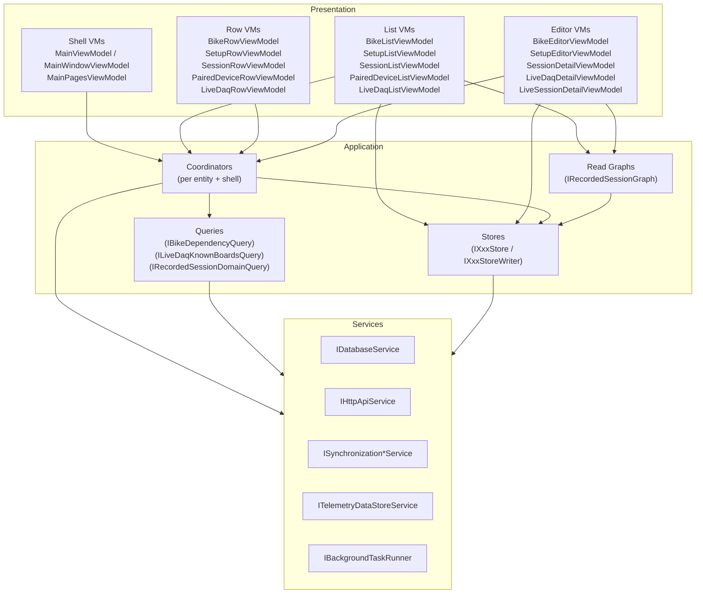

# UI Architecture

> Part of the [Sufni.App architecture documentation](../ARCHITECTURE.md). This file is the presentation-layer entry point: invariants, layering, threading, explicit result shapes, and testing boundaries.

The presentation code is organized in five layers with a strict
one-way dependency chain:

```
Views → ViewModels → Coordinators / Stores / Queries → Services → Platform
```

CommunityToolkit.Mvvm source generators (`[ObservableProperty]`,
`[RelayCommand]`) drive bindings; views are XAML with compiled
bindings; shared read state is reactive and uses DynamicData
(`SourceCache<T, TKey>` → `ReadOnlyObservableCollection<T>`).

Focused presentation references:

- [UI State, Read Graphs, and Queries](ui-state.md) — stores, recorded-session read graph, and query patterns.
- [UI Workflows, Composition, and Navigation](ui-workflows.md) — coordinators, DI, and shell navigation.
- [UI View Models](ui-view-models.md) — shell, page, list, row, editor, and session sub-page view models.
- [Controls Library](controls.md) — reusable mobile and desktop controls.
- [Theming](theming.md) — theme snapshots, resource bridge, runtime theme service, and theme ownership.
- [Plot Rendering](plot-rendering.md) — ScottPlot-backed plot classes and display-time rendering pipeline.

## Architectural Invariants

These boundaries are the invariants worth preserving even if type names
or feature wording evolve:

- A view model owns screen state, command flow, and binding-friendly projection.
- A store owns shared read state for an entity family and direct lookups over its own read model.
- A read graph owns a joined projection across stores and publishes derived state for screens that need more than one entity family.
- A query answers a business question that crosses domains or requires derived reasoning; it does not own the shared collection.
- A coordinator owns workflows with side effects, store writes, navigation decisions, and long-lived event subscriptions.
- A service or factory owns infrastructure-facing work such as datastore construction, file-picker lifetime, platform integration, and explicit background execution.

## Layered Architecture



Rules enforced by convention:

- A view model may depend on coordinators, **read-only** stores, read graphs, queries, services, and other shell composition view models. It may not depend on another feature view model or on a store writer. Any remaining direct feature-VM dependency outside shell composition is technical debt, not a pattern to copy.
- A coordinator may depend on services, **read/write** stores, other coordinators, queries, the shell coordinator, and dialogs. It may not depend on any view model.
- A service or factory may depend on platform or infrastructure APIs and may create concrete datastores, own file-picker lifetime, and own background execution. View models ask services and factories to do this work; they do not `new` concrete infrastructure types.
- A store may depend only on services. A read graph may depend on read-only stores and pure derivation services. A query may depend on services or read-only stores.
- Controls in `Views/Controls/` and `DesktopViews/Controls/` resolve nothing from the DI container — parent views supply everything via bindings or attached behaviours.

## Threading & Lifecycle

Thread ownership is explicit:

- The UI thread is reserved for bound-property updates, `ObservableCollection` mutation, notifications, native picker interaction, and lightweight read-store lookups.
- Filesystem work, network work, datastore enumeration, SST parsing, PSST generation, and similar slow operations must cross an explicit background boundary (`IBackgroundTaskRunner` or a service-owned equivalent) before they run.
- Services may still use UI-thread primitives for cadence or collection ownership (for example `DispatcherTimer`), but only the UI-bound collection mutation belongs back on the UI thread.
- Singleton page view models do not imply always-on work. Browse lifetimes and store subscriptions attach in `Loaded` and tear down in `Unloaded`.
- Prefer generated async-command state such as `Command.IsRunning` as the busy-state source of truth instead of maintaining duplicate booleans.

### Cancellation & Result Coherence

Background workflows whose results can be superseded should take a
`CancellationToken` from their caller and propagate it through the
coordinator/service chain.

- The owner that started the work — typically a page view model — cancels the token in `Unloaded` or before replacing the workflow with a newer request.
- Cancellation is a neutral exit, not a failure outcome. Do not translate `OperationCanceledException` into domain results such as `Failed`, `Unavailable`, or user-facing errors.
- Replaceable read/refresh workflows should be cancellable. Once a workflow has crossed into persistence or other committed side effects, prefer explicit result shapes over best-effort cancellation.

Result application must still enforce coherence after awaited work returns:

- A canceled or superseded workflow must not apply UI state, overwrite newer data, or clear busy indicators that belong to newer work.
- The component that owns the current workflow identity should only clear or dispose its current cancellation state when the completing workflow is still the active one.
- If multiple refresh triggers arrive while only the latest result matters, coalesce them or drop stale completions rather than partially merging old and new state.

## Result Shapes

Operations with multiple semantically distinct outcomes return a sealed
record hierarchy with a private constructor so callers must
pattern-match on known cases instead of relying on bool flags, `null`,
or magic strings. This convention applies to both coordinator and
service contracts when the caller's next step differs by outcome.

`SaveAsync` on the entity coordinators follows this pattern with
`Saved(NewBaselineUpdated)`, `Conflict(CurrentSnapshot)`, or
`Failed(ErrorMessage)`. `BikeSaveResult.Saved` additionally carries
a `BikeEditorAnalysisResult AnalysisResult` so the editor can react
to leverage-ratio recomputation without a second round-trip; the
other `Saved` variants are payload-only. Editors pattern-match on
the result and, on conflict, prompt the user via `IDialogService`
before reloading the snapshot. The coordinator detects conflicts by
comparing the baseline `Updated` value the editor opened on against
the store's current snapshot — so a sync arrival or another tab's
save during an edit cannot silently overwrite the user's changes.
The live session path is deliberately separate:
`SaveLiveCaptureAsync(...)` is create-only and returns
`Saved(SessionId, Updated)` or `Failed(ErrorMessage)` because there
is no optimistic-concurrency baseline for an in-memory live capture.

Recorded-session recompute follows the same explicit-result pattern:
`SessionCoordinator.RecomputeAsync(sessionId, baselineUpdated)`
returns `Recomputed(NewBaselineUpdated)`, `Conflict(CurrentSnapshot)`,
`NotRecomputable(SessionStaleness)`, or `Failed(ErrorMessage)`.
The coordinator checks the editor baseline before loading the source
and again before persistence, so a recompute cannot overwrite a
metadata edit or sync arrival that happened while processing was
running.

The same convention is used for infrastructure-facing service outcomes
such as `StorageProviderRegistrationResult` (`Added` / `AlreadyOpen`)
and for small sealed event hierarchies such as `SessionImportEvent`
(`Imported` / `Failed` / `Progress(Current, Total)`) when a
long-running workflow streams progress back to the UI.

## Testing Boundaries

The architecture is intended to be tested in layers:

- View model tests assert screen-scoped behavior such as property changes, stale-result guards, `Loaded` / `Unloaded` lifecycle, generated command or local busy-state transitions, and progress-driven notification updates under a test `SynchronizationContext`.
- Read-graph tests assert joined projections and derived-change flags across session, setup, bike, and recorded-source updates.
- Coordinator tests assert workflow semantics such as persistence, store writes, branching, result shapes, per-file progress emission, and background-runner usage.
- Service tests cover infrastructure ownership when the behavior is non-trivial, for example datastore registration, duplicate detection, or one-shot board detection.

## Further Details

Detailed presentation-layer references live in focused files:

- [UI State, Read Graphs, and Queries](ui-state.md) covers stores, recorded-session read graphs, and query patterns.
- [UI Workflows, Composition, and Navigation](ui-workflows.md) covers coordinators, dependency injection, and shell navigation.
- [UI View Models](ui-view-models.md) covers shell, page, list, row, editor, and session sub-page view models.
- [Controls Library](controls.md) covers reusable mobile and desktop controls.
- [Theming](theming.md) covers theme snapshots, the resource bridge, runtime theme service, and theme ownership.
- [Plot Rendering](plot-rendering.md) covers ScottPlot-backed plot classes and the display-time rendering pipeline.
